<div align="center">
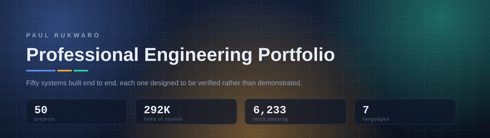
</div>

<div align="center">
<strong>Fifty systems, built end to end.</strong><br>
Every one of them ships the evidence that it works, not a screenshot of it working.
</div>

---

## What this is

This repository is a portfolio of self-directed engineering work: fifty complete systems, each one chosen because it contains a problem that is genuinely hard and commonly got wrong.

They are not tutorials, and they are not demos. A demo is a thing that works when you drive it the way the author drove it. Each project here is built to the opposite standard — it has to keep working when somebody hostile, or merely careless, drives it instead.

### The rule

> **Every claim a project makes, it has to be able to prove on demand.**

That rule does most of the design work. If a project claims a cache is fast, it ships the benchmark. If it claims a migration is lossless, it ships the reconciliation that would catch the loss. If it claims a boundary is safe, it ships the fuzzer that attacks the boundary and the count of what got through.

It also has an uncomfortable consequence, which is the reason the rule is worth having: several projects ship measurements that **contradict the thing I expected to find**, and say so. Those are the results worth reading.

### At a glance

| | |
|---|---|
| **Projects** | 50 designed, 47 built and verified |
| **Source** | 273,925 lines of authored code, generated files excluded |
| **Tests** | 5,346 passing across 46 project suites |
| **Languages** | C#, C++, Go, Java, Python, Rust |
| **Dependencies** | None. No Docker, no database server, no cloud account, no API key. |

That last row is a design constraint, not a limitation. A portfolio that only runs on the author's machine is a portfolio nobody runs. Every project here is built to `git clone` and go, which forced some genuinely better engineering: deterministic local embedding providers instead of a hosted API, an in-process bus behind the same interface as the real broker, seeded simulation instead of `Thread.Sleep`.

---

## The map

<div align="center">
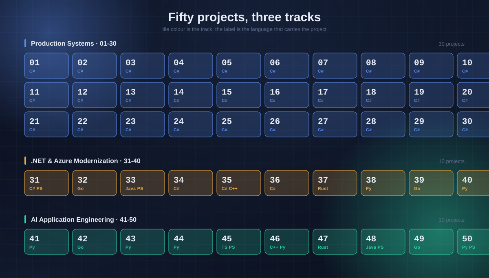
</div>

<div align="center">
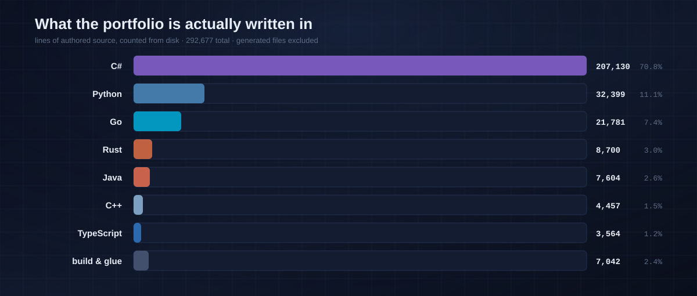
</div>

The language spread is deliberate. A reverse proxy under concurrent load belongs in Go; a deterministic simulator that must not allocate unpredictably belongs in Rust; a numerical core that a business will not let you rewrite is already in C++ and stays there. Picking the language the problem asks for — rather than the one on the CV — is itself part of what these projects are demonstrating.

---

<div align="center">
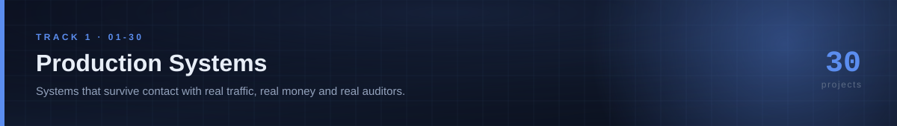
</div>

## Track 1 · Production Systems

> *Systems that survive contact with real traffic, real money and real auditors.*

Thirty services built the way they would have to be built if somebody were paying for them: idempotent, observable, tenant-isolated, and tested against the failure that actually happens rather than the one that is easy to write a test for.

| | Project | What it is |
|:--:|---|---|
| 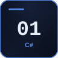 | **[01 · Enterprise Order & Payments Platform](projects/foundation/01-enterprise-order-payments-platform)**<br><sub>`C#` · 84 tests · 6,003 lines</sub> | Payments that survive retries: idempotency keys, a transactional outbox, and settlement reconciliation, so a duplicate webhook cannot double-charge a customer. |
| 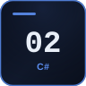 | **[02 · Legacy .NET Modernization Lab](projects/foundation/02-legacy-dotnet-modernization)**<br><sub>`C#` · 55 tests · 3,320 lines</sub> | A deliberately 2010-era claims system and its modern twin, side by side, with characterization tests pinning current behaviour and an anti-corruption layer holding the seam. |
| 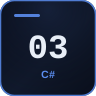 | **[03 · Enterprise RAG Knowledge Assistant](projects/foundation/03-enterprise-rag-knowledge-assistant)**<br><sub>`C#` · 70 tests · 6,767 lines</sub> | RAG over private documents where retrieval is permission-aware, every answer carries citation spans back to source, and the system refuses when it cannot ground an answer. |
| 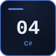 | **[04 · Multi-Tenant B2B SaaS Platform](projects/foundation/04-multitenant-b2b-saas)**<br><sub>`C#` · 90 tests · 5,478 lines</sub> | Tenant isolation enforced by EF Core global query filters and a save-changes interceptor, so a cross-tenant read fails structurally rather than by developer discipline. |
| 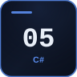 | **[05 · Financial Reconciliation & Settlement Engine](projects/foundation/05-financial-reconciliation-engine)**<br><sub>`C#` · 120 tests · 7,900 lines</sub> | Streaming reconciliation of internal records against a provider settlement file: fee-adjusted and many-to-one matching, with a four-eyes exception queue for what will not match. |
| 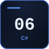 | **[06 · Production Incident Diagnostics Lab](projects/foundation/06-production-incident-diagnostics)**<br><sub>`C#` · 34 tests · 3,452 lines</sub> | Ten production failure modes reproduced on demand — deadlock, connection-pool exhaustion, thread-pool starvation, async void — each paired with the diagnostic that actually finds it. |
| 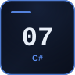 | **[07 · Secure Zero-Trust API Platform](projects/foundation/07-zero-trust-api-platform)**<br><sub>`C#` · 65 tests · 4,377 lines</sub> | One codebase serving partner, customer and admin surfaces at three different trust levels, because enterprises get breached through the weakest one. |
| 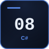 | **[08 · Event-Driven Logistics & Fleet Platform](projects/foundation/08-event-driven-logistics-platform)**<br><sub>`C#` · 58 tests · 7,326 lines</sub> | Fleet telemetry that arrives late, duplicated and out of order, turned into correct ETAs without producing an alert storm. |
| 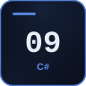 | **[09 · Intelligent Document Processing Platform](projects/foundation/09-intelligent-document-processing)**<br><sub>`C#` · 125 tests · 8,082 lines</sub> | Invoice extraction where confidence is routed rather than assumed: low-confidence fields go to a human queue instead of being silently posted to the ledger. |
|  | **[10 · Industrial IoT Monitoring Platform](projects/foundation/10-industrial-iot-monitoring)**<br><sub>`C#` · 97 tests · 7,189 lines</sub> | Store-and-forward telemetry that survives a site losing connectivity, plus alert hysteresis so a noisy sensor does not page anyone at 3am. |
| 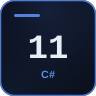 | **[11 · High-Scale Notification Delivery Platform](projects/foundation/11-notification-delivery-platform)**<br><sub>`C#` · 69 tests · 6,170 lines</sub> | Notification delivery with per-user quiet hours, deduplication, and provider failover that degrades instead of collapsing when one channel goes bad. |
| 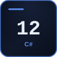 | **[12 · API Integration Hub (iPaaS Lite)](projects/foundation/12-api-integration-hub)**<br><sub>`C#` · 77 tests · 6,980 lines</sub> | Point-to-point integrations replaced by a connector model: declarative mapping, retry with backoff, dead-letter, and replay from any point. |
| 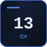 | **[13 · Digital Banking Ledger](projects/foundation/13-digital-banking-ledger)**<br><sub>`C#` · 99 tests · 6,557 lines</sub> | A double-entry banking ledger whose invariants are enforced in the schema, not in a service method that somebody can route around. |
| 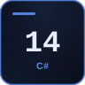 | **[14 · Loan Origination & Credit Workflow](projects/foundation/14-loan-origination-platform)**<br><sub>`C#` · 73 tests · 6,131 lines</sub> | Credit decisions that can be replayed years later and produce the same answer, with the reasons still attached — which is what "explainable" actually means to a regulator. |
| 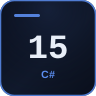 | **[15 · Fraud Detection Event Pipeline](projects/foundation/15-fraud-detection-event-pipeline)**<br><sub>`C#` · 69 tests · 6,349 lines</sub> | Millisecond risk decisions taken against stateful history, each one carrying the explanation an analyst and an auditor will both ask for. |
| 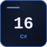 | **[16 · Subscription Billing & Usage Metering Engine](projects/foundation/16-subscription-billing-engine)**<br><sub>`C#` · 112 tests · 12,207 lines</sub> | Proration, month-end anchoring and dunning — the three places subscription businesses quietly lose revenue and customer trust. |
| 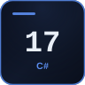 | **[17 · Distributed Job Scheduler](projects/foundation/17-distributed-job-scheduler)**<br><sub>`C#` · 186 tests · 7,977 lines</sub> | A scheduler that survives silent node death: leases, fencing tokens, and an explicit answer to "did that job run twice or not at all?" |
| 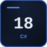 | **[18 · Feature Flag & Configuration Service](projects/foundation/18-feature-flag-service)**<br><sub>`C#` · 72 tests · 3,764 lines</sub> | Flags and progressive rollout that evaluate identically in every service, because the evaluation logic is one tested component rather than five reimplementations. |
| 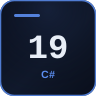 | **[19 · Enterprise Audit & Compliance Event Store](projects/foundation/19-enterprise-audit-platform)**<br><sub>`C#` · 62 tests · 5,149 lines</sub> | A tamper-evident audit log: hash-chained events with periodic anchoring, so alteration is detectable rather than merely discouraged. |
| 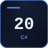 | **[20 · Secrets Rotation & Credential Management](projects/foundation/20-secrets-rotation-platform)**<br><sub>`C#` · 57 tests · 6,479 lines</sub> | Credential rotation modelled as choreography. The cryptography is easy; the overlap windows and the dependents are what cause the outage. |
| 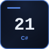 | **[21 · Real-Time Collaboration Backend](projects/foundation/21-realtime-collaboration-platform)**<br><sub>`C#` · 55 tests · 6,420 lines</sub> | Concurrent editing that provably converges, with the convergence model chosen deliberately and tested against adversarial interleavings rather than hoped at. |
| 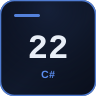 | **[22 · Enterprise Search Platform with Hybrid Retrieval](projects/foundation/22-enterprise-search-platform)**<br><sub>`C#` · 57 tests · 4,033 lines</sub> | Hybrid BM25 and dense retrieval fused with reciprocal rank fusion, plus the evaluation harness that makes relevance tuning honest instead of anecdotal. |
| 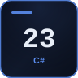 | **[23 · Healthcare Appointment & Workflow Platform](projects/foundation/23-healthcare-workflow-platform)**<br><sub>`C#` · 62 tests · 5,738 lines</sub> | Clinic scheduling treated as the constraint problem it is, with clinical data access provably restricted and every access audited. |
| 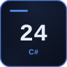 | **[24 · Identity & Access Management Portal](projects/foundation/24-identity-access-management)**<br><sub>`C#` · 84 tests · 8,447 lines</sub> | Answers the first question every auditor asks: who has access to what, and why — including access granted by inheritance nobody remembers configuring. |
| 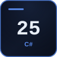 | **[25 · Data Pipeline & Analytics Lakehouse](projects/foundation/25-data-pipeline-lakehouse)**<br><sub>`C#` · 99 tests · 6,794 lines</sub> | Incremental pipelines with data-quality gates and column-level lineage, so analytics can be trusted — or explicitly and visibly distrusted. |
| 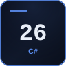 | **[26 · SRE Service Reliability Dashboard](projects/foundation/26-sre-reliability-dashboard)**<br><sub>`C#` · 52 tests · 4,905 lines</sub> | Error-budget burn rate computed correctly, because most reliability dashboards compute it wrongly and therefore page at exactly the wrong moments. |
| 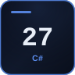 | **[27 · API Performance & Load Testing Toolkit](projects/foundation/27-api-performance-toolkit)**<br><sub>`C#` · 72 tests · 5,149 lines</sub> | Load testing with open-model arrival and correct tail-latency statistics, instead of homegrown numbers that hide the worst case behind an average. |
| 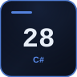 | **[28 · Cloud Deployment Reference Architecture](projects/foundation/28-cloud-deployment-reference)**<br><sub>`C#` · 66 tests · 5,361 lines</sub> | The operational affordances safe deployment requires — health checks, graceful drain, config precedence, readiness gating — built in rather than bolted on afterwards. |
| 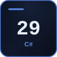 | **[29 · AI Agent Workflow Orchestration Platform](projects/foundation/29-ai-agent-workflow-platform)**<br><sub>`C#` · 139 tests · 9,294 lines</sub> | Agent execution with bounded authority: every tool call is scoped, approved, audited and resumable, because model output is not a mandate. |
| 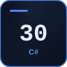 | **[30 · Cloud Cost & Observability Platform](projects/foundation/30-cloud-cost-observability-platform)**<br><sub>`C#` · 63 tests · 4,019 lines</sub> | Cloud spend attributed to the teams that caused it, and anomaly detection that can tell a real cost regression from the fact that it is Tuesday. |

<sub>30 projects · 187,817 lines</sub>

---

<div align="center">
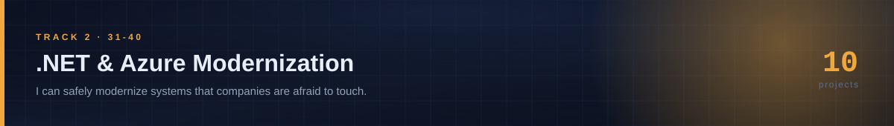
</div>

## Track 2 · .NET & Azure Modernization

> *I can safely modernize systems that companies are afraid to touch.*

Ten projects about **safety under change**. None of them is a greenfield rewrite, because a greenfield rewrite is not the problem clients have. The problem is a system that works, that nobody understands, and that the business cannot afford to have stop working for a weekend.

| | Project | What it is |
|:--:|---|---|
| 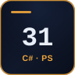 | **[31 · Assembly Archaeologist](projects/dotnet-azure-modernization/31-assembly-archaeologist)**<br><sub>`C#` `PowerShell` · 206 tests · 5,251 lines</sub> | Reads compiled IL, not source. Builds the full type-and-method call graph across 400 assemblies, finds .NET Framework-only APIs, and emits a dependency-ordered migration plan with deliberate cycle-breaking. |
|  | **[32 · Strangler Router](projects/dotnet-azure-modernization/32-strangler-router)**<br><sub>`Go` · 67 tests · 3,694 lines</sub> | A reverse proxy that mirrors live traffic to both legacy and rewrite, returns only the legacy response, and diffs the two semantically. This is the mechanism that makes a cutover honest. |
| 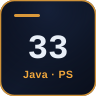 | **[33 · Heterogeneous Database Migration Verifier](projects/dotnet-azure-modernization/33-migration-verifier)**<br><sub>`Java` `PowerShell` · 123 tests · 4,183 lines</sub> | SQL Server to PostgreSQL, where the schema conversion is the weekend and proving no row was silently corrupted is the six months. Row-level checksums across engines that disagree about collation, DECIMAL rounding and NULL ordering. |
| 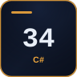 | **[34 · Saga Extractor](projects/dotnet-azure-modernization/34-saga-extractor)**<br><sub>`C#` · 87 tests · 4,028 lines</sub> | Takes a transaction pulled apart by a service split and proves the compensation still holds — by exhaustively searching interleavings for a state no compensation can reach. |
| 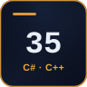 | **[35 · Crown Jewels Bridge](projects/dotnet-azure-modernization/35-crown-jewels-bridge)**<br><sub>`C#` `C++` · 4,663 lines</sub> | A 60,000-line C++ pricing engine nobody will authorise rewriting, exposed through a narrow C ABI. The same engine compiled three ways shows the danger lives in the boundary, not the mathematics. |
| 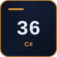 | **36 · Authentication Migration**<br>*in progress* | Forms cookies, WS-Federation and OIDC running simultaneously, with PBKDF2 rehashed to Argon2id at the moment of successful login, so not one user gets a password reset email. |
| 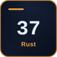 | **[37 · Deterministic Distributed Systems Simulator](projects/dotnet-azure-modernization/37-deterministic-sim-harness)**<br><sub>`Rust` · 37 tests · 2,353 lines</sub> | A FoundationDB-style deterministic simulator: seeded scheduling, injected partitions, reordering and clock skew — and any failure replays exactly from its seed. |
| 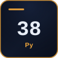 | **[38 · Migration Wave Planner](projects/dotnet-azure-modernization/38-migration-wave-planner)**<br><sub>`Python` · 434 tests · 6,409 lines</sub> | Migration wave ordering optimised under team capacity, freeze windows and coupling, costed with the line items people forget: egress, dual-running overlap, licence double-payment. |
|  | **[39 · Zero-Downtime Schema Evolution Engine](projects/dotnet-azure-modernization/39-schema-evolution)**<br><sub>`Go` · 201 tests · 7,207 lines</sub> | Expand, migrate, contract — backfilled in adaptive batches, with the lock-duration budget that decides whether "zero downtime" is a claim or a measurement. |
| 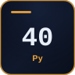 | **[40 · COBOL Batch Decommissioning with byte-equivalence proof](projects/dotnet-azure-modernization/40-cobol-batch-decommissioning)**<br><sub>`Python` · 61 tests · 2,683 lines</sub> | A real COBOL decoder — copybooks, EBCDIC, COMP-3 packed decimal, signed overpunch, OCCURS DEPENDING ON — and a byte-equivalence proof against the modern reimplementation. |

<sub>10 projects · 40,471 lines</sub>

---

<div align="center">
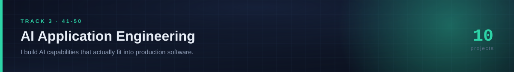
</div>

## Track 3 · AI Application Engineering

> *I build AI capabilities that actually fit into production software.*

Ten projects about the engineering *around* the model. Every one of them runs with no API key and no GPU, because the interesting problems — evaluation that means something, retrieval that can be tuned, output that cannot be malformed, failures that never throw — are not problems about which model you called.

| | Project | What it is |
|:--:|---|---|
| 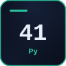 | **[41 · LLM Evaluation & Regression Harness](projects/ai-application-engineering/41-llm-eval-harness)**<br><sub>`Python` · 294 tests · 5,638 lines</sub> | Golden datasets, an LLM judge calibrated against human labels with Cohen's kappa, and significance testing, so that a change in an eval score means something. |
| 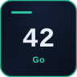 | **[42 · Semantic Cache & Request Coalescing Gateway](projects/ai-application-engineering/42-semantic-cache)**<br><sub>`Go` · 134 tests · 6,937 lines</sub> | Semantic caching that measures its own false-hit rate, because in a cache a false hit is not a performance problem, it is someone else's answer. |
| 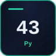 | **[43 · Retrieval Quality Lab](projects/ai-application-engineering/43-retrieval-lab)**<br><sub>`Python` · 366 tests · 6,947 lines</sub> | Systematic ablation across chunking, embedding model, reranking and fusion, scored with nDCG, MRR and recall@k, significance-tested rather than eyeballed. |
| 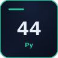 | **[44 · Prompt Injection Red Team](projects/ai-application-engineering/44-prompt-injection-redteam)**<br><sub>`Python` · 407 tests · 6,285 lines</sub> | An attack corpus for direct and indirect prompt injection run against layered defences, reported as a defence-in-depth matrix rather than a pass mark. |
| 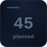 | **45 · Durable Agent Runtime**<br>*in progress* | Event-sourced durable execution: a crashed agent run resumes at the step it died on, and every side effect happens exactly once across the resume. |
| 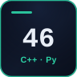 | **[46 · Constrained Decoding](projects/ai-application-engineering/46-constrained-decoding)**<br><sub>`Python` `C++` · 86 tests · 4,894 lines</sub> | Compiles a JSON Schema into a finite automaton aligned to the tokenizer vocabulary, then masks logits so invalid output is impossible to emit rather than merely unlikely. |
| 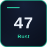 | **[47 · Inference Gateway](projects/ai-application-engineering/47-inference-gateway)**<br><sub>`Rust` · 167 tests · 6,547 lines</sub> | Continuous batching with SLO-aware admission control: shed load deliberately and visibly, instead of degrading every tenant at once. |
|  | **[48 · Graph + Vector Hybrid Reasoning](projects/ai-application-engineering/48-graph-vector-hybrid)**<br><sub>`Java` `PowerShell` · 133 tests · 4,047 lines</sub> | "Which of our suppliers are within two hops of a sanctioned entity?" is a question embeddings cannot answer. Graph traversal fused with vector retrieval, returning the provenance path as justification. |
|  | **[49 · Model Router and Cascade](projects/ai-application-engineering/49-model-router-cascade)**<br><sub>`Go` · 120 tests · 4,342 lines</sub> | Query-difficulty classification driving a cascade that escalates to larger models only when confidence is low, under enforced per-tenant budgets. |
|  | **50 · AI Observability**<br>*in progress* | Detecting the AI failures that never throw an exception: embedding drift by PSI and MMD, continuous quality canaries, and anomaly detection on refusal and hallucination rates. |

<sub>10 projects · 45,637 lines</sub>

---

## Running any of this

Each project is self-contained and carries its own README, its own build and test scripts, and its own architecture decision records. Nothing depends on anything else in this repository.

```bash
git clone https://github.com/pauxru/Paul-Professional-Projects.git
cd Paul-Professional-Projects/projects/<track>/<project>

# projects that ship their own harness (31-50)
pwsh ./test.ps1

# .NET projects (01-30)
dotnet test -c Release
```

To verify the whole repository, and regenerate the numbers quoted above:

```powershell
pwsh tools/verify.ps1        # runs every suite, writes tools/verification.tsv
```

The results of the last full sweep are committed at [`tools/verification.tsv`](tools/verification.tsv), with the raw output of each run under [`tools/logs/`](tools/logs). They are in the repository because a test count in a README is worth exactly as much as the file it can be checked against.

Running every suite on a machine and a date that none of them were written on found four defects that reading the code would not have: two frozen-clock time bombs that had been waiting for the wall clock to overtake a hard-coded test date, a determinism claim that turned out to hold only at one value of `GOMAXPROCS`, and a build step the sweep was skipping. [`docs/VERIFICATION.md`](docs/VERIFICATION.md) is the write-up — including the two bugs that were in the test *counter* rather than in any project.

See [`docs/TOOLCHAINS.md`](docs/TOOLCHAINS.md) for the versions everything was built and verified against.

---

## What is in every project

The later projects (31–50) are held to a fixed deliverables contract, which is written down in [`docs/ENGINEERING_STANDARDS.md`](docs/ENGINEERING_STANDARDS.md). In short, each one ships:

- a **README** that states the problem before it states the solution;
- **architecture decision records** — including the options that were rejected, which is the only part of an ADR that carries information;
- a **results document** generated by running the thing, not by writing about it;
- a **test harness** that fails the build on a compiler warning, re-runs the report to prove it is byte-identical, and mutates the source to prove the tests would have caught it;
- **known limitations**, written honestly, because the fastest way to lose a reviewer is to claim something the code does not do.

---

## Repository layout

```
.
├─ assets/                     generated diagrams; see tools/gen_assets.py
├─ docs/                       standards, toolchains, and the project catalogue
├─ projects/
│  ├─ foundation/              track 1 — projects 01–30
│  ├─ dotnet-azure-modernization/ track 2 — projects 31–40
│  ├─ ai-application-engineering/ track 3 — projects 41–50
└─ tools/                      verification sweep and the generators
```

Every generator in `tools/` is committed and runnable. The README you are reading is itself generated — `tools/gen_readme.py` reads the catalogue and the verification results and writes this file — so it cannot drift away from the repository it describes.

---

<div align="center">
<sub>Paul Rukwaro · <a href="https://github.com/pauxru">github.com/pauxru</a></sub>
</div>
