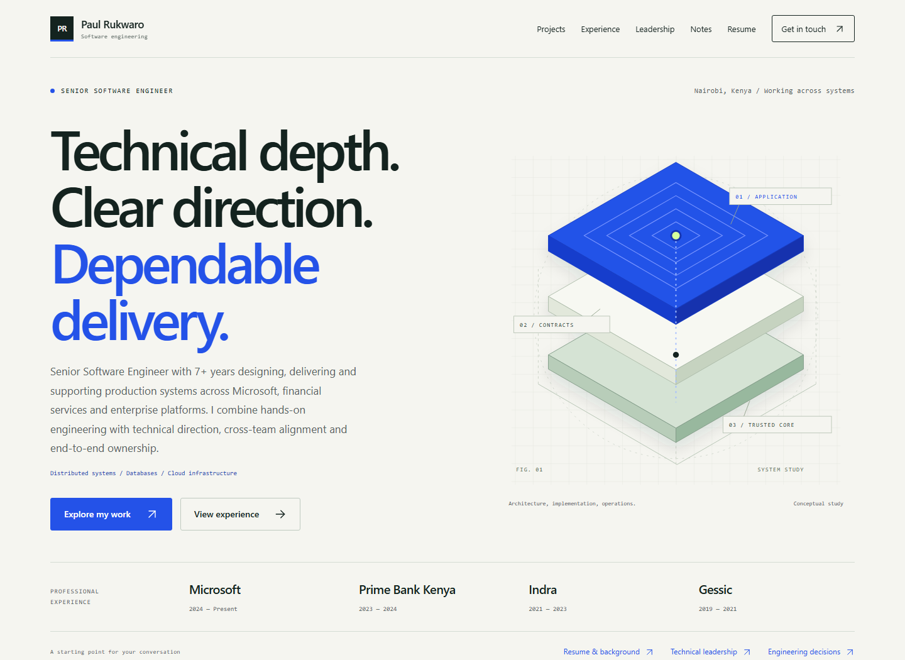
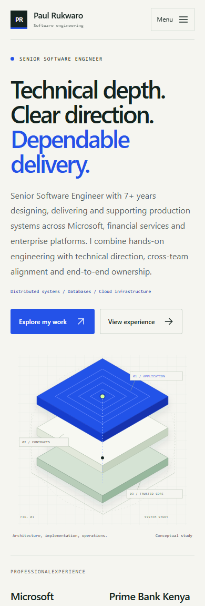

# Portfolio website

Career-focused Astro site for **Paul Rukwaro**, Senior Software Engineer. It combines professional experience and technical leadership with 50 project detail pages, including 3 curated case studies, engineering notes and a downloadable public resume.

## Stack and local defaults

- Astro 7.3.1
- TypeScript 5.9
- Node 24 preferred, Node >= 22.12 supported
- Static output only; no server runtime
- Default local URL: `http://127.0.0.1:4321/Paul-Professional-Projects/`
- Default production origin/base:
  - `SITE_URL=https://pauxru.github.io`
  - `SITE_BASE_PATH=/Paul-Professional-Projects`

`SITE_URL` must always be an HTTPS origin with **no path**. For a future custom domain, keep `SITE_URL=https://your-domain.example` and set `SITE_BASE_PATH=/`.

## Quick start

Use a **Git clone of the complete repository**, not an extracted ZIP: content synchronization uses Git's tracked-file index. Run the commands below from its `portfolio/` directory.

The lockfile pins versions and integrity hashes without registry-specific tarball URLs. Local npm configuration can use an approved mirror; GitHub Actions installs from the public npm registry.

```bash
npm ci
npm run sync
npm run dev
```

Then open `http://127.0.0.1:4321/Paul-Professional-Projects/`.

### Optional local `.env`

`config/environment.mjs` loads `portfolio/.env` when present for Astro and Playwright. Use it only for public-site configuration overrides, for example:

```env
SITE_URL=https://pauxru.github.io
SITE_BASE_PATH=/Paul-Professional-Projects
PORTFOLIO_TEST_PORT=4377
PLAYWRIGHT_CHANNEL=msedge
```

## Commands

| Command | What it does |
| --- | --- |
| `npm run sync` | Rebuilds website content records from tracked repository documentation. |
| `npm run dev` | Starts the Astro dev server on `127.0.0.1:4321`. |
| `npm run check` | Runs `sync` then `astro check`. |
| `npm test` | Runs the Node unit tests in `tests/unit/*.test.mjs`. |
| `npm run build` | Runs `sync`, `astro check`, then emits the static site to `dist/`. |
| `npm run preview` | Serves `dist/` locally for final verification. |
| `npm run test:e2e` | Runs Playwright browser tests against the preview server. |
| `npm run assets` | Re-renders committed social-card, favicon, and touch-icon assets from their SVG sources. |
| `npm run screenshots` | Captures preview screenshots from the built site. |

## Folder structure

```text
portfolio/
|-- config/                  # Site/base-path/environment helpers
|-- docs/
|   |-- deployment.md        # CI, Pages, custom-domain, static-host notes
|   `-- resume.md            # Public resume generation and privacy guidance
|-- public/
|   |-- images/              # Social card and case-study artwork
|   `-- resume/
|       `-- Paul-Rukwaro-Resume.pdf
|-- scripts/
|   |-- build-resume.py      # Optional authoring script for the public PDF
|   |-- sync-projects.mjs     # Tracked documentation -> generated project records
|   |-- lib/                 # Catalogue, Markdown, document and source-link validation
|   |-- capture-preview.mjs
|   `-- render-brand-assets.mjs
|-- src/
|   |-- components/
|   |-- data/                # profile.json plus sync-generated site data
|   |-- layouts/
|   |-- lib/
|   |-- pages/
|   |-- scripts/
|   `-- styles/
|-- tests/
|   |-- e2e/
|   `-- unit/
|-- astro.config.mjs
|-- package.json
`-- playwright.config.ts
```

## Routes and features

### Primary pages

- `/` home
- `/projects/` project library with progressive-enhancement filters
- `/projects/[slug]/` 50 generated project detail pages
- `/experience/`
- `/leadership/`
- `/notes/`
- `/notes/[slug]/`
- `/contact/`
- `/resume/`
- `/privacy/`
- `/rss.xml`
- `/robots.txt`
- `/sitemap-index.xml` and `sitemap-*.xml`
- static 404 page

### Architecture and UX characteristics

- Static Astro output with no trackers, ads, cookies, or runtime API dependency
- Base-path aware for both repo Pages (`/Paul-Professional-Projects`) and future custom-domain root (`/`)
- Canonicals, Open Graph/Twitter metadata, JSON-LD, sitemap, RSS, and robots generated from the configured public origin
- Accessible keyboard navigation: skip link, focusable main region, mobile menu dismissal behavior, no-JavaScript fallbacks
- Local-only assets: images, icons, resume PDF, and internal links stay within the build output
- Playwright coverage validates page content, metadata, local links, fragments, overflow, reduced motion, robots, sitemap, RSS, 404, and resume download

### The 3 curated case studies

These are **not extra routes**. They are richer editorial treatments layered onto their existing project detail pages:

- `35` Crown Jewels Bridge
- `43` Retrieval Quality Lab
- `50` Silent-Failure Observability (`50-silent-failure-observability`)

## Project detail route index

All project pages are served under the local base `http://127.0.0.1:4321/Paul-Professional-Projects`.

### Track 1 - Foundation

- `01` Enterprise Order & Payments Platform - `/projects/01-enterprise-order-payments-platform/`
- `02` Legacy .NET Modernization Lab - `/projects/02-legacy-dotnet-modernization/`
- `03` Enterprise RAG Knowledge Assistant - `/projects/03-enterprise-rag-knowledge-assistant/`
- `04` Multi-Tenant B2B SaaS Platform - `/projects/04-multitenant-b2b-saas/`
- `05` Financial Reconciliation & Settlement Engine - `/projects/05-financial-reconciliation-engine/`
- `06` Production Incident Diagnostics Lab - `/projects/06-production-incident-diagnostics/`
- `07` Secure Zero-Trust API Platform - `/projects/07-zero-trust-api-platform/`
- `08` Event-Driven Logistics & Fleet Platform - `/projects/08-event-driven-logistics-platform/`
- `09` Intelligent Document Processing Platform - `/projects/09-intelligent-document-processing/`
- `10` Industrial IoT Monitoring Platform - `/projects/10-industrial-iot-monitoring/`
- `11` High-Scale Notification Delivery Platform - `/projects/11-notification-delivery-platform/`
- `12` API Integration Hub (iPaaS Lite) - `/projects/12-api-integration-hub/`
- `13` Digital Banking Ledger - `/projects/13-digital-banking-ledger/`
- `14` Loan Origination & Credit Workflow - `/projects/14-loan-origination-platform/`
- `15` Fraud Detection Event Pipeline - `/projects/15-fraud-detection-event-pipeline/`
- `16` Subscription Billing & Usage Metering Engine - `/projects/16-subscription-billing-engine/`
- `17` Distributed Job Scheduler - `/projects/17-distributed-job-scheduler/`
- `18` Feature Flag & Configuration Service - `/projects/18-feature-flag-service/`
- `19` Enterprise Audit & Compliance Event Store - `/projects/19-enterprise-audit-platform/`
- `20` Secrets Rotation & Credential Management - `/projects/20-secrets-rotation-platform/`
- `21` Real-Time Collaboration Backend - `/projects/21-realtime-collaboration-platform/`
- `22` Enterprise Search Platform with Hybrid Retrieval - `/projects/22-enterprise-search-platform/`
- `23` Healthcare Appointment & Workflow Platform - `/projects/23-healthcare-workflow-platform/`
- `24` Identity & Access Management Portal - `/projects/24-identity-access-management/`
- `25` Data Pipeline & Analytics Lakehouse - `/projects/25-data-pipeline-lakehouse/`
- `26` SRE Service Reliability Dashboard - `/projects/26-sre-reliability-dashboard/`
- `27` API Performance & Load Testing Toolkit - `/projects/27-api-performance-toolkit/`
- `28` Cloud Deployment Reference Architecture - `/projects/28-cloud-deployment-reference/`
- `29` AI Agent Workflow Orchestration Platform - `/projects/29-ai-agent-workflow-platform/`
- `30` Cloud Cost & Observability Platform - `/projects/30-cloud-cost-observability-platform/`

### Track 2 - .NET and Azure modernization

- `31` Assembly Archaeologist - `/projects/31-assembly-archaeologist/`
- `32` Strangler Router - `/projects/32-strangler-router/`
- `33` Heterogeneous Database Migration Verifier - `/projects/33-migration-verifier/`
- `34` Saga Extractor - `/projects/34-saga-extractor/`
- `35` Crown Jewels Bridge - `/projects/35-crown-jewels-bridge/` **Curated case study**
- `36` Authentication Migration - `/projects/36-authentication-coexistence/`
- `37` Deterministic Distributed Systems Simulator - `/projects/37-deterministic-sim-harness/`
- `38` Migration Wave Planner - `/projects/38-migration-wave-planner/`
- `39` Schema Evolution & Lock Analysis - `/projects/39-schema-evolution/`
- `40` COBOL Batch Decommissioning - `/projects/40-cobol-batch-decommissioning/`

### Track 3 - AI application engineering

- `41` LLM Evaluation & Regression Harness - `/projects/41-llm-eval-harness/`
- `42` Semantic Cache & Request Coalescing Gateway - `/projects/42-semantic-cache/`
- `43` Retrieval Quality Lab - `/projects/43-retrieval-lab/` **Curated case study**
- `44` Prompt Injection Red Team - `/projects/44-prompt-injection-redteam/`
- `45` Durable Agent Runtime - `/projects/45-durable-agent-runtime/`
- `46` Constrained Decoding - `/projects/46-constrained-decoding/`
- `47` Inference Gateway - `/projects/47-inference-gateway/`
- `48` Graph + Vector Hybrid Reasoning - `/projects/48-graph-vector-hybrid/`
- `49` Model Router and Cascade - `/projects/49-model-router-cascade/`
- `50` Silent-Failure Observability - `/projects/50-silent-failure-observability/` **Curated case study**

## Content updates and single sources of truth

### Project and note content

- `docs/catalogue.json` is the project registry; tracked project READMEs and `docs/` files supply the implementation content and source links.
- Edit `src/data/project-summaries.json` for concise project summaries, focus tags and optional display-title overrides. Keep card summaries within 260 characters. Catalogue subtitles after a colon are omitted from display names so scenario narratives do not become headline claims.
- Edit `src/data/case-studies.source.json` for the three reviewed case studies and `src/data/notes.ts` for engineering articles. Keep findings tied to the linked source and its limitations.
- Run `npm run sync` after changing content. Add new source documents to Git's index first so the pipeline can distinguish them from local build artifacts.
- Do **not** hand-edit generated `src/data/projects.json`, `src/data/case-studies.json` or `public/project-icons/`.
- Missing README links or case-study evidence fail synchronization. Markdown image references become source links rather than loading remote image resources; raw HTML is sanitized and cannot supply application IDs.
- The portfolio distinguishes between:
  - **Professional experience pages** (`/experience/`, `/leadership/`, `/resume/`) derived from public profile data
  - **Independent project pages** (`/projects/[slug]/`) derived from tracked repository documentation

### Public profile and resume content

- `src/data/profile.json` is the single public source for personal/career data used by the website and resume script.
- The checked-in PDF lives at `public/resume/Paul-Rukwaro-Resume.pdf`.
- Resume authoring is optional and separate from the npm build; see [`docs/resume.md`](docs/resume.md).

## Production build and preview

```bash
npm run build
npm run preview
```

- `dist/` is the only deployment artifact.
- The site is expected to work for both:
  - GitHub Pages repository base path: `SITE_BASE_PATH=/Paul-Professional-Projects`
  - Future custom-domain root deployment: `SITE_BASE_PATH=/`

## Browser test tooling

- `npm run test:e2e` uses Playwright against `npm run preview`
- The test server uses a separate strict port and Astro's `--ignore-lock` option; it does not replace or stop your manual preview server.
- Linux CI installs bundled Chromium with `npx playwright install --with-deps chromium`
- Local Windows runs can optionally set `PLAYWRIGHT_CHANNEL=msedge`
- Keep `PORTFOLIO_TEST_PORT` free if overriding the default preview port used by Playwright
- CI does **not** regenerate visual assets; `npm run assets` is only needed when source artwork changes
- CI also builds an isolated `.root-build/` with `SITE_BASE_PATH=/` and exercises its public routes and metadata. `PORTFOLIO_TEST_OUT_DIR=.root-build` selects that artifact for the browser runner; the normal `dist/` output is left intact.

## Preview screenshots

`preview/` contains screenshots of the working homepage. They are documentation assets, not production downloads. Start `npm run dev`, then run `npm run screenshots` in a second terminal to refresh them.





## Public CV privacy rules

The public resume must stay safe to publish:

- include public LinkedIn and GitHub only
- never add private phone/email or raw application materials
- omit application-specific targeting and unconfirmed availability; do not invent endorsements, budgets, team sizes or direct reports
- keep claims grounded in `src/data/profile.json`
- preserve the distinction between professional roles and independent studies

## Deployment and hosting notes

- GitHub Actions + Pages guidance: [`docs/deployment.md`](docs/deployment.md)
- Resume generation guidance: [`docs/resume.md`](docs/resume.md)
- The same static `dist/` output can also be uploaded to Netlify, Cloudflare Pages, or Azure Static Web Apps if `SITE_URL` and `SITE_BASE_PATH` match the target host
