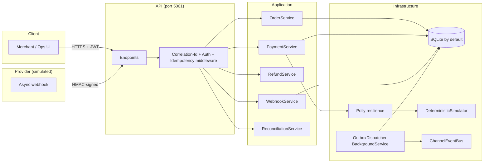

# Enterprise Order & Payments Platform (Project 01)

> **A production-style .NET 10 modular monolith demonstrating the reliability
> engineering that real payment systems require: idempotent APIs, a transactional
> outbox with dead-lettering, HMAC-signed webhooks with replay protection, a full
> payment state machine, and provider settlement reconciliation.**

## Portfolio Classification

**Self-directed engineering case study.** Built end-to-end by @pauxru as the
flagship project of a personal portfolio. There is no real merchant, no real
customers, no real money, no live vendor integration. All demo data is fictional
and clearly labelled (`Contoso Retail` merchant, `TEST-USD-*` and `TEST-KES-*`
SKUs). The purpose is to demonstrate senior-level judgement on distributed
systems reliability, security, and testability — not to service traffic.

## Executive Summary

Payment platforms fail loudly and expensively when idempotency, atomic
state-transitions, or reconciliation are missing. This project builds a
production-shaped ordering + payment surface with those primitives *actually
implemented*, not stubbed:

- **Idempotent** POST endpoints keyed by `Idempotency-Key` + a request-body
  hash. Replays return the original response byte-for-byte; body mismatches
  return `409 Conflict`.
- A **transactional outbox** writes domain events in the same EF Core
  transaction as the aggregate change, then a `BackgroundService` dispatches
  them at-least-once with exponential backoff, jitter, and a dead-letter table.
- **HMAC-SHA256 webhook** verification over the *raw* request body with a
  timestamp tolerance window, constant-time compare, and a persisted
  seen-signature store.
- A **payment state machine** with explicit legal transitions; illegal moves
  throw a domain exception and never mutate state.
- **Reconciliation** against a provider settlement CSV detects matched,
  missing-in-provider, missing-internally, amount-mismatch, duplicate, and
  status-mismatch discrepancies.

Everything runs against SQLite by default — `dotnet build -c Release` and
`dotnet test -c Release` succeed on a clean host with **zero external
infrastructure**. Postgres / Redis / RabbitMQ / Azure Service Bus each exist as
configuration-selected adapters and are labelled UNVERIFIED in the compose file
because the build host cannot start them.

## Business Problem

A merchant needs to place orders, authorize / capture / void / refund payments,
and reconcile the provider's settlement file against its own ledger.

The interesting problems are not "wire up an API." They are:

1. **The customer's retry loop** creates duplicate charges without idempotency.
2. **A provider webhook** may arrive out-of-order, be replayed by an attacker,
   or be spoofed entirely.
3. **The `PaymentAuthorized` domain event** must reach downstream consumers even
   if the process crashes mid-request — but must not double-fire.
4. **A partial-refund + refund race** must never exceed the captured amount.
5. **The settlement file** may say we captured a payment we have no record of,
   or vice versa. Silence here means missing money.

This platform solves each explicitly, and every solution has a test that would
break if the invariant broke.

## Functional Requirements

- **Catalog** — products with SKU, price, currency, active flag.
- **Inventory** — stock levels with named *reservations* (reserve, release,
  commit). Concurrency-safe: a parallel-reservation test proves no oversell.
- **Orders** — aggregate with state machine
  `Draft → Pending → AwaitingPayment → Paid → Fulfilled | Cancelled | Refunded | PartiallyRefunded`.
  Illegal transitions raise `DomainException`; unit-tested exhaustively.
- **Payment intents** — create, authorize, capture, void, retry. Explicit state
  machine `Requires → Authorized → Captured` with sink states `Voided`, `Failed`.
- **Payment provider simulator** — deterministic, in-repo, behind
  `IPaymentProvider`. Configurable per-idempotency-key outcomes (succeed,
  decline, timeout, duplicate, async-pending) plus latency + failure injection.
- **Idempotency middleware** — `Idempotency-Key` header on whitelisted POSTs.
  Persists `(key, endpoint, request-hash, response-status, response-body,
  created-at)` with a UNIQUE index. Replays return the byte-identical response
  plus an `Idempotent-Replay: true` header. Same key + different body → `409`.
- **Webhook endpoint** — HMAC-SHA256 over the raw body, `t=<unix>,v1=<hex>`
  header format, tolerance window, constant-time compare, replay guard on a
  hashed-signature store. Invalid → `401` and nothing mutates.
- **Refunds** — full + partial, cannot exceed captured amount, idempotent, emit
  ledger entries.
- **Transactional outbox** — domain events written in the SAME EF Core
  transaction. A `BackgroundService` polls, publishes to `IEventBus`, retries
  with exponential backoff + jitter, and dead-letters after `MaxAttempts`.
- **In-process event bus** on `System.Threading.Channels`. RabbitMQ + Azure
  Service Bus adapters are documented interface stubs.
- **Reconciliation** — import CSV, produce a run report + one row per
  discrepancy, persist, expose via API. Synthetic-file generator can inject each
  mismatch class on demand.
- **Audit trail** — append-only `AuditEvent` for every state-changing operation.
- **Retry + timeout + circuit-breaker** on the outbound provider call (Polly).

## Non-Functional Requirements

- **Reliability** — at-least-once delivery of domain events; no double-charging;
  no oversold inventory; no lost state on process crash.
- **Security** — bearer auth on all writes; separate scopes for `orders:write`,
  `admin`, `reconciliation:run`; HMAC-verified webhooks; secrets read only from
  configuration.
- **Observability** — OpenTelemetry tracing (ASP.NET Core + EF Core +
  custom spans for `order.place`, `payment.authorize`, `outbox.dispatch`,
  `reconciliation.run`) and a `Meter` with counters
  (`payments_authorized_total`, `payments_failed_total`,
  `outbox_dead_lettered_total`) and duration histograms.
- **Testability** — > 80 automated tests across unit + integration suites, all
  green on a clean host, no external infrastructure required.
- **Portability** — SQLite default; Postgres selectable via configuration.

## Architecture

Modular monolith, four projects, one direction of dependency:

```
Api  →  Application  →  Domain
                 ↘  Infrastructure  ↗
```

- **Domain** — aggregates, value objects, domain events, domain exceptions.
  No framework references.
- **Application** — use-case services, ports (`IPaymentProvider`, `IEventBus`,
  `IWebhookSignatureVerifier`, `IAppDbContext`), DTOs, request/response models,
  outbox writer, reconciliation service.
- **Infrastructure** — EF Core, SQLite/Postgres adapters, `AppDbContext`,
  Polly resilience pipeline, HMAC verifier, deterministic provider simulator,
  outbox dispatcher, event-bus adapters, telemetry.
- **Api** — minimal-API endpoints, middleware (correlation-id, idempotency,
  security headers, rate limiter), auth setup, composition root, dev token
  issuer, dev seeder.

## Architecture Diagram



Sequence diagram — **sync capture** flow:

```mermaid
sequenceDiagram
    autonumber
    participant C as Client
    participant API as API
    participant Idem as IdempotencyMiddleware
    participant PS as PaymentService
    participant Prov as Provider (Polly + Simulator)
    participant DB as SQLite
    C->>API: POST /payments/authorize<br/>Idempotency-Key: k1
    API->>Idem: (check key)
    Idem->>DB: SELECT IdempotencyRecords
    DB-->>Idem: none
    Idem->>PS: forward
    PS->>Prov: AuthorizeAsync
    Prov-->>PS: Succeeded (ref: prov-abc)
    PS->>DB: BEGIN TX; INSERT PaymentIntent + Outbox; COMMIT
    PS-->>API: 200 OK
    API->>DB: INSERT IdempotencyRecord(k1, hash, 200, body)
    API-->>C: 200 OK
    Note over C,API: A retry with the same key + body returns 200 + Idempotent-Replay:true
```

Sequence diagram — **async webhook** flow:

```mermaid
sequenceDiagram
    autonumber
    participant C as Client
    participant API as API
    participant PS as PaymentService
    participant Prov as Provider (Simulator)
    participant WH as Webhook endpoint
    participant WS as WebhookService
    participant DB as SQLite
    C->>API: POST /payments/authorize<br/>Idempotency-Key: k2
    API->>PS: authorize
    PS->>Prov: AuthorizeAsync
    Prov-->>PS: AsynchronousPending
    PS->>DB: INSERT PaymentIntent(status=Requires)
    PS-->>C: 200 OK (Requires)
    Prov->>WH: POST /webhooks/payments<br/>X-Contoso-Signature: t=…,v1=…
    WH->>WS: verify + process
    WS->>WS: HMAC-SHA256 + timestamp window + replay-guard
    WS->>DB: BEGIN TX; UPDATE intent → Captured; INSERT LedgerEntry; UPDATE order → Paid; INSERT WebhookReplay; COMMIT
    WS-->>Prov: 200 OK
```

More diagrams and text: `docs/architecture/architecture.md`.

## Technology Stack

| Layer | Library / product |
|---|---|
| Runtime | .NET 10.0.400, target `net10.0` |
| Web | ASP.NET Core minimal APIs |
| Data | EF Core 10 + SQLite (Postgres adapter available) |
| Resilience | Polly (retry / timeout / circuit breaker) |
| Observability | OpenTelemetry (traces + metrics), Serilog console sink |
| Security | JWT bearer (`Microsoft.AspNetCore.Authentication.JwtBearer`) |
| Docs | Swashbuckle + `Microsoft.AspNetCore.OpenApi` |
| CSV | CsvHelper (reconciliation import) |
| Validation | FluentValidation |
| Tests | xUnit (v3), `Microsoft.AspNetCore.Mvc.Testing`; plain `Assert.*` (no FluentAssertions) |

## Domain Model

- `Money` — value object with `Amount: decimal` and `Currency: string`
  (`sealed record`). All arithmetic requires same currency; positive/negative
  and minor-units helpers are on the type.
- `Product` — SKU, name, price, active flag.
- `InventoryItem` — `OnHand: long` + a list of `StockReservation` (Reserved,
  Released, Committed). `Available = OnHand - reserved`. Version-stamped for
  optimistic concurrency.
- `Order` — lines + status + total. State machine enforced at the aggregate.
- `PaymentIntent` — `Amount`, `CapturedAmount`, `Status`, `IdempotencyKey`,
  attempts list. Explicit `MarkAuthorized`, `MarkCaptured`, `MarkVoided`,
  `MarkFailed`.
- `Refund` — links back to an order + intent; `Amount + Reason + IssuedAtUtc`.
- `LedgerEntry` — append-only accounting record for capture / refund flows.
- `AuditEvent` — append-only audit trail (`actor`, `action`, `resource`,
  before/after hashes, correlation id, timestamp).
- `OutboxMessage` + `OutboxDeadLetter` — see runbooks.

## Core Workflows

1. **Place an order** — validate lines against catalog, reserve inventory per
   line under the same transaction, enqueue `OrderPlaced` on the outbox, write
   `AuditEvent`, commit atomically.
2. **Authorize a payment** — `Idempotency-Key` required. Middleware returns
   any prior response verbatim. Otherwise: call `IPaymentProvider` behind Polly
   (retry / timeout / circuit-breaker), advance intent state, write attempts,
   enqueue `PaymentAuthorized`.
3. **Capture** — advance `Authorized → Captured`; write ledger; enqueue
   `PaymentCaptured`; mark order Paid; commit inventory reservations.
4. **Refund** — validate `refunded + amount ≤ captured`, transition order to
   `PartiallyRefunded` or `Refunded`, ledger, `RefundIssued` event.
5. **Webhook received** — verify HMAC over the raw body, check the replay
   store, advance the intent state, emit events, record the signature hash so a
   replay returns 200 + `replay: true` without side effects.
6. **Reconciliation** — parse settlement CSV, compare to internal payments,
   persist a run + one row per discrepancy.

## Security Model

- **JWT bearer** auth on every write endpoint. Scopes: `orders:write`, `admin`,
  `reconciliation:run`. Health + product listing are open.
- **Dev token issuer** (`POST /api/v1/auth/token`) mints test tokens; refuses
  to boot in Production if the default signing key is unchanged.
- **Webhook signature** — HMAC-SHA256(secret, `t.body`). Signature header is
  `X-Contoso-Signature: t=<unix>,v1=<lowerHex>`. Constant-time compare via
  `CryptographicOperations.FixedTimeEquals`. Timestamp tolerance window
  (default 300s). Replay guard hashes the signature header and stores it.
- **Security headers middleware** sets `X-Content-Type-Options: nosniff`,
  `Referrer-Policy: no-referrer`, `X-Frame-Options: DENY`.
- **Rate limiter** — per-IP fixed window (200 requests / 10s).
- **Secrets** — read only from configuration. `.env` is gitignored; only
  `.env.example` is committed. See `docs/security/security-review.md`.

## Reliability & Failure Handling

- **Idempotency middleware** on all money-moving POSTs.
- **Transactional outbox** — event + state change committed atomically.
- **At-least-once delivery** with exponential backoff + jitter and a
  dead-letter table after `MaxAttempts`.
- **Polly** on the outbound provider call: retry-with-jitter, timeout, and a
  circuit-breaker that opens after N consecutive failures.
- **Optimistic concurrency** via a `Version` concurrency token on every
  aggregate. Concurrent modifications return `409` and the client can retry.
- **SQLite-conflict / db-busy translation** — any raw
  `DbUpdateException` / `SqliteException` is mapped to a `409 db.conflict`
  ProblemDetails so clients can retry.

Runbooks: `docs/runbooks/stuck-payment.md`, `outbox-backlog.md`,
`reconciliation-mismatch.md`.

## Observability

- **Tracing** — OpenTelemetry ASP.NET Core + EF Core instrumentation plus a
  custom `ActivitySource("Contoso.Payments")` with spans:
  - `order.place`
  - `payment.authorize`
  - `outbox.dispatch`
  - `reconciliation.run`
- **Metrics** — a `Meter("Contoso.Payments")` exposes:
  - `payments_authorized_total` (counter)
  - `payments_failed_total` (counter)
  - `outbox_dead_lettered_total` (counter)
  - `outbox_dispatch_duration_ms` (histogram)
- **Logging** — Serilog console sink with a correlation-id log scope.
- **Health** — `/health/live` and `/health/ready` (the latter includes the DB
  check).
- **OpenAPI** — `/openapi/v1.json`.

Console exporter is on by default so the dev demo shows real traces without
any external collector.

## Testing Strategy

The full test suite is deliberately structured around invariants, not lines of
code. See `docs/test-results.md` for the actual run output.

- **Unit tests** (`Contoso.Payments.UnitTests`) — pure domain + application
  logic. `Money`, `Order` state machine (full transition matrix), `InventoryItem`,
  `PaymentIntent`, HMAC verifier, hashing, settlement generator.
- **Integration tests** (`Contoso.Payments.IntegrationTests`) — end-to-end
  through the HTTP surface via
  `Microsoft.AspNetCore.Mvc.Testing.WebApplicationFactory<Program>` against a
  shared-cache SQLite `:memory:` DB. Covers:
  - idempotent order + payment + refund;
  - `409` on same-key/different-body and `400` on missing key;
  - `Idempotent-Replay: true` on replays;
  - HMAC valid + invalid + replay + malformed;
  - async webhook capture end-to-end (order → Paid + LedgerEntry);
  - refund exceeding captured amount → `422`;
  - second partial refund exceeding remainder → `422`;
  - parallel reservation against limited stock (no oversell);
  - outbox message written in same tx as order;
  - outbox dispatcher delivers + dead-letters after `MaxAttempts`;
  - reconciliation detects every mismatch class;
  - auth 401 unauthenticated + 403 wrong scope;
  - health endpoints return 200;
  - correlation id echoed back;
  - ProblemDetails shape on invalid currency.

`FluentAssertions` is not used — plain `Assert.*` per the shared testing
standard.

## Local Development

```powershell
# Prereqs: .NET SDK 10.0.400
cd 01-enterprise-order-payments-platform
dotnet restore
dotnet build -c Release
dotnet test  -c Release

# Run the API on port 5001
dotnet run --project src\Contoso.Payments.Api -c Release

# Mint a dev token with the scopes you need
$body = '{"subject":"me","scopes":["orders:write","admin","reconciliation:run"],"lifetimeMinutes":60}'
$token = (Invoke-RestMethod -Method Post -Uri http://localhost:5001/api/v1/auth/token `
    -ContentType 'application/json' -Body $body).accessToken

# Optional: run scripts/demo.ps1 for a full happy-path + failure-path smoke.
```

## Running with Docker

**Docker configuration created but Docker is unavailable on the build host; the
compose stack has not been started or verified.** The `Dockerfile` and
`docker-compose.yml` are intentionally committed to show intent — every service
in `docker-compose.yml` is labelled `# UNVERIFIED`.

The app itself runs perfectly against SQLite without Docker.

## API Documentation

- OpenAPI schema: `http://localhost:5001/openapi/v1.json`.
- Full route list:
  - `GET  /api/v1/products` — paginated catalog list (public).
  - `POST /api/v1/products` — create (admin scope).
  - `POST /api/v1/orders` — place (Idempotency-Key, `orders:write`).
  - `GET  /api/v1/orders/{id}` — read.
  - `GET  /api/v1/orders` — paginated list.
  - `POST /api/v1/orders/{id}/cancel`.
  - `POST /api/v1/payments/authorize` — Idempotency-Key.
  - `POST /api/v1/payments/{id}/capture`.
  - `POST /api/v1/payments/{id}/void`.
  - `POST /api/v1/payments/{id}/retry-authorize`.
  - `GET  /api/v1/payments/{id}`.
  - `POST /api/v1/refunds` — Idempotency-Key.
  - `GET  /api/v1/refunds` — paginated list.
  - `POST /api/v1/webhooks/payments` — HMAC-signed only.
  - `POST /api/v1/reconciliation/runs` — CSV upload (`reconciliation:run`).
  - `GET  /api/v1/reconciliation/runs`.
  - `GET  /api/v1/reconciliation/runs/{id}`.
  - `POST /api/v1/admin/outbox/dispatch-once` (admin).
  - `GET  /api/v1/admin/outbox/dead-letters` (admin).
  - `GET  /health/live` / `GET  /health/ready`.
  - `POST /api/v1/auth/token` — dev only.

## Example Usage

```powershell
# 1. Mint a token
$body = '{"subject":"me","scopes":["orders:write"],"lifetimeMinutes":60}'
$t = (Invoke-RestMethod -Method Post -Uri http://localhost:5001/api/v1/auth/token `
    -ContentType 'application/json' -Body $body).accessToken

# 2. Place an order (fictional customer + fictional SKU)
$order = @{ customerRef = "cust-abc"; currency = "USD";
    lines = @(@{ sku = "COFFEE-01"; quantity = 2 }) } | ConvertTo-Json

Invoke-RestMethod -Method Post -Uri http://localhost:5001/api/v1/orders `
    -Headers @{ Authorization = "Bearer $t"; 'Idempotency-Key' = [guid]::NewGuid() } `
    -ContentType 'application/json' -Body $order

# 3. Authorize + capture + refund — see scripts/demo.ps1
```

Sample **`Idempotency-Key` replay** response:

```
HTTP/1.1 201 Created
Content-Type: application/json
Idempotent-Replay: true
X-Correlation-Id: 5cb7fee9-8f0c-4b1e-a013-e73e04a9cf1a

{ "id":"...", "status":"Pending", ... }
```

Sample **HMAC-verified webhook** response:

```
HTTP/1.1 200 OK
Content-Type: application/json

{ "detail":"accepted", "replay":false }
```

## Performance / Load Testing

No formal load test was run — this is a portfolio project, not a live service.
The parallel-reservation integration test provides a low-scale concurrency
proof (20 concurrent requests against 5 units of stock, asserting no oversell).
Under load the intended failure modes are:

- SQLite → replace with Postgres for real concurrent write throughput. Adapter
  point is `CompositionRoot.AddPaymentsPlatform`.
- Outbox dispatcher polling interval is `Outbox:PollIntervalMilliseconds` (50ms
  default in Development). For production, prefer LISTEN/NOTIFY on Postgres.

## Trade-offs

| Choice | Trade-off |
|---|---|
| Modular monolith | Simple to run + reason about; not horizontally scalable per module. |
| SQLite default | Zero-config demo; single writer under contention. Postgres adapter documented. |
| At-least-once outbox | Simpler than 2PC; subscribers must be idempotent (see ADR-005). |
| In-process event bus default | No brokers required to demo; RabbitMQ + Azure adapters are stubs. |
| Deterministic simulator | Reproducible tests; not a real vendor. |
| xUnit only | Zero licence risk; slightly more assertion boilerplate than FluentAssertions. |

## Architecture Decisions

See `docs/decisions/`.

- ADR-001 — Outbox pattern vs 2PC
- ADR-002 — Idempotency-Key semantics and storage
- ADR-003 — SQLite by default with Postgres as a configuration-selected adapter
- ADR-004 — State machine inside the domain aggregate vs external workflow engine
- ADR-005 — At-least-once delivery with subscriber-side deduplication

## Known Limitations

- No horizontal scaling story for the outbox dispatcher (single-writer). The
  runbook covers manual dead-letter re-drive.
- RabbitMQ / Azure Service Bus adapters are stubs — the wire protocol is not
  implemented.
- Postgres provider is a documented switch; the connection is not tested
  because the build host has no Postgres server.
- Docker configuration is committed but has never been started or verified.
- Rate limiter is per-IP fixed-window, not token-bucket.

## Future Improvements

- Wire the RabbitMQ adapter for real broker delivery.
- Add per-subscriber offset tracking for exactly-once semantics on the read
  side (idempotent consumer pattern).
- Add contract tests against a mocked "real" Stripe/mPesa payload shape.
- Replace the reconciliation CSV format with the vendor's canonical format.
- Move `PaymentIntent.Attempts` into an explicit `PaymentAttempt` table with
  attempt-level tracing for cross-provider comparisons.
- Add a `docs/portfolio/screenshots-needed.md` list once the Swagger UI is
  externally hosted.

## Portfolio Talking Points

See `docs/portfolio/interview-talking-points.md`.

Highlights I would open an interview with:

1. **Idempotency middleware** — the whole invariant is one middleware,
   one UNIQUE index, and one test. That's the shape of good reliability code.
2. **Transactional outbox** — the domain event and the state change land in
   the same EF Core transaction. Then a `BackgroundService` retries with jitter
   and dead-letters after `MaxAttempts`. The runbook explains how to re-drive.
3. **HMAC over raw body + replay store** — signature verification is boring
   until you notice most vendors get the constant-time compare wrong. This
   uses `CryptographicOperations.FixedTimeEquals` and the replay guard is
   keyed on the SHA256 of the signature header itself.
4. **State machine in the aggregate** — `Order` refuses illegal transitions
   with a `DomainException`. Unit tests cover the entire transition matrix.
5. **Reconciliation** — every mismatch class is generated by a synthetic file
   generator so the flow can be demoed end-to-end.

## Upwork Portfolio Description

See `docs/portfolio/upwork-description.md`.

---

Fictional demo data throughout. Copilot pair-authored under `Co-authored-by:
Copilot`. No real merchant, customers, or funds.
