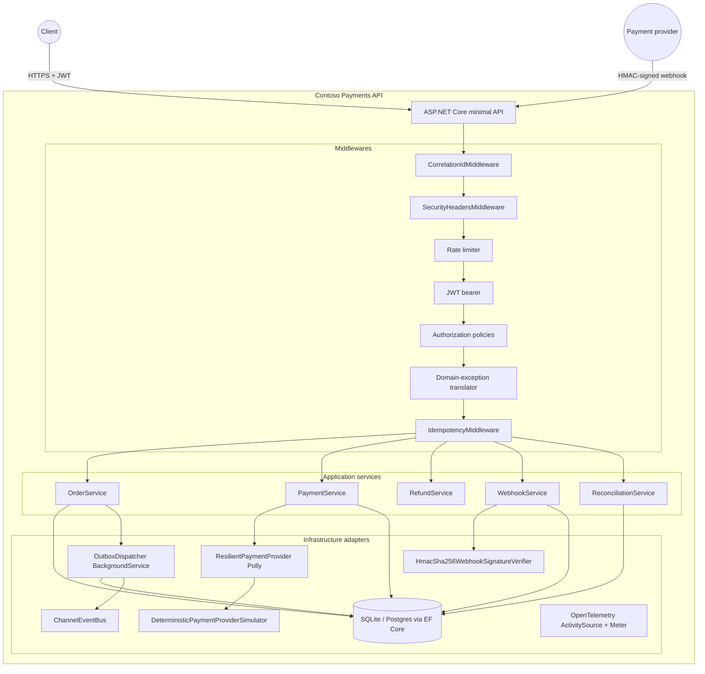

# Architecture

## Layout

Modular monolith. Four projects with strict dependency direction:

```
Api           →  Application  →  Domain
Infrastructure ↗
```

- **`Contoso.Payments.Domain`** — aggregates (`Order`, `PaymentIntent`,
  `InventoryItem`, `Product`, `Refund`), value objects (`Money`), domain
  events (`OrderPlaced`, `PaymentAuthorized`, `PaymentCaptured`,
  `PaymentFailed`, `RefundIssued`), append-only `AuditEvent` +
  `LedgerEntry`, and `DomainException`. Zero framework references.
- **`Contoso.Payments.Application`** — use-case services (`OrderService`,
  `PaymentService`, `RefundService`, `WebhookService`,
  `ReconciliationService`, `CatalogService`), ports (`IPaymentProvider`,
  `IEventBus`, `IWebhookSignatureVerifier`, `IAppDbContext`,
  `IWebhookReplayStore`, `IClock`, `IIdGenerator`), DTOs, `AppResult<T>`
  (success/failure envelope), `OutboxWriter`, `Idempotency` records, and
  the reconciliation settlement-file generator.
- **`Contoso.Payments.Infrastructure`** — `AppDbContext`, EF Core
  `IEntityTypeConfiguration<>` classes, SQLite provider, Postgres switch
  stub, deterministic payment simulator + `ResilientPaymentProvider`
  (Polly), HMAC verifier + EF-backed replay store, `OutboxDispatcher`
  `BackgroundService`, `ChannelEventBus` + adapter stubs, telemetry
  (OpenTelemetry ActivitySource + Meter).
- **`Contoso.Payments.Api`** — minimal-API endpoints, middleware
  (correlation-id, security headers, idempotency), auth setup, composition
  root, dev token issuer, dev seeder. Entry point exposes
  `public partial class Program;` for `WebApplicationFactory<Program>`.

## Container diagram



## Data flow — `POST /api/v1/payments/authorize`

1. `CorrelationIdMiddleware` assigns / echoes `X-Correlation-Id`.
2. `SecurityHeadersMiddleware` adds `nosniff` / `Referrer-Policy` etc.
3. Rate limiter checks per-IP quota.
4. JWT bearer authenticates the caller; authorization enforces
   `orders:write`.
5. Domain-exception translator wraps `next()`.
6. `IdempotencyMiddleware` looks up `(Idempotency-Key, "POST
   /api/v1/payments/authorize")`. On hit: replays original response with
   `Idempotent-Replay: true`. On body-hash mismatch: 409. Otherwise:
   forwards.
7. `PaymentService.AuthorizeAsync` opens a DbContext transaction. It
   loads the order, creates a `PaymentIntent`, calls
   `ResilientPaymentProvider.AuthorizeAsync` through Polly (retry +
   timeout + circuit-breaker). Simulator returns an outcome
   (Succeeded / Declined / Timeout / AsynchronousPending / Duplicate).
8. On Succeeded: `intent.MarkAuthorized`; `outbox.Enqueue(PaymentAuthorized)`;
   `AuditEvents.Add(...)`; commit.
9. On AsynchronousPending: leave intent in `Requires`; audit; commit.
10. On Declined / Timeout: `intent.MarkFailed` (Timeout after Polly retries);
    audit; commit.
11. Middleware captures the response body + status and stores an
    `IdempotencyRecord` (only on 2xx).

## Data flow — `POST /api/v1/webhooks/payments`

1. `WebhookService.ProcessAsync` receives the raw body + signature header.
2. `HmacSha256WebhookSignatureVerifier.Verify` checks timestamp window +
   `FixedTimeEquals`. Invalid → return 401; no DB touch.
3. `WebhookReplays.SeenAsync(sha256(sigHeader))` — replay guard.
   Present → 200 + `replay: true`; no DB touch.
4. Parse body into `WebhookPayload`. Invalid → 400.
5. Load the target `PaymentIntent` (404 if absent).
6. Advance state (`payment.authorized` / `payment.captured` /
   `payment.failed`) using the aggregate methods, which themselves guard
   legal transitions.
7. On capture: mark the order Paid, commit inventory reservations, insert
   `LedgerEntry`, enqueue events onto the outbox.
8. Insert `AuditEvent`; record `WebhookReplayRecord(sigHash)`; commit.

## Cross-cutting concerns

- **Correlation id** — set in the request pipeline, exposed to every
  service via `HttpContext.CorrelationId()`, included in every audit row,
  every outbox message, and every log scope. Echoed to the client in the
  `X-Correlation-Id` response header.
- **Concurrency** — every aggregate has a `Version : long` concurrency
  token. Concurrent modifications throw `DbUpdateConcurrencyException`,
  which application services translate to `409` for the client to retry.
- **Time** — abstracted behind `IClock`. Production uses `SystemClock`;
  tests could inject a fake though they mostly rely on real time.
- **Ids** — abstracted behind `IIdGenerator`. Production uses
  `GuidIdGenerator`; tests inspect the generated ids through the API
  responses.
- **Telemetry** — `ActivitySource("Contoso.Payments")` and
  `Meter("Contoso.Payments")` shared across services. Console exporter by
  default so demos show real traces without any collector.
