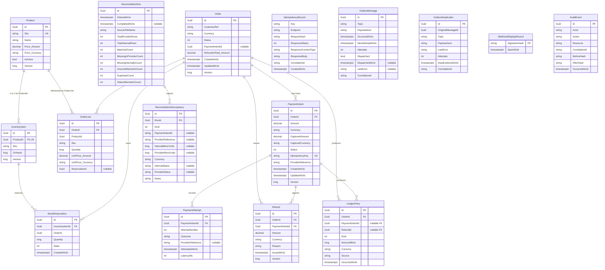

# Database schema

All tables are created by `AppDbContext.OnModelCreating` via the
`IEntityTypeConfiguration<>` classes under
`src/Contoso.Payments.Infrastructure/Persistence/Configurations/`.

## Entity relationship diagram

## Indexes

| Table | Index | Reason |
|---|---|---|
| `Products` | UNIQUE `(Sku)` | SKU lookup + duplicate protection. |
| `InventoryItems` | UNIQUE `(ProductId)` | One row per product. |
| `StockReservations` | `(InventoryItemId, State)` | Fast "available" calc. |
| `Orders` | `(Status)`, `(CustomerRef)` | Status filtering + customer lookup. |
| `OrderLines` | `(OrderId)` | Include navigation. |
| `PaymentIntents` | UNIQUE `(OrderId, IdempotencyKey)` | Second `authorize` with same key must find the prior intent. |
| `PaymentIntents` | `(Status)` | Reconciliation queries. |
| `PaymentAttempts` | `(PaymentIntentId, AttemptNumber)` | Ordered replay. |
| `Refunds` | `(OrderId)`, `(PaymentIntentId)` | Look up refunds by order or intent. |
| `LedgerEntries` | `(OrderId)`, `(PaymentIntentId)` | Journal queries. |
| `IdempotencyRecords` | UNIQUE `(Key, Endpoint)` | The core idempotency invariant. |
| `OutboxMessages` | `(Dispatched, NextAttemptAtUtc)` | Dispatcher poll query. |
| `OutboxDeadLetters` | `(OriginalMessageId)` | DLQ re-drive lookup. |
| `WebhookReplayRecords` | PK on `SignatureHash` | Replay guard. |
| `AuditEvents` | `(Resource)`, `(CorrelationId)` | Trace + audit trail queries. |
| `ReconciliationRuns` | `(StartedAtUtc DESC)` | Recent runs. |
| `ReconciliationDiscrepancies` | `(RunId, Kind)` | Filter discrepancies by kind. |

## Concurrency tokens

All aggregates (`Order`, `InventoryItem`, `PaymentIntent`, `Refund`, `Product`)
carry a `Version : long` property configured as `IsConcurrencyToken()`. Any
concurrent modification will fail SaveChanges with a
`DbUpdateConcurrencyException`, which application services translate to a
`409 Conflict` ProblemDetails and the client can retry.

## Global EF conventions

Applied in `AppDbContext.OnModelCreating`:

- Every `Guid` primary key is `ValueGeneratedNever()` — EF trusts the
  domain's `IIdGenerator`-assigned value on `INSERT`.
- Every `DateTimeOffset` column uses `DateTimeOffsetToBinaryConverter` so
  `WHERE NextAttemptAtUtc <= now` translates on SQLite.
- Navigation collections `Order.Lines` and `InventoryItem.Reservations` are
  `AutoInclude()` so services never need to remember `Include()` for
  correctness-critical calculations like `Order.Total` or `InventoryItem.Available`.
