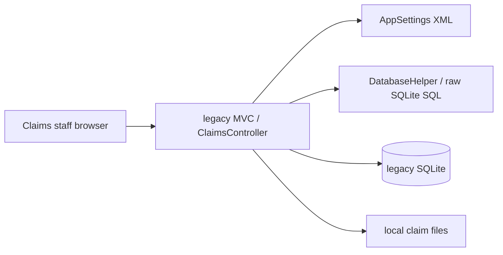
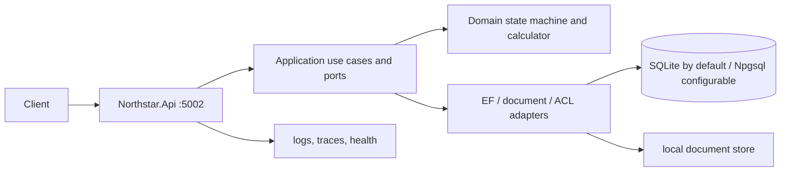
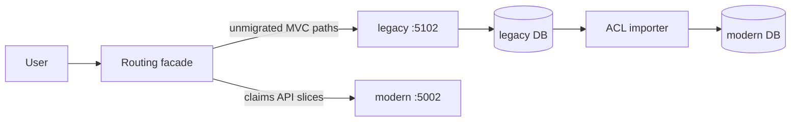
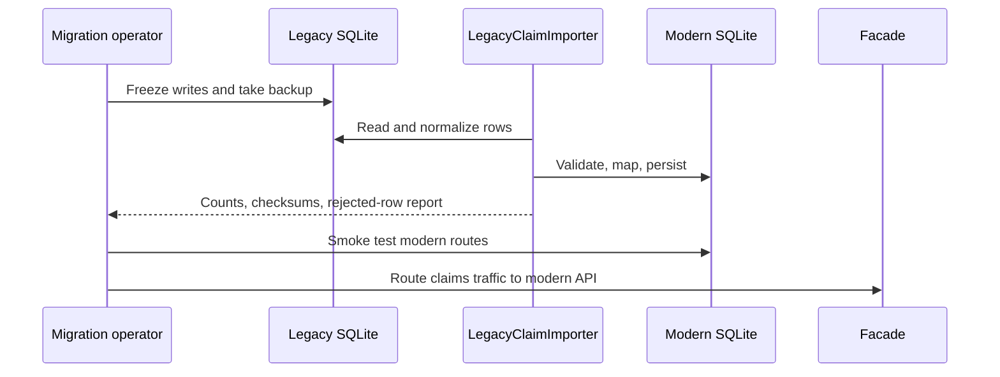

# Northstar Insurance Claims Modernization Lab

## Portfolio Classification
Self-directed engineering case study. This is a production-style prototype of a consulting modernization engagement, using entirely fictional Northstar Insurance Ltd data.

## Executive Summary
This lab preserves a runnable, intentionally legacy-style claims MVC application beside a modern .NET 10 API. It demonstrates assessment, strangler routing, behavioural characterization, anti-corruption import, cutover planning, and a testable target architecture rather than a cosmetic rewrite.

## Business Problem
Northstar needs to improve claims intake, assessment, settlement, and document handling without a risky big-bang replacement. The legacy system combines workflow, SQL, configuration, session, caching, and file access in controllers; this makes security fixes and incremental change expensive.

## Functional Requirements
- Manage policyholders and policies.
- Intake, list, filter, assess, assign, approve/reject, settle, and close claims.
- Calculate settlement from claim amount, deductible/excess, and policy limit.
- Attach PDF/JPEG/PNG evidence documents.
- Preserve legacy settlement behaviour through shared characterization tests.
- Import legacy SQLite claims with row-level rejection reporting and checksums.

## Non-Functional Requirements
- Runs without external infrastructure: SQLite is the default adapter.
- Modern API uses async I/O, cancellation tokens, RFC 7807 errors, JWT policies, correlation IDs, health checks, rate limiting, and OpenTelemetry.
- Claim writes use an explicit `Version` concurrency token.
- Modern document uploads are type- and size-limited and stored outside the web root.

## Architecture
The intentionally nonstandard root layout is deliberate: `legacy/` is the as-is system, `modern/` is the target modular monolith, and `migration-docs/` contains the consulting deliverable. Inside `modern/`, dependencies flow `Api → Infrastructure → Application → Domain`; the domain has no I/O or EF dependency.

## Architecture Diagram








## Technology Stack
| Area | Choice |
|---|---|
| Runtime | .NET 10 / C# |
| Legacy simulation | ASP.NET Core MVC, raw `Microsoft.Data.Sqlite` |
| Target API | ASP.NET Core Minimal APIs |
| Target persistence | EF Core 10, SQLite default, Npgsql adapter by configuration |
| Authentication | JWT bearer, scope-style policy authorization |
| Telemetry | `ILogger`, OpenTelemetry ASP.NET Core instrumentation, console exporter |
| Testing | xUnit, `WebApplicationFactory`, SQLite in-memory |

## Domain Model
Policyholder owns policies. A policy supplies currency, deductible, and limit. A claim belongs to a policy and progresses through `Submitted → UnderReview → Approved|Rejected → Settled|Closed`, subject to explicit allowed edges. Claim documents are metadata records pointing at an `IDocumentStore` key.

## Core Workflows
1. An adjuster with `claims:adjust` submits a claim; the service validates policy/currency and calculates an initial reserve.
2. Assessment starts review, assigns an adjuster, and updates the reserve with a required version.
3. An approver with `claims:approve` decides, settles, or closes according to the domain state machine.
4. The importer reads legacy rows through an anti-corruption adapter, validates them, and emits a reconciliation report.

## Security Model
The legacy simulation deliberately demonstrates concatenated SQL and weak error handling. The target uses parameterized EF queries, restricted document types, problem details without stack traces, JWT validation, scoped policies (`claims:read`, `claims:adjust`, `claims:approve`), append-only audit records, security headers, fixed-window rate limiting, correlation IDs, and a production guard against the development signing key. See [security review](docs/security/security-review.md).

## Reliability & Failure Handling
Claim `Version` is an EF concurrency token; stale writes return `409 Conflict`. Domain violations return `422`, malformed requests return `400`, and unknown records return `404`. The local document adapter fails fast for unsupported or oversized files. The importer leaves rejected source rows out of the target and reports their reasons rather than silently coercing them.

## Observability
Every modern response receives `X-Correlation-Id`; inbound values are honored and added to log scope. The API exposes `/health/live`, `/health/ready`, `/openapi/v1.json`, and OpenTelemetry ASP.NET Core traces. The legacy `Console.WriteLine`/`Trace.Write` usage is intentionally documented as a smell, not a logging design.

## Testing Strategy
The test suite includes legacy characterization tests, shared legacy/modern settlement equivalence tests, an exploit proof for legacy SQL injection and a non-exploit proof for the EF query, domain state-machine and monetary edge cases, importer reconciliation, and HTTP integration tests for happy path, validation, authentication, authorization, and concurrency. Real command output is retained in [docs/test-results.md](docs/test-results.md).

## Local Development
```powershell
Set-Location C:\Users\rukwaropaul\Downloads\DEV\Projects\02-legacy-dotnet-modernization
dotnet build -c Release
dotnet test -c Release
dotnet run --project modern\src\Northstar.Api --launch-profile http
# independently, if demonstrating the as-is system:
dotnet run --project legacy\Northstar.Legacy.Web --launch-profile http
```
Modern API: `http://localhost:5002`; legacy MVC: `http://localhost:5102`. Development startup applies the committed modern EF migration and idempotently seeds fictional data.

## Running with Docker
Docker configuration created but Docker is unavailable on the build host; the compose stack has not been started or verified.

## API Documentation
OpenAPI JSON is available at `http://localhost:5002/openapi/v1.json`. A development-only token endpoint at `POST /api/v1/auth/token` issues local demonstration tokens; it returns `404` in Production. Main resource routes are under `/api/v1/policyholders`, `/api/v1/policies`, `/api/v1/claims`, and `/api/v1/migration/legacy-import`.

## Example Usage
```powershell
$token = (Invoke-RestMethod http://localhost:5002/api/v1/auth/token `
  -Method Post -ContentType 'application/json' `
  -Body '{"subject":"demo-adjuster","scopes":["claims:read","claims:adjust"]}').accessToken
$headers = @{ Authorization = "Bearer $token" }
Invoke-RestMethod http://localhost:5002/api/v1/claims -Method Post -Headers $headers `
  -ContentType 'application/json' `
  -Body '{"policyNumber":"POL-ACME-001","reference":"CLM-DEMO-2026-001","claimedAmount":3400,"currency":"USD"}'
```
Example response fields include `"status":"Submitted"`, `"reserveAmount":2900`, and a `version` used on subsequent writes.

## Performance / Load Testing
No load benchmark is claimed. SQLite and the local document adapter are intentional local/default adapters; a real deployment would benchmark the chosen managed database, object store, and routing facade with representative workload and failure profiles.

## Trade-offs
- The runnable legacy app uses `net10.0` because .NET Framework cannot be installed on this host; this is explicitly a style simulation.
- SQLite provides zero-infrastructure verification but does not model production database operational characteristics.
- The importer is chosen over dual-write to avoid maintaining two sources of truth during the first migration slices.
- `Version` provides optimistic concurrency without locks, requiring clients to retry stale writes.

## Architecture Decisions
The decision records cover the legacy simulation boundary, strangler fig versus big bang, EF Core versus Dapper, and ACL/importer versus dual-write. See [docs/decisions](docs/decisions).

## Known Limitations
There is no real identity provider, virus scanner, managed secret store, Azure Blob deployment, facade host, background retry worker, or production database exercised here. The Npgsql adapter is configuration-supported but not integration-tested against a PostgreSQL server because external infrastructure is unavailable.

## Future Improvements
Add OIDC/JWKS validation, Azure Blob `IDocumentStore`, malware scanning/quarantine, append-only audit records, a production routing facade, migration checkpoint/resume support, and managed database deployment automation.

## Portfolio Talking Points
This project demonstrates the consulting sequence: establish characterization before behavior changes, expose material risk honestly, move a low-risk API slice through an ACL, prove semantic preservation, and make rollback explicit. It also illustrates why a clean target alone is insufficient without coexistence, data, and operational plans.

## Upwork Portfolio Description
**Insurance Claims Modernization Lab — self-directed engineering case study**

Problem: incrementally modernize a claims administration application while preserving settlement behavior and reducing security risk. Built: a runnable legacy-style MVC simulation beside a .NET 10 modular API with EF Core, SQLite, JWT policy authorization, state-machine workflow, file-storage port, and legacy importer. Engineering focus: strangler migration, characterization tests, anti-corruption mapping, optimistic concurrency, RFC 7807 errors, and observability. Verification: local Release build and xUnit suite are recorded in this repository.

This is a self-directed portfolio project, not client work.
