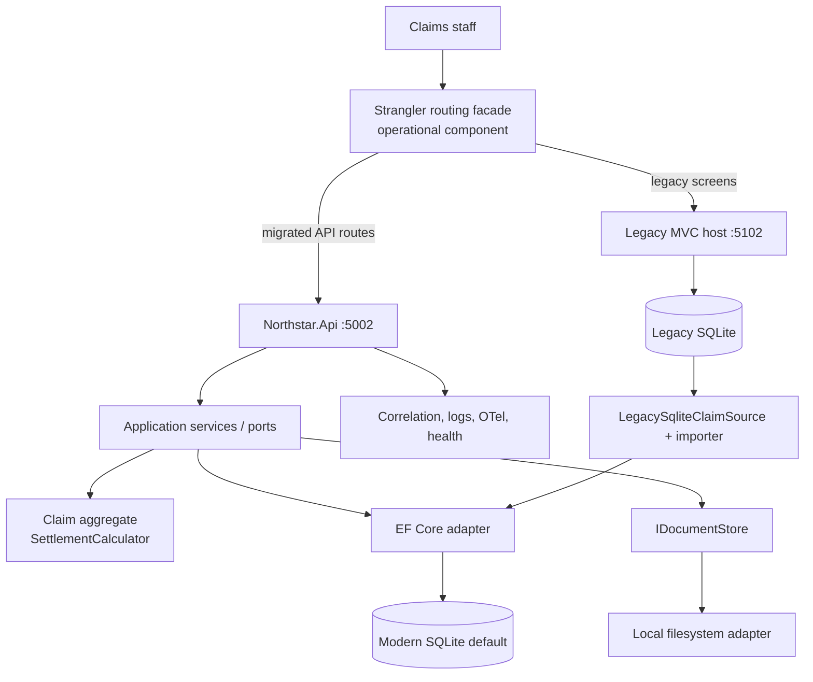
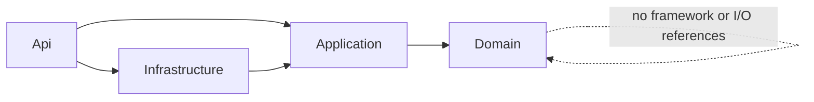
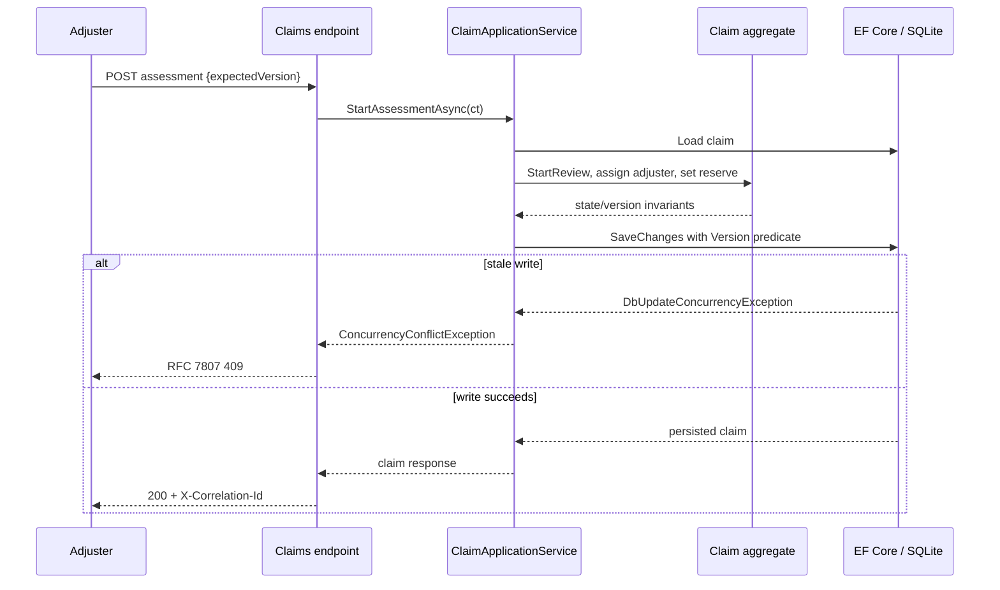

# Architecture — Northstar Claims Modernization Lab

## Intent
The project demonstrates an incremental migration, not a simultaneous rewrite. `legacy/` intentionally keeps unsafe style and behavior visible for assessment and characterization. `modern/` is a modular monolith because claims workflow, policy lookup, settlement calculation, and documents benefit from transactional consistency and straightforward deployment.

## Container view

## Dependency boundaries

`Northstar.Domain` owns monetary arithmetic and allowed state edges. `Northstar.Application` owns use-case orchestration and ports. `Northstar.Infrastructure` owns EF Core, SQLite/Npgsql selection, local documents, clock, and legacy anti-corruption adapter. `Northstar.Api` is the composition root and HTTP/auth/operational edge.

## Assessment-to-settlement sequence

## Cross-cutting behavior
- Modern error mapping uses `IExceptionHandler`: `400` validation, `404` missing resource, `409` stale version, `422` domain rule, and `500` unexpected fault.
- JWT scope policies are applied by endpoint: read, adjust, and approve are distinct authority boundaries.
- Rate limiting runs before auth; correlation/security-header middleware wraps all API responses including failures.
- Successful state-changing endpoints append audit evidence with actor, action, resource, timestamp, correlation/source metadata, and hashes of supplied before/returned-after representations.
- Development applies the committed initial EF migration and idempotent synthetic seed. Tests use a held-open SQLite in-memory connection and intentionally skip startup seeding/migration.

## Deployment view
The default process needs only the .NET SDK and local filesystem. `Database:Provider=Npgsql` selects the Npgsql EF adapter but requires a separately provisioned PostgreSQL-compatible environment and has not been verified on this host. Docker files are present only as unverified deployment artifacts because Docker is unavailable.
