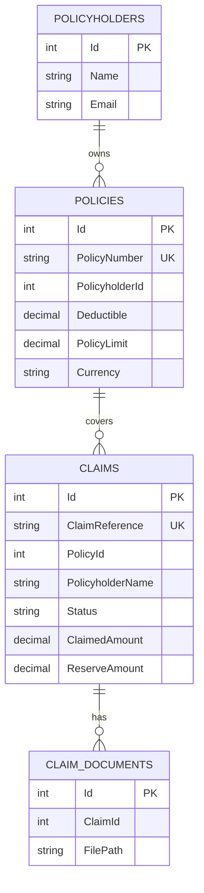
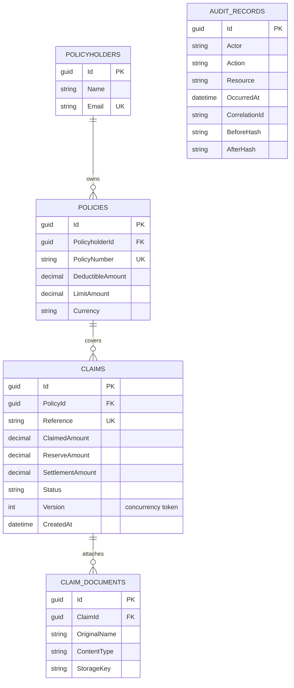

# Database Schema — Northstar Claims Modernization Lab

## Legacy schema (as-is simulation)
| Table | Primary key | Important columns | Notes |
|---|---|---|---|
| `Policyholders` | `Id` integer | `Name`, `Email` | No uniqueness constraint on email |
| `Policies` | `Id` integer | `PolicyNumber` unique, `PolicyholderId`, `Deductible`, `PolicyLimit`, `Currency` | Foreign-key relation is logical in helper schema |
| `Claims` | `Id` integer | `ClaimReference` unique, `PolicyId`, denormalized `PolicyholderName`, status text, claim/reserve values | Duplicates policy terms and accepts free-form status |
| `ClaimDocuments` | `Id` integer | `ClaimId`, `OriginalName`, `FilePath`, `UploadedUtc` | File content is on local disk |

## Modern schema
The committed `202609030001_InitialCreate` EF Core migration creates these tables. SQLite stores GUIDs/timestamps using EF-compatible text representations; `Database:Provider=Npgsql` selects the Npgsql EF provider for a separately provisioned server.

| Table | Key/relationship | Constraints and indexes |
|---|---|---|
| `Policyholders` | GUID `Id` | unique `Email`; required name/email |
| `Policies` | GUID `Id`; `PolicyholderId → Policyholders` | unique `PolicyNumber`; deductible >= 0; limit > 0; holder index |
| `Claims` | GUID `Id`; `PolicyId → Policies` | unique `Reference`; `Status, CreatedAt` and policy indexes; claimed > 0; reserve/settlement >= 0; `Version` concurrency token |
| `ClaimDocuments` | GUID `Id`; `ClaimId → Claims` | claim ID index; required name/content type/storage key |
| `AuditRecords` | GUID `Id` | resource/timestamp and correlation indexes; append-only application audit evidence |
| `__EFMigrationsHistory` | EF internal | applied migration history |

## Data integrity notes
- Domain rules validate before persistence; database constraints are defense in depth.
- `Claims.Version` increments in aggregate behavior and EF uses its original value in updates to detect concurrent writes.
- Monetary values use `decimal`, never `double`. Currency is validated as a three-letter code and claim intake requires it to match the policy.
- The legacy importer regenerates GUID identities and maps by durable business key (`PolicyNumber`, `ClaimReference`), retaining legacy numeric IDs only in its validation report.
- State-changing HTTP endpoints append an `AuditRecords` entry with actor/action/resource, timestamp, correlation/source metadata, and SHA-256 representations of supplied before/returned-after state. No application endpoint mutates or deletes those records.
