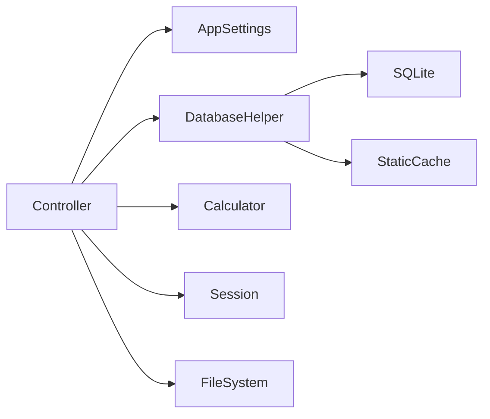

# Northstar Claims Modernization Assessment

## Scope and approach
This assessment examines the runnable `legacy/Northstar.Legacy.Web` simulation and maps a safe target path into `modern/`. The implementation targets `net10.0` only because .NET Framework cannot be installed on the build host; the assessed architecture deliberately reproduces the relevant 2010-era patterns rather than pretending to be an actual Framework 4.x application.

## Codebase inventory
| Area | Location | Current responsibility | Assessment |
|---|---|---|---|
| MVC entry point | `legacy/Northstar.Legacy.Web/Program.cs` | Boot, static configuration, schema setup, session | Host owns persistence lifecycle |
| Claims controller | `Controllers/ClaimsController.cs` | Intake, formatting, workflow, storage, logging | Primary fat-controller hotspot |
| SQL helper | `Legacy/DatabaseHelper.cs` | Schema, seed, queries, cache, raw ADO.NET | Security and data-access hotspot |
| Static configuration | `Legacy/AppSettings.cs` + `AppSettings.xml` | XML parsing/global mutable settings | Not test-isolatable or DI-friendly |
| Settlement utility | `Services/LegacySettlementCalculator.cs` | Deductible/limit arithmetic and throttling | Characterize before extraction |
| MVC views | `Views/Claims/*.cshtml` | Claim list and intake | Thin, disposable presentation layer |
| Local documents | Controller and `ClaimDocuments` table | Filesystem writes plus metadata | Requires storage abstraction and migration plan |

## Smell catalogue
| ID | Evidence | Impact | Target treatment |
|---|---|---|---|
| L-01 | `DatabaseHelper.cs:192` has `// LEGACY-SMELL` and interpolates `policyholderName` into SQL | SQL injection can bypass claims filtering; characterization test proves it | EF LINQ parameterization inside `EfClaimsStore` |
| L-02 | `DatabaseHelper.cs:6,8` is a static helper with a static dictionary cache | Global mutable state, hard-to-isolate tests, stale/implicit cache behavior | Scoped repository port plus explicit adapters |
| L-03 | `AppSettings.cs:6-8` holds global XML-loaded configuration | No validation, no environment composition, no per-test override | Validated `IOptions<T>` at startup |
| L-04 | `ClaimsController.cs:15,55` uses `Thread.Sleep` and `.Result` | Thread-pool starvation and unpredictable latency | Async use cases and propagated `CancellationToken` |
| L-05 | `ClaimsController.cs:43-77` validates, calculates, persists, sets session, and formats errors; `:128-132` executes embedded SQL | High cyclomatic surface and untestable business behavior | Application service plus pure domain services |
| L-06 | `ClaimsController.cs:113` writes a user-named file directly; `:118-121` swallows exceptions; `DatabaseHelper.cs:246` reads files in data access | Traversal/storage safety and silent data loss risk | `IDocumentStore`, allow-list, size cap, observable failure |
| L-07 | `ClaimsController.cs:71` logs with `Console.WriteLine`; `:74` catches broad exception | No structured context or reliable troubleshooting | `ILogger`, correlation scope, RFC 7807 handler |
| L-08 | `ClaimsController.cs:70,99` stores workflow context in session | Sticky-session dependence and unclear source of truth | Persist aggregate status/version in database |
| L-09 | Legacy controller accepts stage strings at `ClaimsController.cs:92-95` | Allows simplistic workflow changes with no transition invariant | Explicit `Claim.IsAllowedTransition` state machine |
| L-10 | `LegacySettlementCalculator.cs:10` throttles with sleep and silently returns zero for invalid input | Behavior is implicit; changes could alter payments | Shared characterization tests before extraction |
| L-11 | `LegacyServiceLocator.cs:3-6` hides construction in a global locator | Dependency graph is opaque and substitution is difficult | Constructor injection and explicit composition root |

## Dependency analysis

The controller is the convergence point for all dependencies. This makes the claims listing/filter and settlement logic suitable first strangler slices: the modern API can take them over without requiring document migration or a full UI replacement.

## Risk register
| Risk | Likelihood | Impact | Early warning | Mitigation / owner |
|---|---:|---:|---|---|
| Incorrect settlement parity | Medium | High | Reconciliation variance | Lock shared tests before changes; claims product owner signs off |
| Legacy filter exploit exposed during coexistence | High | High | Unexpected broad result sets | Restrict legacy access and prioritize read/filter slice; security owner |
| Lost attachments | Medium | High | File/table count mismatch | Manifest + checksum before cutover; migration operator |
| Duplicate claims during dual access | Medium | High | Duplicate references | Route ownership by slice; unique target reference constraint; delivery lead |
| SQLite schema assumptions differ in production | Medium | Medium | Provider-specific migration failures | Test Npgsql adapter before enterprise deployment; platform team |
| Staff use stale UI bookmarks | Medium | Medium | Legacy traffic after routing switch | Facade telemetry, redirects, rollback routing rule; operations |

## Indicative effort estimate
These are planning ranges, not a delivery promise.

| Workstream | Range | Assumptions |
|---|---:|---|
| Characterization and inventory | 3–5 engineer-days | Representative settlement and filtering behavior available |
| Target core/domain/API | 8–12 engineer-days | One claims bounded context, no external IDP integration |
| Data mapping and dry runs | 5–10 engineer-days | Legacy schema quality similar to simulation |
| UI routing and coexistence | 5–8 engineer-days | Facade ownership and DNS/change window available |
| Cutover/hypercare | 3–5 engineer-days | Named business validators and rollback authority |

## Recommendation
Use a strangler approach. Stabilize settlement behavior with characterization tests, move authenticated read/list and new intake to the target, import data through an ACL during a controlled freeze, then retire the legacy claims route. Do not begin with a UI rewrite or dual-write synchronization.
