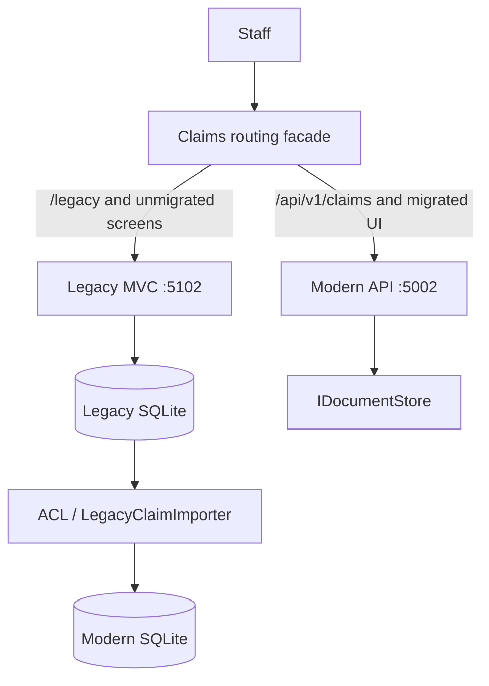

# Strangler Fig Plan

## Routing facade

The facade is an operational deployment component, not implemented in this repository. Its route table, logs, health probes, and rollback switch are part of the cutover runbook.

## Phases
| Phase | Slice | Why it moves now | Coexistence/data strategy | Exit criteria | Rollback |
|---|---|---|---|---|---|
| 0 | Discovery + characterization | Removes uncertainty before changing finance-adjacent logic | Legacy remains system of record | Shared settlement/injection tests green; schema inventory signed off | No production behavior changed |
| 1 | Read-only claim list/detail API | Low write risk; gives telemetry and auth value early | Modern reads imported snapshot; legacy UI remains owner | Counts/filter behavior reconciled | Route GET traffic back to MVC |
| 2 | New claims intake + assessment | Highest controller coupling, clear aggregate boundary | Facade routes new references to modern; legacy claims remain legacy | Reference uniqueness and stale-write handling observed | Stop modern writes, route new intake back |
| 3 | Approval, settlement, documents | Requires policy authorization and attachment manifest | Controlled freeze; import delta; modern becomes claims owner | Reconciliation and business smoke approval | Restore legacy DB/files and facade rule |
| 4 | Retirement | Removes operational/security burden | Archive read-only legacy image + database backup | No legacy route hits for agreed period | Re-enable archive route only |

## Why claims list and intake move first
The unsafe policyholder filter is a high-severity exposure and the list slice has limited mutation risk. Intake then moves because it isolates a coherent aggregate and immediately benefits from the explicit state machine, calculation service, policy authorization, and versioning. Attachments wait until their storage manifest can be reconciled.

## Coexistence rules
- Exactly one system owns a claim reference at a time; ownership is encoded by facade route and reference allocation.
- Avoid dual-write. It creates hard-to-reconcile independent transaction failures.
- Import snapshot/delta through the ACL; report source count, imported count, checksums, and rejected rows.
- Legacy remains read-only during final delta import; do not allow manual back-dating during the freeze.
- A business-visible banner labels legacy screens during coexistence and directs users to the route owner.

## Phase verification
For each phase, compare count by status, amount totals by currency, reference set checksum, policy mapping completeness, and attachment manifest. Route only after operational, security, and business owners acknowledge the evidence.
