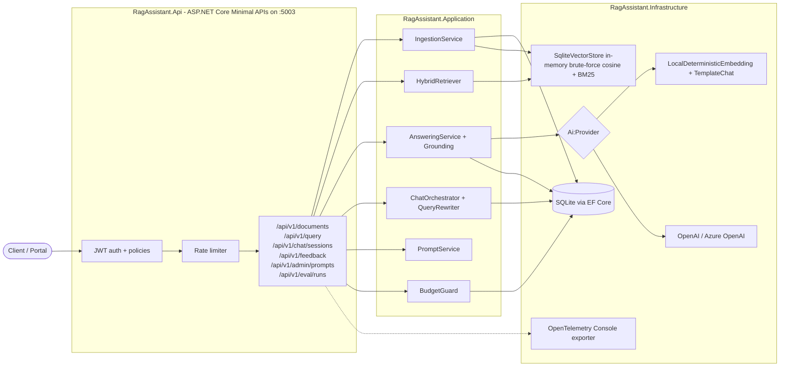
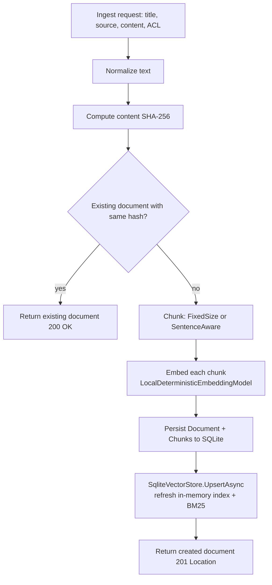
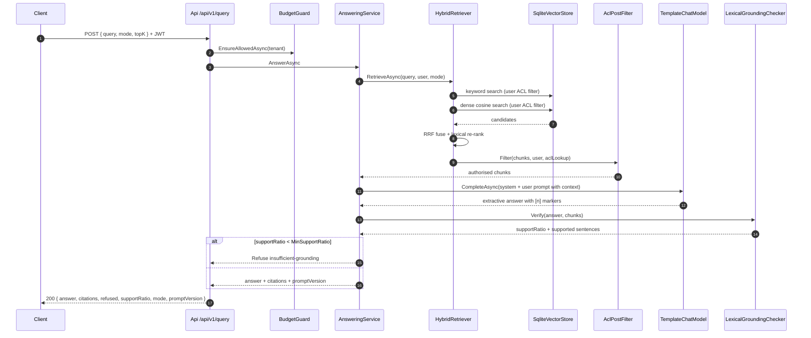

# Enterprise RAG Knowledge Assistant

> Production-grade retrieval-augmented Q&A for enterprise documents, in
> C#/ASP.NET Core. Permission-aware retrieval, inline citations, grounding
> checks, prompt versioning and a real evaluation harness — reproducible
> offline with **zero paid API keys**.

Everything in this README maps to code you can read, tests you can run, and
numbers you can reproduce. The fictional company `Acme Manufacturing` used
in the corpus is intentional and clearly labelled — no real company data is
included.

---

## 1. Overview

An ASP.NET Core 10 service that ingests documents, indexes them for hybrid
retrieval, answers questions with inline citations, and refuses when it does
not have enough grounded evidence. The default AI provider is a
**deterministic local implementation** so the entire test suite runs offline;
real OpenAI / Azure OpenAI adapters are gated behind a config switch and
never hit in tests.

Highlights:

- **Hybrid retrieval** — BM25 keyword (hand-built inverted index), dense
  cosine retrieval, and Reciprocal Rank Fusion of the two, with an optional
  lexical-overlap re-ranker.
- **Permission-aware retrieval** — ACLs enforced at the store *and* as a
  post-filter, with a leak test that proves restricted content never reaches
  an unauthorised user.
- **Grounding / faithfulness check** — every answer sentence must have
  lexical support in a cited chunk, otherwise the answer is downgraded to a
  refusal.
- **Prompt versioning** — content-hashed prompt templates; every answer
  records the exact prompt id + version it used.
- **Real evaluation harness** — a 35-question golden dataset (27 direct +
  8 paraphrase queries) over the synthetic corpus, reporting Recall@k, MRR,
  nDCG@k, citation precision, citation recall, any-correct-citation rate and
  refusal accuracy. Numbers reproduced in `docs/evaluation.md`.
- **Enterprise plumbing** — JWT + policies, ProblemDetails errors, rate
  limiting, OpenTelemetry traces/metrics, correlation ids, per-tenant
  budget guard with 429s.

## 2. Tech stack

| Layer          | Choice                                                   |
|----------------|----------------------------------------------------------|
| Runtime        | .NET 10 (`net10.0`)                                      |
| API            | ASP.NET Core Minimal APIs                                |
| Storage        | EF Core over SQLite (default); pgvector documented (ADR 0003) |
| Identity       | JWT (`Microsoft.AspNetCore.Authentication.JwtBearer`)    |
| Observability  | OpenTelemetry (traces + metrics, console exporter)       |
| Tests          | xUnit + `Microsoft.AspNetCore.Mvc.Testing`               |
| CI             | GitHub Actions (`.github/workflows/ci.yml`)              |

No Docker required. No Python required. No API key required.

## 3. Repository layout

```
src/
├── RagAssistant.Domain            Entities, value objects (Document, Acl, ChatSession, Prompt, Citation, ...)
├── RagAssistant.Application       Use cases + abstractions (IEmbeddingModel, IChatModel, IVectorStore, ...)
│   ├── Chunking                   FixedSizeChunker, SentenceAwareChunker
│   ├── Embeddings                 LocalDeterministicEmbeddingModel
│   ├── Retrieval                  Bm25Index, ReciprocalRankFusion, HybridRetriever
│   ├── Answering                  TemplateChatModel, LexicalGroundingChecker, AnsweringService
│   ├── Ingestion                  IngestionService (idempotent, versioned)
│   ├── Chat                       ContextualQueryRewriter, ChatOrchestrator
│   ├── Prompts                    PromptService
│   ├── Feedback                   FeedbackService
│   ├── Cost                       BudgetGuard, PriceBook
│   ├── Security                   AclPostFilter
│   └── Evaluation                 EvaluationHarness
├── RagAssistant.Infrastructure    EF Core mappings + repositories + SqliteVectorStore + OpenAI adapters
├── RagAssistant.Api               Minimal APIs, auth, middleware, endpoints, health, OpenAPI
└── RagAssistant.Eval              Console runner for the evaluation harness

tests/
├── RagAssistant.UnitTests         52 tests (Application layer)
└── RagAssistant.IntegrationTests  14 tests (WebApplicationFactory)

docs/
├── evaluation.md                  Real measured metrics
├── test-results.md                Build + test evidence
├── database-schema.md             ER diagram + column semantics
├── decisions/                     5 ADRs
├── security/security-review.md    STRIDE + non-claims
├── runbooks/                      Operational reference
└── portfolio/                     6 portfolio files
```

## 4. Container diagram



## 5. Ingestion pipeline



## 6. Query sequence



## 7. Getting started

Prereqs: .NET SDK 10.0.400, PowerShell 7 (Windows), git.

```powershell
dotnet build -c Release
dotnet test  -c Release      # 70/70 tests, no network required
dotnet run --project src/RagAssistant.Api -c Release
# API on http://localhost:5003
```

## 8. Configuration

Everything is bound from configuration. Copy `.env.example` to `.env` for a
starting point. Key sections:

- `Database:Provider` / `Database:ConnectionString` — SQLite by default.
- `Jwt:Issuer`, `Jwt:Audience`, `Jwt:SigningKey` — required in production.
- `Ai:Provider` — `Local` (default), `OpenAI`, or `AzureOpenAI`.
- `Rag:MinRetrievalScore`, `Rag:MinSupportForSentence`, `Rag:MinSupportRatio`,
  `Rag:TopK` — retrieval / grounding thresholds.
- `Budget:DailyLimitUsd`, `Budget:DailyRequestLimit` — per-tenant caps.
- `RateLimiting:PermitsPerMinute` — global rate limiter.

## 9. Authentication

JWT bearer, HS256. In non-Production environments the API exposes
`POST /api/v1/auth/token` (see `AuthEndpoints.cs`) to mint dev tokens with a
chosen user id, roles, departments and classification. In Production the API
refuses to boot if the signing key still starts with `dev-only`.

Two policies:

- `KnowledgeReader` — every authenticated request.
- `KnowledgeAdmin` — requires a `role=admin` claim; guards
  `/api/v1/admin/prompts`, `DELETE /documents/{id}`, `/api/v1/eval/runs`.

## 10. API surface

| Endpoint                                | Method | Notes                                            |
|-----------------------------------------|--------|--------------------------------------------------|
| `/api/v1/documents`                     | POST   | Ingest (idempotent by hash). Returns 200 on reuse, 201 on create. |
| `/api/v1/documents`                     | GET    | List, ACL-filtered.                              |
| `/api/v1/documents/{id}`                | GET    | 200 / 403 / 404.                                 |
| `/api/v1/documents/{id}/reindex`        | POST   | Re-run the chunker + embed pipeline.             |
| `/api/v1/documents/{id}`                | DELETE | `KnowledgeAdmin` only.                           |
| `/api/v1/query`                         | POST   | Answer with citations.                           |
| `/api/v1/chat/sessions`                 | POST   | Create/continue a chat turn.                     |
| `/api/v1/feedback`                      | POST/GET | Thumbs up/down + reason.                       |
| `/api/v1/admin/prompts`                 | POST/GET | Prompt versioning (`KnowledgeAdmin`).          |
| `/api/v1/eval/runs`                     | POST   | Run the evaluation harness (`KnowledgeAdmin`).   |
| `/api/v1/auth/token`                    | POST   | Dev token issuer — not mapped in Production.     |
| `/health/live`, `/health/ready`         | GET    | Health checks.                                   |

OpenAPI is exposed at `/openapi/v1.json` in non-Production.

## 11. Retrieval design

See ADR 0002 for the decision record. Three modes, one `IRetriever`:

- `Keyword` — hand-built inverted index (`Bm25Index.cs`) with BM25 scoring
  (k₁ = 1.2, b = 0.75, no external dependency).
- `Dense` — cosine over `LocalDeterministicEmbeddingModel` vectors,
  brute-force.
- `Hybrid` — RRF over the two rankings + lexical-overlap re-rank.

Every mode is filtered by the caller's `UserPrincipal` before scoring
(ADR 0004) and again by `AclPostFilter` after retrieval.

## 12. Answering and grounding

`AnsweringService`:

1. Retrieves top-k chunks (already ACL-filtered).
2. Refuses with `insufficient-retrieval` if the best chunk score is below
   `Rag:MinRetrievalScore`.
3. Composes a system prompt with retrieved chunks inside a
   `<<CTX_JSON>>...<<END_CTX_JSON>>` marker.
4. Calls the configured `IChatModel` (default `TemplateChatModel`).
5. Runs `LexicalGroundingChecker.Verify` — the answer's support ratio must
   clear `Rag:MinSupportRatio` or the answer is downgraded to
   `insufficient-grounding` refusal.
6. Builds `citations[]` from the chunks that actually supported a sentence,
   including doc id, title, chunk id, char span, and score.

See ADR 0005 for the details.

## 13. Permission-aware retrieval

Two layers, both enforced. See ADR 0004 and
`tests/RagAssistant.IntegrationTests/Api/QueryEndpointsTests.cs`.

- Store level: `SqliteVectorStore.SearchAsync` filters by
  `document.Acl.Allows(user)` before scoring.
- Post-filter: `AclPostFilter.Filter` re-checks each chunk against a fresh
  `IDocumentRepository` ACL lookup. Unknown documents are dropped.

Leak test: `Query_RestrictedDoc_LeaksNothing` asks a restricted question as
an unauthorised user and asserts no citation carries a restricted document
and no forbidden substring appears in the answer.

## 14. Prompt versioning

`PromptService` in `Application.Prompts`. Prompts are content-hashed on
registration. Re-registering the same `(name, version)` with a different
body → `409 Conflict`. Registering a new version deactivates prior ones for
that name. Every `AnswerResult` includes `promptVersion` (e.g. `rag.answer@v1`).

## 15. Evaluation harness

`EvaluationHarness` runs the golden dataset against each retrieval mode and
also runs the answering service to measure attribution and refusal quality.
It reports:

- **Recall@k, MRR, nDCG@k** per mode, over all 35 examples.
- **Citation precision, citation recall and any-correct-citation rate** —
  reported together so a good-looking precision cannot hide low recall (and
  vice versa).
- **Refusal accuracy** — fraction of `should_refuse` labels handled correctly.
- **Paraphrase slice** — the same retrieval metrics computed only on the 8
  synonym-heavy queries, to isolate the vocabulary-mismatch behaviour.

Real numbers measured on this host live in `docs/evaluation.md`, which also
carries a written diagnosis of why citation precision was initially 35 %
and what changed to lift it to 71 %.

## 16. Observability

- **Traces:** OpenTelemetry `RagAssistant` activity source. Spans of
  interest: `rag.retrieve`, `rag.rerank`, `rag.generate`. Console exporter
  by default; swap to OTLP in production.
- **Metrics:** OpenTelemetry meter `RagAssistant`. Extend it with your
  retrieval latency histogram, tokens counter, refusal counter.
- **Correlation ids:** `CorrelationIdMiddleware` accepts or generates an
  `X-Correlation-Id` header.
- **Security headers:** `SecurityHeadersMiddleware` sets `X-Content-Type-Options`,
  `X-Frame-Options`, and `Referrer-Policy`.
- **Health:** `/health/live` (process alive), `/health/ready` (DB reachable).

## 17. Rate limiting and cost control

- Global fixed-window rate limiter partitioned by identity or IP; permit
  count via `RateLimiting:PermitsPerMinute`.
- `UsageBudgetGuard` reads from the `UsageEntry` ledger; requests are
  rejected with 429 when the tenant's daily cost or request count is
  exceeded. Prices per model come from an in-memory `PriceBook`.

## 18. Testing strategy

- **Unit tests (56)** cover Application-layer concerns: chunking (boundary
  correctness), the deterministic embedding (similarity ordering property),
  BM25 index (score sign + tie-breakers), RRF fusion, grounding checker,
  template chat model (including the chunk-rank preference that fixed the
  attribution bug), the AnsweringService citation-marker parser, contextual
  query rewriter, ACL rules, and hashing.
- **Integration tests (14)** boot the API through `WebApplicationFactory`
  with an in-memory SQLite, seed the corpus, and hit the endpoints as
  different identities. Includes the permission leak test, ingestion
  idempotency, prompt versioning, evaluation harness run, chat turn with
  follow-up, and feedback capture.
- **Evaluation harness** doubles as a regression test — an
  `AdminEndpointsTests.RunEvaluation_ReportsMetricsAndHybridBeatsDenseOnMrr`
  test asserts:
  - `Hybrid MRR >= Dense MRR` on the full set,
  - `Hybrid Recall@5 >= 0.7`,
  - `Refusal accuracy >= 0.8`,
  - `Citation precision >= 0.6`, `Any-correct-citation rate >= 0.75`,
  - `Hybrid MRR >= Dense MRR` on the paraphrase slice.

Run everything:

```powershell
dotnet test -c Release
```

## 19. Security review

`docs/security/security-review.md` walks through STRIDE with explicit
non-claims (no SOC 2, no HSM, no mTLS). Key controls: JWT with issuer +
audience + lifetime validation, ACL post-filter, dev-only endpoint gating,
prompt version integrity, budget + rate limits, ProblemDetails errors, no
PII in logs.

## 20. Deployment

- Native: `dotnet publish src/RagAssistant.Api -c Release -r <rid>`
- Container: `Dockerfile` in the repo (labelled UNVERIFIED — reference
  artefact for the pgvector production path).
- `docker-compose.yml` runs the app + pgvector 16 side by side (also
  UNVERIFIED).

Production checklist:

- Replace `Jwt:SigningKey` with a 32+ char secret from your secret store.
- Switch `Ai:Provider` and set the corresponding credentials.
- Switch OpenTelemetry to an OTLP exporter pointing at your collector.
- Add EF Core migrations before running against a real database.

## 21. Roadmap and honest limitations

Documented in `docs/portfolio/checklist.md`. Selected items:

- **pgvector adapter** — designed, not implemented.
- **EF Core migrations** — currently `EnsureCreatedAsync`.
- **NLI-based second-layer grounding** — after enabling a real LLM.
- **Cross-tenant vector isolation** — `Tenant` scopes budgets today, not
  storage.
- **Deterministic embedding vs paraphrases** — the local embedding cannot
  bridge synonyms ("annual leave" ↔ "paid time off"). Hybrid retrieval
  already beats dense on the paraphrase slice, but real neural embeddings
  are required to overtake keyword-only on it. This is discussed in
  `docs/evaluation.md`.

---

*The Acme Manufacturing corpus is fictional. Any resemblance to real
companies is coincidental.*
