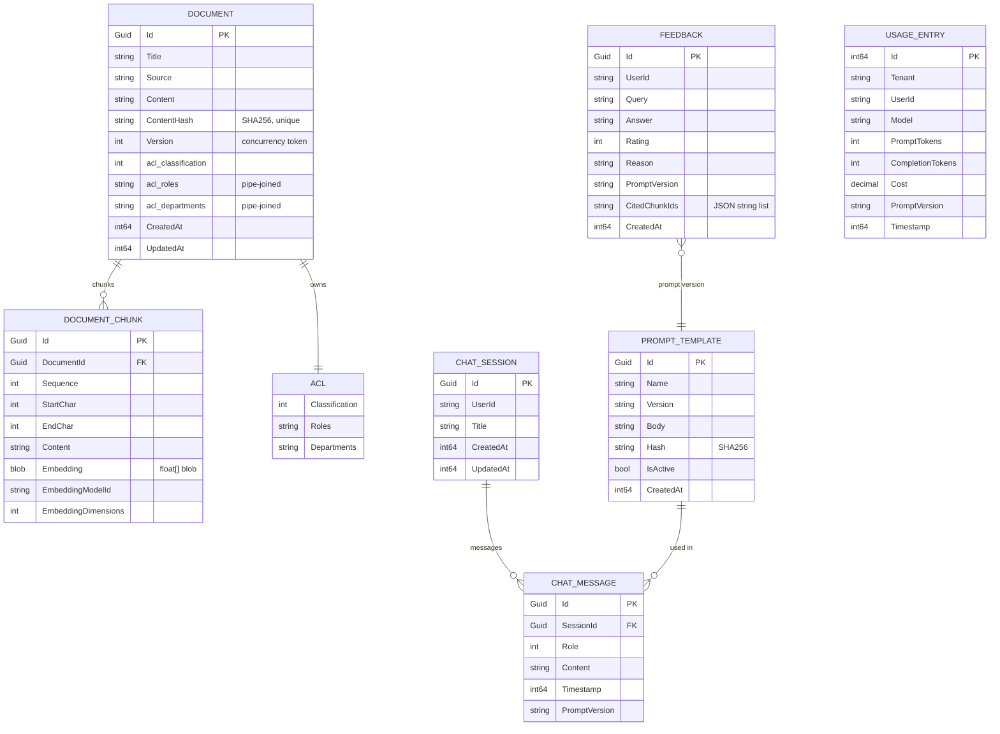

# Database schema

The service uses SQLite by default (see ADR 0003). All types are shown in
SQLite terms; `DateTimeOffset` is persisted as a 64-bit integer via
`DateTimeOffsetToBinaryConverter` (globally configured in `RagDbContext`).

## ER diagram

## Table notes

- **Documents.**
  `ContentHash` is unique — this is what makes ingestion idempotent
  (`IngestionService` reuses the existing document when the hash matches).
  `Version` is the EF Core concurrency token; a re-ingest bumps it and
  clears the chunk list before re-adding.
  `Acl` is owned (`OwnsOne`) — the columns are inlined onto `documents`
  as `acl_classification`, `acl_roles`, `acl_departments`. Roles /
  departments are stored pipe-joined via a value converter.

- **DocumentChunk.** Embeddings are stored as raw `float[]` bytes via
  `Buffer.BlockCopy`. Decoding is done in-memory at `SqliteVectorStore`
  boot. `Sequence`/`StartChar`/`EndChar` allow citation spans to point at
  the exact substring in `Document.Content`.

- **ChatSession/ChatMessage.** Cascade delete on session id. Messages are
  inserted individually by `ChatSessionRepository.AppendMessagesAsync`
  using `ExecuteUpdateAsync` on the parent session to bump `UpdatedAt`.

- **PromptTemplate.** `Hash = SHA-256(Body)`. Registering the same
  `(Name, Version)` with a different body returns `409 Conflict`; a new
  `Version` deactivates all previous ones for that name.

- **Feedback.** `CitedChunkIds` is serialised JSON — feedback rows are
  written rarely and read for offline analysis, so JSON is fine.

- **UsageEntry.** Feeds the budget guard. Aggregated per tenant per day.

## Migrations

The project uses `EnsureCreatedAsync` at boot for the dev/CI experience —
there are no EF migrations yet. Adding them is straightforward
(`dotnet ef migrations add InitialCreate`), and required before running in
production against a real database.
