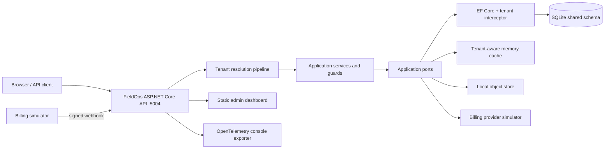
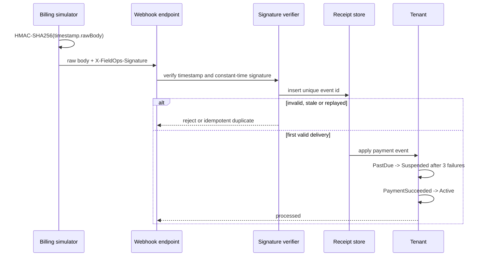

# FieldOps Multi-Tenant B2B SaaS Platform

## Portfolio Classification

**Self-directed engineering case study.** This repository is a production-style reference implementation, not client work and not a claim of a live production deployment. It demonstrates a multi-tenant field-operations SaaS with provable isolation, policy authorization, commercial entitlements, metering, feature delivery and signed billing events.

## Executive Summary

FieldOps manages equipment, work orders and inspections for several organizations in one shared application. Its headline property is tenant isolation enforced at four boundaries: request resolution, application guards, EF Core query filters and a write interceptor. The commercial layer adds plans, quotas, tenant/user feature flags, subscription simulation, dunning and an auditable platform-admin surface.

The default adapter set requires only the .NET 10 SDK: ASP.NET Core, EF Core and SQLite. Synthetic tenants are **Savanna Logistics Ltd (fictional)**, **Jua Kali Manufacturing Ltd (fictional)** and **Acme Manufacturing (fictional)**. Example billing uses KES and USD.

## Business Problem

B2B field-service vendors need more than work-order CRUD:

- one identity may work with several customers, without data crossing customer boundaries;
- dispatchers, technicians and viewers need distinct live permissions;
- each subscription plan must control capacity and features;
- billing failures must drive service status predictably;
- administrators need operational visibility without creating an IDOR back door;
- every security-relevant mutation needs evidence for support and investigations.

This project treats those concerns as core architecture rather than later middleware.

## Functional Requirements

- Organizations with slug, region, settings, plan and `Trial`, `Active`, `PastDue`, `Suspended` states.
- JWT/header/subdomain tenant resolution with configurable precedence and ambiguity rejection.
- Users, multi-organization memberships, teams, invitations and active-organization switching.
- Roles: Owner, Admin, Dispatcher, Technician and Viewer; eight permission policies.
- Assets, scheduled jobs, assignment, SLA tracking, attachments and a strict job state machine.
- Typed inspection templates and scored submissions.
- Free, Starter, Professional and Enterprise plan catalogues with limits and entitlements.
- Monthly atomic usage meters with soft and hard thresholds.
- Per-tenant feature flags, stable percentage rollout, per-user overrides and kill switches.
- Simulated customers/subscriptions/proration/invoices/payments behind `IBillingProvider`.
- HMAC-signed, replay-protected webhook handling and dunning transitions.
- Tenant-aware cache and append-only audit search.
- Platform-admin tenant/job views and a static administration dashboard.

## Non-Functional Requirements

- Zero external infrastructure for build and test; SQLite is the default.
- Defence-in-depth isolation with executable regression tests.
- RFC 7807 errors, bounded pagination, upload allow-lists and request rate controls.
- Policy authorization that reads current membership state, so role changes do not require restart.
- Correlation IDs, structured logging, OpenTelemetry traces/metrics and health checks.
- Adapter interfaces owned by the Application layer.
- Cancellation tokens across asynchronous persistence and API operations.

## Architecture

The system is a modular monolith:

- **Domain** owns entities, invariants, state machines and value types.
- **Application** owns use cases, ports, permissions, tenant guards, entitlements and evaluations.
- **Infrastructure** owns EF Core/SQLite, isolation interceptors, repositories, cache, object storage and billing simulation.
- **API** owns composition, middleware, JWT, authorization requirements, endpoint groups, OpenAPI and the dashboard.

Dependency direction is `Api -> Infrastructure -> Application -> Domain`. Domain and Application have no ASP.NET or EF dependency. The shared-schema design makes tenant isolation a testable invariant while keeping local execution simple.

## Architecture Diagram



Tenant request sequence:

```mermaid
sequenceDiagram
    participant C as Client
    participant A as AuthN
    participant R as Tenant resolver
    participant Z as Permission handler
    participant S as Application service
    participant D as EF Core
    participant I as Save interceptor
    C->>A: JWT + X-Tenant
    A->>R: authenticated principal
    R->>R: evaluate JWT/header/subdomain
    alt sources resolve to different tenants
        R-->>C: 400 tenant-resolution ProblemDetails
    else tenant resolved
        R->>Z: tenant context + user
        Z->>D: current membership role
        Z->>S: permission granted
        S->>S: explicit cross-aggregate tenant guard
        S->>D: query/write
        D->>D: global TenantId query filter
        D->>I: SaveChanges
        I->>I: stamp inserts; reject foreign writes
        I-->>C: tenant-scoped result
    end
```

Billing webhook sequence:



## Technology Stack

| Area | Choice |
|---|---|
| Runtime | .NET 10 / C# |
| HTTP | ASP.NET Core minimal APIs |
| Persistence | EF Core 10 + SQLite |
| Authentication | JWT bearer, HS256 development issuer |
| Authorization | ASP.NET Core policies + custom permission requirement |
| Rate limiting | ASP.NET Core fixed-window partition + plan gate |
| Cache | tenant-namespaced in-process cache adapter |
| Files | local filesystem `IObjectStore` adapter |
| Billing | deterministic in-repository simulator |
| Observability | `ILogger`, `ActivitySource`, `Meter`, OpenTelemetry console exporter |
| API description | ASP.NET Core OpenAPI at `/openapi/v1.json` |
| UI | static HTML, CSS and vanilla JavaScript served by the API |
| Tests | xUnit, `WebApplicationFactory`, SQLite in-memory |

## Domain Model

`Organization` is the tenant root. Tenant-owned rows implement `ITenantOwned` and carry `TenantId`: memberships, teams, invitations, assets, jobs, attachments, inspection templates/items/submissions/answers, usage counters, flags/overrides, billing records and audit entries.

Important invariants:

- a job moves only through `Draft -> Scheduled -> Dispatched -> InProgress -> Completed|Cancelled|Failed`;
- terminal job states cannot transition;
- schedule end follows schedule start and SLA cannot precede the schedule;
- inspection answers match exactly one template item and type-specific rules;
- invitation tokens are SHA-256 hashed, expire and are single-use;
- audit records implement `IAppendOnly`;
- KES and USD money uses `decimal`, never floating point.

See [database-schema.md](docs/database-schema.md) for keys, indexes and the ER view.

## Core Workflows

1. **Tenant request:** authentication validates JWT; resolution evaluates all configured strategies; mismatch returns 400; non-membership or suspension returns 403; the scoped context then drives every data access.
2. **Job creation:** permission check, plan entitlement, monthly quota increment, optional asset tenant guard, persisted job and audit entry.
3. **Inspection:** tenant-scoped template load, duplicate/unknown/missing answer checks, typed evaluation, weighted score, pass/fail persistence.
4. **Active organization switch:** the API verifies another membership and issues a JWT scoped to that organization.
5. **Flag evaluation:** kill switch, user override, base enabled state and stable percentage bucket are evaluated in that order and cached by tenant/user/version.
6. **Billing:** subscription creation updates the organization plan; plan changes include a proration preview; signed payment events drive dunning and reactivation.

## Security Model

- JWT issuer/audience/signature/lifetime validation; production refuses the demo signing key.
- Tenant resolution from JWT `tenant_id`, `X-Tenant` or subdomain; conflicts are rejected.
- EF global query filters on every `ITenantOwned` type.
- `TenantSaveChangesInterceptor` stamps empty insert tenant IDs and rejects mismatched current/original tenant IDs.
- Application `TenantGuard` protects cross-aggregate commands.
- Permission policies read the current membership role and tenant-namespaced cache; role mutation invalidates it.
- `/api/v1/admin/*` is exempt from tenant filtering only behind `platform-admin`.
- Webhooks authenticate the exact raw body with HMAC-SHA256, timestamp tolerance, fixed-time comparison and unique event receipts.
- Attachment size/content-type/path controls and per-tenant object keys.
- Security headers, explicit CORS origins, rate limiting and bounded pages.
- Append-only audit evidence stores actor, hashes, correlation ID, IP and user agent.

See the [STRIDE security review](docs/security/security-review.md). No formal audit or certification is claimed.

## Reliability & Failure Handling

- Replayed billing events return an idempotent duplicate result without advancing dunning.
- A stale or forged webhook cannot mutate tenant status.
- Soft monthly thresholds are reported; hard limits fail before increment with upgrade-oriented ProblemDetails.
- Usage periods derive from `IClock`, so month rollover is deterministic.
- Database writes reject ambient/entity tenant mismatches even when a repository uses `IgnoreQueryFilters`.
- Cache keys are generated centrally and foreign/raw physical keys are rejected.
- Suspended tenants are denied during resolution; successful payment reactivates them.
- Local object-store paths are rooted, normalized and checked before access.

Operational responses are documented in `docs/runbooks/`.

## Observability

- Every response emits `X-Correlation-Id`; supplied IDs are honored.
- Logging scopes carry correlation ID and, after resolution, tenant ID/slug.
- Security rejections are structured warnings and increment `fieldops.security.denials`.
- OpenTelemetry records ASP.NET Core spans and metrics plus tenant-tagged request counters.
- `/health/live` and `/health/ready` include an SQLite connectivity check.
- Audit queries support actor/action/time filters and pagination.

Tenant identifiers are operational metadata; request bodies, JWTs and invitation tokens are not logged.

## Testing Strategy

The suite uses plain xUnit assertions:

- domain state-machine matrices, SLA and inspection scoring;
- permission allow/deny matrix and live role cache invalidation;
- plan entitlement, hard/soft usage limits and `FakeClock` rollover;
- stable feature rollout, override priority, kill switch and cache isolation;
- valid/invalid/stale/replayed webhooks and dunning/reactivation;
- EF query filters, interceptor stamping/rejection and append-only audit;
- API 201/400/401/403/404, correlation, pagination, health and organization switching;
- cross-tenant read/update/list tests and protected `IgnoreQueryFilters` administration.

Integration tests use one held-open SQLite in-memory connection. No database server, Docker daemon or network service is required. Real verification output is in [docs/test-results.md](docs/test-results.md).

## Local Development

Prerequisite: .NET SDK 10.0.400 or a compatible .NET 10 SDK.

```powershell
Set-Location C:\Users\rukwaropaul\Downloads\DEV\Projects\04-multitenant-b2b-saas
dotnet restore FieldOps.sln
dotnet build FieldOps.sln -c Release
$env:ASPNETCORE_ENVIRONMENT = "Development"
dotnet run --project src\FieldOps.Api --urls http://localhost:5004
```

Open `http://localhost:5004/` for the dashboard or `http://localhost:5004/docs` for the OpenAPI link. Development startup creates and idempotently seeds `fieldops.db`.

Demo identities:

| Email | Typical role |
|---|---|
| `owner@fieldops.demo` | Owner |
| `technician@fieldops.demo` | Technician |
| `viewer@fieldops.demo` | Viewer |
| `platform@fieldops.demo` | Owner + platform-admin claim |

## Running with Docker

**Docker configuration created but Docker is unavailable on the build host; the compose stack has not been started or verified.**

The authored, unverified intent is:

```powershell
docker compose up --build
```

SQLite and object files are assigned named volumes. Replace all development secrets and use a production OIDC provider before any real deployment.

## API Documentation

- OpenAPI JSON: `GET /openapi/v1.json`
- Documentation landing page: `GET /docs`
- Dashboard: `GET /`
- Health: `GET /health/live`, `GET /health/ready`

Primary groups are `/api/v1/auth`, `/jobs`, `/assets`, `/inspections`, `/teams`, `/invitations`, `/feature-flags`, `/usage`, `/billing`, `/audit` and `/admin`.

Error responses use RFC 7807 with stable `type`, `status`, `title`, `detail`, `traceId` and `correlationId`. Validation responses include `errors`.

## Example Usage

Acquire a development token:

```powershell
$session = Invoke-RestMethod -Method Post `
  -Uri http://localhost:5004/api/v1/auth/token `
  -ContentType application/json `
  -Body '{"email":"owner@fieldops.demo","tenantSlug":"savanna-logistics"}'

$headers = @{
  Authorization = "Bearer $($session.accessToken)"
  "X-Tenant" = "savanna-logistics"
}
```

Create a KES-market field job:

```powershell
$job = Invoke-RestMethod -Method Post `
  -Uri http://localhost:5004/api/v1/jobs `
  -Headers $headers -ContentType application/json `
  -Body '{
    "title":"Inspect loading-bay lift",
    "description":"Synthetic demonstration work order",
    "priority":"High",
    "scheduleStart":"2026-09-05T06:00:00Z",
    "scheduleEnd":"2026-09-05T09:00:00Z",
    "slaDueAt":"2026-09-05T10:00:00Z"
  }'
```

Example response:

```json
{
  "id": "generated-guid",
  "tenantId": "11111111-1111-1111-1111-111111111111",
  "title": "Inspect loading-bay lift",
  "priority": "High",
  "status": "Draft",
  "isSlaBreached": false
}
```

Evaluate a feature:

```powershell
Invoke-RestMethod `
  -Uri http://localhost:5004/api/v1/feature-flags/mobile-inspections/evaluate `
  -Headers $headers
```

Run the full scripted isolation and webhook demonstration:

```powershell
.\scripts\demo.ps1
```

## Performance / Load Testing

No production throughput or latency claim is made. The automated suite validates bounded pagination, atomic in-process quota increments and tenant-partitioned rate limits, but it is not a load benchmark. A real deployment would add a repeatable k6 or NBomber workload, publish hardware/runtime context and test the production database/cache adapters.

## Trade-offs

- A shared schema gives economical operations and strong testability, but a discriminator mistake has a larger blast radius than database-per-tenant; filters plus interceptor plus guards mitigate it.
- SQLite enables zero-infrastructure review, but multi-node atomic quotas would move to a transactional database or Redis script.
- Live RBAC looks up current membership and caches briefly; this is safer than trusting long-lived permission claims but adds a data/cache dependency.
- The simulator makes billing deterministic and inspectable; it intentionally omits vendor-specific tax, payment-method and dispute behavior.
- Static JavaScript keeps the UI secondary to backend engineering; it has no component framework or generated API client.
- `EnsureCreated` is used for the demonstration database; production evolution would use reviewed EF migrations and expand/contract releases.

## Architecture Decisions

- [ADR-001: Shared schema and tenant discriminator](docs/decisions/ADR-001-shared-schema-tenancy.md)
- [ADR-002: Query filters plus write interceptor](docs/decisions/ADR-002-tenant-defence-in-depth.md)
- [ADR-003: Central entitlements service](docs/decisions/ADR-003-entitlements-service.md)
- [ADR-004: Feature evaluation and cache](docs/decisions/ADR-004-feature-flags.md)
- [ADR-005: Billing simulator and signed webhooks](docs/decisions/ADR-005-billing-simulator.md)

## Known Limitations

- Only the SQLite adapter is implemented in this repository.
- Meter/cache coordination is process-local; horizontally scaled production nodes need a distributed atomic store.
- The development token endpoint is intentionally available only in Development/Testing.
- No email is sent for invitations; the token is returned to the authorized demo caller.
- Local object storage is not replicated, malware-scanned or lifecycle-managed.
- Billing prices and proration are illustrative; taxes, credits and accounting ledgers are out of scope.
- The dashboard is utilitarian and does not implement every API command.
- Docker files are authored but unverified because Docker is unavailable on the host.

## Future Improvements

- Add OIDC/JWKS federation and tenant-domain discovery.
- Add PostgreSQL with row-level security as an additional tenant boundary.
- Move quotas/cache to Redis with Lua atomicity and eviction telemetry.
- Add outbox delivery for invitations, audit export and billing side effects.
- Add reviewed EF migrations, backup/restore tests and tenant export/deletion workflows.
- Add antivirus scanning and cloud blob object-lock policies.
- Add SCIM, SSO and approval-based platform administration.
- Add synthetic load, chaos and multi-node replay tests.

## Portfolio Talking Points

1. The difficult part is not routing by tenant; it is proving a missed repository predicate still cannot write foreign data.
2. Query filters make the safe path automatic, while the interceptor validates original and current tenant IDs.
3. Platform-wide reads are explicit, policy-protected `IgnoreQueryFilters` operations rather than implicit exceptions.
4. Permission decisions use current membership state and tested cache invalidation, avoiding stale role claims.
5. Commercial concerns are first-class ports/services: entitlement checks, metering, feature rollout and billing state.
6. Billing authenticity covers raw-body HMAC, timestamp tolerance, constant-time compare and event replay.
7. The project is runnable with only .NET and makes no claim of production customers, scale or certification.

## Upwork Portfolio Description

**Multi-Tenant B2B Field Operations SaaS — self-directed engineering case study**

Problem: B2B SaaS platforms must isolate customer data while enforcing changing roles, plan limits and billing status. A single missed tenant predicate or replayed webhook can become a serious incident.

Built: A .NET 10 modular monolith for assets, jobs and inspections with a functional admin dashboard.

Engineering focus: EF query filters plus write interception, live policy RBAC, entitlements/atomic metering, stable feature rollout, signed idempotent billing webhooks and append-only audit evidence.

Stack: ASP.NET Core, EF Core, SQLite, JWT, OpenTelemetry, xUnit and vanilla JavaScript.

Verification: Release build and automated unit/integration suites run without external infrastructure; exact results are committed in `docs/test-results.md`.

This is a self-directed portfolio project, not client work.
