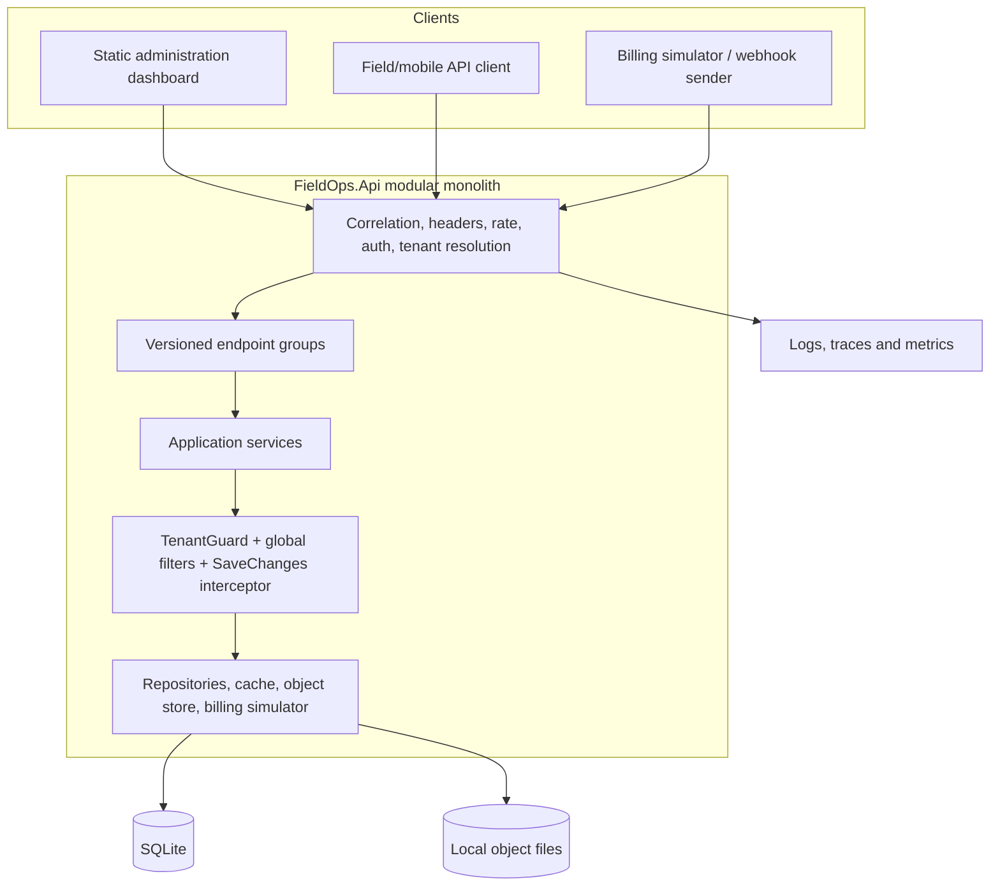
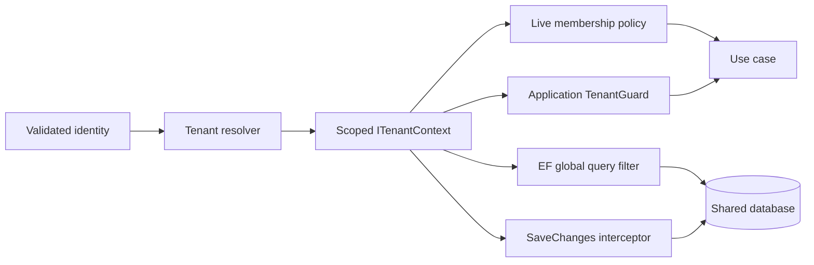
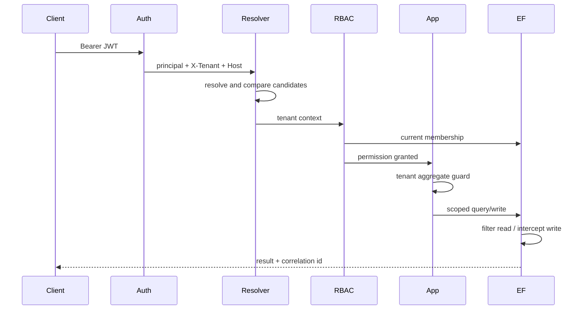
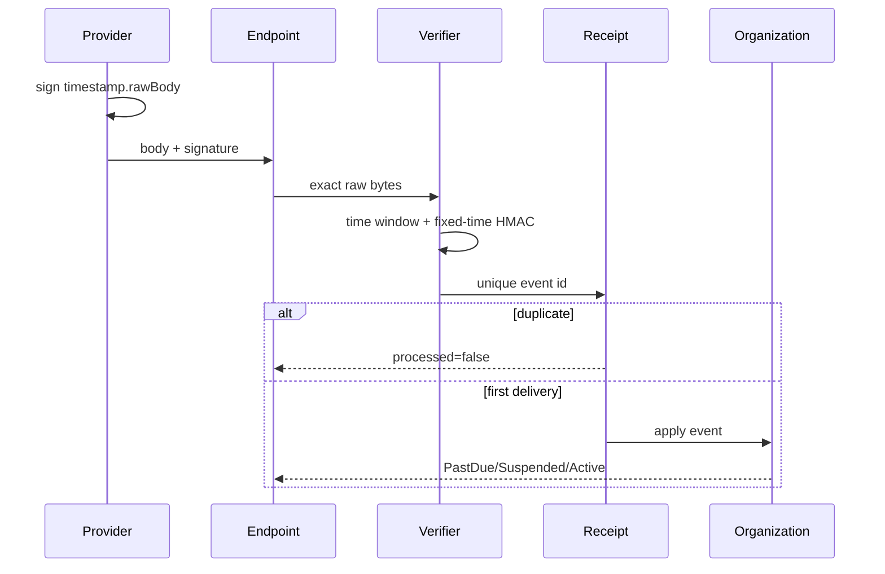

# Architecture — FieldOps Multi-Tenant SaaS

## Goals

1. Make tenant isolation automatic, layered and directly testable.
2. Keep the reference implementation runnable with only .NET 10.
3. Separate business decisions from ASP.NET, EF Core and vendor simulators.
4. Demonstrate commercial SaaS machinery without hiding it behind mocked endpoints.

## Container view

## Module boundaries

| Module | Owns | Must not reference |
|---|---|---|
| Domain | entities, state transitions, scoring and value objects | ASP.NET, EF, filesystem |
| Application | ports, guards, permissions, quotas, flags, billing orchestration | EF, HTTP |
| Infrastructure | EF model/repositories/interceptor, local adapters | API |
| API | middleware, policy handlers, endpoint DTOs, composition, UI | implementation details outside registered ports where avoidable |

Project references enforce `Api -> Infrastructure -> Application -> Domain`. API also references Application directly for request orchestration and policy requirements.

## Tenant isolation boundaries

- **Resolution:** every protected tenant route resolves JWT/header/subdomain inputs to an organization. Different resolved IDs are ambiguous and fail.
- **Membership:** the user must have an active membership unless the route is invitation acceptance or the identity is a platform administrator.
- **Guard:** cross-aggregate commands compare tenant IDs before persistence.
- **Filter:** every `ITenantOwned` EF entity has `TenantId == CurrentTenantId`.
- **Interceptor:** inserts are stamped and foreign current/original tenant IDs are rejected for add/update/delete.
- **Administration:** `IgnoreQueryFilters` appears only in deliberate infrastructure/admin paths; HTTP access requires `platform-admin`.

## Tenant request sequence

## Billing webhook sequence

## Data and consistency

SQLite is a shared-schema store with tenant discriminator columns and explicit composite indexes. Usage increments use a keyed semaphore and a unique `(TenantId, Metric, PeriodStart)` record. This is atomic for one process, matching the zero-infrastructure execution target. Multi-node deployment would use database atomic update/upsert semantics or a Redis script.

Audit entries are insert-only. The interceptor rejects `Modified` and `Deleted` states for `IAppendOnly`. Webhook receipts use event ID as the primary key, making duplicate delivery observable and idempotent.

## Security and trust boundaries

- Internet/client to API: untrusted JSON, JWT, headers and upload content.
- Billing sender to webhook: unauthenticated transport identity, authenticated payload.
- Platform admin to unfiltered data: elevated trust, explicit policy.
- API to filesystem: normalized tenant root, content allow-list and size cap.
- Application to shared database/cache: tenant context must be present.

See `docs/security/security-review.md`.

## Deployment topology

The verified topology is one local API process and SQLite file. The unverified compose design adds named volumes. A real cloud topology would put the API behind TLS/WAF, federate OIDC, use managed PostgreSQL/SQL Server, distributed cache, cloud blob storage, a secrets manager and OTLP collector.

## Failure handling

| Failure | Behavior |
|---|---|
| Missing/ambiguous tenant | 400 ProblemDetails |
| User outside tenant or suspended tenant | 403 ProblemDetails |
| Foreign row read | query filter produces 404 |
| Foreign write via forgotten filter | interceptor exception + security log |
| Plan feature/limit exceeded | 402 upgrade ProblemDetails |
| Plan request rate exceeded | 429 + upgrade-oriented type |
| Invalid/stale webhook | 403, no tenant mutation |
| Replayed webhook | 200 duplicate result, no repeat mutation |
| Three consecutive failures | tenant becomes Suspended |
| Successful payment | tenant becomes Active and failures reset |

## Evolution

The ports allow replacing SQLite, cache, files and billing independently. Production evolution should add migrations, outbox delivery, distributed quota atomicity, OIDC/SCIM and database row-level security while retaining the current application and domain boundaries.
