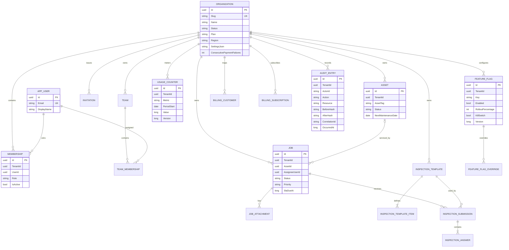

# Database Schema

## Storage model

The verified default is EF Core 10 with SQLite. `Organization`, `AppUser` and `WebhookReceipt` are platform records. Every other persisted business entity is tenant-owned and carries `TenantId`. Date/time offsets are stored as Unix milliseconds so SQLite can sort and compare them consistently.

## Entity relationship diagram

## Tables

| Table/entity | Primary key | Tenant-owned | Purpose |
|---|---|---:|---|
| Organizations | `Id` | No | tenant root, status, plan, region and settings |
| Users | `Id` | No | global synthetic identity |
| Memberships | `Id` | Yes | user-to-organization role |
| Teams | `Id` | Yes | named tenant team |
| TeamMemberships | `Id` | Yes | user assignment to team |
| Invitations | `Id` | Yes | hashed token, role, expiry and acceptance |
| Assets | `Id` | Yes | equipment, category, location, status, maintenance |
| Jobs | `Id` | Yes | work order, assignment, schedule, SLA and state |
| JobAttachments | `Id` | Yes | metadata for `IObjectStore` object |
| InspectionTemplates | `Id` | Yes | checklist name and passing score |
| InspectionTemplateItems | `Id` | Yes | typed weighted checklist rule |
| InspectionSubmissions | `Id` | Yes | job/template submission and score |
| InspectionAnswers | `Id` | Yes | normalized answer and pass result |
| UsageCounters | `Id` | Yes | monthly metric value/version |
| FeatureFlags | `Id` | Yes | base flag and rollout |
| FeatureFlagOverrides | `Id` | Yes | per-user decision |
| BillingCustomers | `Id` | Yes | simulated provider customer |
| BillingSubscriptions | `Id` | Yes | simulated subscription period/plan |
| WebhookReceipts | `EventId` | No | replay/idempotency record |
| AuditEntries | `Id` | Yes | append-only security/operation evidence |

## Tenant indexes

Every tenant-owned table has a `TenantId` index. Composite indexes match lookup and isolation paths:

| Entity | Index | Unique | Reason |
|---|---|---:|---|
| Membership | `(TenantId)` | No | filter support |
| Membership | `(TenantId, UserId)` | Yes | one membership per user/tenant; live policy lookup |
| Team | `(TenantId)` | No | filter support |
| Team | `(TenantId, Name)` | Yes | tenant-local team name |
| TeamMembership | `(TenantId)` | No | filter support |
| TeamMembership | `(TenantId, TeamId, UserId)` | Yes | duplicate assignment prevention |
| Invitation | `(TenantId)` | No | filter support |
| Invitation | `(TenantId, TokenHash)` | Yes | token acceptance lookup |
| Asset | `(TenantId)` | No | filter support |
| Asset | `(TenantId, AssetTag)` | Yes | tenant-local equipment identity |
| Asset | `(TenantId, Status)` | No | operational lists |
| Job | `(TenantId)` | No | filter support |
| Job | `(TenantId, Status, ScheduleStart)` | No | board/status schedule query |
| Job | `(TenantId, AssigneeUserId)` | No | technician workload |
| Job | `(TenantId, SlaDueAt)` | No | SLA ordering |
| JobAttachment | `(TenantId)` | No | filter support |
| JobAttachment | `(TenantId, JobId)` | No | job attachment list |
| InspectionTemplate | `(TenantId)` | No | filter support |
| InspectionTemplate | `(TenantId, Name)` | No | template lookup |
| InspectionTemplateItem | `(TenantId)` | No | filter support |
| InspectionTemplateItem | `(TenantId, TemplateId)` | No | checklist load |
| InspectionSubmission | `(TenantId)` | No | filter support |
| InspectionSubmission | `(TenantId, JobId, SubmittedAt)` | No | job history |
| InspectionAnswer | `(TenantId)` | No | filter support |
| InspectionAnswer | `(TenantId, SubmissionId, ItemId)` | Yes | one answer per item |
| UsageCounter | `(TenantId)` | No | filter support |
| UsageCounter | `(TenantId, Metric, PeriodStart)` | Yes | atomic monthly key |
| FeatureFlag | `(TenantId)` | No | filter support |
| FeatureFlag | `(TenantId, Key)` | Yes | tenant-local flag |
| FeatureFlagOverride | `(TenantId)` | No | filter support |
| FeatureFlagOverride | `(TenantId, FlagKey, UserId)` | Yes | one user override |
| BillingCustomer | `(TenantId)` | No | filter support |
| BillingCustomer | `(TenantId, ProviderCustomerId)` | Yes | provider mapping |
| BillingSubscription | `(TenantId)` | No | filter support |
| BillingSubscription | `(TenantId, ProviderSubscriptionId)` | Yes | provider mapping |
| AuditEntry | `(TenantId)` | No | filter support |
| AuditEntry | `(TenantId, OccurredAt)` | No | tenant timeline |
| AuditEntry | `(TenantId, Action, OccurredAt)` | No | filtered audit query |

Platform indexes:

- `Organizations(Slug)` unique.
- `Users(Email)` unique.
- `JobAttachments(ObjectKey)` unique.
- `WebhookReceipts(EventId)` primary/unique idempotency key.

## Isolation invariants

1. EF query filters apply to every tenant-owned type.
2. Inserts with empty tenant ID are stamped from scoped context.
3. Adds/updates/deletes with a foreign current or original tenant ID fail.
4. Audit updates/deletes fail.
5. `IgnoreQueryFilters` is limited to membership resolution, explicit unsafe test path and platform-admin reporting.

## Schema evolution

The demonstration uses `EnsureCreated` because migration mechanics are not its teaching point. Production should commit reviewed migrations, use expand/contract changes, back up before destructive operations and test tenant-aware rollback/restore.
