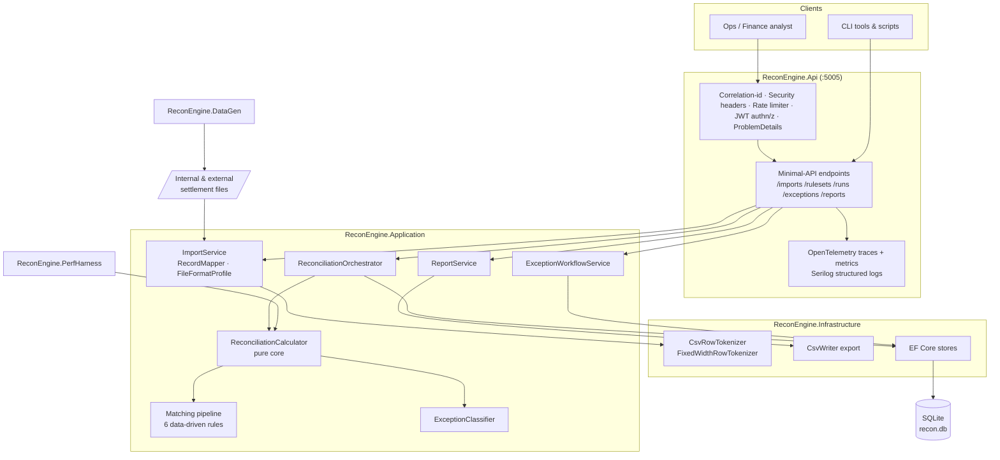
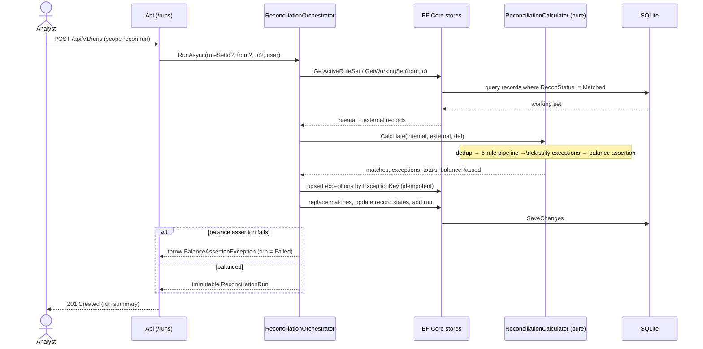
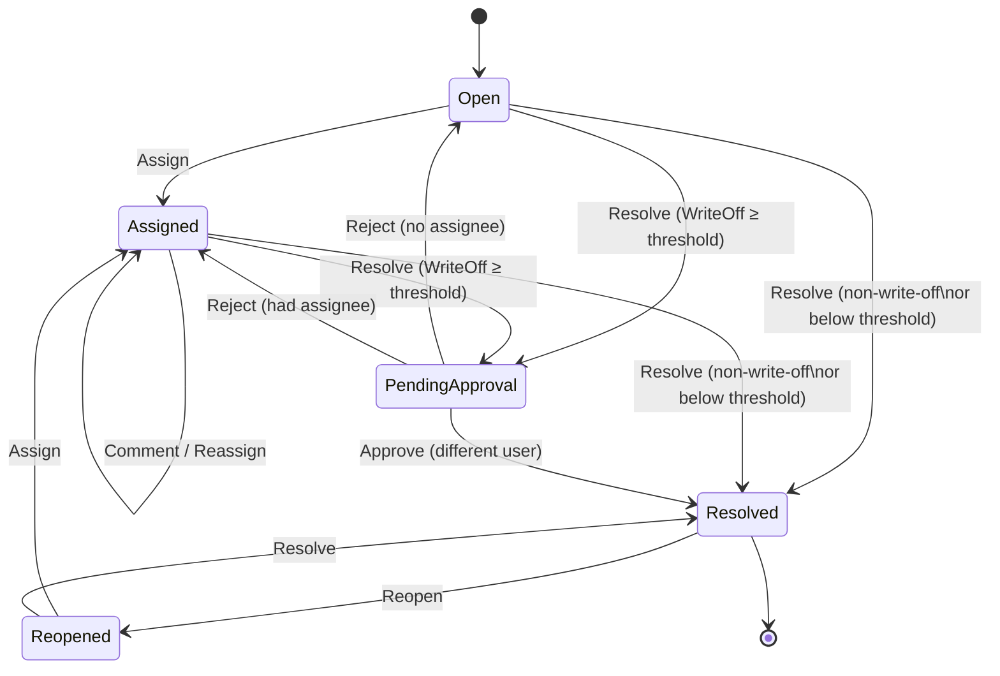

# Financial Reconciliation & Settlement Engine

> A production-shaped reconciliation and settlement engine: it ingests internal transactions and
> external PSP/bank settlement files, matches them with a data-driven rules pipeline, classifies the
> discrepancies, drives a four-eyes exception workflow, and proves its own arithmetic with a
> per-currency balance assertion — all on **.NET 10** with **SQLite by default** and **zero external
> infrastructure**.

---

## Portfolio Classification

**Self-directed engineering case study.** This is a personal, portfolio-grade project built to
demonstrate senior-level backend engineering on a realistic fintech problem. The domain participants
— `Example Bank` (settling bank), `Contoso Retail` (merchant), and `PesaGate (fictional)` (payment
service provider) — are fictional, and all data is synthetic. No real clients, transaction volumes,
revenue, users, or uptime are claimed anywhere in this repository.

## Executive Summary

When a fintech says *"the numbers don't match,"* the fix is a reconciliation engine that can take two
independently-produced views of the same money — the merchant's internal ledger and the PSP's
settlement file — and decide, line by line, what matches, what doesn't, and why. This project is that
engine.

It streams large delimited and fixed-width files without loading them into memory, normalises money
into integer minor units with an ISO currency code, and runs a **priority-ordered, data-driven
matching pipeline** (exact reference → composite → fuzzy amount/date window → bounded subset-sum
many-to-one/one-to-many → fee-adjusted → refund). Everything that does not match is classified into one
of ten exception types, each with a severity and a suggested action, and routed into a manual
resolution workflow with **four-eyes approval** for large write-offs and a complete, immutable audit
trail. Reconciliation **runs are immutable and idempotent**: re-running the same inputs never
duplicates exceptions, and every run self-checks a **balance assertion** (sum internal = sum matched +
sum unmatched, per currency) and fails loudly if the books don't tie out.

The build is honest about its constraints: `dotnet build -c Release` and `dotnet test -c Release` both
pass with **118 tests** and **zero external services**, and the performance numbers in this README are
measured on the build host, not invented.

## Business Problem

A merchant (`Contoso Retail`) captures card payments through a PSP (`PesaGate`), which later settles
the net proceeds to the merchant's bank (`Example Bank`) and issues a settlement file. Three things
routinely go wrong:

- **The files disagree.** Amounts differ by fees, currencies are recorded differently, references are
  formatted differently, dates land on different days across timezones, refunds appear on one side
  only, and rows get duplicated by retries.
- **The money must still tie out.** Finance has to prove that every internal transaction is either
  matched to a settlement line or explicitly accounted for as an open exception — per currency, to the
  minor unit.
- **Resolutions must be auditable.** Writing off a discrepancy, matching manually, or raising a case
  with the provider are financial actions that need reason codes, segregation of duties, and an
  audit trail an examiner can read.

This engine automates the matching, makes the exceptions explicit and workable, and keeps the whole
process reproducible and auditable.

## Functional Requirements

- **Ingestion** of internal transactions and external settlement files in **CSV and fixed-width**,
  driven by a declarative, configurable **file-format profile** (delimiter, header, date formats,
  decimal separator, column→field mapping, amount-sign convention, minor-vs-major units, source
  timezone offset). Streaming readers (`IAsyncEnumerable`) so a 250k-row file never loads into memory.
  Row-level error capture with line numbers and a **rejected-rows report**.
- **Normalisation**: currency-aware `Money` (decimal + ISO code, minor units as `long`), timezone
  normalisation to UTC, reference-id canonicalisation (trim/case/prefix rules), and a stable **row
  hash** for duplicate detection.
- **Matching engine** — a data-driven, priority-ordered rules pipeline: exact-reference, composite,
  fuzzy amount+date window, bounded subset-sum many-to-one/one-to-many, fee-adjusted, and refund. Each
  match carries a confidence and an **explanation** of which predicates fired, plus the rule id and
  ruleset version for audit.
- **Exception classification** into ten types (`MissingInExternal`, `MissingInInternal`,
  `AmountMismatch`, `CurrencyMismatch`, `DuplicateInternal`, `DuplicateExternal`, `StatusMismatch`,
  `FeeVariance`, `DateOutOfWindow`, `Unmatched`), each with a severity and a suggested resolution.
- **Exception workflow**: assign, comment, resolve with a reason code (`WriteOff`, `ManualMatch`,
  `RaiseWithProvider`, `Reprocess`, `Ignore`), **four-eyes approval** for write-offs above a
  configurable threshold, full audit trail, and re-open.
- **Reconciliation runs**: immutable records (ruleset version, input checksum, counts, monetary
  totals, duration) that are **idempotent and re-runnable**, support incremental day-window runs, and
  carry unmatched records forward across runs.
- **Reports**: run summary, aging of open exceptions, matched/unmatched value by currency and by day,
  fee reconciliation, and a **balance assertion** — exported as CSV and JSON.
- **Synthetic dataset generator** producing internal + external files with a *known* number of each
  defect class, so tests assert exact detection counts.
- **Performance harness** measuring throughput, wall time, and peak memory for 10k/100k/250k rows.

## Non-Functional Requirements

- **Runs anywhere the .NET 10 SDK runs** — SQLite default, no Docker/Postgres/Redis required.
- **Deterministic & reproducible** — seeded generation, stable row hashing, idempotent runs, input
  checksums.
- **Performance** — streaming ingestion and index-backed matching (no O(n²) scans); measured
  ~230k rows/s on the reconcile hot path for 250k-pair inputs on the build host.
- **Auditability** — immutable runs, immutable exception audit entries, enums persisted as readable
  strings, every match traceable to a rule id + ruleset version.
- **Security** — JWT with scoped authorization policies, ProblemDetails, correlation ids, rate
  limiting, CSV-injection-safe exports.
- **Observability** — OpenTelemetry traces (span per run stage) and metrics (rows/sec, match rate,
  open-exceptions gauge), structured logging.
- **Testability** — pure calculation core, `IClock` abstraction (no `DateTime.UtcNow` in domain code),
  `WebApplicationFactory` + in-memory SQLite integration tests.

## Architecture

The system is a **modular monolith** organised with Clean-Architecture layering. Dependencies point
inward; the domain has no infrastructure dependencies, and matching/reconciliation is a **pure,
side-effect-free core** that the orchestrator wraps with persistence.

| Layer | Project | Responsibility |
|-------|---------|----------------|
| Domain | `ReconEngine.Domain` | Entities, value objects (`Money`, `MatchingRuleSetDefinition`, `FeeSchedule`), enums, normalisation (`ReferenceCanonicalizer`, `RowHasher`), `IClock`. No external dependencies. |
| Application | `ReconEngine.Application` | Matching rules pipeline, `ReconciliationCalculator` (pure) + `ReconciliationOrchestrator`, exception classifier + workflow service, ingestion (`ImportService`, `RecordMapper`, `FileFormatProfile`), reporting, rulesets, data generation, store interfaces. |
| Infrastructure | `ReconEngine.Infrastructure` | EF Core `AppDbContext` (SQLite), entity configurations, store implementations, streaming tokenizers (`CsvRowTokenizer`, `FixedWidthRowTokenizer`), `CsvWriter` export, `DatabaseInitializer`. |
| API | `ReconEngine.Api` | Minimal-API endpoints, JWT auth + policies, middleware (correlation id, security headers, exception handler), OpenTelemetry, Serilog. |
| Tools | `ReconEngine.DataGen`, `ReconEngine.PerfHarness` | CLI synthetic-data generator and benchmark runner. |

The port used by the API is **5005**. The reconciliation core (`ReconciliationCalculator`) is
deliberately separated from the `ReconciliationOrchestrator` so the entire matching + classification +
balance logic can be unit-tested with hand-built fixtures and benchmarked without a database.

## Architecture Diagram

Container / component view:



## Technology Stack

- **Runtime / language**: .NET 10 (`net10.0`), C# with nullable reference types and implicit usings.
- **Web**: ASP.NET Core Minimal APIs, built-in `RateLimiter`, `ProblemDetails`, OpenAPI
  (`Microsoft.AspNetCore.OpenApi`).
- **Auth**: `Microsoft.AspNetCore.Authentication.JwtBearer` (HMAC-SHA256), scope-based authorization
  policies.
- **Persistence**: Entity Framework Core with **SQLite** (`Microsoft.EntityFrameworkCore.Sqlite`);
  the same model runs on Postgres by swapping the provider, but SQLite is the committed default.
- **Observability**: OpenTelemetry (`Extensions.Hosting`, `Instrumentation.AspNetCore`,
  `Exporter.Console`) + a custom `ActivitySource` and `Meter`; Serilog for structured logging.
- **Testing**: xUnit (plain `Assert.*`, no commercial assertion library),
  `Microsoft.AspNetCore.Mvc.Testing`, in-memory SQLite.
- **Tooling**: two console apps (DataGen, PerfHarness) for reproducible data and real benchmarks.

## Domain Model

Core entities and their tables (enums are persisted as readable strings for audit):

- **`ReconRecord`** (`recon_records`) — a normalised internal transaction or external settlement line:
  minor-unit amount + currency, canonical + raw reference, value date, status, row hash, and its
  reconciliation state (`Pending` / `Matched` / `Exception`).
- **`ImportBatch`** (`import_batches`) + **`ImportRejection`** (`import_rejections`) — an immutable
  record of one file import, its SHA-256 checksum, accepted/rejected counts, and the per-row rejection
  report.
- **`MatchingRuleSet`** (`rule_sets`) — a versioned, immutable ruleset holding the serialized
  `MatchingRuleSetDefinition`. Version tag is `Name@vN`; editing creates a new version.
- **`Match`** (`matches`) + **`MatchEntry`** (`match_entries`) — a confirmed match linking one-or-more
  internal records to one-or-more external records, with rule id, ruleset version, confidence, and a
  human-readable explanation.
- **`ReconciliationRun`** (`runs`) — an immutable snapshot: ruleset version, window, input checksum,
  counts, per-currency totals (JSON), exception breakdown (JSON), balance result, and duration.
- **`ReconciliationException`** (`exceptions`) + **`ExceptionComment`** + **`ExceptionAuditEntry`** —
  the discrepancy, its four-eyes-aware state machine, and an append-only audit trail.

Value objects: **`Money`** (long minor units + ISO code, banker's rounding, cross-currency addition
throws), **`CurrencyInfo`** (decimal exponents: KES/USD/EUR = 2, JPY = 0, BHD = 3), **`FeeSchedule`**
(expected fee = `round(gross × 0.029) + 30` minor units, ±1 tolerance), and
**`MatchingRuleSetDefinition`** (every rule toggle and tolerance).

## Core Workflows

### Reconciliation run (sequence)



The run is **idempotent**: exceptions are keyed by a stable `ExceptionKey`, so a re-run over the same
inputs preserves any triaged exception and never creates a duplicate. Unmatched records **carry
forward** (matched records are archived out of the working set), which supports incremental day-window
operation.

### Exception lifecycle (state machine)



Write-offs at or above the configurable threshold (default `1000.00`, i.e. `100000` minor units)
require **four-eyes approval**: the approver must be a different user than the proposer, and every
transition appends an immutable audit entry.

## Security Model

- **Authentication**: JWT bearer tokens (HMAC-SHA256). A development `TokenIssuer` mints scoped tokens
  so the API can be exercised end-to-end without an external IdP (clearly not for production).
- **Authorization**: three scopes mapped to policies — `recon:run` (start runs), `recon:resolve`
  (assign/comment/resolve/reopen), `recon:approve` (approve/reject write-offs). Privileged endpoints
  require the specific scope; all business endpoints require authentication.
- **Segregation of duties**: four-eyes approval on large write-offs, enforced in the domain
  (`Approve`/`RejectApproval` reject a same-user actor).
- **Input safety**: streaming parsing with per-row rejection, a profile allow-list, SHA-256 file
  checksums, and **CSV-injection-safe exports** (`CsvWriter` prefixes `'` for fields beginning with
  `= + - @`, tab, or CR, then RFC-4180 quotes).
- **Transport & platform**: ProblemDetails for uniform errors, correlation-id middleware, security
  headers, and a fixed-window rate limiter (100 requests / 10s per IP). See
  [`docs/security/security-review.md`](docs/security/security-review.md) for the full STRIDE analysis
  and explicit non-claims.

## Reliability & Failure Handling

- **Balance assertion**: every run verifies `sum(internal) = sum(matched internal) + sum(unmatched
  internal)` per currency; a violation throws `BalanceAssertionException` and marks the run `Failed` —
  the engine refuses to silently present books that don't tie out.
- **Idempotent, immutable runs**: re-running identical inputs yields the same input checksum and never
  duplicates exceptions; runs are snapshots that are never mutated after completion.
- **Row-level fault isolation**: a malformed row is captured as an `ImportRejection` (line number +
  reason + raw line) instead of failing the whole import.
- **Deterministic recovery**: because runs are idempotent and unmatched records carry forward, a failed
  or partial day can simply be re-run — see [`docs/runbooks/rerun-a-day.md`](docs/runbooks/rerun-a-day.md).
- **Currency isolation**: matching never crosses currencies, so a KES line can never be matched to a
  USD line even at identical numeric amounts.

## Observability

- **Tracing**: a dedicated `ActivitySource` (`ReconEngine`) emits a span per run stage —
  `recon.run` → `recon.load` → `recon.calculate` → `recon.persist` — plus ASP.NET Core instrumentation.
- **Metrics**: a custom `Meter` (`ReconMetrics`) records rows/second and match rate per run and exposes
  an **open-exceptions gauge**.
- **Logging**: Serilog structured logging with request logging and a correlation id propagated in and
  out via response header and log scope.
- In `Development`, traces and metrics are also written to the console exporter for zero-setup local
  inspection.

## Testing Strategy

- **118 tests**, all passing: **105 unit** + **13 integration**.
- **Unit tests** cover every matching rule in isolation with hand-built fixtures, tolerance boundary
  cases (just inside / just outside), many-to-one and one-to-many, fee-adjusted matching and fee
  variance, refund pairing, duplicate detection by row hash, multi-currency isolation, the balance
  assertion, the exception state machine, four-eyes enforcement, `Money`/currency arithmetic,
  reference canonicalisation, and CSV/fixed-width parser edge cases (quoted commas, embedded newlines,
  BOM, blank lines, bad dates, negative/zero amounts) plus CSV-injection-safe export.
- **Integration tests** use `WebApplicationFactory<Program>` with a kept-open in-memory SQLite
  connection and the `Testing` environment: health/readiness, token issuance, 401/403, import
  validation and happy path, a full generated-dataset reconciliation asserted against the generator's
  ground-truth manifest (exact defect counts), idempotent re-run, carry-forward across two runs, and a
  **50k-row streaming** import completing within a sane bound.
- Time is injected via `IClock` (a `TestClock` in unit tests) — no `DateTime.UtcNow` in domain code.
- The real pasted test output lives in [`docs/test-results.md`](docs/test-results.md).

## Local Development

Prerequisites: **.NET SDK 10.0.400** (no Docker, database server, or other infrastructure required).

```powershell
# from the repo root
dotnet build -c Release
dotnet test  -c Release

# run the API (http://localhost:5005)
dotnet run --project src\ReconEngine.Api

# OpenAPI document
#   http://localhost:5005/openapi/v1.json
# health
#   http://localhost:5005/health   and   /health/ready
```

Generate a synthetic dataset and drive an end-to-end run with the demo script:

```powershell
# 250k-row internal + external pair with a known number of each defect
dotnet run -c Release --project src\ReconEngine.DataGen -- --rows 250000 --seed 42 `
    --inject duplicates,amount-mismatch,missing,fees,refunds --out .\data

# end-to-end demo (starts the API, imports, runs, resolves an exception)
pwsh .\scripts\demo.ps1
```

The database file `recon.db` is created automatically on first run (`EnsureCreated`) and the default
ruleset is seeded idempotently.

## Running with Docker

A `Dockerfile` and `docker-compose.yml` are included for completeness. **Docker configuration created
but Docker is unavailable on the build host; the compose stack has not been started or verified.** The
compose file is labelled `UNVERIFIED`. The application itself needs no containers to run — SQLite and
the in-process defaults mean `dotnet run` is sufficient.

## API Documentation

Base path `/api/v1`. All business endpoints require a bearer token; privileged actions require a
specific scope.

| Area | Method & route | Scope |
|------|----------------|-------|
| Auth | `POST /auth/token` | anonymous (dev issuer) |
| Imports | `POST /imports` (multipart `file` + `profile`) | authenticated |
| Imports | `GET /imports`, `GET /imports/{id}`, `GET /imports/{id}/rejections` | authenticated |
| Rulesets | `GET /rulesets`, `/rulesets/active`, `/rulesets/{id}` | authenticated |
| Rulesets | `POST /rulesets`, `POST /rulesets/{id}/activate` | authenticated |
| Runs | `POST /runs` | `recon:run` |
| Runs | `GET /runs`, `GET /runs/{id}`, `GET /runs/{id}/report` | authenticated |
| Exceptions | `GET /exceptions`, `GET /exceptions/{id}` | authenticated |
| Exceptions | `POST /exceptions/{id}/assign` · `/comment` · `/resolve` · `/reopen` | `recon:resolve` |
| Exceptions | `POST /exceptions/{id}/approve` · `/reject` | `recon:approve` |
| Reports | `GET /reports/aging`, `/reports/runs/{id}/summary` · `value-by-currency` · `value-by-day` · `fees` · `balance` | authenticated |
| Health | `GET /health`, `GET /health/ready` | anonymous |
| OpenAPI | `GET /openapi/v1.json` | anonymous |

Import profiles: `internal-csv`, `external-csv`, `external-fixed`. Reports accept `?format=csv|json`.

## Example Usage

```powershell
$base = "http://localhost:5005"

# 1) get a token with all scopes
$token = (Invoke-RestMethod -Method Post "$base/api/v1/auth/token" -ContentType application/json `
    -Body '{ "subject": "analyst@example", "scopes": ["recon:run","recon:resolve","recon:approve"] }').accessToken
$auth = @{ Authorization = "Bearer $token" }

# 2) import internal + external files (generated by DataGen)
Invoke-RestMethod -Method Post "$base/api/v1/imports" -Headers $auth -Form @{
    file = Get-Item .\data\internal.csv; profile = "internal-csv" }
Invoke-RestMethod -Method Post "$base/api/v1/imports" -Headers $auth -Form @{
    file = Get-Item .\data\external.csv; profile = "external-csv" }

# 3) start a reconciliation run
$run = Invoke-RestMethod -Method Post "$base/api/v1/runs" -Headers $auth `
    -ContentType application/json -Body '{}'
$run | Format-List Id, MatchCount, ExceptionCount, BalanceAssertionPassed

# 4) inspect the run report and the balance assertion
Invoke-RestMethod "$base/api/v1/runs/$($run.Id)/report" -Headers $auth
Invoke-RestMethod "$base/api/v1/reports/runs/$($run.Id)/balance" -Headers $auth

# 5) triage: list open exceptions, resolve one as a manual match
$open = Invoke-RestMethod "$base/api/v1/exceptions?status=Open&pageSize=5" -Headers $auth
$id = $open.items[0].id
Invoke-RestMethod -Method Post "$base/api/v1/exceptions/$id/resolve" -Headers $auth `
    -ContentType application/json -Body '{ "reason": "ManualMatch", "note": "matched by merchant ref" }'
```

A run response includes `matchCount`, `exceptionCount`, per-stage counts, `balanceAssertionPassed`,
and `durationMs`; the balance report shows, per currency, that internal totals equal matched plus
unmatched.

## Performance / Load Testing

Numbers below are **measured on the build host** by `ReconEngine.PerfHarness` (16 logical cores,
Microsoft Windows 10.0.26200, .NET 10.0.11). They are reproducible, not hand-edited — see
[`docs/performance.md`](docs/performance.md).

```powershell
dotnet run -c Release --project src\ReconEngine.PerfHarness -- --sizes 10000,100000,250000
```

Reconcile hot path (dedup + 6-rule pipeline + classification + balance):

| pairs | rows | wall time | throughput | peak working set |
|------:|-----:|----------:|-----------:|-----------------:|
| 10,000 | 20,000 | 93.5 ms | 213,827 rows/s | 68.6 MB |
| 100,000 | 200,000 | 867.8 ms | 230,463 rows/s | 278.3 MB |
| 250,000 | 500,000 | 2,165.5 ms | 230,897 rows/s | 545.5 MB |

Streaming CSV parse + normalise (100k rows): 649.1 ms / 154,058 rows/s. **Hot-path optimisation**:
exact-reference matching over 20k pairs went from **153.2 ms** (naive O(n·m) scan) to **32.5 ms**
(dictionary index keyed by currency+reference+amount) — a **4.7× speed-up** — which is why the shipped
pipeline uses dictionary/day-bucket indexes throughout and never nested scans.

## Trade-offs

- **Data-driven rulesets over compiled matchers** — behaviour is a versioned data change, at the cost
  of a serialized definition and slightly less compile-time type-safety. (ADR-001)
- **Streaming ingestion over load-all-in-memory** — bounded memory on huge files, at the cost of a
  more careful single-pass parser. (ADR-002)
- **Bounded subset-sum over exact subset-sum** — predictable, capped runtime for many-to-one/one-to-many
  at the cost of missing very large groupings. (ADR-003)
- **Immutable, idempotent runs with carry-forward** — reproducibility and no duplicate exceptions, with
  a documented consequence: a re-run's *in-scope* exception count can be ≤ the first run's because
  matched records (including fee-variance/status-mismatch pairs) are archived out of the working set,
  while the *total* open set stays stable. (ADR-004)
- **Minor-unit integer money over decimal-major/double** — exact arithmetic and safe hashing, with the
  ergonomic cost of converting at the edges. (ADR-005)
- **SQLite default over a server database** — zero-infra reproducibility for a portfolio build; the EF
  model is provider-swappable to Postgres.

## Architecture Decisions

Full ADRs live in [`docs/decisions/`](docs/decisions/):

- [ADR-001 — Data-driven ruleset vs hard-coded matchers](docs/decisions/ADR-001-data-driven-ruleset-vs-hard-coded-matchers.md)
- [ADR-002 — Streaming vs in-memory ingestion](docs/decisions/ADR-002-streaming-vs-in-memory-ingestion.md)
- [ADR-003 — Bounded subset-sum for many-to-one](docs/decisions/ADR-003-bounded-subset-sum-for-many-to-one.md)
- [ADR-004 — Idempotent, immutable reconciliation runs](docs/decisions/ADR-004-idempotent-immutable-reconciliation-runs.md)
- [ADR-005 — Minor-units money representation](docs/decisions/ADR-005-minor-units-money-representation.md)

## Known Limitations

- The `TokenIssuer` is a development convenience (anonymous endpoint minting scoped JWTs); a production
  deployment would integrate a real identity provider.
- Subset-sum matching is intentionally bounded (group size 4, 20 candidates), so pathologically large
  many-to-one groupings are reported as exceptions rather than matched.
- Re-classification churn on re-run: a duplicate whose original has already been matched-and-archived is
  re-typed as a "missing" singleton on a subsequent run (documented in ADR-004); the total open set is
  unaffected.
- SQLite is single-writer; high-concurrency production loads would use the Postgres provider.
- Docker artifacts are unverified (no Docker on the build host).
- No UI — this is an API-plus-CLI engine; report exports are CSV/JSON.

## Future Improvements

- Pluggable identity provider (OIDC) and per-tenant rulesets.
- A read-model/projection for exception dashboards and SLA aging alerts.
- Parallelised matching across currency/day partitions for very large runs.
- A rules authoring UI over `MatchingRuleSetDefinition` with dry-run previews.
- Postgres-backed deployment profile with migrations and connection resiliency (Polly).
- Webhook/notification adapters for new high-severity exceptions.

## Portfolio Talking Points

- A **pure reconciliation core** separated from persistence, so the entire matching + classification +
  balance logic is unit-testable and benchmarkable without a database.
- **Honest, measured performance** (~230k rows/s, a real 4.7× indexing win) rather than hand-waved
  claims, produced by a committed benchmark harness.
- **Financial correctness primitives**: integer minor-unit money, currency isolation, and a
  self-checking balance assertion that fails loudly.
- **Auditability by design**: versioned rulesets, immutable runs, four-eyes approval, and append-only
  audit trails.
- **Tests that assert exact defect counts** against a synthetic generator's ground-truth manifest — no
  magic numbers. See [`docs/portfolio/interview-talking-points.md`](docs/portfolio/interview-talking-points.md).

## Upwork Portfolio Description

*Reconciliation is where fintechs quietly lose money and trust.* I build settlement-reconciliation
engines that ingest your internal ledger and your PSP/bank settlement files, match them with a
transparent, tunable rules pipeline, and turn the leftovers into an auditable exception queue with
segregation-of-duties controls — with a per-currency balance check that proves the books tie out. This
repository is a self-directed case study of that system on .NET 10: streaming CSV/fixed-width
ingestion, a six-rule matching engine, four-eyes write-off approval, idempotent immutable runs, and a
measured ~230k rows/second hot path — building and testing green with zero external infrastructure. See
[`docs/portfolio/upwork-description.md`](docs/portfolio/upwork-description.md) for the full write-up.
