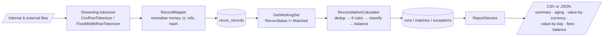
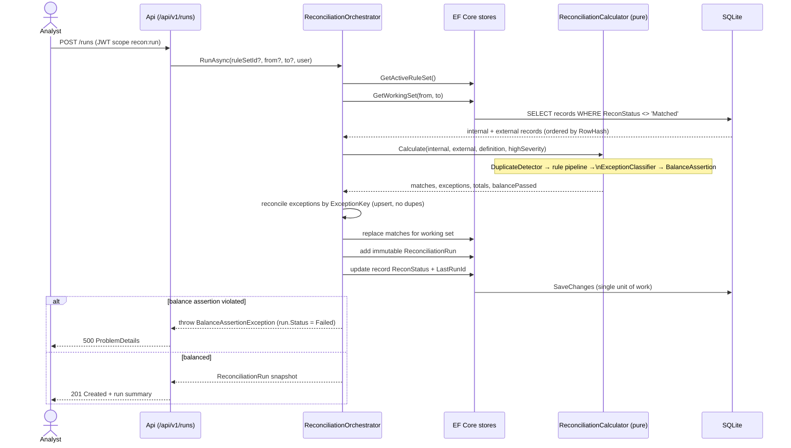

# Architecture

This document expands on the README's architecture section: the layering, the pure reconciliation
core, the request/data flow, and the headline sequence.

## Layering

`ReconEngine` is a **modular monolith** using Clean-Architecture dependency rules. Dependencies point
inward and the domain is dependency-free:

```
ReconEngine.Api  ─►  ReconEngine.Infrastructure  ─►  ReconEngine.Application  ─►  ReconEngine.Domain
                                                        ▲                              ▲
                    ReconEngine.DataGen ────────────────┘                              │
                    ReconEngine.PerfHarness ───────────────────────────────────────────┘
```

- **Domain** — entities, value objects (`Money`, `MatchingRuleSetDefinition`, `FeeSchedule`,
  `CurrencyInfo`), enums, normalisation (`ReferenceCanonicalizer`, `RowHasher`), and the `IClock`
  abstraction. No EF, no ASP.NET, no I/O.
- **Application** — the use-case layer: the matching rules pipeline, the **pure**
  `ReconciliationCalculator`, the `ReconciliationOrchestrator` (which wraps the calculator with
  persistence), the exception classifier and workflow service, ingestion (`ImportService`,
  `RecordMapper`, `FileFormatProfile`, `BuiltInProfiles`), reporting, ruleset management, the synthetic
  data generator, and the store **interfaces** (`Abstractions/Stores.cs`).
- **Infrastructure** — EF Core `AppDbContext` (SQLite), entity configurations (keys, indexes, value
  conversions), store implementations, the streaming tokenizers (`CsvRowTokenizer`,
  `FixedWidthRowTokenizer`), the `CsvWriter` export, and `DatabaseInitializer`.
- **API** — Minimal-API endpoints grouped per feature, JWT authentication + scope policies, middleware
  (correlation id, security headers, global exception handler), OpenTelemetry, and Serilog.

## The pure reconciliation core

The single most important design choice is that **matching, classification, and the balance assertion
are a pure function of their inputs**. `ReconciliationCalculator.Calculate(internal, external,
definition, highSeverityThreshold)` takes already-loaded records and returns a `ReconciliationResult`
(matches, exceptions, per-currency totals, balance result) **without touching a database, a clock, or
the network**.

This yields three concrete benefits:

1. **Unit-testability** — every rule and every exception class is tested with hand-built fixtures and
   with the synthetic generator's ground-truth manifest, no web host or database required.
2. **Benchmarkability** — `ReconEngine.PerfHarness` calls the same core directly to measure throughput
   and memory, so the published numbers reflect the shipped code path.
3. **Idempotency** — because the core is deterministic, re-running the same inputs produces the same
   matches and the same exception keys, which is what makes runs safely repeatable.

The `ReconciliationOrchestrator` is the thin, impure shell: it loads the working set, calls the core,
then persists an immutable run, upserts exceptions by key, replaces matches, and updates record states.

## Matching pipeline

Rules are evaluated in priority order and are **data-driven** by the persisted, versioned
`MatchingRuleSetDefinition`:

1. `ExactReferenceMatch` — reference + amount + currency (confidence 1.0).
2. `CompositeMatch` — merchant ref + amount (± tolerance) + date within N days (0.9).
3. `AmountAndDateWindowMatch` — fuzzy amount (absolute and/or percentage tolerance) within a date
   window; the percentage basis is the larger of the two amounts.
4. `ManyToOneMatch` / `OneToManyMatch` — bounded subset-sum (group-size and candidate caps).
5. `FeeAdjustedMatch` — internal gross = external net + expected fee (from `FeeSchedule`), flagging
   fee variance (0.85).
6. `RefundMatch` — a negative amount pairing to an earlier capture of the same reference (0.85).

Each rule is backed by dictionary or day-bucket indexes over the candidate set, never an O(n²) scan.
Every match records the rule id and the ruleset version tag, and carries an explanation string listing
the predicates that fired.

## Data flow (ingestion → run → report)



## Headline sequence — a reconciliation run



## Idempotency & carry-forward

- **Input checksum** — a run stores `InputChecksum`, a deterministic hash of the working-set row
  hashes, so identical inputs are provably identical.
- **Exception keys** — exceptions are upserted by a stable `ExceptionKey`; a re-run preserves any
  triaged exception (assignment/comments/state) and never inserts a duplicate.
- **Carry-forward** — matched records are set to `ReconStatus.Matched` and excluded from future working
  sets; unmatched records carry forward and are re-evaluated. This enables incremental day-window runs
  and a "carry-forward unmatched" posture across runs.
- **Documented consequence** — because matched records (including fee-variance and status-mismatch
  pairs, which *are* matched but flagged) leave the working set, a second run over identical inputs
  re-evaluates only the still-open records. Its *in-scope* exception count can therefore be ≤ the first
  run's, while the *total* open exception set remains stable (no duplication). This is analysed in
  ADR-004 and asserted by the `Re_running_the_same_inputs_is_idempotent` integration test.

## Cross-cutting concerns

- **Configuration** — options bound with `ValidateDataAnnotations().ValidateOnStart()`;
  `DatabaseInitializer` runs `EnsureCreated` and seeds the default ruleset idempotently.
- **Security** — JWT bearer + scope policies, ProblemDetails, correlation id, security headers, fixed
  window rate limiting; see `docs/security/security-review.md`.
- **Observability** — `ActivitySource "ReconEngine"` (span per run stage) and `ReconMetrics` meter
  (rows/sec, match rate, open-exceptions gauge); Serilog structured logs.
