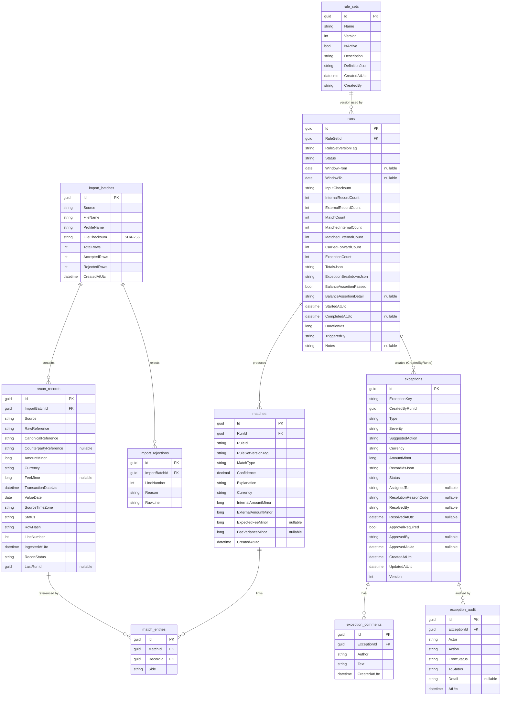

# Database Schema

The engine uses **Entity Framework Core** with **SQLite** by default (`Data Source=recon.db`). The
schema is defined declaratively through `IEntityTypeConfiguration` classes in
`ReconEngine.Infrastructure/Persistence/Configurations`, applied via
`ApplyConfigurationsFromAssembly`. The database is created with `EnsureCreated` by
`DatabaseInitializer`, which also seeds the default ruleset idempotently.

All enum properties are persisted **as their readable string names** (a convention applied in
`AppDbContext.OnModelCreating`), so audit-grade rows are human-readable rather than magic integers.
Money is stored as **integer minor units** (`long`); currency is a 3-character ISO code.

## Entity–relationship diagram

> Relationships between `recon_records`/`runs`/`exceptions` and `match_entries` are logical (by id)
> rather than enforced FK constraints in every case: matches and exceptions reference record ids so
> the reconciliation core can stay persistence-agnostic. `import_batches → recon_records/rejections`
> and `exceptions → comments/audit` are modelled navigations.

## Tables & keys

| Table | Primary key | Purpose |
|-------|-------------|---------|
| `import_batches` | `Id` | One immutable file import (side, checksum, accepted/rejected counts). |
| `import_rejections` | `Id` | Per-row rejection (line number + reason + raw line) — the rejected-rows report. |
| `recon_records` | `Id` | Normalised internal transaction or external settlement line. |
| `rule_sets` | `Id` | Versioned, immutable matching ruleset (`DefinitionJson`). |
| `matches` | `Id` | A confirmed match with rule id, ruleset version, confidence, explanation. |
| `match_entries` | `Id` | Join from a match to each internal/external record it links. |
| `runs` | `Id` | Immutable reconciliation-run snapshot (counts, totals, balance, duration). |
| `exceptions` | `Id` | A discrepancy plus its four-eyes-aware workflow state. |
| `exception_comments` | `Id` | Triage comments. |
| `exception_audit` | `Id` | Append-only audit of every workflow transition. |

## Indexes

Indexes are chosen to back the real query paths: loading the working set, deduplicating by row hash,
windowing by currency/value-date, filtering the exception queue, and detecting re-uploaded files.

| Table | Index | Rationale |
|-------|-------|-----------|
| `recon_records` | `(Currency, ValueDate)` | Currency-scoped day-window matching and value-by-day reports. |
| `recon_records` | `CanonicalReference` | Exact/composite reference matching. |
| `recon_records` | `RowHash` | Duplicate detection and input checksums. |
| `recon_records` | `ReconStatus` | Working-set load (`ReconStatus != Matched`). |
| `recon_records` | `Source` | Split into internal vs external. |
| `recon_records` | `LastRunId` | Carry-forward counting. |
| `recon_records` | `(ReconStatus, ValueDate)` | Incremental day-window working-set queries. |
| `exceptions` | `ExceptionKey` | Idempotent upsert of exceptions across runs. |
| `exceptions` | `Status` | Exception-queue filtering (open/assigned/…). |
| `exceptions` | `Type` | Filter and aging by exception class. |
| `exceptions` | `Severity` | Prioritised triage. |
| `exceptions` | `Currency` | Per-currency views. |
| `exceptions` | `AssignedTo` | "My queue" views. |
| `exceptions` | `CreatedAtUtc` | Aging buckets. |
| `runs` | `StartedAtUtc` | Run history listing. |
| `runs` | `Status` | Filter completed/failed runs. |
| `runs` | `InputChecksum` | Detect identical re-runs. |
| `rule_sets` | `(Name, Version)` **unique** | Enforce one row per ruleset version. |
| `rule_sets` | `IsActive` | Resolve the active ruleset quickly. |
| `matches` | `RunId` | Fetch a run's matches. |
| `match_entries` | `MatchId`, `RecordId` | Join records ↔ matches both ways. |
| `import_batches` | `FileChecksum`, `CreatedAtUtc` | Detect re-uploads; list recent imports. |
| `import_rejections` | `ImportBatchId` | Build a batch's rejected-rows report. |
| `exception_comments` | `ExceptionId` | Load an exception's comments. |
| `exception_audit` | `ExceptionId` | Load an exception's audit trail. |

## Column notes & constraints

- **Money**: `AmountMinor`, `FeeMinor`, `*AmountMinor`, `FeeVarianceMinor`, `ExpectedFeeMinor` are
  `long` minor units; `Currency` is `char(3)`-ish (`HasMaxLength(3)`), required on records.
- **Hashes/checksums**: `RowHash`, `InputChecksum`, `FileChecksum`, `ExceptionKey` are
  `HasMaxLength(64)` (SHA-256 hex / derived keys).
- **JSON columns**: `rule_sets.DefinitionJson`, `runs.TotalsJson`, `runs.ExceptionBreakdownJson`, and
  `exceptions.RecordIdsJson` store serialized value objects/collections.
- **Optimistic concurrency**: `exceptions.Version` is bumped on each workflow transition to guard
  concurrent triage.
- **Immutability**: `runs`, `matches`, `import_batches`, and `exception_audit` rows are never mutated
  by application code after creation; ruleset edits create a new `rule_sets` version.

## Provider portability

The model is provider-agnostic. Swapping `UseSqlite(...)` for `UseNpgsql(...)` (the resolvable
`Npgsql.EntityFrameworkCore.PostgreSQL` provider) targets Postgres; SQLite remains the committed
default so the project builds and tests with zero external infrastructure.
