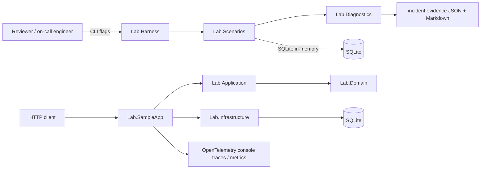
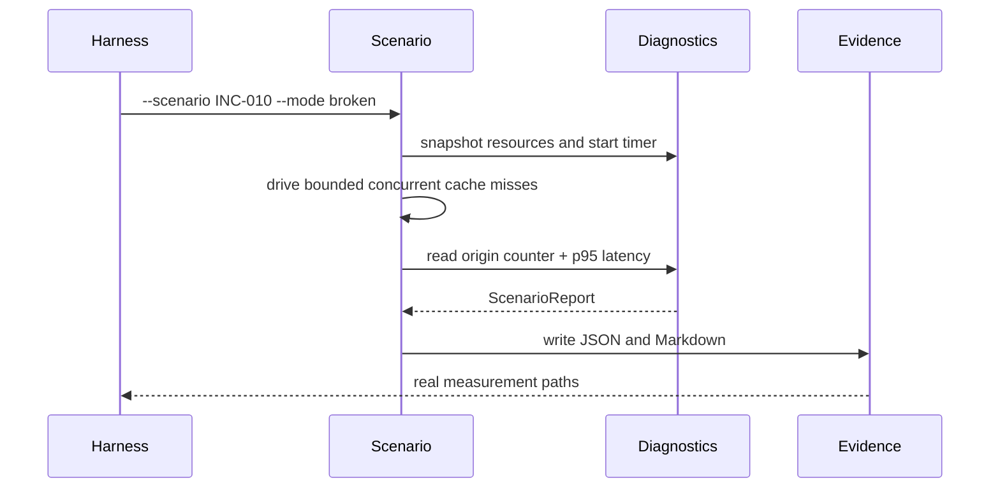
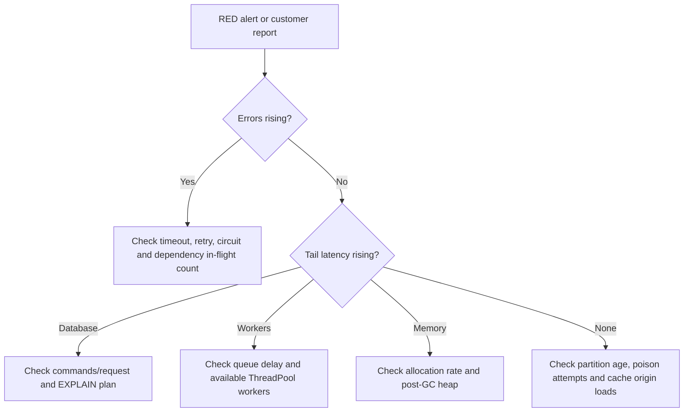

# Production Incident Diagnostics Lab

## Portfolio Classification
Self-directed engineering case study. This is a runnable, production-style diagnostics lab for a fictional Northstar Logistics order and shipment API; it is not client work or a production deployment.

## Executive Summary
The repository turns ten common .NET incident patterns into bounded experiments. Each scenario has a deliberately broken path, a fixed path, a hard deadline, real instrumentation, reproducible evidence, and a short incident report. The goal is to make troubleshooting judgement inspectable rather than merely claim familiarity with reliability patterns.

## Business Problem
On-call teams often see latency, database load, queue lag, and memory pressure before they know which code path caused them. Northstar Logistics needs a safe way to practice diagnosis without risking a live order workflow or requiring cloud infrastructure.

## Functional Requirements
- Provide a SQLite-backed order, shipment, and customer API for the subject system.
- Run `INC-001` through `INC-010` in `broken` or `fixed` mode from one CLI.
- Capture query counts, query plans, allocation/GC deltas, ThreadPool samples, latency percentiles, queue delay, and outbound-call counts.
- Write JSON and Markdown evidence under the relevant `incidents\INC-XXX-*\evidence\` directory.

## Non-Functional Requirements
- The repository builds and tests without Docker, network services, or a database server.
- All pathological demonstrations have small bounded workloads and cancellation-based deadlines.
- Incident tests are marked `Trait("Category", "Incident")` and avoid unbounded waits, leaks, or process-wide ThreadPool configuration changes.
- API configuration is typed and startup-validated; the default database is SQLite.

## Architecture
This is a modular monolith around a subject API and a separate lab runner. `Lab.Domain`, `Lab.Application`, and `Lab.Infrastructure` preserve the core dependency direction for Northstar. The diagnostics and scenario modules are intentionally reusable and do not depend on ASP.NET Core. See [architecture details](docs/architecture/architecture.md).

## Architecture Diagram


## Technology Stack
| Area | Choice |
|---|---|
| Runtime | .NET 10 / `net10.0` |
| HTTP surface | ASP.NET Core Minimal APIs |
| Persistence | EF Core 10 with SQLite |
| Auth | Development-only HS256 JWT issuer and policy-based scopes |
| Observability | OpenTelemetry ASP.NET Core, HttpClient, EF Core, custom `ActivitySource` and `Meter` |
| Tests | xUnit, `WebApplicationFactory`, SQLite in-memory |

## Domain Model
`Customer` books a `LogisticsOrder`; an order may have one `Shipment`. Order transitions are `Booked → InTransit → Delivered`, with domain checks preventing dispatch twice or delivery before dispatch. EF mappings add unique lookup indexes and an optimistic-concurrency `Version` token.

## Core Workflows


The normal API workflow is: acquire an `orders.write` development token, submit a validated order, persist it through EF Core, and return `201 Created` with a location. `orders.read` is required for queries.

## Security Model
The local issuer exists only outside Production. JWT validation checks issuer, audience, signing key, and expiry; policy assertions require the `orders.read` or `orders.write` scope. Correlation IDs, security headers, rate limiting, `ProblemDetails`, input validation, and a production startup guard against the known development signing key are included. See the [security review](docs/security/security-review.md).

## Reliability & Failure Handling
The lab does not hide failure with retries. It makes budgets explicit: connection acquisitions time out, simulated dependencies observe cancellation, retry amplification is counted, poison messages have a delivery cap, and static retention is cleared in a `finally` block after measurement. Fixed paths use projection, indexes, deterministic cleanup, async flow, bounded workers, timeout/cancellation, retry budget plus breaker, dead-lettering, and single-flight caching.

## Observability
`Lab.Diagnostics` supplies a reusable `LatencyHistogram`, request and outbound counters, EF `DbCommandInterceptor`, allocation/GC sampler, ThreadPool sampler, `MeasurementSession`, and report writer. The sample API wires OpenTelemetry traces for ASP.NET Core, HttpClient, and EF Core plus Northstar-specific spans and metrics to the console exporter. [`docs/evidence/sample-api-otel-console.txt`](docs/evidence/sample-api-otel-console.txt) is a real captured console trace of token issuance, `orders.list`, EF SQL spans, `orders.book`, and the custom `northstar.orders.booked` metric; its local content-root path was redacted. Evidence is synthetic and host-specific.



## Testing Strategy
Unit tests pin every incident’s measurable signal, domain transitions, and diagnostics math. Integration tests host the API in-process with an open SQLite in-memory connection and cover happy paths, validation `ProblemDetails`, `401`, `403`, readiness, correlation IDs, and lookup behaviour. Every incident test passes a hard `CancellationTokenSource` deadline; workloads use tens of operations, not unbounded load.

## Local Development
```powershell
Set-Location C:\Users\rukwaropaul\Downloads\DEV\Projects\06-production-incident-diagnostics
dotnet build -c Release
dotnet test -c Release
dotnet run --project src\Lab.SampleApp --launch-profile http
```
The API listens on `http://localhost:5006`. A Development run idempotently creates and seeds `northstar-lab.db`; tests use a separate in-memory SQLite database.

## Running with Docker
Docker configuration created but Docker is unavailable on the build host; the compose stack has not been started or verified.

## API Documentation
In Development, browse `http://localhost:5006/docs` for Swagger UI and `http://localhost:5006/openapi/v1.json` for the contract. Health probes are `/health/live` and `/health/ready`.

## Example Usage
```powershell
$token = (Invoke-RestMethod -Method Post `
  -Uri http://localhost:5006/api/v1/auth/token `
  -ContentType 'application/json' `
  -Body '{"subject":"demo-engineer","scope":"orders.read orders.write"}').accessToken

$headers = @{ Authorization = "Bearer $token"; 'X-Correlation-Id' = 'demo-incident-06' }
Invoke-RestMethod -Uri 'http://localhost:5006/api/v1/orders?page=1&pageSize=2' -Headers $headers

Invoke-RestMethod -Method Post -Uri http://localhost:5006/api/v1/orders -Headers $headers `
  -ContentType 'application/json' `
  -Body '{"customerName":"Contoso Retail (fictional)","customerEmail":"routing@contoso.example","reference":"NS-30001","destination":"Eldoret distribution centre"}'
```
The create response is `201 Created` and resembles `{"id":"...","reference":"NS-30001","status":"Booked","shipment":null}`.

Run a comparison and write evidence:
```powershell
dotnet run --project src\Lab.Harness -c Release -- --scenario INC-003 --mode broken --requests 20
dotnet run --project src\Lab.Harness -c Release -- --scenario INC-003 --mode fixed --requests 20
```

## Performance / Load Testing
This lab is a synthetic benchmark on Windows and .NET 10, not a production performance claim. Run `.\scripts\run-all-scenarios.ps1` to regenerate all evidence on the current host. The incident reports quote the actual captured measurements and distinguish structural signals (query plan, command count, origin-call count) from host-sensitive timings.

## Trade-offs
In-process simulations make diagnosis portable and testable but do not reproduce TCP, broker, OS scheduler, or production database behaviour. SQLite provides real SQL and plans but not server-pool semantics or a production optimizer. Ratios and categorical evidence are intentionally favoured over host-specific latency targets.

## Architecture Decisions
- [ADR-001: in-process reproduction](docs/decisions/ADR-001-in-process-reproduction.md)
- [ADR-002: ratio-based measurements](docs/decisions/ADR-002-ratio-based-measurements.md)
- [ADR-003: scenario toggling](docs/decisions/ADR-003-scenario-toggling.md)
- [ADR-004: SQLite scope and limits](docs/decisions/ADR-004-sqlite-scope-and-limits.md)

## Known Limitations
- The `OpenTelemetry.Instrumentation.EntityFrameworkCore` adapter is a prerelease package because no stable release was available from the host feed.
- All scenarios are process-local and intentionally small; they are not load tests for a real cluster.
- The local token endpoint must never be enabled in Production.
- Docker assets are authored but unverified because Docker is not installed on the build host.

## Future Improvements
- Add an OTLP collector profile and trace-to-report correlation.
- Add a PostgreSQL profile for real network connection-pool diagnostics.
- Capture `dotnet-trace` and `dotnet-gcdump` artifacts in an optional diagnostics-host profile.
- Add a dashboard that compares report JSON over time.

## Portfolio Talking Points
1. The business problem is reducing mean time to identify a failure class without taking production risks.
2. The architecture separates reusable measurement code from the intentionally broken subject paths.
3. The ten failures cover database, memory, worker scheduling, downstream, queue, retry, and cache layers.
4. Fixed paths include cleanup, bounding, cancellation, dead-lettering, and coalescing rather than superficial exception handling.
5. JWT policies, headers, rate limiting, and validation protect the sample API.
6. SQLite in-memory integration tests exercise real SQL without external infrastructure.
7. OpenTelemetry plus evidence files make a reviewer able to inspect the signal.
8. In-process reproducibility is a deliberate trade-off documented in ADRs.
9. A real deployment would scale diagnostics through OTLP, a production database, and distributed coordination.
10. A real enterprise rollout would replace the development issuer and validate operational runbooks against its actual brokers and dependencies.

## Upwork Portfolio Description
**Production Incident Diagnostics Lab — self-directed engineering case study**

Problem: teams need a safe, repeatable way to prove and diagnose common production failure modes before a 3am incident. Built: a .NET 10 Northstar Logistics API plus a bounded harness that runs ten broken-versus-fixed scenarios and writes real evidence. Engineering focus: EF query analysis, connection lifecycle, GC retention, ThreadPool diagnostics, timeout/cancellation, retry budgets, poison queues, and single-flight caching. Stack: ASP.NET Core, EF Core, SQLite, OpenTelemetry, xUnit. Verification: repository-local build, test suite, and evidence runner. This is a self-directed portfolio project, not client work.
