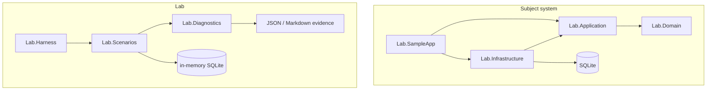
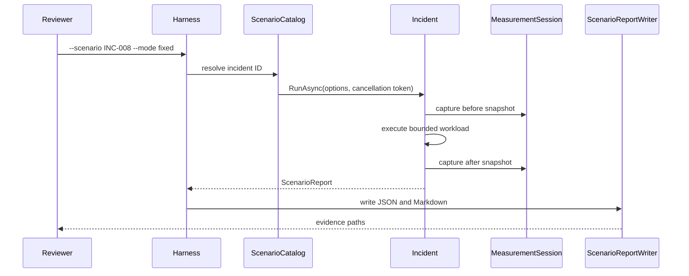

# Architecture — Production Incident Diagnostics Lab

## Intent
The lab separates a runnable subject system from intentionally pathological scenarios so that diagnostics code remains useful outside a single lesson. The Northstar Logistics API follows `Api → Infrastructure → Application → Domain`; the harness consumes `Scenarios → Diagnostics`.

## Scenario run sequence

## Boundary rules
- `Lab.Domain` has no I/O or framework dependency.
- `Lab.Application` owns use-case contracts and ports.
- `Lab.Infrastructure` owns EF Core and SQLite adapters.
- `Lab.SampleApp` owns HTTP, authentication, composition, and telemetry wiring.
- `Lab.Diagnostics` is infrastructure-neutral except for the EF interception abstraction it deliberately exposes.
- `Lab.Scenarios` can use an in-memory SQLite connection for the database scenarios but does not host the API.

## Configuration
`DatabaseOptions` and `JwtOptions` are data-annotation validated at startup. `Database:Provider` currently accepts only SQLite, intentionally enforcing the standalone build contract. A Production host refuses the known development signing key.
