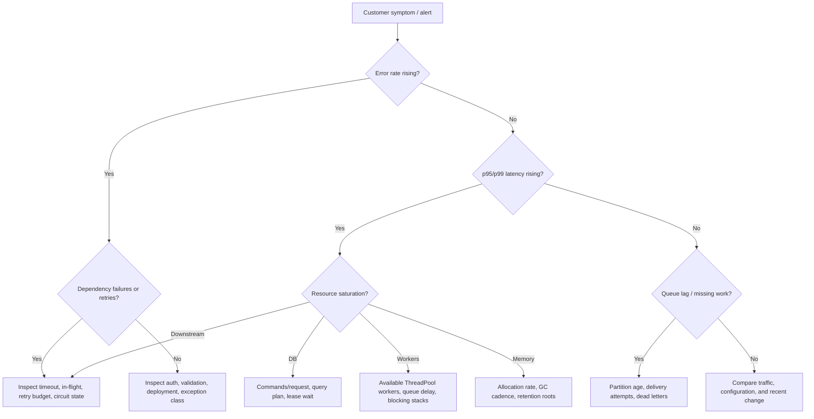

# Production Triage Methodology

## Position
Treat a production incident as an evidence-reduction exercise, not a hunt for a familiar bug. Start with the customer-visible failure, construct a time-bounded hypothesis, and change only one variable at a time. A dashboard is not a diagnosis; an observed causal change is.

## 1. Stabilize before explaining
1. Declare an incident owner, a communications owner, and a timekeeper.
2. State the blast radius in terms of affected workflow, tenant, region, and time window.
3. Stop amplification first: disable risky retries, shed nonessential load, cap queues, or roll back the smallest safe change.
4. Preserve timestamps, correlation IDs, deployment hashes, and representative failed requests before logs expire.
5. Do not restart indiscriminately: it can erase queue state, leak evidence, or move work into a retry storm.

## 2. Classify the signal with RED and USE
For request-serving components, use **RED**:

| Signal | Question |
|---|---|
| Rate | Did completed request rate fall, rise unusually, or diverge from arrivals? |
| Errors | Which status, exception, dependency, and tenant dimensions changed? |
| Duration | Is p50 normal while p95/p99 grows, or did all latency shift? |

For resources, use **USE**:

| Signal | Question |
|---|---|
| Utilization | Which resource is busy: CPU, pool slots, disk, workers, connection count? |
| Saturation | Is work queuing, timing out, retrying, or being rejected? |
| Errors | Are failures from the resource or merely propagated from a dependency? |

The pair narrows the layer: a rising p95 plus flat CPU and rising downstream in-flight calls points away from application CPU; a falling available-worker count plus queued requests points toward blocking work.

## 3. Narrow by layer
Move from the request edge toward dependencies and capture a before/after metric at each hop:

1. **Ingress:** request rate, status class, payload size, correlation IDs, authentication failures.
2. **Application:** endpoint latency, activity spans, exception class, allocation rate, worker availability.
3. **Persistence:** command count per request, query duration, plan, lock waits, connection lease time.
4. **Outbound dependency:** request count, timeout rate, retries, circuit state, in-flight depth.
5. **Asynchronous work:** queue age, delivery attempts, partition skew, dead-letter count, handler duration.
6. **Cache:** hit rate, origin calls per miss, expiry synchronization, in-flight refresh count.

The correct next probe is the one most likely to make two hypotheses disagree. For example, a `SCAN` plan eliminates “network latency” as the explanation for a database hot path; an origin-call count equal to concurrent callers strongly supports stampede over cache serialization.

## 4. Bisect dependencies, not just code
Use feature flags, traffic partitions, or a synthetic canary to compare:

- one endpoint versus another sharing the same dependency;
- one dependency call disabled or replaced with a deterministic simulator;
- one tenant, shard, or partition versus a control;
- one release window before and after the deployment;
- one retry policy/budget versus a no-retry control.

Never alter every timeout, retry, and pool setting at once. That removes the ability to attribute recovery and can create a secondary incident.

## 5. Safe diagnostics in production
Prefer probes that are bounded, scoped, and reversible:

- sample a small request cohort by correlation ID;
- run `EXPLAIN` only against a representative query and never execute unbounded ad hoc scans;
- capture top-level counters before enabling verbose logs;
- cap durations, result counts, and allocations;
- use read-only replicas or an isolated canary when possible;
- redact payloads and tokens before incident channels or artifacts;
- record the diagnostic’s own cost and remove it after use.

The harness encodes this stance: no scenario has an unbounded loop, each accepts a cancellation token, and static retention/leased resources are cleaned up after evidence is collected.

## 6. Trace, dump, or both?
Take a **trace** first when the problem is temporal or cross-component: latency tails, retry chains, outbound timing, thread-pool scheduling, and workload changes. It is usually lower disruption and preserves causal ordering.

Take a **GC dump** when managed heap retention is suspected and a smaller heap snapshot can identify roots without pausing too long. Take a **full dump** only when the evidence justifies its cost: persistent memory growth, deadlock, native leak suspicion, process crash analysis, or a reproducible stuck state. Dumps may contain secrets and personal data; control storage, access, and retention.

For a live service, set a blast-radius limit before capture: one instance, one time window, one artifact, and an abort condition. If the service is already memory-starved, avoid adding a dump capture workload without an approved mitigation.

## 7. Verify recovery
Recovery means the signature disappears under comparable load:

1. Re-run the narrowest safe reproduction.
2. Compare ratios rather than a raw millisecond claim: commands/request, origin calls/logical request, timeout fraction, queue-delay distribution.
3. Confirm errors, p95/p99, saturation, and customer symptom return together.
4. Add a regression test, alert dimension, and review checklist item.
5. Document what remains uncertain rather than backfilling a convenient narrative.

## Triage decision tree

