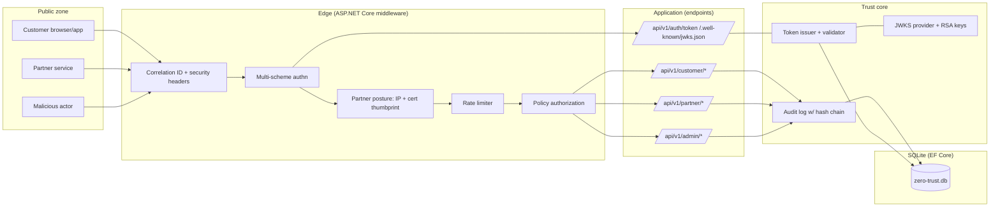
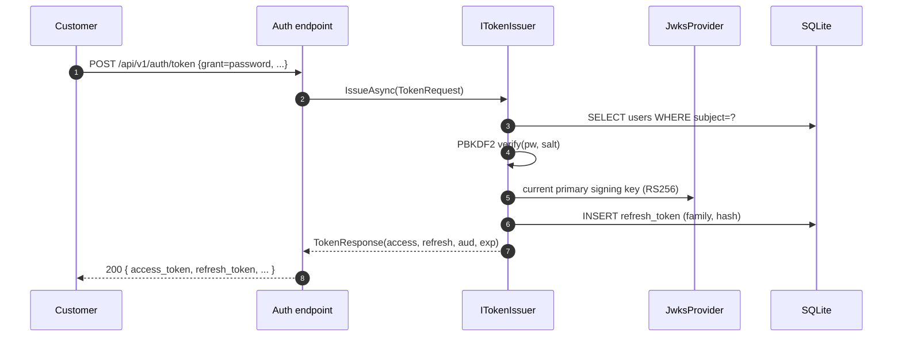
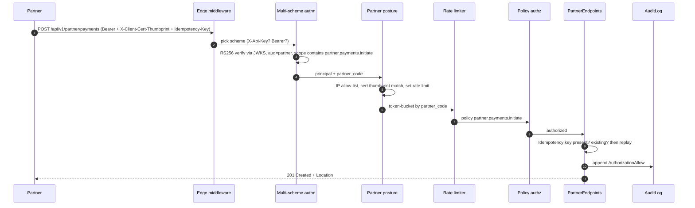

# Secure Zero-Trust API Platform

> Northstar Financial Services (fictional). Three API surfaces, three audiences, no implicit
> trust anywhere. RS256 + JWKS, explainable authorization, refresh-token rotation with reuse
> detection, HMAC webhooks, hash-chain audit log, and a real API-key migration playbook.

## Portfolio Classification

**Self-directed engineering case study.** This is a reference implementation, not client
work. No customers, no revenue, no compliance certification — it is here to be read, run
and interrogated.

## Executive Summary

A single .NET 10 solution hosting three distinct API surfaces on port `5007`:

- **Customer API** (`/api/v1/customer/*`) — OIDC-style user JWTs, per-user ownership checks,
  IDOR-safe by policy authorization + resource requirements.
- **Partner API** (`/api/v1/partner/*`) — machine-to-machine client-credentials with scopes,
  per-partner rate limits, IP allow-lists, simulated mTLS via a verified
  `X-Client-Cert-Thumbprint` header, and signed outbound webhooks.
- **Admin API** (`/api/v1/admin/*`) — elevated policies, mandatory step-up (`amr`/`acr`),
  short token lifetime, break-glass with two-person approval, hash-chain audit.

Everything is self-contained: EF Core over SQLite, an in-repo RS256 token issuer with a
JWKS endpoint and key rotation, an in-process webhook signer/verifier, an in-process audit
log, and a full test suite that runs with `dotnet test -c Release` — no Docker, no external
services required.

## Business Problem

Financial-services organisations expose the same core system to three very different
audiences: end customers (via web/mobile), partner integrators (B2B, machine-to-machine),
and internal operators (admin/support). Treating them the same is how breaches happen —
customer surfaces get bearer tokens meant for admins, partner keys stay in place for years
after the migration to OAuth was "finished", ownership checks live only in the UI. Zero
trust here means every request re-establishes identity, audience, scope, ownership and
posture; and every allow/deny is auditable.

The concrete goals of this platform are:

1. Prove per-surface identity and authorization posture that cannot be spoofed by
   presenting the wrong token type on the wrong endpoint.
2. Make authorization decisions explainable and testable (a policy decision point endpoint
   that answers *"would principal X be allowed to do Y on resource Z, and why?"*).
3. Support a realistic, non-trivial API-key → OAuth migration with a dual-accept phase, a
   usage report and an enforcement cutover — with a runbook and tests.
4. Provide integrity for the audit trail (hash chain) so tampering is detectable.

## Functional Requirements

- Password grant, client-credentials grant, refresh-token grant, service-account grant.
- Refresh-token rotation with reuse detection that revokes the whole token family.
- Token revocation list; audience-scoped tokens; scope narrowing on client credentials.
- JWKS endpoint with two active RS256 keys during rotation; key rollover with `kid` selection.
- Legacy API keys (salted PBKDF2 hashes) with dual-accept phase and enforced cutover.
- Explainable authorization: `/api/v1/admin/authz/evaluate` returns the deciding requirement.
- Signed outbound webhooks (`v1={hex}` scheme) and verified inbound webhooks with a replay cache.
- Idempotent partner payment initiation with a header-driven idempotency key.
- Append-only, tamper-evident audit log queryable by admins.
- Break-glass admin operation requiring a distinct approver and a written justification.

## Non-Functional Requirements

- Runs on Windows with only the .NET 10 SDK installed. No Docker, no external database.
- `dotnet build -c Release` and `dotnet test -c Release` both succeed on a clean checkout.
- Fail-fast configuration: `AddOptions<T>().ValidateDataAnnotations().ValidateOnStart()`.
- Production guard: refuses to boot in `Production` with the default dev signing key.
- All time flows through `IClock` (`FakeClock` in tests) — no `DateTime.UtcNow` in domain code.
- SQLite (default) or SQL Server / Postgres via configuration.
- Security headers (HSTS, X-Content-Type-Options, X-Frame-Options, Referrer-Policy).
- Correlation IDs on every request/response and every audit record.
- RFC 7807 `ProblemDetails` for every error.

## Architecture

Modular monolith with strict, project-reference-enforced dependency direction:

```
Api -> Infrastructure -> Application -> Domain
Api -> Application -> Domain
```

Ports (interfaces) live in `Application/Abstractions`:

| Port                | Adapter (default)                                    |
|---------------------|------------------------------------------------------|
| `IClock`            | `SystemClock` (or `FakeClock` in tests)              |
| `ITokenIssuer`      | Local RS256 issuer with revocation + refresh families |
| `ITokenValidator`   | JWKS-aware validator (kid selection, alg=none reject) |
| `IJwksProvider`     | RSA key store with rotation + retirement             |
| `IAuditLog`         | EF Core append-only writer with SHA-256 hash chain   |
| `IWebhookSigner`    | HMAC-SHA256, `v1={hex}` scheme                        |
| `IWebhookVerifier`  | Constant-time compare, replay cache, timestamp window |

Everything else that talks to external systems (webhooks, JWKS, etc.) is behind a port.

## Architecture Diagram



The **trust core** (issuer, validator, JWKS, audit) is a first-class component. It has its
own tests, its own runbook (key rotation), and its own ADR.

## Technology Stack

- **.NET 10**, C# 12, minimal APIs, ASP.NET Core auth + rate limiter.
- **EF Core 10** over SQLite by default (Sql Server / Postgres via configuration).
- **RSA + HMAC** via `System.Security.Cryptography` for tokens and webhooks.
- **System.IdentityModel.Tokens.Jwt** for JWT issuance/validation.
- **OpenTelemetry** (Console exporter in dev; wired for OTLP in production).
- **xUnit** for unit and integration tests, `WebApplicationFactory<Program>` for API tests.
- **SQLite in-memory** (single connection kept open per fixture) for integration tests.

## Domain Model

- `User(subject, email, displayName, passwordHash+salt, roles, mfaEnrolled)`
- `Partner(partnerCode, clientId, secretHash+salt, allowedScopes, allowedIps, certThumbprint, rateLimit)`
- `RefreshToken(id, tokenHash, familyId, subject, audience, scopes, expiresAt, consumedAt, revokedReason)`
- `RevokedToken(jti, subject, reason)`
- `ApiKey(keyId, keyHash+salt, ownerPartnerCode, allowedScopes, deprecatedAfterUtc, revoked)`
- `SigningKey(kid, algorithm, publicKeyPem, privateKeyPem, isPrimary, notBefore, notAfter, retired)`
- `BreakGlassGrant(requester, approver, justification>=10, window)` — two-person rule.
- `AuditRecord(sequence, kind, actor, action, resource, correlationId, sourceIp, userAgent, detail, allowed, previousHash, hash, createdAtUtc)`
- `Account(accountNumber, ownerSubject, nickname, currency, balanceMinorUnits)` + `IsOwnedBy`.
- `Statement(accountId, ownerSubject, year, month, opening, closing, currency)`.
- `PaymentInitiationRequest(externalReference, debtorAccount, creditorAccount, amount, currency, initiatedBy, status)`.

## Core Workflows

### Token issuance (customer password grant)



### Partner payment initiation (all checks)



### Key rotation

```mermaid
sequenceDiagram
    autonumber
    participant OPS as Operator
    participant ADM as Admin API
    participant JWKS as JwksProvider
    participant CLI as Any client
    OPS->>ADM: POST /api/v1/admin/keys/rotate
    ADM->>JWKS: mint new RSA key, mark primary
    ADM->>JWKS: existing primary → secondary
    ADM->>JWKS: keys older than N days → retired
    JWKS-->>ADM: new kid, jwks includes both primary + secondary
    CLI->>ADM: GET /.well-known/jwks.json
    ADM-->>CLI: 2 keys visible; token signed with new kid verifies
    CLI->>ADM: (old token signed with previous kid still verifies)
```

## Security Model

- **Zero implicit trust**: no endpoint is public by default; the `/` service card and the
  `/health/*` and `/.well-known/*` endpoints are explicitly `AllowAnonymous`.
- **Audience separation**: each surface requires its own audience claim
  (`ntsf-customer-api`, `ntsf-partner-api`, `ntsf-admin-api`). A customer token cannot open
  an admin endpoint even if scopes match.
- **Ownership (IDOR safety)** enforced by an `AccountOwnerRequirement` handler that reads
  the account, checks `IsOwnedBy(subject)`, and denies otherwise — with an audited deny.
- **Step-up for admin**: `amr=mfa` and `acr=urn:ntsf:acr:step-up` required for every admin
  endpoint. A regular customer token cannot be used on admin surfaces.
- **Partner posture**: IP allow-list + `X-Client-Cert-Thumbprint` verified against the
  registry (this is a **simulated mTLS** — documented honestly).
- **Refresh-token reuse detection**: if a consumed refresh token is presented again, the
  whole *family* is revoked (rotation invariant preserved).
- **Signed outbound webhooks / verified inbound webhooks** with a replay cache.
- **Append-only audit log** with a per-record SHA-256 hash chain over the canonical payload.
- **API-key migration**: PBKDF2 hashes only, deprecated-after date per key, migration report
  endpoint, cutover toggle that turns dual-accept off cleanly.

See [`docs/security/threat-model.md`](docs/security/threat-model.md) and
[`docs/security/security-review.md`](docs/security/security-review.md).

## Reliability & Failure Handling

- **Refresh reuse family revocation**: guarantees an attacker who has stolen a refresh
  token cannot ride alongside the legitimate user; the next legitimate refresh reveals the
  compromise and the whole family is revoked (tested).
- **JWKS key rotation window**: two active keys means clients holding an unexpired token
  signed with the previous key can still succeed until they refresh. No forced outage.
- **Idempotent partner payments**: `Idempotency-Key` header stored and replays return the
  original result. Tested for exact replay.
- **Rate limit backpressure**: `429` with `Retry-After` on burst; audited.
- **Break-glass** requires a separate approver and a justification of ≥10 characters. Attempts
  without approval are rejected at the domain layer and never leave state behind.

## Observability

- **Correlation ID** in `X-Correlation-Id` request/response headers and every audit record.
- **Structured logging** with `ILogger<T>`.
- **OpenTelemetry** tracing + metrics (Console exporter by default), with named ActivitySource
  `ZeroTrust.Authz` and Meter `ZeroTrust.Authz` intended to hold spans/metrics for authz
  decisions and rate-limit denials.
- Every authorization allow AND deny is written to the audit log with the deciding reason.

## Testing Strategy

- **Unit tests** (`ZeroTrust.UnitTests`): domain invariants (`BreakGlassGrant`,
  `RefreshToken`, `ApiKey`, `Account`), the secret hasher, the HMAC webhook signer/verifier,
  the audit hash-chain integrity check.
- **Integration tests** (`ZeroTrust.IntegrationTests`): `WebApplicationFactory<Program>`
  with SQLite in-memory. One shared class fixture per test class for speed; a dedicated
  `LowLimitFactory` for the rate-limit test so its low permits don't pollute other classes.
- Tests cover: JWKS key selection + rotation, expired/wrong-audience/wrong-issuer/none-alg
  rejection, scope enforcement per surface, ownership check (IDOR), refresh rotation + reuse
  detection, API key lifecycle, dual-accept, cutover, rate-limit 429 + `Retry-After`,
  webhook signature valid/invalid/expired/replayed, outbound signing round-trip, service
  token rejected on customer API, step-up required for admin, break-glass invariants, audit
  hash-chain detects tampering, authz-explain endpoint returns the deciding requirement,
  ProblemDetails shape, 401 vs 403 correctness.

Actual results are in [`docs/test-results.md`](docs/test-results.md).

## Local Development

```powershell
# Restore + build + test
cd 07-zero-trust-api-platform
dotnet build -c Release
dotnet test  -c Release

# Run the API
dotnet run --project src\ZeroTrust.Api
# Kestrel: http://localhost:5007
# JWKS:    http://localhost:5007/.well-known/jwks.json
# OpenAPI: http://localhost:5007/openapi/v1.json
```

The dev seeder creates two customer users (`alice`, `bob`), an admin (`admin`), two
partners (`ACME-TREASURY`, `SAVANNA-LOGISTICS`) and one legacy API key.

See [`scripts/demo.ps1`](scripts/demo.ps1) for a scripted walkthrough of all three surfaces.

## Running with Docker

Docker configuration created but Docker is **unavailable on the build host**; the compose
stack has not been started or verified. The `Dockerfile` and `docker-compose.yml` in this
repository are provided as documentation of intent, not as verified deploy artefacts.

## API Documentation

OpenAPI is exposed at `/openapi/v1.json` when the API runs. In Development, all endpoints
are visible; in Production the `/api/v1/auth/token` password grant is expected to be
disabled in favour of the configured OIDC provider (see
[`docs/decisions/ADR-001-rs256-jwks-vs-hs256.md`](docs/decisions/ADR-001-rs256-jwks-vs-hs256.md)).

## Example Usage

```powershell
# Customer token
$body = @{ grant_type = "password"; subject = "alice"; password = "CustomerPassw0rd!"; audience = "ntsf-customer-api"; scope = "customer.read customer.write" } | ConvertTo-Json
$tok = Invoke-RestMethod -Method Post -Uri "http://localhost:5007/api/v1/auth/token" -ContentType "application/json" -Body $body
Invoke-RestMethod -Uri "http://localhost:5007/api/v1/customer/accounts" -Headers @{ Authorization = "Bearer $($tok.access_token)" }

# Partner client-credentials + payment initiation
$partnerBody = @{ grant_type = "client_credentials"; client_id = "acme-treasury-client"; client_secret = "PartnerSecret!ExampleOnly"; audience = "ntsf-partner-api"; scope = "partner.payments.initiate partner.payments.read" } | ConvertTo-Json
$ptok = Invoke-RestMethod -Method Post -Uri "http://localhost:5007/api/v1/auth/token" -ContentType "application/json" -Body $partnerBody
Invoke-RestMethod -Method Post -Uri "http://localhost:5007/api/v1/partner/payments" `
  -Headers @{ Authorization = "Bearer $($ptok.access_token)"; "X-Client-Cert-Thumbprint" = "AA11BB22CC33DD44EE55FF66AA11BB22CC33DD44"; "Idempotency-Key" = "ext-1" } `
  -ContentType "application/json" `
  -Body (@{ externalReference = "ext-1"; debtorAccountNumber = "NTSF-0001-ALICE"; creditorAccountNumber = "PARTNER-9999"; amountMinorUnits = 12500; currency = "USD" } | ConvertTo-Json)
```

The full end-to-end walkthrough (`scripts\demo.ps1`) has been executed live against the running
API and every checkpoint returns green — see
[`docs/test-results.md`](docs/test-results.md#live-demo--scriptsdemops1-end-to-end) for the raw
transcript.

## Performance / Load Testing

Not performed. The project's subject is security posture, not throughput; the
`scripts/demo.ps1` walkthrough is deterministic, not a benchmark. Any performance number
would be synthetic and unlabelled, which this portfolio does not permit.

## Trade-offs

- **Modular monolith over microservices.** The three "surfaces" are conceptually separate
  services; here they live in one process for simplicity, and audience separation is
  enforced by policy authorization rather than by a distinct deploy unit.
- **Simulated mTLS via `X-Client-Cert-Thumbprint`.** A real deployment would terminate TLS
  at the ingress and pass the client-cert thumbprint via an auto-populated request header;
  the mechanism is honest but is not the same as end-to-end mTLS with a client-authored TLS
  handshake. This is called out in an ADR.
- **Local RS256 issuer for demos.** Real production uses Entra ID or Auth0. The token
  issuer abstraction is deliberately provider-agnostic and the JWKS URL is a config value.
- **SQLite by default.** Postgres/SQL Server work via configuration but SQLite lets the
  build/test process run with nothing external.

## Architecture Decisions

See [`docs/decisions/`](docs/decisions/):

- **ADR-001** — RS256 + JWKS as the default vs HS256 for demos.
- **ADR-002** — Scopes vs roles vs ABAC and why we compose all three.
- **ADR-003** — Refresh-token rotation with reuse detection.
- **ADR-004** — API-key migration strategy (dual-accept + enforced cutover).
- **ADR-005** — Simulated mTLS: honesty over illusion.

## Known Limitations

- The token issuer is self-contained. It is *not* an OpenID Provider — the OIDC-ish
  discovery document is minimal, and no user-facing consent screen exists.
- `RequireHttpsMetadata = false` is used to keep the test host happy; in production,
  `RequireHttpsMetadata = true` and HTTPS termination are non-negotiable.
- Rate limiting partitions by `partner_code` (or IP for anonymous). Multi-region
  deployments would need a shared bucket store; this build is single-process only.
- The audit log is queryable and hash-chained but not shipped to a WORM store. In an
  enterprise deployment, records would additionally be streamed to an append-only sink
  (S3 Object Lock / Azure Immutable Blob).
- No pen test, no formal audit, no certification. See the non-claims section of the
  security review.

## Future Improvements

- Real mTLS via Kestrel `HttpsConnectionAdapterOptions.ClientCertificateMode`.
- Persisted DPoP or mTLS-bound access tokens (RFC 8705 / RFC 9449) instead of bearer.
- Continuous-access-evaluation-style token revocation for admin sessions.
- Streaming the audit log to a WORM sink and adding a Merkle-tree proof endpoint.
- Full policy language (OPA/Rego or Cedar) with a bundled policy pack.

## Portfolio Talking Points

See [`docs/portfolio/interview-talking-points.md`](docs/portfolio/interview-talking-points.md).

## Upwork Portfolio Description

See [`docs/portfolio/upwork-description.md`](docs/portfolio/upwork-description.md).
