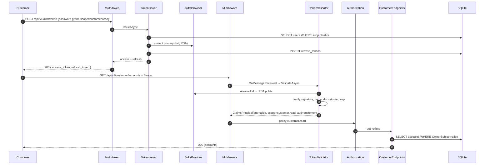

# Architecture

## Modular monolith with a first-class trust core

The platform is a single ASP.NET Core process that hosts three logical services — customer,
partner, admin — behind different authorization postures. All three share one persistence
layer, one audit log and one trust core (issuer, validator, JWKS, revocation). The three
services could be split into their own deployments; the architecture makes that a
mechanical refactor, not a rewrite.

```mermaid
flowchart TB
    subgraph API["ZeroTrust.Api (composition root)"]
        PROG[Program.cs]
        AUTHZ[Authorization\n(policies, PDP)]
        MW[Middleware\n(correlation-id, security-headers, partner-posture)]
        EP[Endpoints\n(customer / partner / admin / auth)]
    end
    subgraph APP["ZeroTrust.Application"]
        PORTS[Abstractions\n(IClock, ITokenIssuer, ITokenValidator, IAuditLog,\nIWebhookSigner/Verifier, IJwksProvider)]
    end
    subgraph INF["ZeroTrust.Infrastructure"]
        SQL[EF Core + SQLite]
        TI[TokenIssuer / TokenValidator]
        JWKS[JwksProvider]
        SEC[SecretHasher / HmacWebhook / AuditLog]
        CLK[SystemClock / FakeClock]
    end
    subgraph DOM["ZeroTrust.Domain"]
        IDENT[Identity]
        CUST[Customer]
        PART[Partner]
        AUD[Audit]
        COM[Common]
    end
    API-->APP
    API-->INF
    INF-->APP
    APP-->DOM
    INF-->DOM
```

Reference rules enforced by `csproj` project references only — never violated in code.

## The trust core

The trust core is the module that makes zero-trust concrete. It is the *only* code that
touches signing key material or emits/consumes JWTs.

| Component        | Responsibility                                                                                       |
|------------------|-------------------------------------------------------------------------------------------------------|
| `JwksProvider`   | Owns the RSA keys. Rotates: current primary → secondary; retires older keys. Emits JWKS JSON.        |
| `TokenIssuer`    | Grants: `password`, `client_credentials`, `refresh_token`, `service_account`. Mints RS256 or HS256.  |
| `TokenValidator` | Validates: iss, aud, exp, nbf, signature, kid, `alg != none`. Reads revocation list.                 |
| `AuditLog`       | Append-only; hash-chained; verified end-to-end via `/api/v1/admin/audit/verify-chain`.               |
| `SecretHasher`   | PBKDF2-SHA256, 100 000 iters, per-secret salt.                                                       |
| `HmacWebhook`    | v1 scheme (`{version}.{ts}.{nonce}.{body}` → HMAC-SHA256), constant-time compare, replay cache.       |

## Sequence: customer token → account read (headline flow)



## Ports and adapters

| Port | Adapter |
|------|---------|
| `IClock` | `SystemClock` (prod) / `FakeClock` (tests) |
| `ITokenIssuer` / `ITokenValidator` | `TokenIssuer` / `TokenValidator` |
| `IJwksProvider` | `JwksProvider` |
| `IAuditLog` | `AuditLog` (EF Core-backed) |
| `IWebhookSigner` / `IWebhookVerifier` | `HmacWebhookSigner` / `HmacWebhookVerifier` |

All external dependencies (webhooks, JWKS) go through ports; there is no direct HTTP call
buried in a domain method.

## Configuration

`RateLimitingOptions`, `TokenIssuerOptions`, `DatabaseOptions`, `CorsOptions` are POCOs
with data-annotations, bound at startup via
`AddOptions<T>().Bind().ValidateDataAnnotations().ValidateOnStart()`.

A startup guard refuses to boot in `Production` with the default HS signing key.
