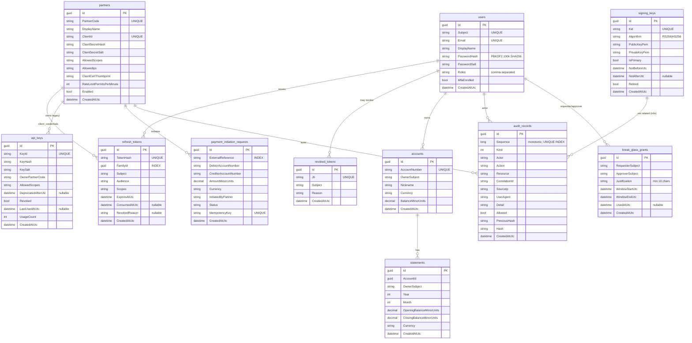

# Database schema

SQLite by default (via `Data Source=zero-trust.db`), Postgres or SQL Server work
identically via configuration. Schema is created by `EnsureCreatedAsync` at startup
(migrations are not the teaching point of this project).

## ER diagram

## Indexes and constraints

| Table                       | Constraint                                         |
|-----------------------------|-----------------------------------------------------|
| users                       | UNIQUE(Subject), UNIQUE(Email)                     |
| partners                    | UNIQUE(PartnerCode), UNIQUE(ClientId)              |
| refresh_tokens              | UNIQUE(TokenHash), INDEX(FamilyId)                 |
| revoked_tokens              | UNIQUE(Jti)                                        |
| api_keys                    | UNIQUE(KeyId)                                      |
| signing_keys                | UNIQUE(Kid)                                        |
| audit_records               | UNIQUE(Sequence)                                   |
| accounts                    | UNIQUE(AccountNumber)                              |
| payment_initiation_requests | INDEX(ExternalReference), UNIQUE(IdempotencyKey)   |

## Rationale

- **PBKDF2 hashes stored, salts stored separately.** Salted PBKDF2 with 100 000 iterations
  is safe against offline dictionary attacks on the hosts this project targets. Argon2 is
  strictly better; PBKDF2 is what ships with .NET out of the box, which matters for the
  "zero external dependencies" claim.
- **Refresh tokens stored as hashes, plaintext returned only on issuance.** A DB dump does
  not leak live refresh tokens.
- **Refresh `FamilyId` index.** Reuse detection means "revoke every row in a family";
  cheap only if indexed.
- **Audit `Sequence` unique.** Monotonic sequence + hash chain gives cheap detection of
  insertion / reordering / modification.
- **Money is `decimal` in minor units.** No `double` money. See architecture standards §4.
- **Payment idempotency key unique.** Duplicate submission returns the original result.
