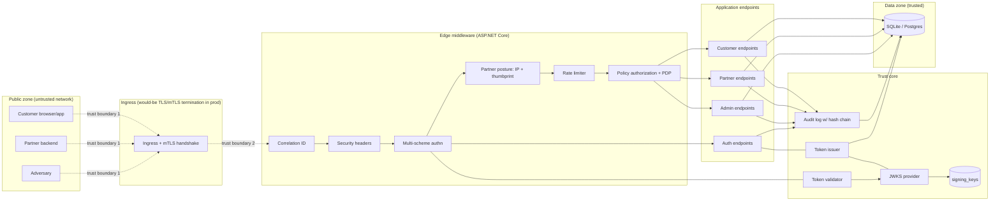
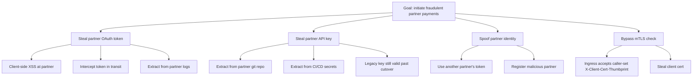
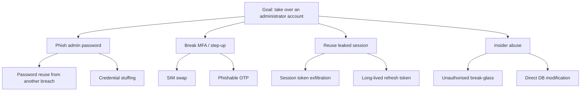

# Threat Model — Zero-Trust API Platform

> Northstar Financial Services (fictional). This document captures the trust boundaries,
> assets, STRIDE analysis, attack trees and mitigations for the platform. It is a real
> threat model of the code in this repository — not a template.

## 1. System decomposition

The platform is a single ASP.NET Core process exposing three logical API surfaces
sharing one persistence layer and one trust core (issuer + validator + JWKS + audit log).

### Trust boundaries

- **B1** — Public network to ingress. Anything before this line is fully untrusted.
- **B2** — Ingress to application. The application trusts headers that only the ingress can
  set (e.g. `X-Client-Cert-Thumbprint`). A misconfigured ingress that accepts caller-set
  values here is a critical vulnerability; documented in ADR-005.
- **B3** — Application to trust core. The trust core is the only component permitted to
  read/write signing keys and refresh-token families.
- **B4** — Application to database. All queries are parameterised via EF Core.

## 2. Asset inventory

| # | Asset | Sensitivity | Where stored | Notes |
|---|-------|-------------|--------------|-------|
| A1 | RSA private signing keys | Critical | `signing_keys` table (private_key_pem) | Compromise = mint any token |
| A2 | User password hashes | Critical | `users.PasswordHash+Salt` (PBKDF2 SHA256) | 100k iterations, per-user salt |
| A3 | Partner client secret hashes | Critical | `partners.ClientSecretHash+Salt` | Same posture as A2 |
| A4 | Legacy API-key hashes | High | `api_keys.KeyHash+Salt` | Migration in progress |
| A5 | Live refresh tokens | High | `refresh_tokens.TokenHash` | Hash-stored, never plaintext |
| A6 | Access tokens (bearer) | High | Never persisted server-side | Short-lived; JWKS-signed |
| A7 | Audit trail | High | `audit_records` (hash-chained) | Tampering must be detectable |
| A8 | Customer accounts + statements | Medium | `accounts`, `statements` | Per-user scoped |
| A9 | Partner payment initiations | Medium | `payment_initiation_requests` | Idempotency key stored |
| A10 | Correlation IDs, IP addresses, user agents | Low | In audit records | Contribute to forensics |

## 3. STRIDE per boundary — 20 concrete threats

### Boundary B1 (public network → ingress)

| ID | STRIDE | Threat | Mitigation | Where |
|----|--------|--------|------------|-------|
| T-01 | S | Adversary calls admin endpoints without any credentials. | `RequireAuthenticatedUser()` on every non-anonymous policy; anon → 401. | `src\ZeroTrust.Api\Program.cs`, `AuthEndpoints.cs` |
| T-02 | T | MITM alters a JWT in transit. | JWT signature (RS256) verified via JWKS; alg=none rejected. | `TokenValidator.cs`; test `Alg_None_Tampered_Token_Rejected` |
| T-03 | R | Client denies having initiated an action. | Correlation ID + audit record with actor/action/resource. | `AuditLog.cs`, `CorrelationIdMiddleware.cs` |
| T-04 | I | Adversary enumerates whether a user exists via distinct 401/404 responses. | Auth endpoint returns 400 for bad credentials without leaking user existence. | `AuthEndpoints.cs` |
| T-05 | D | Volumetric denial of service against public surfaces. | ASP.NET Core rate limiter partitioned by principal/IP; request size cap (1 MiB); Kestrel limits. | `Program.cs` (rate limiter policies) |
| T-06 | E | Reflection-based header injection tricks the app into trusting a request. | Security headers set by middleware; ingress must set trusted headers; documented in ADR-005. | `SecurityHeadersMiddleware.cs` |

### Boundary B2 (ingress → application)

| ID | STRIDE | Threat | Mitigation | Where |
|----|--------|--------|------------|-------|
| T-07 | S | Adversary spoofs partner identity by setting `X-Client-Cert-Thumbprint` from the outside. | In real deployment, ingress config must strip caller-set values. ADR-005 documents the constraint; middleware verifies match against partner registry, but this is only strong if the ingress removes caller-supplied values. | `PartnerPostureMiddleware.cs`, `docs/decisions/ADR-005-simulated-mtls.md` |
| T-08 | T | Adversary tampers with correlation IDs to break forensics. | Correlation ID is echoed but each audit record is chained; audit tampering is detected via hash chain. | `CorrelationIdMiddleware.cs`, `AuditLog.VerifyChainAsync` |
| T-09 | I | Adversary reads response error bodies to leak stack traces. | `AddProblemDetails` + `UseExceptionHandler` — no stack traces in responses. | `Program.cs` |
| T-10 | E | Adversary calls partner endpoint from disallowed IP. | Per-partner `AllowedIps` list; middleware rejects with 403 and audits. | `Partner.IsIpAllowed`, `PartnerPostureMiddleware.cs` |

### Boundary B3 (application → trust core)

| ID | STRIDE | Threat | Mitigation | Where |
|----|--------|--------|------------|-------|
| T-11 | S | A service token is presented on a customer surface. | Every policy requires the correct `aud` claim; service tokens have `aud=partner`; test `Service_Token_Cannot_Be_Used_On_Partner_Api` explicitly denies. | Policies in `Program.cs`; integration test |
| T-12 | T | Adversary forges a JWT with `alg=none`. | Validator sets `RequireSignedTokens=true` and explicitly disallows algorithm `none`. | `TokenValidator.cs` |
| T-13 | R | Admin denies having triggered a break-glass. | Break-glass records: requester, approver, justification, timestamps, correlation id — plus audit entry. | `BreakGlassGrant.cs`, `AdminEndpoints.cs` |
| T-14 | I | Adversary reads a refresh token from logs. | Refresh tokens are hashed at rest; the plaintext value is returned once in the response, never logged; audit records don't include the token value. | `TokenIssuer.cs`, `AuditLog.cs` |
| T-15 | D | Adversary uses a stolen refresh token concurrently with the legitimate user. | Rotation with reuse detection → entire family revoked on reuse; both parties disconnected forcing re-authentication. | `TokenIssuer.RefreshAsync`; tests |
| T-16 | E | Compromised signing key is used to mint arbitrary tokens. | Key rotation runbook; audit event on key rotation; two-active-key window means immediate revocation of a compromised key doesn't lock everyone out. | `docs/runbooks/key-rotation.md`; `AdminEndpoints.cs` |

### Boundary B4 (application → database)

| ID | STRIDE | Threat | Mitigation | Where |
|----|--------|--------|------------|-------|
| T-17 | T | SQL injection via user-supplied input. | EF Core parameterises every query; no `FromSqlRaw` on untrusted input. | All repositories |
| T-18 | I | IDOR: user reads other user's account by guessing GUID. | `AccountOwnerRequirement` + handler that reads `IsOwnedBy(subject)`; test `Alice_Cannot_Read_Bobs_Account_By_Guessing_Id`. | `Handlers.cs`, `CustomerEndpoints.cs` |
| T-19 | R | Audit record retro-actively modified. | Append-only writer + SHA-256 hash chain over `(sequence, kind, actor, action, resource, correlationId, ip, ua, detail, allowed, ticks, previousHash)`. Verify endpoint returns first tampered row. | `AuditLog.cs`; test `AuditHashChainTests.Chain_Detects_Tampering` |
| T-20 | D | Attacker fills DB with refresh tokens or audit records to exhaust disk. | Rate limits on token issuance (per-principal); audit growth is proportional to allowed traffic; production runbook says "rotate to a WORM sink and truncate cold rows". | Runbooks + rate limiter |

## 4. Attack trees

### 4.1 Attack tree: Compromise a partner and initiate fraudulent payments

Mitigations mapped:

- **A1a/A1b/A1c** — token audience + scope + short expiry; refresh rotation with reuse
  detection; token revocation list; ADR-003.
- **A2a/A2b** — legacy keys stored as PBKDF2 hashes (never plaintext in server logs); rotation
  supported; usage report identifies keys still in use.
- **A2c** — enforced cutover with `IApiKeyToggle`; test `Api_Key_Rejected_After_Cutover_When_Past_Deprecation`.
- **A3a** — `partner_code` claim on every partner token; IP allow-list per partner;
  `X-Client-Cert-Thumbprint` per partner. Impersonating another partner requires the
  attacker to simultaneously satisfy all three.
- **A3b** — partner onboarding is out of scope but the model requires operator approval
  (audited).
- **A4a** — ADR-005 explicitly names this as the failure mode a real deployment must guard
  against, at the ingress layer.
- **A4b** — client certs are out of scope for the simulation; the runbook for a real
  deployment says "revoke and reissue via internal CA".

### 4.2 Attack tree: Take over an administrator account

Mitigations mapped:

- **P1/P2** — passwords are PBKDF2 with per-user salt; admin has `mfaEnrolled=true` and every
  admin endpoint requires `amr=mfa` + `acr=urn:ntsf:acr:step-up`.
- **M1/M2** — represent classes of MFA that would be replaced with phishing-resistant
  factors (WebAuthn) in a real deployment; the abstraction (`StepUpRequirement`) is
  factor-agnostic.
- **R1** — admin access tokens have short lifetime (`AdminAccessTokenMinutes = 5`) and are
  scoped to `aud=admin`. A stolen admin access token has a small blast radius.
- **R2** — refresh rotation with reuse detection (ADR-003) applies.
- **I1** — break-glass requires two-person rule: requester ≠ approver, ≥10-char
  justification, time window; violations rejected in domain layer.
- **I2** — hash-chain audit detects any post-hoc modification; verify endpoint returns
  first tampered row and time.

## 5. Residual risk register

| Risk | Impact | Likelihood | Mitigation | Residual |
|------|--------|------------|------------|----------|
| Simulated mTLS accepts caller-set thumbprint if ingress misconfigured | High | Low (ops discipline) | ADR-005 + runbook | Medium |
| Signing key held in SQLite (demo default) | Critical | Low (demo only) | Prod uses Key Vault / KMS | Low in prod, N/A in demo |
| Rate-limit partitions are process-local | Medium | Medium (multi-instance) | Documented; needs shared bucket store in prod | Medium |
| No penetration test | Medium | N/A | Non-claim in security review | Explicit non-claim |
| No formal audit / certification | N/A | N/A | Non-claim in security review | Explicit non-claim |

## 6. Explicit non-claims

- This is a self-directed engineering demonstration. No formal security audit, penetration
  test, or compliance certification (PCI DSS, SOC 2, HIPAA, ISO 27001) has been performed
  or is claimed.
- The `X-Client-Cert-Thumbprint` mechanism is a **simulation** of ingress-terminated mTLS;
  see ADR-005.
- The `alice`, `bob`, `admin`, `ACME-TREASURY`, `SAVANNA-LOGISTICS`, `acme-treasury-client`
  identifiers are fictional.
