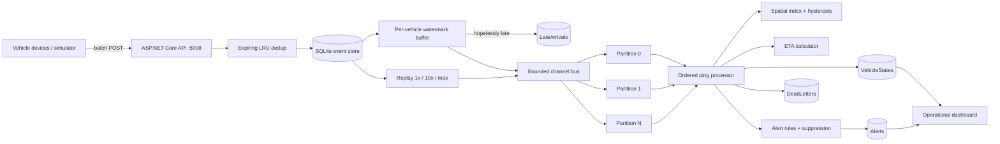
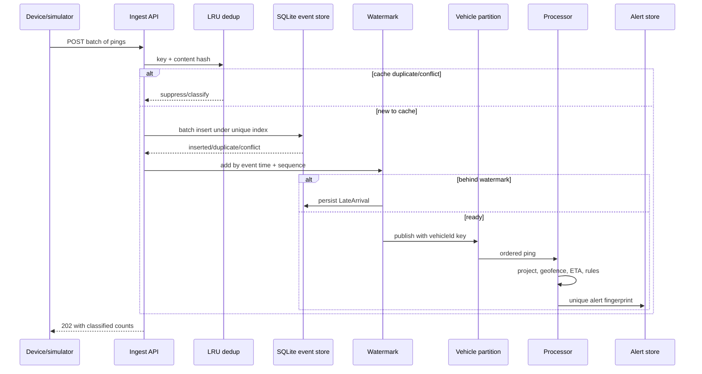
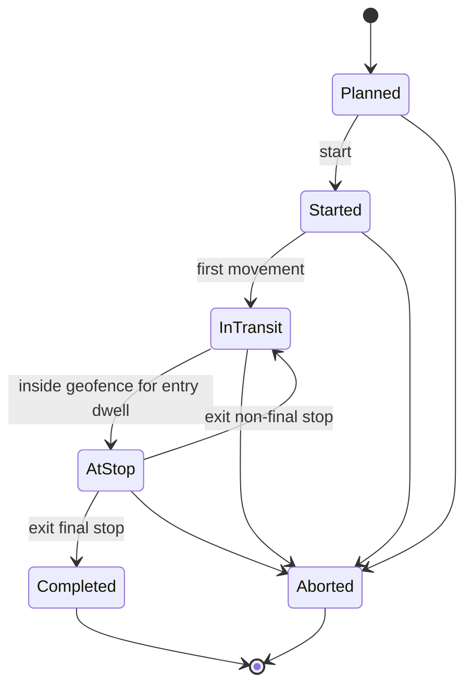

# Savanna Event-Driven Logistics Platform

## Portfolio Classification

Self-directed engineering case study. This repository is a production-style reference implementation, not client work and not a claim of a live fleet deployment.

## Executive Summary

Savanna Logistics Ltd (fictional) operates a synthetic Nairobi fleet through an event-driven .NET platform. The system accepts high-rate, imperfect GPS telemetry; restores per-vehicle event-time order; deduplicates retries; projects current vehicle state; detects geofence and route events; calculates ETAs; suppresses alert storms; and safely replays incidents. It runs end-to-end with .NET 10 and SQLite, without external infrastructure.

The headline engineering decisions are the bounded event-time watermark, vehicle-keyed channel partitions, layered cache/database idempotency, hand-built geospatial maths and replayable state projection.

## Business Problem

Fleet operators receive data from unreliable mobile links and clocks. Duplicate, late and out-of-order pings can create false route deviations, incorrect trip transitions and hundreds of repeated alerts. Operators also need to reconstruct an incident without corrupting live state.

This implementation makes those failure modes explicit:

- unreliable device delivery is modelled rather than hidden;
- event time is separated from ingest/processing time;
- every vehicle has an ordered processing lane;
- current state can be rebuilt from retained pings;
- alerts use rule-level suppression and a persisted uniqueness boundary;
- all location data in the repository is synthetic.

## Functional Requirements

- Fleet registry for vehicles, drivers, capacity, status and driver assignment.
- Batch telemetry ingestion for latitude, longitude, speed, heading, odometer, fuel, ignition, device time, ingest time and sequence.
- Configurable simulator with duplicates, adjacent out-of-order swaps, GPS jitter, tunnel-style dropouts and clock skew.
- Event-time watermark with bounded lateness and a persisted late-arrival sink.
- `(vehicleId, sequenceNumber)` deduplication plus SHA-256 content comparison.
- In-memory and SQLite-backed current-state projection with offline detection.
- Ordered routes/stops, trip state machine and geofence dwell hysteresis.
- Circular/polygon geofences, haversine, ray casting, corridor distance and grid bucketing.
- Rolling-speed ETA prediction, ETA history and arrival-error metrics.
- Speeding, harsh-braking, prolonged-stop, route-deviation, geofence, offline and SLA-risk alerts.
- Safe 1x/10x/max incident replay and full projection rebuild.
- Bounded, partitioned in-process channel bus with backpressure, lag and dead-letter handling.
- Authenticated APIs, OpenAPI JSON and a utilitarian operational dashboard.

## Non-Functional Requirements

- No external services are needed for build, tests or local execution.
- SQLite is the default adapter; migrations are committed.
- Channels are bounded, writes apply backpressure and consumers isolate failures.
- Per-vehicle order is deterministic while different partitions run concurrently.
- API errors use RFC 7807 Problem Details and include trace/correlation identifiers.
- Batch size is capped at 10,000 and ingest is token-bucket rate-limited.
- Pagination caps page size at 200.
- Domain calculations are deterministic and time-sensitive behaviour is clock-injectable.
- The 58-test suite includes geometry, ordering, idempotency, replay, auth and load behaviour.

## Architecture

The solution follows ports and adapters:

- `SavannaLogistics.Domain`: entities, trip state, geospatial primitives and invariants.
- `SavannaLogistics.Application`: repository/bus ports plus ordering, dedup, spatial index, ETA, alert and channel algorithms.
- `SavannaLogistics.Infrastructure`: EF Core SQLite adapter, migrations, bus host, stream processor, replay, simulator and workers.
- `SavannaLogistics.Api`: composition root, JWT/policies, endpoint groups, middleware, OpenAPI and dashboard.

The in-process topology is deliberately shaped like a future Kafka/Event Hubs topology: vehicle ID is the partition key, the SQLite event table represents retained source events, and dead/late events have explicit sinks. See `docs/architecture/architecture.md`.

## Architecture Diagram





## Technology Stack

| Area | Technology |
|---|---|
| Runtime | .NET SDK 10.0.400, `net10.0`, C# |
| API | ASP.NET Core minimal APIs, Problem Details, health checks |
| Persistence | EF Core 10 + SQLite, committed migration |
| Eventing | `System.Threading.Channels`, bounded vehicle partitions |
| Security | JWT bearer HS256 local profile, policy/scoped authorization |
| Observability | OpenTelemetry ASP.NET instrumentation, custom `Meter` and `ActivitySource` |
| UI | Server-rendered HTML, fetch and vanilla JavaScript |
| Testing | xUnit, `WebApplicationFactory<Program>`, SQLite in-memory |

## Domain Model

Core aggregates and records are `Vehicle`, `Driver`, `RoutePlan`, `RouteStop`, `Trip`, `Geofence`, `VehiclePing`, `VehicleState`, `EtaPrediction`, `AlertRecord`, `LateArrival` and `DeadLetter`.

`Trip` owns lifecycle invariants and optimistic `Version`. `VehiclePing` is immutable after construction. `VehicleState.Apply` rejects an older sequence. `Geofence` owns shape-specific containment, while `GeoMath` owns reusable calculations.

## Core Workflows

1. **Ingest:** validate up to 10,000 pings, hash canonical content, cache-deduplicate, batch persist, watermark and publish.
2. **Process:** consume a vehicle partition, update state, evaluate indexed geofences, transition a trip, recalculate ETA and emit suppressed alerts.
3. **Replay:** read a retained window in event order, preserve speed timing at 1x/10x or use max speed, republish with replay semantics, and rely on alert fingerprints for idempotency.
4. **Rebuild:** clear only current-state rows and volatile calculators, then replay all retained pings. Retained source pings remain untouched.



## Security Model

- JWT validation checks issuer, audience, signature and lifetime.
- Local token profiles are available only outside Production; Production rejects the default signing key.
- Policies enforce `fleet.read`, `fleet.write`, `telemetry.ingest` and `operations` scopes.
- Ingest is rate-limited by authenticated subject/IP, capped by body shape and batch size.
- Security headers include CSP, HSTS, frame denial, MIME sniffing denial and restrictive permissions policy.
- Correlation IDs are honoured and returned without logging raw telemetry bodies.
- All demo identities and coordinates are synthetic. See `docs/security/security-review.md`.

## Reliability & Failure Handling

- The LRU cache avoids needless database trips; the database unique index is the final idempotency authority.
- The watermark waits a configurable duration before ordering by sequence; events behind the watermark are retained in `LateArrivals`.
- Channel capacity bounds memory. `WriteAsync` applies backpressure and `TryPublish` exposes immediate pressure.
- A handler exception is isolated, counted and persisted to `DeadLetters`; subsequent partition messages continue.
- Alert suppression stops repetitive rules in memory, while a unique persisted fingerprint protects replay/restart scenarios.
- SQLite writes are serialized by a narrow process-wide gate to avoid local lock storms. Production mapping uses independently scalable partitions and database/broker guarantees.

## Observability

The `SavannaLogistics` meter exposes:

- `logistics.pings.ingested`
- `logistics.pings.processed`
- `logistics.pings.late`
- `logistics.alerts.emitted`
- `logistics.geofence.evaluations`
- `logistics.processing.lag.ms`
- `logistics.consumer.lag`

ASP.NET traces and the `SavannaLogistics.Processing` activity source are wired through OpenTelemetry. Set `Observability__ConsoleExporter=true` for local export. `/health/live` checks process liveness; `/health/ready` checks SQLite connectivity.

## Testing Strategy

The suite uses plain xUnit assertions:

- geometry known values and polygon edge/vertex/concave cases;
- random equivalence of spatial index and brute force;
- watermark reorder and late classification;
- cache and database deduplication;
- partition ordering, parallelism, backpressure and dead letters;
- trip state and hysteresis/no-flapping;
- ETA, dwell, route corridor and alert rules;
- offline detection with `FakeClock`;
- API 401, 403, validation Problem Details and fleet happy path;
- persisted projection, late sink, simulator faults, replay idempotency and rebuild;
- a real 10,000-ping API batch bound.

The integration fixture keeps a `Data Source=:memory:` SQLite connection open for the fixture lifetime.

## Local Development

Prerequisite: .NET SDK 10.0.400 or a compatible .NET 10 SDK.

```powershell
Set-Location C:\Users\rukwaropaul\Downloads\DEV\Projects\08-event-driven-logistics-platform
dotnet restore
dotnet build -c Release
dotnet test -c Release
dotnet run --project src\SavannaLogistics.Api
```

Open `http://localhost:5008`. The Development startup migration and seed are idempotent. The dashboard can issue the predefined development `operator` profile token.

## Running with Docker

Docker configuration created but Docker is unavailable on the build host; the compose stack has not been started or verified.

If Docker is available elsewhere, the intended command is `docker compose up --build`, followed by `http://localhost:5008`. Treat both container files as authored but **UNVERIFIED**.

## API Documentation

- OpenAPI JSON: `GET /openapi/v1.json`
- Human landing page: `GET /docs`
- Dashboard: `GET /`
- Health: `GET /health/live`, `GET /health/ready`
- Auth: `POST /api/v1/auth/token`
- Fleet: `/api/v1/vehicles`, `/api/v1/vehicles/drivers`
- Telemetry: `/api/v1/telemetry`, `/api/v1/telemetry/stats`, `/api/v1/telemetry/simulate`
- Planning: `/api/v1/routes`, `/api/v1/trips`, `/api/v1/geofences`
- Operations: `/api/v1/alerts`, `/api/v1/replay`, `/api/v1/eta/*`

## Example Usage

```powershell
$tokenResponse = Invoke-RestMethod -Method Post `
  -Uri http://localhost:5008/api/v1/auth/token `
  -ContentType application/json `
  -Body '{"clientId":"operator"}'
$headers = @{ Authorization = "Bearer $($tokenResponse.accessToken)" }

$vehicles = Invoke-RestMethod -Headers $headers `
  -Uri 'http://localhost:5008/api/v1/vehicles?page=1&pageSize=20'

$vehicleId = $vehicles.items[0].id
$body = @{
  pings = @(
    @{
      vehicleId = $vehicleId
      latitude = -1.286389
      longitude = 36.817223
      speedKph = 52.4
      headingDegrees = 88
      odometerKm = 30214.6
      fuelPercent = 68.2
      ignition = $true
      deviceTimestamp = [DateTimeOffset]::UtcNow
      sequenceNumber = 900001
    }
  )
} | ConvertTo-Json -Depth 5

Invoke-RestMethod -Method Post -Headers $headers -ContentType application/json `
  -Uri http://localhost:5008/api/v1/telemetry -Body $body
```

The ingest response is shaped like:

```json
{
  "received": 1,
  "accepted": 1,
  "cacheDuplicates": 0,
  "databaseDuplicates": 0,
  "conflicts": 0,
  "lateArrivals": 0,
  "published": 0
}
```

`published` may be zero until the watermark advances or the quiet-vehicle timer flushes.

## Performance / Load Testing

Measured on the build host (Windows, 16 cores, 64 GB RAM, .NET 10; synthetic data):

- 10,000-ping HTTP batch: **3,604.60 ms**, **2,774.23 pings/s** accepted into SQLite and watermark buffering.
- 2,000 geofences × 5,000 points: brute force **1,919.25 ms** / 10,000,000 evaluations; grid index **12.75 ms** / 10,510 evaluations; identical 1,527 matches.
- ETA simulator: 100 runs / 1,000 predictions, mean absolute error **41.85 s**, p90 **81.25 s**, maximum **174.07 s**.

These are real repository test outputs, not production claims. See `docs/geofence-benchmark.md`, `docs/eta-accuracy.md` and `docs/test-results.md`.

## Trade-offs

- A bounded watermark improves ordering but adds latency and cannot recover events arriving behind the watermark.
- A process-local cache and bus keep the demo infrastructure-free but do not coordinate across replicas.
- SQLite is reproducible and transactional, but the write gate trades local throughput for deterministic lock behaviour.
- Grid cells are simple and inspectable; extreme latitudes and anti-meridian polygons would need additional treatment.
- Replay intentionally avoids duplicating ETA history or mutating historical trip transitions; projection state and alert rules are re-evaluated safely.

## Architecture Decisions

1. `ADR-001-event-time-watermark.md`
2. `ADR-002-vehicle-partitioning.md`
3. `ADR-003-own-geo-maths-vs-postgis.md`
4. `ADR-004-projection-rebuild-by-replay.md`
5. `ADR-005-layered-deduplication.md`

## Known Limitations

- The local JWT profile endpoint is a development convenience, not a device provisioning system.
- The dashboard is map-less and polls every five seconds.
- The watermark state, LRU and alert suppression memory are not distributed.
- SQLite serializes application writes; no production-scale throughput claim is made.
- Polygon logic does not model holes or anti-meridian crossing.
- The local simulator uses generated straight-segment routes rather than road-network routing.
- Docker files are unverified on this host.

## Future Improvements

- Map device identities to per-device keys/certificates and signed telemetry envelopes.
- Replace channels with Kafka/Event Hubs and persist consumer checkpoints.
- Add PostgreSQL/PostGIS `geography` columns, GiST indexes and `ST_DWithin`.
- Add an outbox for externally delivered alerts and an operator acknowledgement workflow.
- Render a tile map and stream changes with SignalR.
- Add cold event storage and partition pruning for multi-month replay.

## Portfolio Talking Points

- Explain why sequence order and event-time watermarks solve different parts of the problem.
- Demonstrate a duplicate, an out-of-order trip, a late sink row and an idempotent replay.
- Compare the 10,000,000 brute-force geofence checks with 10,510 indexed candidates.
- Show the production mappings without pretending local SQLite/channels are already distributed.
- Discuss the security boundary around location data and device identity spoofing.

## Upwork Portfolio Description

Savanna Event-Driven Logistics Platform — self-directed engineering case study

Problem: Unreliable fleet telemetry arrives duplicated and out of order, causing incorrect vehicle state and alert storms.

Built: A .NET 10 fleet platform with event-time ordering, vehicle-partitioned channels, geofence/ETA processing, simulator fault injection and safe incident replay.

Engineering focus: watermarking, layered idempotency, hand-built spatial indexing, rebuildable projections and alert suppression.

Stack: ASP.NET Core, EF Core, SQLite, Channels, OpenTelemetry, xUnit.
Verification: 58 passing tests plus measured geofence, ETA and 10,000-ping synthetic benchmarks.

This is a self-directed portfolio project, not client work.
