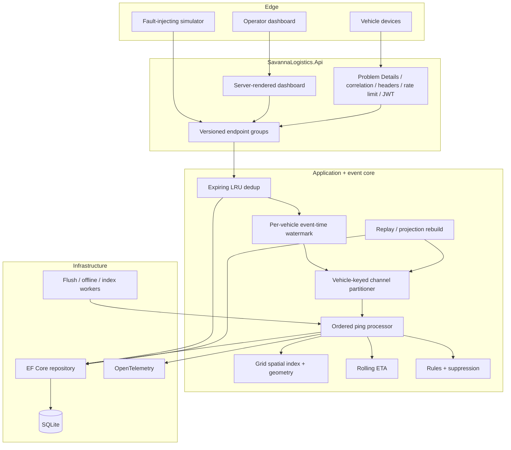
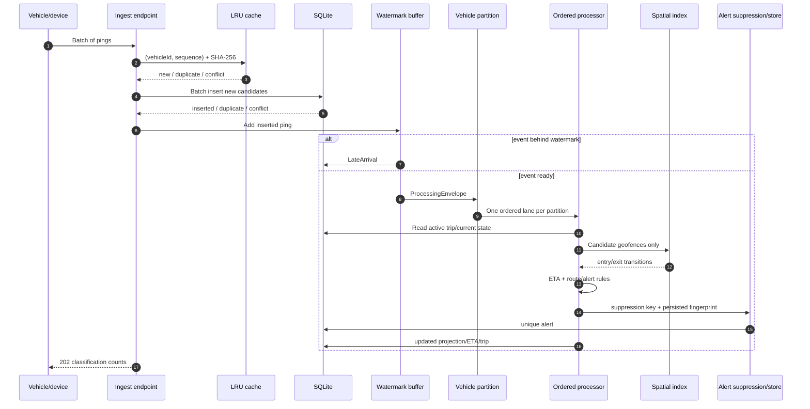

# Architecture — Savanna Event-Driven Logistics Platform

## Scope

This self-directed case study demonstrates the control plane and event-processing core for a fictional Kenyan fleet operator. The local topology is deliberately infrastructure-light: ASP.NET Core, SQLite and bounded in-process channels. The design exposes the seams required to move persistence, messaging, caching and identity to managed production services.

## Component view

## Ping-to-alert sequence

## Ordering model

There are three distinct orders:

1. **Device sequence** is the expected order inside one vehicle stream.
2. **Device timestamp** advances an event-time watermark.
3. **Ingest timestamp** measures processing lag and determines when an otherwise quiet buffer is flushed.

The watermark is `maxSeenDeviceTime - allowedLateness`. Buffered events eligible at or before the watermark are emitted by sequence number. An event whose sequence is already emitted, or whose event time is behind the watermark, is persisted as late. The quiet-vehicle worker flushes a buffer after the configured lateness interval so the final event does not wait forever.

## Partitioning and backpressure

`PartitionedChannelBus<T>` hashes `vehicleId` into a fixed partition count. Each bounded channel has one reader, preserving insertion order within that partition. Multiple channels process concurrently. `WriteAsync` waits when a partition is full; `TryPublish` returns false for callers that prefer shedding. Consumer lag is enqueued minus processed/dead-lettered.

The local handler failure boundary catches an exception, retains the message and error in memory, writes a `DeadLetter` row, increments metrics and continues with the next message. A production broker would add retry topics and operator-controlled redrive.

## State and replay

`VehiclePings` is the retained source event table. `VehicleStates` is a disposable projection. Full rebuild:

1. delete projection rows;
2. clear volatile rolling-speed, hysteresis and suppression state;
3. read retained pings;
4. publish them by vehicle sequence with replay semantics;
5. wait for consumer lag to reach zero.

Replay does not append source pings, duplicate ETA history or reapply historical trip transitions. Alert rules can run, but persisted alert fingerprints make the operation idempotent.

## Spatial processing

Every geofence is inserted into all grid cells touched by its bounding box. A ping looks up one cell, then performs exact circle/polygon containment only for candidates. Geofences already entered by a vehicle are retained as relevant candidates until an exit is confirmed; otherwise moving beyond a bounding box could hide an exit.

Local exact operations:

- haversine great-circle distance;
- inclusive ray-casting point-in-polygon with explicit edge test;
- local equirectangular point-to-segment/polyline corridor distance;
- circle and polygon bounding boxes.

## Kafka / Event Hubs production mapping

| Local component | Kafka / Event Hubs mapping |
|---|---|
| HTTP batch + `VehiclePings` | Device gateway writes a durable `vehicle-pings` topic and raw archive |
| Hash partition | Topic partition key = canonical vehicle ID |
| Bounded channel | Broker partitions + consumer-group fetch limits |
| Consumer lag gauge | Partition high watermark minus committed offset |
| Watermark buffer | Stateful stream processor keyed by vehicle; event-time timer/state store |
| `LateArrivals` | `vehicle-pings-late` topic + searchable cold store |
| `DeadLetters` | retry topics then `vehicle-pings-dlq` |
| Projection updates | Idempotent consumer writing PostgreSQL/Redis read models |
| Replay query | New consumer group over retained topic offsets or archived event range |

Kafka/Event Hubs still needs downstream idempotency: checkpoint commit and database update are not one atomic transaction unless an outbox/transactional-consumer strategy is used. The persisted unique event key remains valuable.

## Deployment evolution

Production would run stateless APIs behind a gateway, use OIDC/workload identity, place telemetry on Kafka/Event Hubs, persist operational data in PostgreSQL/PostGIS, put hot vehicle state in Redis, archive raw events to object storage, and export OpenTelemetry to an OTLP collector. Location retention, access logging and encryption keys would be governed separately from ordinary fleet metadata.
