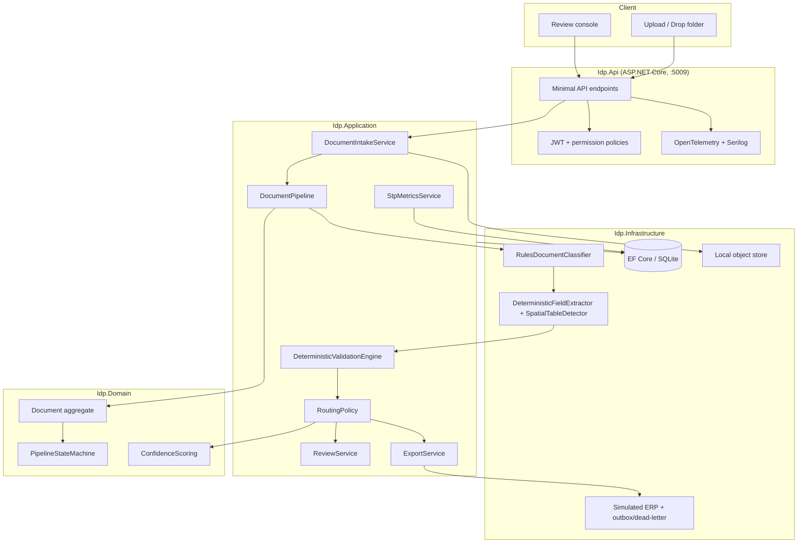
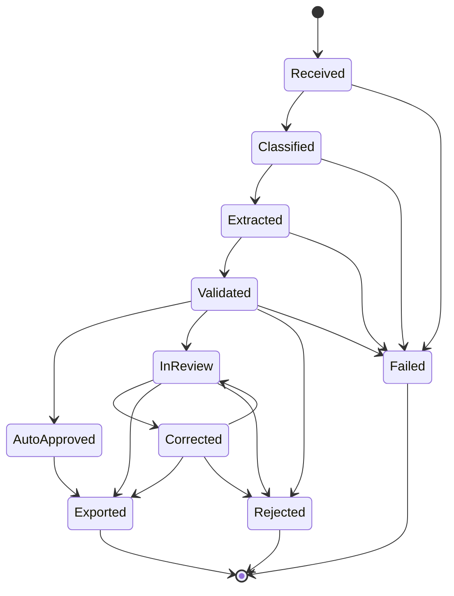
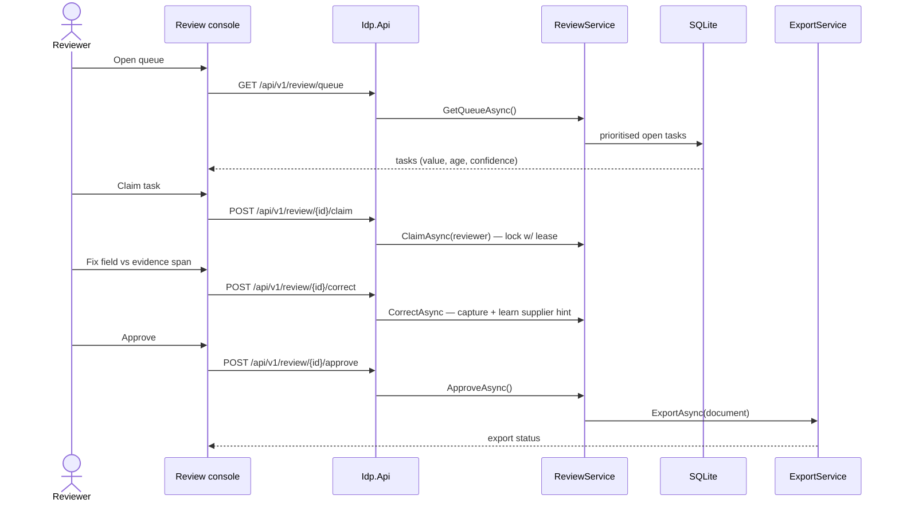

# Intelligent Document Processing Platform

Accounts-payable document automation for **Acme Manufacturing (fictional)** — ingesting invoices,
purchase orders and delivery notes from suppliers such as **Rift Valley Supplies Ltd (fictional)** in
**KES** and **USD**. The engineering story is **the pipeline and the guardrails around AI** —
confidence routing, deterministic validation, human-in-the-loop review, a correction feedback loop,
and a **straight-through-processing (STP) rate** measured as a real KPI over a seeded corpus.

> **Measured on the seeded corpus (deterministic, reproducible):** classification **100.00%**
> (19/19), extraction **98.78%** (81/82 fields), STP **31.58%** (6/19 auto-approved, 13 in review).
> **125 tests pass** (112 unit + 13 integration). See [`docs/accuracy-report.md`](docs/accuracy-report.md)
> and [`docs/test-results.md`](docs/test-results.md).

## Portfolio Classification

**Self-directed engineering case study.** A production-style prototype and reference implementation,
built solely to be read, run and interrogated. It is **not** client work: no real company, supplier,
document, revenue, user or transaction is represented. All data is synthetic and fictional. No paid
APIs and no network calls occur in the build, the tests, or the default runtime.

Profile mapping: **AI engineering** (guardrails, confidence routing, human-in-the-loop) and
**.NET / backend** (modular monolith, EF Core, observability).

## Executive Summary

The platform turns a stream of supplier documents into either a booked ERP entry or a prioritised
human-review task, and it can prove — with a measured number — what fraction it processed
straight-through. Documents are ingested (upload or drop-folder), classified with an explainable
model, extracted with spatial (coordinate-aware) strategies, validated by a battery of deterministic
rules (including a full **three-way match** of invoice ↔ PO ↔ delivery note), scored for confidence
and then **routed** to auto-approve, review or reject. Approved documents export to a simulated ERP
with retries, an idempotency key and a dead-letter path. Corrections captured in review feed back into
**per-supplier extraction hints** so the same supplier's next document extracts better — a property
proven end-to-end by a test.

The default extraction and classification engines are deterministic and fully offline; an optional
LLM classifier exists behind configuration and is unit-tested with a stub, but is never used by
default. **Tech:** C#/ASP.NET Core (.NET 10), EF Core + SQLite, minimal APIs, JWT, OpenTelemetry,
Serilog. **API port 5009.**

## Business Problem

Accounts-payable teams receive thousands of invoices, purchase orders and delivery notes in
inconsistent layouts. Keying them by hand is slow and error-prone; paying them without checks is
worse. The business value is not "reading the document" — modern OCR and LLMs do that adequately —
it is **deciding whether a machine-read document can be trusted enough to pay automatically**, and
catching the ones that cannot before money moves.

That decision is a chain of guardrails: does the arithmetic reconcile, are the dates sane, is this a
duplicate, does the supplier exist, does the invoice match the purchase order and the goods actually
delivered? Only documents that clear every guardrail with high confidence should be paid
automatically; the rest must land in front of a human with the exact evidence needed to resolve them
quickly. The measurable outcome is the **straight-through-processing rate**: the higher it is (safely),
the less manual work and the faster suppliers are paid.

## Functional Requirements

- **Ingestion**: multipart upload and drop-folder watcher; content-hash duplicate detection;
  pluggable object store (local filesystem; documented Azure Blob adapter); document versioning; one
  job per document with an explicit, audited pipeline state machine.
- **Formats**: plain text, CSV, and a synthetic **`.ocr.json`** layout format (word boxes with
  coordinates) so extraction is genuinely spatial without OCR/PDF libraries. A **document generator**
  produces realistic synthetic invoices/POs/delivery notes from several supplier templates, plus
  deliberately degraded variants.
- **Classification** (`IDocumentClassifier`): explainable rules+features linear model returning
  class + confidence + contributing features. Optional LLM adapter behind config.
- **Extraction** (`IFieldExtractor`): per-type field schemas; anchor/regex/positional strategies with
  a spatial table detector; every field carries value, normalised value, confidence, source box and
  the strategy that produced it.
- **Deterministic validation**: arithmetic, date sanity, duplicate detection, currency consistency,
  fuzzy supplier existence, tax-id format, and three-way match with tolerances.
- **Confidence & routing**: per-field and document-level aggregation; configurable thresholds route to
  auto-approve / review / reject; STP rate exposed as a metric.
- **Human review**: prioritised queue (value, age, confidence); claim/lock with expiry; field editing
  against evidence; correction capture; bulk approve; SLA aging.
- **Correction feedback**: corrections learn per-supplier anchors that improve the next extraction.
- **Downstream export**: ERP CSV/JSON to an outbox + a simulated ERP HTTP endpoint with retries,
  idempotency and dead-letter; export status and re-export.
- **Review UI**: functional server-rendered review console (queue, document detail, confidence
  colouring, evidence spans, approve/correct/reject).

## Non-Functional Requirements

- **Zero-dependency build**: `dotnet build` / `dotnet test` succeed with only the .NET SDK — no
  Docker, database server, network or paid API.
- **Determinism**: the seeded corpus and hence all measured numbers are reproducible run-to-run.
- **Security**: JWT auth with permission policies; untrusted-file handling; path-traversal-safe
  storage; SSRF containment; CSV-injection neutralisation; ProblemDetails; upload limits.
- **Observability**: OpenTelemetry metrics/traces (stage durations, STP rate, queue depth, confidence
  histogram); structured logging with correlation ids.
- **Testability**: `IClock` everywhere time matters; pure domain rules; full-stack integration tests
  against throwaway SQLite.
- **Maintainability**: strict layered dependencies; adapters behind ports; configuration-driven
  thresholds and tolerances.

## Architecture

A modular monolith with a strict dependency rule: **Domain ← Application ← Infrastructure ← Api**.

- **`Idp.Domain`** — pure business rules with no external dependencies: the `Document` aggregate, the
  `PipelineStateMachine`, `ConfidenceScoring`, review/export entities, and text utilities
  (`StringDistance`, `TaxIdFormat`).
- **`Idp.Application`** — orchestration and **ports** (interfaces): `DocumentPipeline`,
  `DeterministicValidationEngine`, `RoutingPolicy`, `ReviewService`, `ExportService`,
  `StpMetricsService`, and abstractions such as `IObjectStore`, `IDocumentClassifier`,
  `IFieldExtractor`, `IErpExportClient`.
- **`Idp.Infrastructure`** — adapters: `RulesDocumentClassifier`, `DeterministicFieldExtractor` +
  `SpatialTableDetector`, EF Core/SQLite persistence, `LocalFileSystemObjectStore`, the simulated ERP
  client, and the `DocumentGenerator`/`AccuracyEvaluator`.
- **`Idp.Api`** — ASP.NET Core minimal API: endpoints, JWT auth + policies, observability middleware,
  and the review console.

See [`docs/architecture/architecture.md`](docs/architecture/architecture.md) for the detailed
component view and the headline sequence flow.

## Architecture Diagram

Container / component view:



Document lifecycle state machine (every transition guarded and audited):



Review flow (headline human-in-the-loop sequence):



## Technology Stack

| Concern | Choice |
| --- | --- |
| Language / runtime | C# 13, .NET 10 (`net10.0`) |
| Web | ASP.NET Core minimal APIs |
| Persistence | EF Core 10 + **SQLite** (default) |
| Auth | JWT bearer (`Microsoft.AspNetCore.Authentication.JwtBearer`) + permission policies |
| Observability | OpenTelemetry (metrics + tracing), Serilog structured logging |
| Testing | xUnit, NSubstitute, `Microsoft.AspNetCore.Mvc.Testing` |
| AI (optional, off by default) | `IChatModel` adapter, stubbed in tests |

No Docker, Python, Postgres or Redis are required. Rate limiting uses the framework-built-in
`AddRateLimiter`. Assertions use plain xUnit `Assert.*`.

## Domain Model

- **`Document`** (aggregate root) — identity, versioning, classification result, extracted `Fields`
  and `LineItems`, `Validations`, `Transitions`, routing decision, confidence and value. All state
  changes go through methods that enforce the state machine and append audited transitions.
- **`ExtractedField`** — field key, raw + normalised value, confidence, strategy, source text and
  bounding `WordBox`.
- **`LineItem`** — description, quantity, unit price, line total, tax rate, confidence.
- **`DocumentValidation`** — rule name, outcome (Pass/Warn/Fail), message, implicated fields.
- **`PipelineTransition`** — from/to state, reason, actor, timestamp (the audit trail).
- **`Supplier`** + **`SupplierHint`** — master data, aliases, default currency, tax id, and learned
  per-template extraction hints.
- **`ReviewTask`** + **`Correction`** — review lifecycle, claim lease, SLA, and captured corrections.
- **`ExportRecord`** — export status, attempts, ERP reference, outbox path, last error.
- **`AuditEntry`** — cross-cutting actor/action/resource audit with before/after hashes.

Confidence is computed by the pure `ConfidenceScoring` service; state legality by
`PipelineStateMachine`. See [`docs/database-schema.md`](docs/database-schema.md) for the persisted
schema and ER diagram.

## Core Workflows

1. **Intake → pipeline.** A document is received (upload or drop-folder), content-hashed for duplicate
   detection, stored via `IObjectStore`, then driven through
   `Received → Classified → Extracted → Validated → (AutoApproved | InReview | Rejected)`.
2. **Classification.** `RulesDocumentClassifier` scores each type with a transparent linear model over
   keyword and layout features and returns the contributing features as an explanation.
3. **Extraction.** `DeterministicFieldExtractor` applies learned-anchor → anchor → regex → positional
   strategies and the `SpatialTableDetector` for line items; each field carries its evidence.
4. **Validation.** `DeterministicValidationEngine` runs every rule; three-way match reconciles
   invoice, PO and delivery note.
5. **Routing.** `ConfidenceScoring` aggregates confidence; `RoutingPolicy` maps it to auto-approve,
   review or reject.
6. **Review.** Humans claim, correct and approve/reject tasks; corrections learn supplier hints.
7. **Export.** Approved documents export to the simulated ERP with retries, idempotency and
   dead-letter; re-export is supported.

## Security Model

- **AuthN/Z**: JWT bearer; four permission policies — `documents:submit`, `review:process`,
  `review:approve`, `export:manage`. The dev-token endpoint is mapped only in Development. Startup
  refuses the default signing key in Production.
- **Untrusted files**: size and content-type allow-lists, content hashing, extension checks; content
  is never executed and is stored under generated, path-traversal-safe keys.
- **SSRF**: the export target URL is validated against an allow-list before any request is made.
- **CSV injection**: exported CSV neutralises leading `= + - @` (and tab/CR) with a `'` prefix.
- **PII**: document contents may contain personal/business data; access is authenticated, logs avoid
  document bodies, and the security review documents handling and retention expectations.
- **Transport & headers**: security headers middleware; ProblemDetails for errors; correlation ids.

Full STRIDE analysis and explicit non-claims are in
[`docs/security/security-review.md`](docs/security/security-review.md).

## Reliability & Failure Handling

- **Explicit state machine** — no document can enter an illegal state; failures move to `Failed` and
  are auditable and reprocessable.
- **Idempotent export** — an idempotency key (`{documentId}:v{version}`) means a retry after an
  ambiguous ERP response never double-books; the simulated ERP honours it.
- **Bounded retries + dead-letter** — transient export failures retry to a limit, then dead-letter for
  operator attention; permanent failures dead-letter immediately.
- **Duplicate detection** — content hash on intake and supplier+invoice-number at validation.
- **Claim leases** — an abandoned review claim expires so work is never stuck on one reviewer.
- **Reprocess** — terminal documents can be reset to `Received` and re-run at a new version.

Operational procedures for the common failure modes are in
[`docs/runbooks/`](docs/runbooks/): [stuck-document](docs/runbooks/stuck-document.md),
[export-failures](docs/runbooks/export-failures.md), [review-backlog](docs/runbooks/review-backlog.md).

## Observability

OpenTelemetry meter `Idp.Pipeline` exposes: pipeline stage durations (histogram), documents processed
and auto-approved (counters), STP rate (observable gauge), review queue depth (observable gauge), and
an extraction-confidence histogram. Tracing instruments ASP.NET Core requests. Serilog provides
structured logs with request logging and a correlation-id enricher. A Console OTel exporter is enabled
in Development only (so tests and CI stay quiet and offline).

## Testing Strategy

Two projects: `Idp.UnitTests` (domain/application/infrastructure invariants) and
`Idp.IntegrationTests` (`WebApplicationFactory<Program>` against a seeded, throwaway file-SQLite
database). `IClock`/`FixedClock` is used wherever time matters. **125 tests** cover classifier and
extraction accuracy over the corpus, spatial table detection, every validation rule
(pass + fail + boundary tolerances), three-way match (partial/over delivery, over-billing), duplicate
detection, fuzzy supplier matching (with a negative case), confidence routing at threshold boundaries,
review claim/expiry/concurrent-conflict, the correction feedback loop (v1 miss → learn → v2 correct),
export retry-then-dead-letter, the state-machine transition matrix, upload validation (too large /
wrong type), API happy-path / 401 / 403, and STP computation. Real output:
[`docs/test-results.md`](docs/test-results.md).

## Local Development

Prerequisites: **.NET SDK 10**. Nothing else.

```powershell
dotnet build -c Release
dotnet test  -c Release

# run the API (Development seeds the corpus into src/Idp.Api/idp-dev.db)
dotnet run --project src/Idp.Api
# → http://localhost:5009   (review console at /, health at /health)
```

Get a token in Development from `POST /api/v1/dev/token`, or just open the review console at `/`.

## Running with Docker

A `Dockerfile` and `docker-compose.yml` are included for completeness. **Docker configuration created
but Docker is unavailable on the build host; the compose stack has not been started or verified.** They
are labelled `UNVERIFIED`. The application requires no containers to build, test or run locally.

## API Documentation

All routes are under `/api/v1` unless noted; OpenAPI is served by the running app.

| Method & path | Policy | Purpose |
| --- | --- | --- |
| `POST /documents` | `documents:submit` | Upload (multipart, field `file`) |
| `GET /documents` | `documents:submit` | List (paged) |
| `GET /documents/{id}` | `documents:submit` | Get one (fields, validations, transitions) |
| `GET /documents/{id}/fields` | `documents:submit` | Extracted fields + evidence |
| `POST /documents/{id}/reprocess` | `documents:submit` | Reprocess a terminal document |
| `GET /review/queue` | `review:process` | Prioritised review queue |
| `POST /review/{id}/claim` | `review:process` | Claim/lock a task |
| `POST /review/{id}/correct` | `review:process` | Capture corrections |
| `POST /review/{id}/approve` | `review:approve` | Approve → export |
| `POST /review/{id}/reject` | `review:approve` | Reject |
| `GET /exports` | `export:manage` | List export records |
| `POST /exports/{documentId}/reexport` | `export:manage` | Re-export |
| `GET /suppliers` | authenticated | Supplier master data |
| `GET /metrics/stp` | authenticated | STP snapshot |
| `GET /health`, `/health/live`, `/health/ready` | anonymous | Health probes |
| `POST /simulated-erp/invoices` | anonymous | Simulated ERP sink (idempotent) |
| `POST /api/v1/dev/token` | Development only | Mint a dev token |

Cross-cutting: ProblemDetails errors, `X-Correlation-ID`, upload size/content-type limits, rate
limiting.

## Example Usage

```powershell
$base = "http://localhost:5009"

# 1) Get a development token (Development environment only)
$token = (Invoke-RestMethod -Method Post "$base/api/v1/dev/token" `
  -ContentType application/json -Body '{"subject":"demo"}').access_token
$h = @{ Authorization = "Bearer $token" }

# 2) Upload a document (multipart; field name must be "file")
$doc = Invoke-RestMethod -Method Post "$base/api/v1/documents" -Headers $h `
  -Form @{ file = Get-Item .\samples\invoice-rift-valley.ocr.json }
$doc.id      # -> a new GUID; state is AutoApproved or InReview after the pipeline runs

# 3) Inspect extracted fields with evidence
Invoke-RestMethod "$base/api/v1/documents/$($doc.id)/fields" -Headers $h
# -> [{ fieldKey: "invoiceNumber", value: "INV-1001", confidence: 0.9,
#       strategy: "Anchor", box: { x, y, width, height, page } }, ... ]

# 4) The straight-through-processing KPI
Invoke-RestMethod "$base/api/v1/metrics/stp" -Headers $h
# -> { totalDocuments: 19, processed: 19, autoApproved: 6, inReview: 13,
#      rejected: 0, exported: 0, reviewQueueDepth: 13, straightThroughRate: 0.3158 }

# 5) Work the review queue
$q = Invoke-RestMethod "$base/api/v1/review/queue" -Headers $h
Invoke-RestMethod -Method Post "$base/api/v1/review/$($q.items[0].taskId)/claim" `
  -Headers $h -ContentType application/json -Body '{"reviewer":"demo"}'
```

A `401` is returned with no/invalid bearer token; a `403` when the token lacks the required
permission; a `400` ProblemDetails for an oversized or wrong-type upload; a `409` for a duplicate
(same content hash).

## Performance / Load Testing

No load test is included, and **no performance numbers are claimed**. The portfolio policy is that
throughput/latency figures may be published only when they are the real output of a load test in the
repository, run on documented hardware and labelled a synthetic benchmark. The accuracy and STP
numbers that *are* published are correctness measurements over the deterministic seeded corpus (see
[`docs/accuracy-report.md`](docs/accuracy-report.md)), not performance benchmarks.

## Trade-offs

- **Deterministic-first extraction** over an LLM by default: reproducible, explainable, free and
  offline, at the cost of some recall on messy layouts — the LLM path is an opt-in adapter
  ([ADR-001](docs/decisions/ADR-001-deterministic-first-extraction.md)).
- **Synthetic `.ocr.json` layout** instead of real OCR/PDF: keeps the build dependency-free and the
  corpus deterministic, at the cost of not exercising a real OCR engine
  ([ADR-002](docs/decisions/ADR-002-synthetic-layout-format.md)).
- **Weakest-link confidence aggregation**: safer routing (one bad critical field blocks
  auto-approval) at the cost of a lower STP rate
  ([ADR-003](docs/decisions/ADR-003-confidence-aggregation.md)).
- **Per-supplier hint learning** instead of model retraining: instant, explainable, testable feedback
  at the cost of not generalising across suppliers
  ([ADR-004](docs/decisions/ADR-004-feedback-loop.md)).
- **Modular monolith** over microservices: one deployable, easy to run and test, at the cost of
  independent scaling ([ADR-005](docs/decisions/ADR-005-three-way-match-tolerances.md) covers match
  tolerances; the monolith choice is discussed in the architecture doc).

## Architecture Decisions

See [`docs/decisions/`](docs/decisions/):

- [ADR-001 — Deterministic-first extraction with optional LLM](docs/decisions/ADR-001-deterministic-first-extraction.md)
- [ADR-002 — Synthetic layout format vs real OCR](docs/decisions/ADR-002-synthetic-layout-format.md)
- [ADR-003 — Confidence aggregation method](docs/decisions/ADR-003-confidence-aggregation.md)
- [ADR-004 — Feedback loop as per-supplier hints vs model retraining](docs/decisions/ADR-004-feedback-loop.md)
- [ADR-005 — Three-way match tolerances](docs/decisions/ADR-005-three-way-match-tolerances.md)

## Known Limitations

- The synthetic `.ocr.json` format stands in for real OCR/PDF extraction; a production adapter would
  wrap a real OCR engine behind `IDocumentParser`.
- The object store and ERP client are local/simulated adapters; Azure Blob and a real ERP client are
  documented extension points.
- The optional LLM classifier is stubbed and off by default.
- The STP rate (31.58%) reflects a deliberately mixed corpus that includes degraded documents; it is a
  correctness measure, not a performance target.
- `Dockerfile`/`docker-compose.yml` are unverified (no Docker on the build host).

## Future Improvements

- A real OCR/PDF parser adapter behind `IDocumentParser`.
- Azure Blob object-store and a real ERP client adapter.
- Supplier-template auto-clustering to seed hints without a first correction.
- A reviewer analytics dashboard (throughput, SLA breaches, correction hotspots).
- Optional model-assisted extraction with the same guardrails gating auto-approval.

## Portfolio Talking Points

- **The hard part is trust, not reading.** The guardrail layer (deterministic validation + three-way
  match + weakest-link confidence + explicit routing) is what makes auto-payment safe.
- **A measured KPI, honestly.** STP is computed by the system over a deterministic corpus (31.58%),
  not asserted.
- **A feedback loop proven by a test.** v1 mis-extracts a field, a correction learns the anchor, v2
  extracts it correctly — `CorrectionFeedbackTests`.
- **Failure modes designed in.** Idempotent export, bounded retries + dead-letter, claim leases,
  reprocessing, and an audited state machine.
- **Runs anywhere with just the .NET SDK.** No Docker, no cloud, no paid API — 125 tests green.

## Upwork Portfolio Description

```
Intelligent Document Processing Platform — self-directed engineering case study

Problem: Accounts-payable teams must decide which machine-read supplier documents are safe to pay
automatically and route the rest to humans with the right evidence.
Built: A C#/.NET 10 document pipeline — ingestion, explainable classification, spatial extraction,
deterministic validation incl. three-way match, confidence routing, human review, correction
feedback, and idempotent ERP export.
Engineering focus: guardrails around AI, weakest-link confidence aggregation, measured
straight-through-processing rate, per-supplier learning feedback loop, idempotent export with
dead-letter, audited pipeline state machine.
Stack: ASP.NET Core, EF Core/SQLite, JWT, OpenTelemetry, xUnit.
Verification: 125 tests pass; classification 100%, extraction 98.78%, STP 31.58% measured over a
deterministic seeded corpus; zero network calls in build/test.

This is a self-directed portfolio project, not client work.
```

---

Fictional context throughout (Acme Manufacturing, Rift Valley Supplies Ltd). No real company data,
secrets, or personal information.
