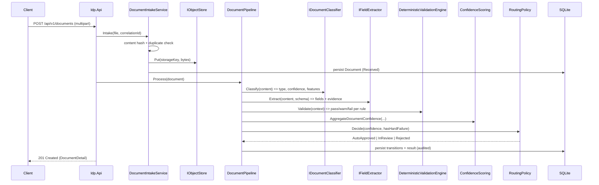

# Architecture

This document complements the README's architecture sections with the detailed component view and
the headline sequence flow.

## Layering and dependency rule

A modular monolith with a strict, compiler-enforced dependency direction:

```
Idp.Domain  ←  Idp.Application  ←  Idp.Infrastructure  ←  Idp.Api
```

- **Domain** references nothing. Pure business rules and invariants.
- **Application** references Domain only. Orchestration plus **ports** (interfaces) that
  infrastructure implements.
- **Infrastructure** references Application (and Domain). Concrete **adapters**: EF Core/SQLite,
  classifier, extractor, object store, ERP client, generator.
- **Api** references Infrastructure. Composition root, HTTP endpoints, auth, observability.

Because dependencies point inward, the domain and application can be unit-tested with no I/O, and any
adapter (SQLite → Postgres, local store → Azure Blob, deterministic classifier → LLM) can be swapped
without touching business logic.

## Components

| Layer | Component | Responsibility |
| --- | --- | --- |
| Domain | `Document` aggregate | State, versioning, fields, line items, validations, transitions |
| Domain | `PipelineStateMachine` | Legal-transition guard for the lifecycle |
| Domain | `ConfidenceScoring` | Weakest-link confidence aggregation |
| Domain | `StringDistance`, `TaxIdFormat` | Jaro-Winkler/Levenshtein, tax-id checksum format |
| Application | `DocumentIntakeService` | Hashing, storage, duplicate detection, intake |
| Application | `DocumentPipeline` | Drives classify → extract → validate → route |
| Application | `DeterministicValidationEngine` + rules | The guardrail layer |
| Application | `RoutingPolicy` | Confidence → auto-approve / review / reject |
| Application | `ReviewService` | Queue, claim/lease, correct, approve/reject |
| Application | `ExportService` | Retries, idempotency, outbox, dead-letter |
| Application | `StpMetricsService` | STP snapshot over the corpus |
| Infrastructure | `RulesDocumentClassifier` | Explainable linear classifier |
| Infrastructure | `DeterministicFieldExtractor` + `SpatialTableDetector` | Spatial extraction |
| Infrastructure | `DocumentGenerator`, `AccuracyEvaluator` | Corpus + measurement |
| Infrastructure | `IdpDbContext` + repositories | Persistence |
| Infrastructure | `LocalFileSystemObjectStore` | Object storage adapter |
| Infrastructure | `SimulatedErpExportClient` + `SimulatedErpLedger` | ERP sink |
| Api | Endpoint modules, `TokenFactory`, `IdpMetrics`, middlewares | HTTP surface |

## Headline flow — intake to routing



## State machine

The lifecycle is `Received → Classified → Extracted → Validated → (AutoApproved | InReview |
Rejected) → Corrected → Exported | Rejected | Failed`. Any stage may transition to `Failed`. Terminal
states (`Exported`, `Rejected`, `Failed`) may be reprocessed, which resets to `Received` at an
incremented version. The full state diagram is in the README (Architecture Diagram) and every legal
edge is enforced by `PipelineStateMachine` and pinned by `StateMachineTests`.

## Why a modular monolith

One deployable unit keeps the project runnable and testable with only the .NET SDK, which the PRIME
DIRECTIVE requires. The strict internal layering preserves most of the benefits of separate services
(clear seams, swappable adapters, isolated domain logic) without the operational cost of a
distributed system. Splitting the pipeline stages or the review subsystem into services is a
documented future option, not a present need.

## Persistence and configuration

EF Core with SQLite by default (`Database:ConnectionString`). All entity Guid primary keys are
configured `ValueGeneratedNever()` so identity is domain-assigned, not database-assigned. Options bind
and validate on start (`Pipeline`, `Validation`, `Review`, `Export`, `Storage`, `Ingestion`,
`Classifier`, `Jwt`, `Database`). See [`database-schema.md`](../database-schema.md).
