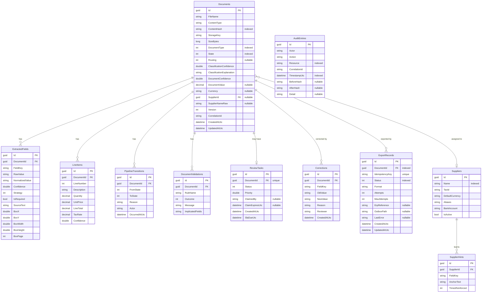

# Database Schema

The platform persists via **EF Core** to **SQLite** by default (`Database:ConnectionString`, default
`Data Source=idp-dev.db`). All entity primary keys are `Guid` and **domain-assigned**
(`ValueGeneratedNever()`), so identity comes from the domain, not the database. Money is stored as
`decimal`. Timestamps are UTC.

## Entity–relationship diagram

## Tables, keys and indexes

| Table | PK | Foreign keys | Indexes |
| --- | --- | --- | --- |
| `Documents` | `Id` | `SupplierId → Suppliers.Id` (nullable) | `ContentHash`, `State`, `DocumentType` |
| `ExtractedFields` | `Id` | `DocumentId → Documents.Id` (cascade) | `(DocumentId, FieldKey)` |
| `LineItems` | `Id` | `DocumentId → Documents.Id` (cascade) | `DocumentId` |
| `PipelineTransitions` | `Id` | `DocumentId → Documents.Id` (cascade) | `DocumentId` |
| `DocumentValidations` | `Id` | `DocumentId → Documents.Id` (cascade) | `DocumentId` |
| `Suppliers` | `Id` | — | `Name` |
| `SupplierHints` | `Id` | `SupplierId → Suppliers.Id` (cascade) | `(SupplierId, FieldKey)` |
| `ReviewTasks` | `Id` | `DocumentId → Documents.Id` | **unique** `DocumentId`, `(Status, Priority)` |
| `Corrections` | `Id` | `DocumentId → Documents.Id` | `DocumentId` |
| `ExportRecords` | `Id` | `DocumentId → Documents.Id` | **unique** `IdempotencyKey`, `DocumentId`, `Status` |
| `AuditEntries` | `Id` | — | `TimestampUtc`, `Resource` |

## Notable design points

- **Owned bounding box.** `ExtractedField.Box` (`WordBox`) is persisted inline as
  `BoxX/BoxY/BoxWidth/BoxHeight/BoxPage` columns on `ExtractedFields`.
- **Aliases / implicated fields** are stored as delimited strings (`Suppliers.Aliases`,
  `DocumentValidations.ImplicatedFields`) rather than child tables — they are small, read-mostly value
  lists.
- **Enum columns** (`DocumentType`, `State`, `Routing`, `Strategy`, `Outcome`, `Status`) are stored as
  integers.
- **Uniqueness guarantees.** One `ReviewTask` per document (`unique DocumentId`) and one ERP booking
  per idempotency key (`unique IdempotencyKey`) — the latter is the database-level backstop for
  idempotent export.
- **Cascade deletes** from `Documents` to its child collections keep a document's data consistent when
  it is removed; `Suppliers → SupplierHints` cascades likewise.
- **Audit** rows are append-only by convention (no update/delete paths in application code) and carry
  before/after hashes for tamper-evidence.

## Migration / creation

For the SQLite default the schema is created from the model on startup (seeded in Development/Testing).
A production Postgres deployment would use EF Core migrations; the model is provider-agnostic (no
SQLite-only column types are used).
