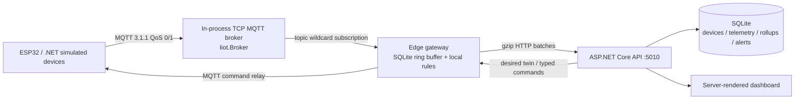
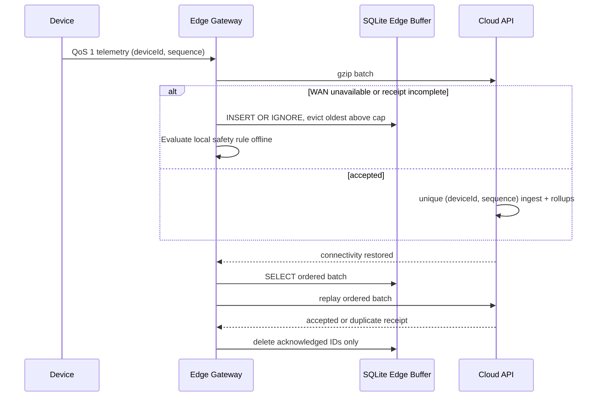
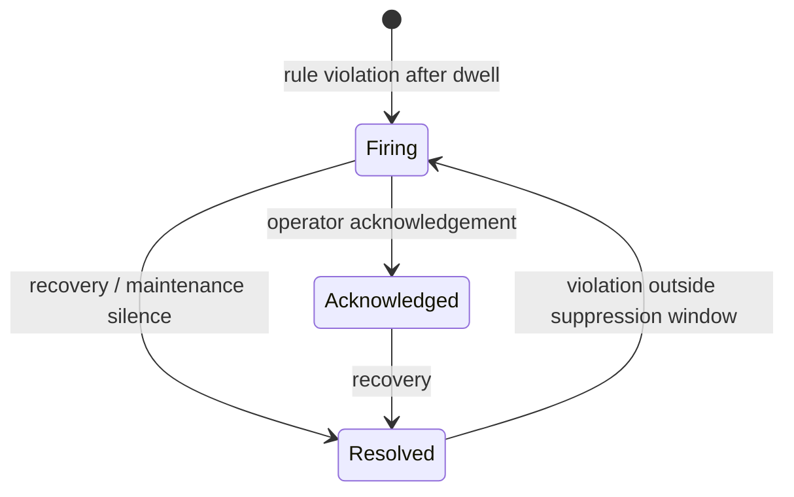

# Industrial IoT Monitoring Platform

## Portfolio Classification
Self-directed engineering case study. This is a production-style reference implementation for **Jua Kali Manufacturing Ltd (fictional)**, not client work or a claim of a production deployment.

## Executive Summary
This .NET 10 modular monolith monitors compressors, motors, chillers, and tanks in two fictional plants. Its defining component is a hand-written MQTT 3.1.1 packet codec, TCP broker, and client paired with a durable edge gateway that keeps collecting, locally evaluates safety rules, and replays ordered telemetry when the cloud link returns.

## Business Problem
Industrial equipment cannot stop reporting merely because WAN connectivity is intermittent. Operations teams need trusted device identities, idempotent time-series ingestion, useful alarms rather than flapping noise, safe remote commands, and firmware rollout visibility. This implementation demonstrates those controls with metric units and KES-compatible business context, using entirely synthetic data.

## Functional Requirements
- Provision devices into a plant / line / asset hierarchy with hashed device keys, simulated certificate thumbprints, enrolment tokens, revocation, and versioned desired/reported twins.
- Encode and decode MQTT 3.1.1 CONNECT, CONNACK, PUBLISH QoS 0/1, PUBACK, SUBSCRIBE, SUBACK, PINGREQ/PINGRESP, and DISCONNECT packets; run them through an in-process TCP broker.
- Simulate physical signals and bearing-wear, overheating, stuck-at, drift, dropout, and spike faults.
- Buffer telemetry durably at the edge during an outage, cap and evict oldest records, then replay batches in order with cloud-side `(deviceId, sequence)` deduplication.
- Persist raw readings, create 1-minute and 1-hour rollups, apply retention, evaluate threshold/rate/missing/composite rules, and manage firing/acknowledged/resolved alerts.
- Detect anomalies with explainable rolling z-score, MAD, EWMA, and seasonal-baseline statistics.
- Queue typed allow-listed commands and desired-firmware updates; simulate OTA application and rollback.

## Non-Functional Requirements
The default runtime has no dependency on Docker, a broker, hardware, or a remote database. SQLite is the default store. All HTTP errors use RFC 7807-style `ProblemDetails`; data-changing API paths use JWT policies or device-key authentication; per-device ingest is rate limited. Correlation IDs, security headers, health checks, OpenAPI, and OpenTelemetry meters are wired into the host.

## Architecture
The code follows ports and adapters: `Domain` owns invariants, `Application` owns use cases and ports, `Infrastructure` owns EF Core / SQLite, and `Api` composes the host. `IMessageTransport` lets an in-memory test transport or the hand-written TCP MQTT adapter be selected without changing devices or gateway logic.

## Architecture Diagram






## Technology Stack
- .NET SDK 10 / `net10.0`, ASP.NET Core minimal APIs, xUnit
- EF Core 10 and SQLite (default)
- Hand-written MQTT 3.1.1 codec / TCP listener / client using `TcpListener` and `TcpClient`
- JWT bearer authentication, built-in ASP.NET Core rate limiting, OpenTelemetry API instrumentation
- GZip, `System.Text.Json`, PBKDF2-SHA256 device-key hashes; no ML library

## Domain Model
`DeviceDescriptor` captures immutable identity and hierarchy while `DeviceCredential` contains only a salted PBKDF2 hash, enrolment-token hash, simulated certificate thumbprint, and revocation state. `DeviceTwin` applies optimistic versioned JSON-like patches separately to desired and reported maps. `TelemetryReading` is typed: °C, mm/s RMS, bar, A, L/min, %, machine state, device timestamp, sequence, and quality. `TelemetryRollup` holds min/max/average/count/standard deviation per tier.

## Core Workflows
1. An administrator provisions a device and receives a one-time simulated device key plus enrolment token; only hashes persist.
2. Devices publish wire-format JSON through `IMessageTransport`. The local MQTT broker supports concrete topic names and `+`/`#` filters, retained messages, QoS 1 PUBACK, and LWT publishing.
3. The edge evaluates safety rules first. If cloud ingestion fails, it appends the reading to its SQLite queue. Its bounded oldest-first eviction prevents disk growth.
4. On reconnect, the gateway submits ordered batches and deletes only entries whose receipt is all accepted or already duplicate. SQLite's unique telemetry key makes replay exactly-once-effective.
5. API ingestion evaluates cloud rules, updates raw and rollup storage, and exposes live status to the dashboard. Commands and OTA requests are represented by audited, typed state transitions.

## Security Model
Device keys are salted PBKDF2-SHA256 values, never stored in plaintext. Device-key headers are checked against the claimed device ID and revocation state before ingestion. JWT scope policies protect operator and administrator paths. Remote command types and parameters are allow-listed by device type; no arbitrary payload execution exists. The host applies correlation IDs, rate limits, RFC 7807 errors, and restrictive browser security headers. See [security review](docs/security/security-review.md).

## Reliability & Failure Handling
The edge queue uses a durable SQLite table keyed by device and sequence, ordered autoincrement IDs, and a configurable capacity. A failed HTTP call changes the gateway to offline mode without losing the current telemetry record. Replay is serial, ordered, batched at 100, and treats accepted plus cloud deduplication as an acknowledgement. Local safety rules continue during outages. TCP broker disconnects publish an MQTT last-will when DISCONNECT was not received.

## Observability
Every response returns `X-Correlation-Id`; it is also added to a log scope. `/health/live` and `/health/ready` verify host availability. OpenTelemetry ASP.NET Core tracing and meters publish ingest counts, gateway buffer depth, alert events, and command latency. The demo dashboard surfaces buffer depth and active alerts.

## Testing Strategy
The test suite is intentionally broad: MQTT codec boundary and malformed-packet cases; wildcard matching; real loopback TCP broker flows; registry authentication / revocation; durable edge outage/replay/cap flows; rollups, retention with `FakeClock`, rule flapping resistance, anomalies, commands, twins, OTA, and SQLite-backed API integration paths. Integration tests hold an in-memory SQLite connection open for fixture lifetime. Results are recorded in [docs/test-results.md](docs/test-results.md).

## Local Development
```powershell
Set-Location C:\Users\rukwaropaul\Downloads\DEV\Projects\10-industrial-iot-monitoring
dotnet build -c Release
dotnet test -c Release
dotnet run --project src\Iiot.Api --launch-profile Iiot.Api
```
Open `http://localhost:5010/`. Development hosting starts the embedded MQTT TCP broker on port `18830`, seeds fictional devices idempotently, and runs a simulated edge / device demo. The API itself listens on port `5010`.

## Running with Docker
Docker configuration created but Docker is unavailable on the build host; the compose stack has not been started or verified. The files are supplied as a deployment starting point only.

## API Documentation
OpenAPI JSON is available at `GET /openapi/v1.json`; a dependency-free interactive OpenAPI explorer is available at `/docs` in Development. Key route groups are:

| Group | Main endpoints |
|---|---|
| `/api/v1/devices` | registry, enrolment, credential revocation, desired/reported twins |
| `/api/v1/telemetry` | device-key batch ingest, raw ranges, minute/hour rollups |
| `/api/v1/rules`, `/api/v1/alerts` | rule configuration, active alerts, acknowledgement |
| `/api/v1/commands` | queue, query, status transition, audit trail |
| `/api/v1/firmware` | desired twin firmware update |
| `/api/v1/demo/network` | dashboard demo's cloud-link toggle |

`POST /api/v1/auth/token` is a Development/Testing-only helper for this reference implementation. It is deliberately unavailable in Production.

## Example Usage
```powershell
# Development-only operator token
$token = (Invoke-RestMethod http://localhost:5010/api/v1/auth/token -Method Post `
  -ContentType application/json -Body '{"subject":"demo-admin","scope":"admin operator"}').accessToken
$headers = @{ Authorization = "Bearer $token" }

# Provision: the returned deviceKey is displayed once; only its hash is stored.
$device = Invoke-RestMethod http://localhost:5010/api/v1/devices -Method Post -Headers $headers `
  -ContentType application/json -Body '{
    "deviceId":"cmp-demo-01","deviceType":"compressor","plant":"plant-a","line":"line-1",
    "asset":"air-compressor-01","firmwareVersion":"1.0.0",
    "deviceKey":"demo-device-key-0001","enrollmentToken":"enrol-demo-01"
  }'

$ingestHeaders = @{ "X-Device-Id"="cmp-demo-01"; "X-Device-Key"="demo-device-key-0001" }
Invoke-RestMethod http://localhost:5010/api/v1/telemetry -Method Post -Headers $ingestHeaders `
  -ContentType application/json -Body '[{
    "deviceId":"cmp-demo-01","sequence":1,"deviceTimestamp":"2026-09-01T10:00:00Z",
    "values":{"temperatureC":62.4,"vibrationMmPerSecondRms":2.3,"pressureBar":7.4,
      "currentA":26.1,"flowLitresPerMinute":185.0,"tankLevelPercent":64.0,"machineState":"Running"},
    "quality":"Good"
  }]'
# Response: {"accepted":1,"duplicates":0,"rejected":0}

Invoke-RestMethod "http://localhost:5010/api/v1/telemetry/cmp-demo-01/rollups?metric=TemperatureC&resolution=minute" -Headers $headers
```

## Performance / Load Testing
No load or throughput benchmark is claimed. The focused reliability measurements are deterministic functional runs, not capacity measurements: see [anomaly evaluation](docs/anomaly-evaluation.md) and [edge buffering test](docs/edge-buffering-test.md). A real deployment would benchmark SQLite write contention, compression size, and network latency with representative hardware and broker settings.

## Trade-offs
SQLite makes the full demo portable but is not a clustered time-series store. The broker intentionally supports MQTT 3.1.1 control flow required here, not QoS 2, persistent in-flight QoS replay, TLS, or full MQTT 5. The edge queue favors deterministic oldest-first eviction over domain-specific priority. Statistical anomaly detectors explain every result but are less adaptive than a validated model.

## Architecture Decisions
Five concise ADRs cover the MQTT implementation, edge storage, relational rollups, explainable anomaly methods, and device identity model in [docs/decisions](docs/decisions/).

## Known Limitations
- MQTT transport is a deliberately scoped 3.1.1 implementation: CONNECT/CONNACK, QoS 0/1 PUBLISH/PUBACK, SUBSCRIBE/SUBACK, ping, disconnect, retained messages, LWT, and wildcards are implemented; QoS 2, TLS, shared subscriptions, persistent in-flight retransmission, and MQTT 5 are not.
- The API hosts a fictional simulator rather than connecting to hardware. The ESP32 example is uncompiled and unflashed.
- Production OIDC/JWKS, secret storage, HSM-backed firmware signing, broker ACL persistence, multi-node coordination, and long-term object storage are integration work, not claimed.

## Future Improvements
Add a Mosquitto/Azure IoT Hub adapter behind `IMessageTransport`, mutual TLS and per-topic broker ACLs, a firmware artifact verifier with signed manifests, outbox-based alert publication, tiered raw-data archival, a Grafana/OTel collector deployment, and statistically validated per-asset seasonal baselines.

## Portfolio Talking Points
The most important design discussion is recovery: cloud ingestion is intentionally at-least-once, while the unique `(deviceId, sequence)` key makes it exactly-once-effective. The edge keeps safety decisions local, exposes bounded failure behavior, and does not erase queued records until the cloud receipt proves it can. The protocol layer is small enough to interrogate packet-by-packet and tested at MQTT variable-length boundaries.

## Upwork Portfolio Description
**Industrial IoT Monitoring Platform — self-directed engineering case study**

Problem: intermittent industrial connectivity can turn telemetry loss and unsafe delayed alerts into operational risk. Built: a .NET 10 monitoring reference implementation with a hand-written MQTT 3.1.1 TCP broker/client, durable SQLite edge store-and-forward, idempotent cloud ingestion, explainable anomaly detection, and typed command / OTA state machines. Engineering focus: offline recovery, message idempotency, device identity, rule flapping resistance, and observable failure handling. Verification: local build and tests run without Docker, broker infrastructure, or hardware. This is a self-directed portfolio project, not client work.
