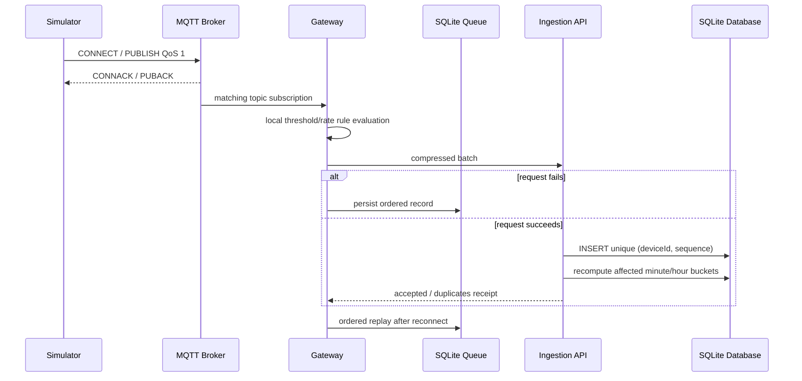

# Architecture — Industrial IoT Monitoring Platform

## Intent
This self-directed engineering case study is a modular monolith with intentionally explicit reliability boundaries. It runs locally using SQLite and an embedded TCP MQTT implementation; no remote services are needed for build or test.

## Modules

| Module | Responsibility | Depends on |
|---|---|---|
| `Iiot.Domain` | telemetry, twin, alert, command invariants | nothing |
| `Iiot.Application` | ports, ingestion, rollups, rules, anomaly and command orchestration | Domain |
| `Iiot.Infrastructure` | EF Core SQLite repository and PBKDF2 credential adapter | Application, Domain |
| `Iiot.Protocol` | binary MQTT 3.1.1 frame codec and neutral transport contract | BCL |
| `Iiot.Broker` | TCP broker, sessions, subscriptions, retained records, LWT, client adapter | Protocol |
| `Iiot.Device` | deterministic physics simulator and OTA behavior | Protocol, Application, Domain |
| `Iiot.EdgeGateway` | SQLite queue, batching, gzip HTTP adapter, local rules, relay | Protocol, Application, Domain |
| `Iiot.Api` | minimal HTTP API, auth, dashboard, composition and demo host | all adapters |

## Boundaries and failure model
The gateway receives telemetry locally before cloud delivery. Its local SQLite queue is a durability boundary; it uses `device_id + sequence` uniqueness to avoid local duplicate growth, while the cloud raw table uses the same logical key to make retry replay exactly-once-effective. It deletes records only after the cloud receipt says every record was accepted or was already a duplicate.

## State ownership
- Device registry, twins, rules, alerts, commands, raw data, and rollups belong to the cloud database.
- The edge owns only its bounded queue and local transient rule state.
- MQTT sessions/subscriptions/retained messages are process-memory state by design; broker persistence is a documented future production adapter concern.

## Scaling path
The current design favors a local independently runnable reference implementation. A production evolution would use a managed broker or Mosquitto cluster behind `IMessageTransport`, a clustered relational/time-series store, object storage for raw archival and OTA artifacts, a transactional outbox for alert/command distribution, and a separate identity authority. Those are prospective changes, not deployed claims.
