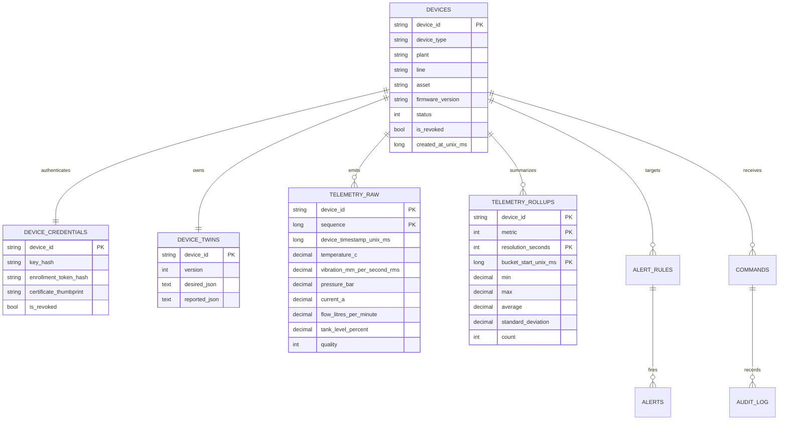

# Database Schema — Industrial IoT Monitoring Platform

## Storage approach
The default adapter is EF Core 10 over SQLite. Timestamp properties are persisted as Unix milliseconds so SQLite range and ordering predicates are translatable and indexed. All values are synthetic when the development seed is enabled.

## Tables, keys, and indexes

| Table | Key | Important indexes | Purpose |
|---|---|---|---|
| `devices` | `device_id` | `(plant,line,asset)`, `status` | Registry hierarchy and status |
| `device_credentials` | `device_id` | primary key lookup | PBKDF2 key/token hash, thumbprint, revocation |
| `device_twins` | `device_id` | primary key lookup | optimistic `version`, desired/reported JSON maps |
| `telemetry_raw` | `(device_id,sequence)` | `(device_id,device_timestamp)`, `device_timestamp` | idempotent typed raw readings |
| `telemetry_rollups` | `(device_id,metric,resolution_seconds,bucket_start)` | `(device_id,resolution_seconds,bucket_start)` | minute/hour aggregates |
| `alert_rules` | `rule_id` | `device_id` | threshold, rate, heartbeat, composite settings |
| `alerts` | `alert_id` | `(device_id,rule_id,state)` | deduplicated lifecycle records |
| `commands` | `command_id` | `(device_id,status)`, `timeout_at` | typed request/response status |
| `audit_log` | `id` | `(command_id,at)` | append-only application audit entries |

## Invariants
- `telemetry_raw(device_id, sequence)` is the cloud idempotency key and is the basis for exactly-once-effective gateway replay.
- Edge `edge_queue(device_id, sequence)` has an analogous unique key but is intentionally local and bounded.
- Twin writers supply the current `version`; desired and reported patch operations increment it atomically at the application level.
- Command types and parameter shapes are validated before persistence. Audit entries are inserted, not edited, by application workflows.

## Retention and tiering
Raw data is the detailed tier and is pruned by a clock-driven retention operation. The application calculates 1-minute and 1-hour materialized aggregate tiers with min/max/avg/count/population standard deviation. This reference implementation recomputes affected buckets on ingest; a production high-ingest deployment would move that work to a transactional outbox worker or database job.
