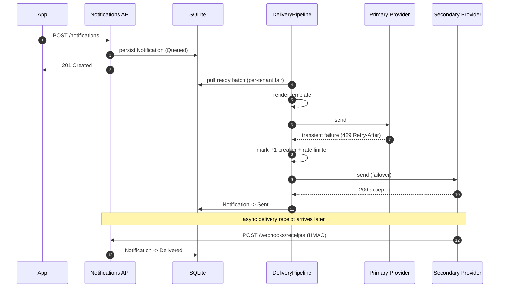

# High-Scale Notification Delivery Platform

## Portfolio Classification

Self-directed engineering case study. No client, no real users, no production
traffic. Built to demonstrate the domain reasoning, reliability engineering,
and operational discipline required to run a multi-channel notification
platform under adversarial provider behaviour.

## Executive Summary

A multi-tenant notification service that accepts application events and
delivers them to recipients over Email, SMS, Push, and Webhook channels while
respecting recipient preferences, quiet hours, quotas, suppressions and
compliance rules. Delivery is decoupled from ingestion by an EF-backed outbox
queue with per-tenant fair scheduling, provider failover, circuit breaking,
retry with jittered exponential backoff, and a dead-letter queue with replay.
A signed webhook endpoint accepts asynchronous delivery receipts and updates
the notification lifecycle.

The system runs entirely on the local host — .NET 10, EF Core, SQLite — with
no external brokers or databases. Provider outages, throttling, latency and
signed receipts are simulated deterministically so behaviour under failure can
be tested at unit and integration level.

## Business Problem

Every SaaS eventually has to send transactional and marketing messages to
users. When that turns into "we're paying two SMS providers", "we forgot to
respect quiet hours", "our marketing burst starved our OTP traffic", or "the
provider silently rate-limited us and we didn't notice", teams end up
rebuilding this platform for the third time. This project is the reference
implementation:

- Send once, target the right channel with the right provider, in the right
  locale, at the right local time for the recipient.
- Never send to a suppressed address, never violate opt-out, never bill a
  tenant past its hard quota.
- When a provider misbehaves, fail over, back off, break the circuit, and
  finally dead-letter — never lose the message, never retry forever.

Fictional tenants: **Contoso Retail** and **Savanna Logistics Ltd
(fictional)**. Fictional recipients only. Currencies KES and USD.

## Functional Requirements

- Channels behind a single abstraction (`INotificationChannel`) with at least
  two provider simulators per channel implementing `IChannelProvider`:
  - Email — `SmtpSimulator`, `SendGridSimulator`
  - SMS — `TwilioSimulator`, `AfricasTalkingSimulator`
  - Push — `FirebaseSimulator`, `ApnsSimulator`
  - Webhook — `HttpWebhookSimulator`, `AlternativeWebhookSimulator`
- Versioned templates per `(channel, templateKey, locale)` with a safe
  rendering engine: token substitution (`{{user.firstName}}`), conditionals,
  loops, HTML escaping by default, explicit raw marker, strict mode that
  rejects unknown tokens.
- Locale resolution with fallback chain (`sw-KE → sw → en`) and per-tenant
  default locale. Number, date, and currency formatting via `CultureInfo`.
- Send API: single and bulk (batch cap enforced), idempotency keys with
  replayable outcomes, deduplication window `(tenant, recipient, template,
  dedupKey)`, scheduling (`sendAt`), timezone-aware quiet hours with deferral
  to the next allowed window, and priority lanes — `Transactional` bypasses
  quiet hours and can bypass rate limits.
- Delivery pipeline: durable EF-backed outbox with in-process channel workers
  and per-tenant fair scheduling so a noisy tenant cannot starve others.
- Retry & failover: exponential backoff with jitter, capped attempts, retry
  only on transient classifications, primary → secondary provider failover
  with per-provider circuit breaker (closed / open / half-open) and automatic
  recovery, plus a dead-letter queue with replay endpoint.
- Rate limits & quotas: per-provider global rate limit, per-tenant monthly
  quota (soft warn + hard block), per-recipient marketing frequency cap.
- Preferences & compliance: per-recipient channel/category preferences,
  opt-in / opt-out, signed one-click unsubscribe tokens, suppression list
  (bounces, complaints, unsubscribes) enforced before send, consent audit
  trail.
- Delivery receipts & status lifecycle: `Queued → Scheduled → Rendering →
  Dispatched → Sent → Delivered | Bounced | Failed | Suppressed |
  DeadLettered`. Receipt webhook with HMAC signature + replay protection.
- Observability: OpenTelemetry spans per pipeline stage, metrics, health
  checks, structured logs with message and correlation ids.

## Non-Functional Requirements

- Determinism: providers, RNG, clocks, and IDs are all injectable so tests
  are reproducible.
- Isolation: multi-tenant; every entity carries `TenantId` and every query
  and index is scoped by it.
- No external infrastructure: SQLite is the default database and the outbox
  queue lives inside it. The system must build and test green with only the
  .NET SDK installed.
- Small blast radius: provider failure isolated by circuit breaker; tenant
  overload isolated by fairness scheduler; quota exhaustion isolated by
  per-tenant hard limits.
- Safe defaults: HTML escaped by default, strict template mode, tokens
  signed, keys refused if they start with `dev-only-` in Production.
- Observability by construction: correlation ids on every log and every
  span, metrics named by the domain, not by the code path.

## Architecture

Modular monolith organised as four projects along Clean-Architecture lines:

- `NotificationPlatform.Domain` — entities, value objects, invariants,
  state machine for the notification lifecycle, no external dependencies.
- `NotificationPlatform.Application` — abstractions
  (`INotificationService`, `IChannelProvider`, `ITemplateEngine`,
  `IReceiptIngestor`, ...), options types, DTOs.
- `NotificationPlatform.Infrastructure` — EF Core `AppDbContext`, provider
  simulators, delivery pipeline, template engine, quiet hours calculator,
  fairness scheduler, HMAC signing, ID generator, seed data.
- `NotificationPlatform.Api` — minimal-API endpoints, JWT + authorization
  policies, hosted worker that drives the pipeline in the background, ops
  dashboard.

The delivery pipeline is the heart of the system. The Send API only enqueues
a notification; a hosted worker inside the Api process pulls a batch of ready
notifications, renders their templates, iterates the configured providers for
the target channel (checking each provider's circuit state and rate limiter),
records the outcome, and either marks the notification `Sent`, retries with
backoff, or dead-letters after the attempt cap. Signed delivery receipts flow
back through `/api/v1/webhooks/receipts` and transition the notification into
its terminal state (`Delivered`, `Bounced`, `Failed`).

## Architecture Diagram

```mermaid
flowchart LR
    subgraph Client
        A[Application / Ops user]
    end
    A -->|POST /api/v1/notifications| API[Notifications API]
    API -->|enqueue| DB[(SQLite AppDb)]
    DB <-->|dequeue batches| PIPE[Delivery Pipeline]
    PIPE -->|render + failover| PROV[Provider Simulators]
    PROV -.->|delivery receipt| REC[/POST /api/v1/webhooks/receipts/]
    REC --> DB
    API -->|reads| DB
    ADMIN[Ops Dashboard /ops] --> API
    OTEL[(OTLP + Console)] <-. spans + metrics .- PIPE
```

Sequence — Send with failover:



Delivery status state machine — see `docs/architecture/architecture.md`.

## Technology Stack

| Layer | Choice | Notes |
|---|---|---|
| Runtime | .NET 10 (SDK 10.0.400) | Target `net10.0`. |
| Web | ASP.NET Core Minimal APIs | Small surface, endpoint routing. |
| Persistence | EF Core 10 + SQLite | Provider stored on disk (`notifications.db`) or in-memory for tests. |
| Auth | JWT bearer + policies | Dev-only signing key refused in Production. |
| Observability | OpenTelemetry (traces + metrics), structured `ILogger` | OTLP exporter optional, Console exporters in dev only. |
| Testing | xUnit v3, WebApplicationFactory, in-memory SQLite | Deterministic FakeClock, seeded RNG, provider fakes. |
| Docs | Markdown + Mermaid diagrams | Static, review-friendly. |

## Domain Model

Aggregates and key entities:

- `Tenant` — has default locale, monthly quotas, active flag.
- `Recipient` — external id, per-channel addresses, locale, timezone,
  optional quiet-hours window, channel preferences (`RecipientPreference`),
  and frequency counters (`RecipientFrequencyCounter`).
- `Template` — versioned by `(Channel, TemplateKey, Locale, Version)`, holds
  compiled source and rendering flags.
- `Notification` — the durable message the pipeline works on; carries
  `Status`, `Attempts`, `NextAttemptAt`, `Priority`, `Category`, correlation
  ids, and the rendered content once produced.
- `DeliveryAttempt` — one row per provider attempt with outcome, latency,
  provider message id, and error class.
- `DeliveryReceipt` — the terminal event: delivered / bounced / complained,
  keyed by nonce to reject replays.
- `SuppressionEntry`, `UnsubscribeToken`, `IdempotencyRecord`,
  `ProviderHealth`, `TenantUsageCounter`.

Invariants live inside the aggregates — for example `Notification` refuses
`MarkSent` from `DeadLettered`, and `ProviderHealth` transitions honour the
closed → open → half-open → closed cycle.

## Core Workflows

- **Send single / bulk** — validate → idempotency → preferences → suppression
  → dedup → frequency cap → quota → quiet-hours → persist as `Queued`.
- **Deliver** — pipeline picks the batch, renders the template, iterates the
  provider list for the channel, respecting circuit state and rate limits,
  and records a `DeliveryAttempt` per try. Success → `Sent`; retryable failure
  → schedule next attempt with backoff; exhausted attempts → `DeadLettered`.
- **Receipt ingest** — POST `/api/v1/webhooks/receipts` verifies HMAC and
  timestamp, rejects replays by nonce, and moves the notification to its
  terminal state, adding to the suppression list on hard bounce or complaint.
- **Unsubscribe** — signed token issued from `/api/v1/unsubscribe/issue`, one
  click endpoint at `/api/v1/unsubscribe/{token}` toggles the preference and
  records a suppression entry.
- **DLQ** — `/api/v1/admin/dlq` lists and replays dead-lettered
  notifications; each replayed notification returns to `Queued` with attempts
  reset.

## Security Model

- **AuthN**: JWT bearer tokens issued by `/api/v1/auth/token`; production
  guard refuses to boot if the signing key starts with `dev-only-`.
- **AuthZ**: scope-based policies —
  `notifications:send`, `templates:manage`, `preferences:manage`,
  `suppressions:manage`, `receipts:ingest`, `dlq:manage`, `analytics:view`.
  Tenant isolation is enforced from the `tid` claim on every write path.
- **Template safety**: rendering escapes HTML by default; the `{{ raw:x }}`
  marker requires an opt-in flag on the template; strict mode rejects
  unknown tokens instead of substituting empty strings.
- **Unsubscribe tokens**: HMAC-signed payloads with expiry, single-use nonce,
  and tamper detection; the security review documents the choice.
- **Webhook signatures**: `hex(hmac_sha256(key, timestamp + "." + body))` +
  `X-Timestamp` skew tolerance + `X-Nonce` replay guard; verified with
  `CryptographicOperations.FixedTimeEquals`.
- **PII in logs**: message ids and correlation ids only. Payloads are stored
  as opaque JSON blobs — never rendered into logs.
- **SSRF**: webhook channel is provider-simulated; the real provider would
  require an allowlist. Documented as a known limitation.

See `docs/security/security-review.md` for the full STRIDE analysis.

## Reliability & Failure Handling

- **Retries**: exponential backoff with jitter
  (`ExponentialBackoffPolicy(baseMs, maxMs, seed)`) capped at
  `DefaultMaxAttempts`. Only transient classifications retry.
- **Failover**: per-channel provider list; each attempt runs a fresh
  provider until one accepts or all are exhausted this cycle. When all
  providers are blocked by the circuit breaker or rate limiter, the
  notification is scheduled for retry instead of failed.
- **Circuit breaker**: `Closed → Open → HalfOpen → Closed` per provider,
  tripped by consecutive failures. Half-open probes recover automatically.
- **Rate limiting**: token-bucket per provider name; tenants are throttled
  by fair scheduling not by rate limiters so priority messages still ship.
- **Dead-letter queue**: notifications that exhaust attempts move to
  `DeadLettered`. `/api/v1/admin/dlq/replay` returns them to `Queued`.
- **Idempotency**: request key uniquely identifies a send; replays return
  the original outcome verbatim (`Kind = IdempotentReplay`).
- **Fairness**: `TenantFairnessScheduler.PickBatch` uses a weighted round
  robin so a tenant with 10k queued messages cannot starve a tenant with 5.

## Observability

- **Tracing**: OpenTelemetry spans on `NotificationPlatform` activity source
  — `send.queue`, `pipeline.dispatch`, `pipeline.render`,
  `provider.attempt`, `receipt.ingest`.
- **Metrics**: counters and histograms for `notifications_queued_total`,
  `notifications_sent_total`, `notifications_failed_total`,
  `notifications_suppressed_total`, `dlq_depth`, `render_duration_ms`.
- **Health checks**: `/health/live` (process), `/health/ready` (DB + writer
  connectivity via `AddDbContextCheck`).
- **Logs**: structured Serilog-compatible `ILogger` output with
  `messageId`, `tenantId`, `correlationId`, `provider`, `attempt`.
- **Ops dashboard**: `/ops` — static HTML/JS that pulls
  `/api/v1/analytics/summary` and shows queue depth, DLQ depth, per-provider
  health, and the last 20 notifications.

## Testing Strategy

- Determinism: `FakeClock`, seeded providers, seeded RNG, isolated in-memory
  SQLite per test factory.
- Layered: pure-domain unit tests, application unit tests around the
  services, and integration tests through the ASP.NET Core stack via
  `WebApplicationFactory` with real EF Core.
- Coverage of the difficult properties, not just the endpoints: fairness
  under load, retry sequence, backoff bounds, circuit-breaker transitions,
  strict-mode template rendering, HMAC replay guard, quota + quota edge, and
  quiet-hours across timezones.
- 41 unit + 28 integration = 69 tests. Real counts in
  `docs/test-results.md`.

## Local Development

Prerequisites: .NET SDK 10.0.400. No Docker, Postgres, Redis, or Python.

```powershell
cd C:\Users\rukwaropaul\Downloads\DEV\Projects\11-notification-delivery-platform
dotnet restore
dotnet build -c Release
dotnet test  -c Release
dotnet run   --project src\NotificationPlatform.Api -c Release
```

The API listens on `http://localhost:5011`. Swagger UI is at
`http://localhost:5011/swagger`, and the ops dashboard at
`http://localhost:5011/ops`.

## Running with Docker

Docker configuration has been created (`Dockerfile`, `docker-compose.yml`)
but Docker is unavailable on the build host; the compose stack has not been
started or verified. Both files are labelled `UNVERIFIED` at the top.

## API Documentation

OpenAPI is served at `/swagger` in Development. The v1 surface:

| Method | Path | Purpose |
|---|---|---|
| POST | `/api/v1/auth/token` | Issue a dev JWT for a tenant. |
| POST | `/api/v1/notifications` | Enqueue a single notification. |
| POST | `/api/v1/notifications/bulk` | Enqueue a bounded batch. |
| GET  | `/api/v1/notifications/{id}` | Fetch a notification. |
| GET  | `/api/v1/notifications` | List paginated notifications. |
| POST | `/api/v1/templates` | Create / update a template version. |
| POST | `/api/v1/templates/preview` | Render a template with a payload. |
| GET  | `/api/v1/preferences/{recipient}` | Read recipient preferences. |
| PUT  | `/api/v1/preferences/{recipient}` | Update preferences. |
| GET  | `/api/v1/suppressions` | List suppressions. |
| POST | `/api/v1/suppressions` | Add a suppression. |
| POST | `/api/v1/unsubscribe/issue` | Issue a signed token. |
| GET  | `/api/v1/unsubscribe/{token}` | One-click unsubscribe. |
| POST | `/api/v1/webhooks/receipts` | Ingest a signed delivery receipt. |
| GET  | `/api/v1/admin/dlq` | List dead-lettered notifications. |
| POST | `/api/v1/admin/dlq/replay` | Return DLQ items to the queue. |
| GET  | `/api/v1/analytics/summary` | Delivery / bounce / DLQ counters. |
| GET  | `/health/live` | Liveness. |
| GET  | `/health/ready` | Readiness. |

## Example Usage

```powershell
# 1) Issue a dev token
$body = @{ tenantId = "11111111-1111-1111-1111-111111111111" } | ConvertTo-Json
$token = (Invoke-RestMethod -Method Post -Uri http://localhost:5011/api/v1/auth/token `
    -ContentType 'application/json' -Body $body).access_token

# 2) Send a transactional email
$headers = @{ Authorization = "Bearer $token" }
$payload = @{
  templateKey = "order.confirmation"
  channel     = "Email"
  recipientExternalId = "cust-001"
  payload = @{
    user  = @{ firstName = "Alice" }
    order = @{ id = "SO-1042"; item = "Coffee Beans 1kg"; total = "KES 2,500" }
  }
  priority = "Transactional"
  category = "Transactional"
} | ConvertTo-Json -Depth 5

Invoke-RestMethod -Method Post -Uri http://localhost:5011/api/v1/notifications `
    -Headers $headers -ContentType 'application/json' -Body $payload
```

Expected response (elided):

```json
{
  "kind": "Accepted",
  "notificationId": "...",
  "status": "Queued"
}
```

## Performance / Load Testing

See `docs/throughput-test.md` for the local script and the real measured
numbers. No claim is made about production throughput.

## Trade-offs

- **EF-backed outbox instead of a broker**: keeps the host clean (no Redis,
  no RabbitMQ) but caps throughput at SQLite's write rate. ADR-001.
- **In-process worker**: fewer moving parts and easier tests; a real
  production deployment would separate the worker from the API host. ADR-001.
- **Own template engine**: exact escape semantics and strict mode without a
  dependency; costs us the wider Liquid/Handlebars ecosystem. ADR-004.
- **Circuit breaker per provider + fairness per tenant**: two blast-radius
  boundaries so a hot tenant does not starve a cold one and a bad provider
  does not sink everyone. ADR-002, ADR-003.

## Architecture Decisions

- ADR-001 — DB-backed outbox queue vs broker.
- ADR-002 — Provider failover and circuit breaking.
- ADR-003 — Fairness scheduling per tenant.
- ADR-004 — Template engine: own vs library, and the escaping decision.
- ADR-005 — Unsubscribe token design.

All in `docs/decisions/`.

## Known Limitations

- SQLite ceiling: writes serialize; throughput measured locally in
  `docs/throughput-test.md`.
- Providers are simulated; there is no real SMTP / SMS / Push connection.
- The ops dashboard is deliberately minimal (no charts, no auth beyond
  same-origin) — this is a case study, not a product.
- Webhook channel would need an outbound URL allowlist in production to
  prevent SSRF; called out in the security review.

## Future Improvements

- Move the outbox to Postgres and the worker into a separate host.
- Replace the token-bucket rate limiter with a distributed one (Redis).
- Add a real template gallery and an editor UI.
- Add delivery-time A/B testing and per-provider quality scoring.
- Add data-retention policies for `Notification.PayloadJson` (currently
  kept indefinitely).

## Portfolio Talking Points

See `docs/portfolio/interview-talking-points.md`. Highlights:

- Why an outbox in SQLite is a legitimate design for a case study — and
  where it stops being a legitimate design in production.
- How the fairness scheduler is tested (property test at pipeline layer,
  not just at unit level).
- The escape-by-default template engine and the `raw:` marker — the
  smallest possible surface where XSS can be introduced.
- Signed unsubscribe tokens as a lifecycle primitive, not a checkbox.

## Upwork Portfolio Description

See `docs/portfolio/upwork-description.md` for the copy-ready blurb.
