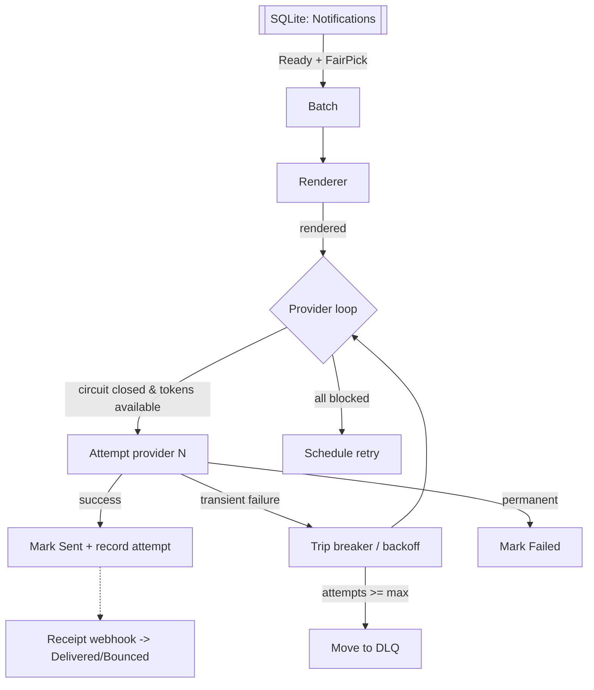
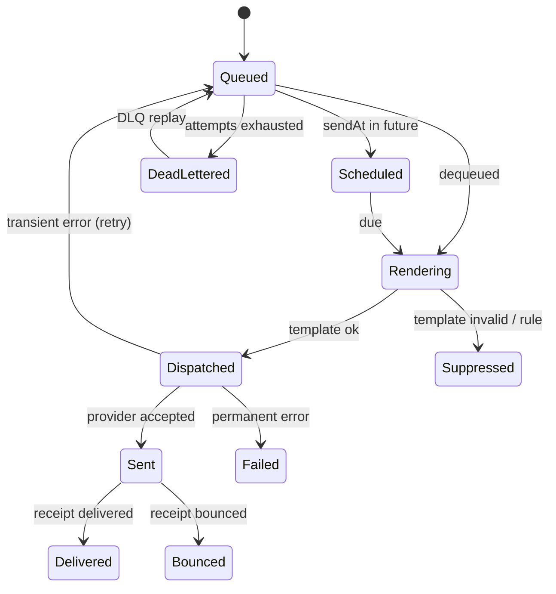

# Architecture

## Layers

```
NotificationPlatform.Domain          <- entities, invariants, state machines
NotificationPlatform.Application     <- abstractions, DTOs, options
NotificationPlatform.Infrastructure  <- EF Core, providers, engine, security
NotificationPlatform.Api             <- HTTP + auth + hosted worker + ops UI
tests/*                              <- unit + integration
```

Dependency direction: Api → Infrastructure → Application → Domain. Domain
has zero external references (nothing outside `System.*`).

## The delivery pipeline



The pipeline is deterministic under a seeded RNG so retry backoffs, provider
selection, and simulator behaviour reproduce across test runs.

## Notification lifecycle



## Fair scheduling

`TenantFairnessScheduler` picks a batch across all tenants using weighted
round-robin. Weights come from tenant tier and outstanding queue depth; the
implementation is small enough to test the fairness property directly at unit
level — see `FairnessSchedulerTests`.

## Provider failover + circuit breaking

Each provider has a `ProviderHealth` row with state, consecutive failures,
and a `NextAttemptAt`. The pipeline consults it before attempting the
provider. On success the state closes; on repeated failure it opens; a probe
in half-open reruns one attempt and either closes or reopens the breaker. All
transitions live inside the domain `ProviderHealth` aggregate and are unit
tested in `DomainInvariantTests`.

## Idempotency + dedup

- `IdempotencyRecord` uniquely keyed by `(TenantId, Key)`; stores the response
  JSON so replays return byte-for-byte the original outcome.
- Dedup window compares `(TenantId, RecipientId, TemplateKey, DedupKey)`
  within `DedupWindowMinutes`.

## Suppressions & unsubscribes

Suppression list is checked before every send. Unsubscribe tokens are HMAC
signed with an expiry; consuming one flips the preference and adds an
`Unsubscribe` suppression entry so subsequent sends are refused even if the
preference is later re-enabled.
