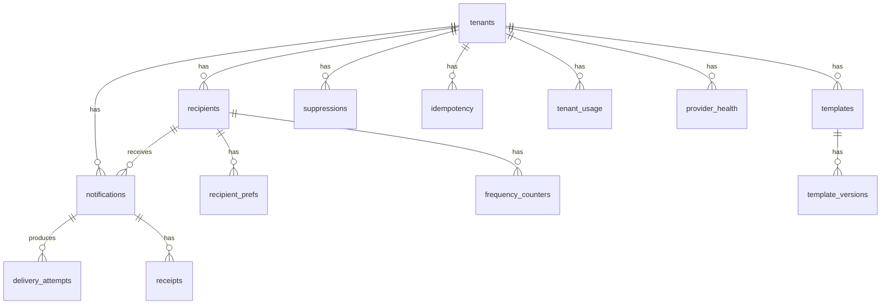

# Database schema

## Entity relationships

## Tables

### tenants

| Column | Type | Notes |
|---|---|---|
| Id | GUID PK |  |
| Name | TEXT(200) |  |
| Slug | TEXT(100) UNIQUE | index `ix_tenants_slug` (unique) |
| DefaultLocale | TEXT(20) |  |
| MonthlyQuotaSoft | INT |  |
| MonthlyQuotaHard | INT |  |
| IsActive | INT (bool) |  |

### recipients

| Column | Type | Notes |
|---|---|---|
| Id | GUID PK |  |
| TenantId | GUID FK |  |
| ExternalId | TEXT(100) | (`TenantId`, `ExternalId`) unique |
| EmailAddress | TEXT nullable |  |
| PhoneE164 | TEXT nullable |  |
| PushToken | TEXT nullable |  |
| WebhookUrl | TEXT nullable |  |
| Locale | TEXT(20) nullable |  |
| TimeZoneId | TEXT(64) nullable |  |
| QuietHoursStart | INT (long-ticks) nullable |  |
| QuietHoursEnd | INT (long-ticks) nullable |  |
| Channels | INT | bit flags |
| CreatedAt | INT (long-ticks) |  |

Indexes: `ix_recipients_tenant_external` on (TenantId, ExternalId) unique.

### templates + template_versions

Composite key `(TenantId, Channel, TemplateKey, Locale, Version)` on
`template_versions`. Latest version is picked by the render pipeline.

### notifications

| Column | Type | Notes |
|---|---|---|
| Id | GUID PK |  |
| TenantId | GUID FK | index `ix_notif_tenant_status_next` on (TenantId, Status, NextAttemptAt) for the pipeline dequeue query |
| RecipientId | GUID FK |  |
| TemplateKey | TEXT(120) |  |
| Channel | INT | enum |
| Category | INT | enum |
| Priority | INT | enum |
| Locale | TEXT(20) |  |
| PayloadJson | TEXT |  |
| RenderedSubject | TEXT nullable |  |
| RenderedBody | TEXT nullable |  |
| Address | TEXT nullable | resolved recipient address at queue time |
| Status | INT | enum |
| Attempts | INT |  |
| MaxAttempts | INT |  |
| NextAttemptAt | INT (long-ticks) nullable | drives pipeline dequeue |
| ScheduledAt | INT (long-ticks) nullable |  |
| CreatedAt | INT (long-ticks) |  |
| CorrelationId | TEXT(64) |  |
| IdempotencyKey | TEXT(200) nullable |  |
| DeduplicationKey | TEXT(200) nullable |  |
| ProviderName | TEXT nullable |  |
| ProviderMessageId | TEXT nullable |  |
| FailureReason | TEXT nullable |  |

Indexes:

- `ix_notif_tenant_status_next` (TenantId, Status, NextAttemptAt) — the hot
  path for the pipeline dequeue.
- `ix_notif_correlation` (CorrelationId).
- `ix_notif_dedup` (TenantId, RecipientId, TemplateKey, DeduplicationKey).

### delivery_attempts

Per-provider attempt with `Provider`, `Outcome`, `LatencyMs`, `Reason`,
`AttemptAt`. Index `(NotificationId, AttemptAt)`.

### receipts

`Nonce` unique index enforces replay rejection. Index `(NotificationId,
CreatedAt)`.

### suppressions

`(TenantId, Channel, Address)` unique index; blocks send at the API layer.
Reason enum (`HardBounce`, `Complaint`, `Unsubscribe`, `ManualSuppress`).

### idempotency

`(TenantId, Key)` unique. Stores the raw response JSON so replays are
byte-identical.

### tenant_usage

`(TenantId, YearMonth)` unique.

### provider_health

`(TenantId, ProviderName)` unique. Rows for the state machine
(`Closed | Open | HalfOpen`), consecutive failures, and next attempt.

### recipient_prefs

`(TenantId, RecipientId, Channel, Category)` unique. Records opt-in.

### frequency_counters

`(TenantId, RecipientId, Category, DateKey)` unique. Marketing daily cap.

## Notes on the SQLite mapping

- All `DateTimeOffset` and `TimeSpan` columns are persisted as `long` ticks
  via a global value converter registered in `AppDbContext.OnModelCreating`.
  This is what allows LINQ predicates such as `n.NextAttemptAt <= now` to
  translate to SQL for SQLite.
- All GUIDs are stored as BLOBs by EF's default provider.
- All indexes above are declared in `Persistence/Configurations/*` and
  applied by `EnsureCreated` in the tests and by migrations at production
  time.
