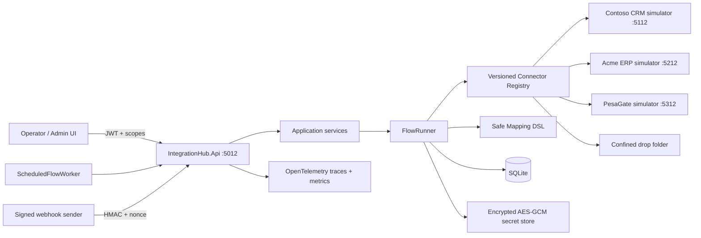
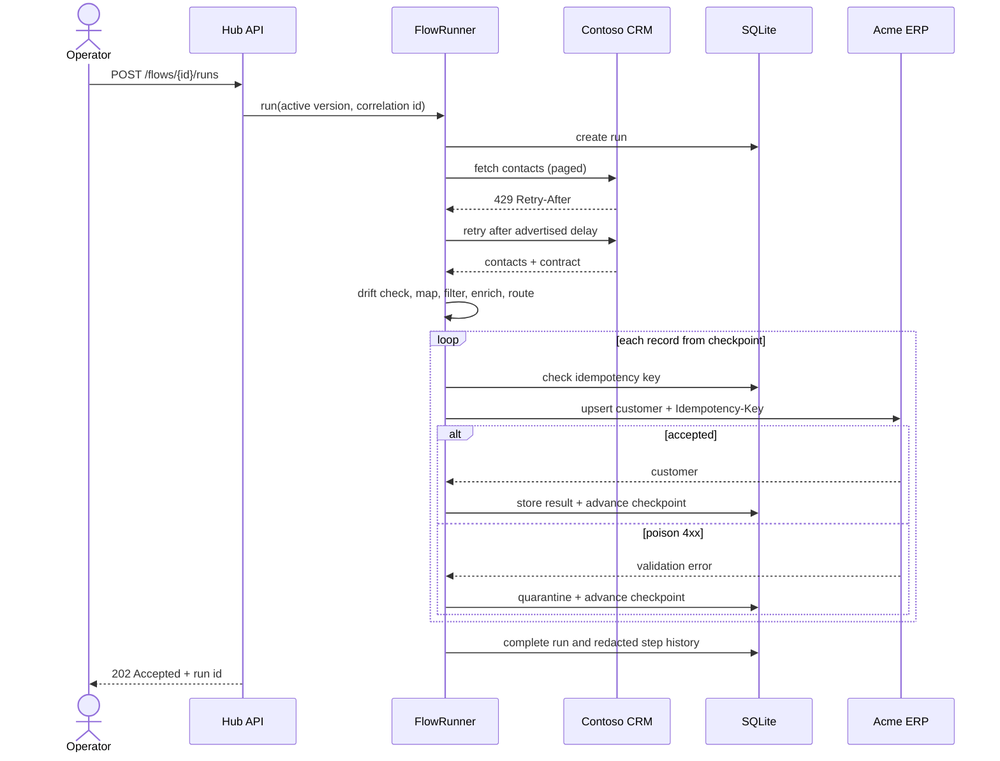
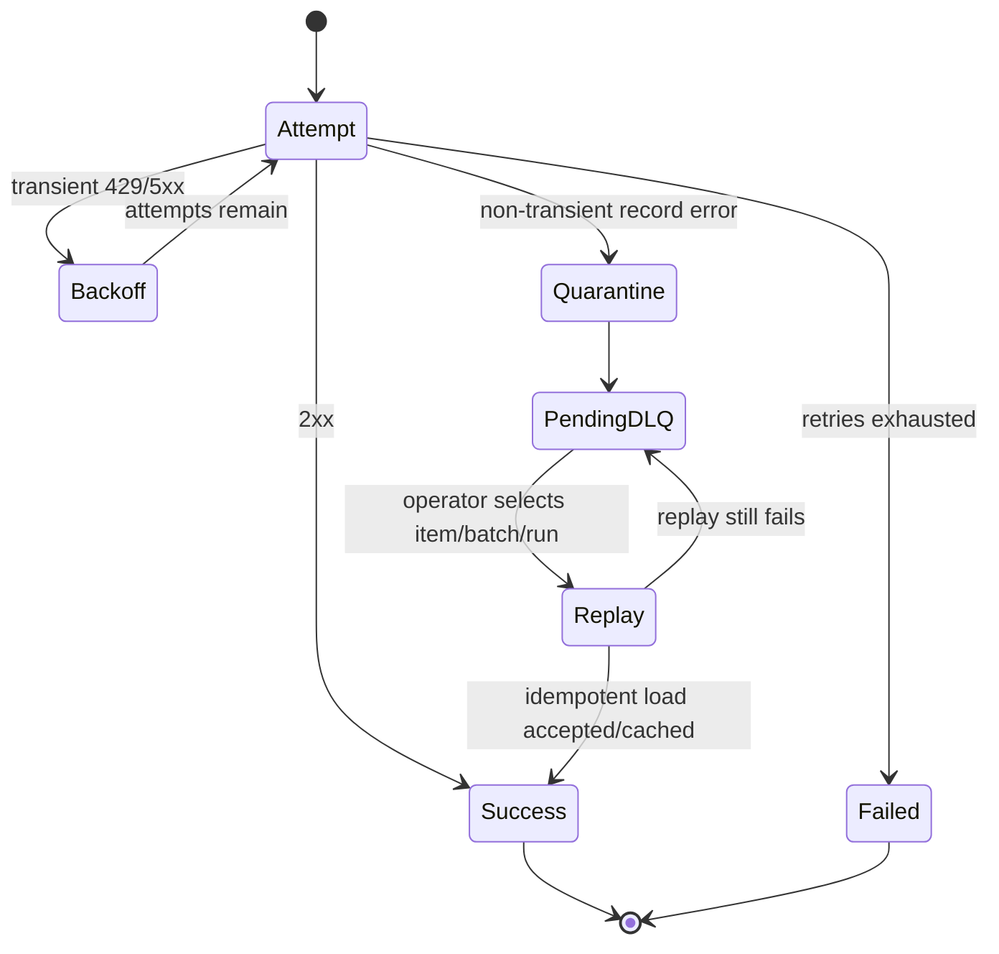

# API Integration Hub (iPaaS Lite)

## Portfolio Classification

**Self-directed engineering case study.** This repository is a production-style prototype and reference implementation, not client work and not a claim of production deployment.

## Executive Summary

API Integration Hub connects three fictional enterprise systems—Contoso CRM, Acme ERP, and PesaGate Payments (fictional)—through versioned connectors and declarative integration flows. It demonstrates the operationally difficult parts of integration work: hostile downstream behavior, safe transformation, contract drift, idempotency, checkpoints, dead letters, replay, secret isolation, scheduling, and forensic run history.

The solution runs locally with .NET 10 and SQLite. Three separate ASP.NET Core simulator applications deliberately expose pagination, authentication, optimistic concurrency, throttling, validation failures, and configurable 5xx faults. No paid service, Docker daemon, database server, or outbound network is required for build or test.

## Business Problem

Enterprises often hold related records in disconnected CRM, ERP, and payment products. Point-to-point scripts become brittle when contracts change, APIs throttle, a batch stops halfway through, or an operator retries a failed load. This project centralizes connector metadata, mappings, execution controls, and recovery so integrations can be inspected and operated rather than treated as opaque scheduled scripts.

## Functional Requirements

- Discover versioned connectors and their auth, operations, contracts, limits, and pagination model.
- Execute generic REST operations with API key, Basic, bearer, or OAuth2 client-credentials authentication.
- Import/export JSON and CSV through a root-confined drop-folder connector.
- Accept signed webhook triggers with HMAC, timestamp validation, nonce replay protection, and contract validation.
- Persist JSON or constrained YAML flow definitions with manual, webhook, or cron triggers.
- Execute `trigger → fetch → transform → filter → enrich → route → load → respond` steps.
- Test field mappings and return a per-field trace.
- Detect new, missing, and retyped response fields.
- Record searchable runs, step timings, counts, redacted snapshots, correlation IDs, and errors.
- Quarantine poison records, checkpoint batches, and replay one item, a batch, or a run.
- Manage encrypted, versioned local secrets by reference.
- Operate flows, runs, connectors, mappings, and dead letters from a utilitarian browser UI.

## Non-Functional Requirements

- Builds and tests offline after package restore; tests make zero outbound calls.
- SQLite is the default persistence provider.
- Bounded input, expression depth, mapping count, page size, retries, concurrency, and request duration.
- At-least-once processing with idempotent target writes.
- Per-connector circuit breaker and bulkhead.
- Correlation propagation, OpenTelemetry traces, metrics, structured logs, and health endpoints.
- JWT scope policies, HMAC webhook authentication, rate limiting, security headers, and SSRF controls.
- No arbitrary script execution, reflection-based invocation, or dynamic assembly loading.

## Architecture

The hub is a modular monolith with strict project-reference direction:

`Api → Infrastructure → Application → Domain`

The Domain project owns connector/flow language and invariants. Application owns ports, the safe mapping evaluator, contract validation, scheduling rules, and reliability primitives. Infrastructure supplies EF Core/SQLite, encrypted secrets, REST/file/webhook adapters, execution history, and orchestration. The API is the composition root and HTTP/UI surface. Simulators are independent web executables.

## Architecture Diagram







## Technology Stack

| Area | Technology |
|---|---|
| Runtime | .NET 10 / C# |
| HTTP | ASP.NET Core minimal APIs, `IHttpClientFactory` |
| Persistence | EF Core 10 + SQLite |
| Authentication | JWT bearer, scope-based policies |
| Telemetry | OpenTelemetry activities, counters, histograms, console exporter |
| Tests | xUnit, `WebApplicationFactory`, SQLite in-memory, deterministic fakes |
| UI | Dependency-free HTML, CSS, and JavaScript |
| Contracts | `System.Text.Json.Nodes` plus explicit JSON-schema-ish descriptors |

## Domain Model

- **ConnectorDescriptor**: stable id, semantic version, auth kind, operations, contracts, limits, pagination.
- **IntegrationFlow**: identity, name, immutable version list, active version, rollback behavior.
- **FlowDefinition**: trigger plus ordered typed steps and bounded timeout/retry settings.
- **Run / RunStep**: status, correlation, redacted snapshots, timings, counts, error context.
- **Checkpoint**: `(run, step, batch) → next index`.
- **Idempotency result**: `(scope, key) → original status and response`.
- **DeadLetterItem**: failed record envelope, stable key, replay status.
- **ContractDriftAlert**: connector/operation/path and change category.
- **Secret**: encrypted named value with monotonically increasing versions.

## Core Workflows

1. **Manual execution:** authenticate, select an active flow, submit payload, execute steps, inspect history.
2. **Scheduled execution:** evaluate five-field cron, apply catch-up/misfire policy, prevent overlap, run once.
3. **Webhook execution:** verify HMAC over `timestamp.nonce.rawBody`, consume nonce, validate payload, run flow.
4. **CRM → ERP sync:** page CRM contacts, detect drift, map fields, upsert ERP customers idempotently.
5. **Recovery:** quarantine non-transient records, select by item/batch/run, replay with the original stable key.
6. **Mapping test bench:** run expressions over sample JSON without saving or invoking external code.

## Security Model

- Development token endpoint issues HS256 JWTs only in Development/Testing; production must replace the default signing key and use an external OIDC authority.
- Policies enforce `hub.read`, `hub.write`, and `hub.admin`; authentication alone is insufficient.
- Connector URLs require an explicit host allow-list. The guard rejects private, loopback, link-local, multicast, and special ranges unless local-simulator mode deliberately permits them; Production refuses to start with that exception enabled.
- Webhooks use HMAC-SHA256, fixed-time comparison, a five-minute timestamp window, and one-use nonces.
- Expressions are parsed by a small whitelist evaluator with length, nesting, output, and mapping-count limits.
- AES-GCM protects the local secret file; connector configuration stores `@secret:path` references, not values.
- Run history recursively redacts PII-shaped fields and every secret value seen by the store.
- CSP, HSTS, frame denial, no-sniff, no-referrer, permissions policy, CORS allow-list, and rate limiting are applied.

See [the security review](docs/security/security-review.md).

## Reliability & Failure Handling

- REST calls apply bounded retries with exponential backoff and jitter; `Retry-After` wins over local delay.
- OAuth2 access tokens are cached and forcibly refreshed after a 401.
- Each connector has an independent circuit breaker and concurrency bulkhead.
- Every flow step has a timeout and retry budget.
- Stable load keys are persisted with the original response; simulator targets also enforce idempotency.
- Checkpoints advance after each successful or quarantined record, so a resumed batch starts at the first unfinished index.
- Non-transient poison records do not fail the entire batch.
- DLQ replay supports item, batch, or original run selection and reuses stable idempotency keys.
- Retention runs daily and deletes completed history older than the configured window.

## Observability

Every response carries `X-Correlation-Id`, and inbound values are honored. Runs persist per-step input/output snapshots after redaction, timestamps, counts, and exception context. Custom activities cover flow runs, steps, and connector calls.

Metrics include:

- `integrationhub.runs`
- `integrationhub.records.processed`
- `integrationhub.step.duration.ms`
- `integrationhub.connector.latency.ms`
- `integrationhub.connector.retries`
- `integrationhub.dlq.added`
- `integrationhub.dlq.depth`

Liveness and readiness are at `/health/live` and `/health/ready`.

## Testing Strategy

The suite contains unit and in-process integration tests. It covers every mapping function, nested/array paths, failures and sandbox escape; schema drift; HMAC validity/replay; encrypted secrets and rotation; secret/PII history redaction; cron/misfire/overlap; retries, `Retry-After`, circuit states, idempotency, checkpoint resume, poison quarantine, DLQ replay; all four pagination styles against real simulator hosts; OAuth caching/401 refresh; simulator auth and ETags; and API 200/400/401/403 behavior.

The API fixture uses a held-open SQLite in-memory connection. Simulator tests use `WebApplicationFactory`; no socket leaves the process.

## Local Development

Prerequisite: .NET SDK 10.0.400 or a compatible .NET 10 SDK.

```powershell
dotnet restore
dotnet build -c Release
dotnet test -c Release
```

Run the four hosts in separate terminals:

```powershell
dotnet run --project src\IntegrationHub.Simulators.Crm --urls http://localhost:5112
dotnet run --project src\IntegrationHub.Simulators.Erp --urls http://localhost:5212
dotnet run --project src\IntegrationHub.Simulators.Payments --urls http://localhost:5312
dotnet run --project src\IntegrationHub.Api --urls http://localhost:5012
```

Open `http://localhost:5012`, obtain a development token, and use the operator pages. Startup seeding is idempotent in Development.

## Running with Docker

**Docker configuration created but Docker is unavailable on the build host; the compose stack has not been started or verified.**

The authored, unverified command is:

```powershell
docker compose up --build
```

## API Documentation

OpenAPI JSON is exposed at `/openapi/v1.json` and an interactive Swagger UI at `/docs` in Development and Testing.

| Surface | Purpose | Scope |
|---|---|---|
| `POST /api/v1/auth/token` | Development token | anonymous, non-production |
| `GET /api/v1/connectors` | Registry discovery | `hub.read` |
| `GET/POST /api/v1/flows` | Flow catalog/create | read/write |
| `POST /api/v1/flows/{id}/versions` | Add immutable version | `hub.write` |
| `POST /api/v1/flows/{id}/versions/{v}/activate` | Activate version | `hub.write` |
| `POST /api/v1/flows/{id}/rollback` | Roll back | `hub.write` |
| `POST /api/v1/flows/{id}/runs` | Manual run | `hub.write` |
| `GET /api/v1/runs` | Search history | `hub.read` |
| `POST /api/v1/mappings/test` | Mapping trace | `hub.write` |
| `GET/POST /api/v1/dead-letters` | Inspect/replay | read/write |
| `GET/PUT/POST /api/v1/secrets` | Metadata/set/rotate | `hub.admin` |
| `POST /api/v1/webhooks/{flowId}` | Signed trigger | HMAC |

## Example Usage

```powershell
$tokenResponse = Invoke-RestMethod -Method Post -Uri http://localhost:5012/api/v1/auth/token `
  -ContentType application/json `
  -Body '{"clientId":"demo-client","clientSecret":"dev-only-client-secret","scopes":["hub.read","hub.write","hub.admin"]}'
$headers = @{ Authorization = "Bearer $($tokenResponse.access_token)" }

$connectors = Invoke-RestMethod -Uri http://localhost:5012/api/v1/connectors -Headers $headers
$flows = Invoke-RestMethod -Uri http://localhost:5012/api/v1/flows -Headers $headers
$run = Invoke-RestMethod -Method Post -Uri "http://localhost:5012/api/v1/flows/$($flows[0].id)/runs" `
  -Headers $headers -ContentType application/json -Body '{"payload":{}}'
```

Mapping test:

```json
{
  "input": { "name": " ada ", "currency": "KSH", "amount": "12.50" },
  "mappings": [
    { "targetPath": "$.name", "expression": "upper(trim($.name))" },
    { "targetPath": "$.currency", "expression": "currency($.currency)" },
    { "targetPath": "$.minorUnits", "expression": "decimal_scale($.amount, 100)" }
  ]
}
```

## Performance / Load Testing

No production throughput or latency claim is made. The repository deliberately prioritizes deterministic behavior tests over synthetic headline numbers. A future benchmark should measure connector concurrency, SQLite writer contention, large mapping batches, and DLQ replay under a documented workload and host profile.

## Trade-offs

- SQLite makes the case study one-command runnable, but a multi-instance deployment needs a server database and distributed scheduler leases.
- The constrained YAML parser intentionally supports the project’s flow shape, not the full YAML specification.
- The safe DSL is less expressive than JavaScript/C#, which is the security trade-off.
- In-process scheduling state prevents overlap within one hub process; horizontal scale requires durable leases.
- Local AES-GCM provides meaningful at-rest protection but is not a replacement for HSM-backed enterprise secret management.
- Simulators model important failure modes, not complete vendor APIs.

## Architecture Decisions

1. [ADR-001: Declarative flows over code-first integrations](docs/decisions/ADR-001-declarative-flows.md)
2. [ADR-002: Whitelisted expression evaluator](docs/decisions/ADR-002-safe-expression-evaluator.md)
3. [ADR-003: At-least-once delivery and idempotent loads](docs/decisions/ADR-003-at-least-once-idempotency.md)
4. [ADR-004: Per-record checkpointing](docs/decisions/ADR-004-checkpoint-granularity.md)
5. [ADR-005: Runtime secret references](docs/decisions/ADR-005-secret-reference-model.md)
6. [ADR-006: In-repository behavior simulators](docs/decisions/ADR-006-simulator-boundaries.md)

## Known Limitations

- Scheduler overlap state is process-local; this implementation is single-active-instance.
- SQLite has single-writer constraints and is not intended as the final clustered database.
- YAML support is a constrained, safe subset.
- OAuth supports client credentials, not authorization-code or device-code grants.
- The admin UI intentionally favors operational clarity over a visual workflow designer.
- Docker artifacts are authored but unverified because Docker is unavailable on the build host.

## Future Improvements

- Durable scheduler leases and leader election.
- PostgreSQL/SQL Server provider and migration bundle.
- OIDC/JWKS configuration with Entra ID example.
- Visual flow designer and schema-assisted mapping suggestions.
- OpenTelemetry OTLP collector profile and production dashboards.
- Pluggable cloud secret stores and dual-control rotation approval.
- Streaming batches and bounded disk spooling for very large payloads.

## Portfolio Talking Points

- Why integration correctness is primarily a recovery and contract-management problem.
- How a tiny expression language reduces the attack surface compared with embedded scripting.
- Why at-least-once delivery is paired with idempotency at both hub and target boundaries.
- How realistic simulators make retries, throttling, ETags, OAuth refresh, and poison records testable.
- Where the single-node prototype boundary is and how durable leases change the design.

## Upwork Portfolio Description

**API Integration Hub — self-directed engineering case study**

Problem: CRM, ERP, and payment systems frequently expose incompatible contracts and failure behavior.

Built: A .NET 10 integration hub with versioned connectors, declarative flows, safe mappings, scheduling, encrypted secrets, contract-drift alerts, checkpoints, and idempotent DLQ replay.

Engineering focus: hostile API resilience, transformation sandboxing, operational recovery, secret/PII hygiene, and end-to-end simulator testing.

Stack: ASP.NET Core, EF Core, SQLite, OpenTelemetry, xUnit, HTML/JavaScript.
Verification: Release build and automated tests run locally without external infrastructure.

This is a self-directed portfolio project, not client work.
