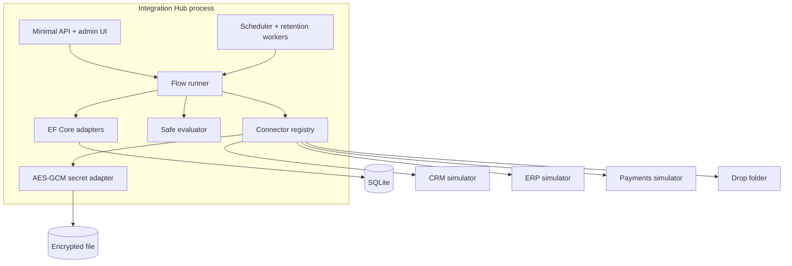
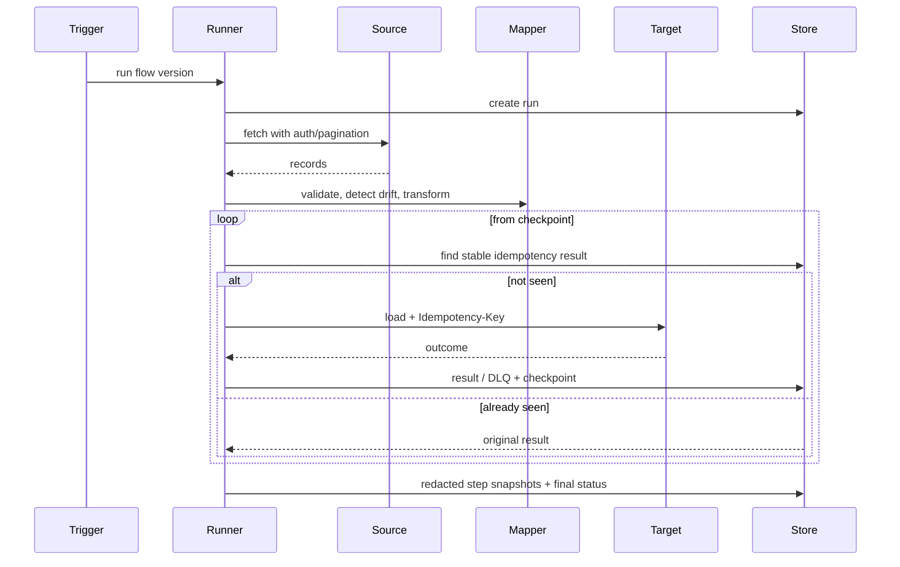

# Architecture

## Context

The hub sits between systems that differ in authentication, pagination, resource shape, availability, and write semantics. The central architectural constraint is that retries and human replay must never create duplicate business effects.

## Containers

## Component responsibilities

| Component | Responsibility |
|---|---|
| Domain | Stable connector descriptors, flow language, versioning invariants |
| Application | Ports, mapping evaluator, schema checks, cron, retry/circuit/bulkhead/idempotency/checkpoint primitives |
| Infrastructure | REST/file/webhook adapters, EF stores, encryption, execution orchestration |
| API | Composition, auth policies, rate limits, middleware, endpoints, static operator UI |
| Simulators | Executable test targets with deliberate edge and failure behavior |

## Execution sequence

## Failure domains

- A connector owns its timeout, retry, circuit, and bulkhead state.
- A step owns its configured timeout and retry budget.
- A record-level non-transient load failure is quarantined; it does not abort sibling records.
- A process interruption leaves the checkpoint at the first uncompleted index.
- A replay reuses the original record key and is safe after ambiguous responses.
- Contract drift creates alerts before changed data can be silently mapped.

## Deployment boundary

The demonstrator is a modular monolith plus three simulator executables. A production multi-instance hub would move SQLite to a server database, secret values to a managed vault, schedule state to durable leases, and telemetry to OTLP. Splitting the runner into workers is optional and should follow load evidence rather than precede it.
