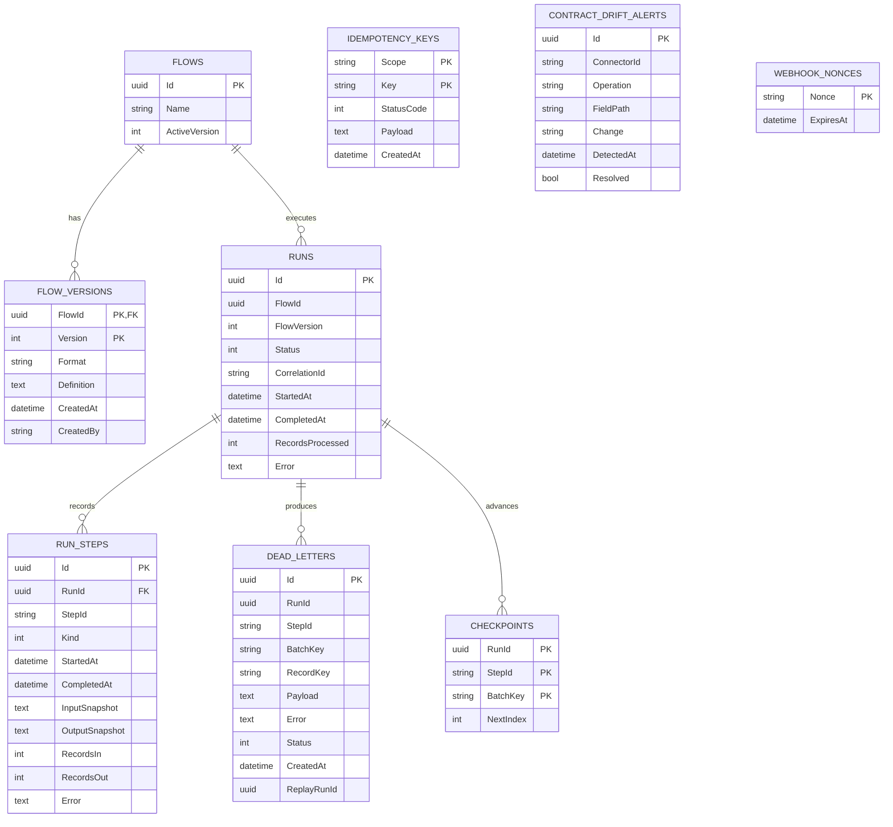

# Database Schema

SQLite is the default database. EF Core creates the schema with `EnsureCreated` because migration mechanics are not the teaching focus of this case study.

## Keys and indexes

- `FlowVersions`: composite primary key `(FlowId, Version)`.
- `Runs`: indexes on `(FlowId, StartedAt)`, `(Status, StartedAt)`, and `CorrelationId`.
- `RunSteps`: index on `(RunId, StartedAt)`.
- `DeadLetters`: indexes on `(RunId, BatchKey)` and `(Status, CreatedAt)`; unique `(RunId, StepId, RecordKey)` prevents duplicate quarantine within a run.
- `Checkpoints`: composite primary key `(RunId, StepId, BatchKey)`.
- `IdempotencyKeys`: composite primary key `(Scope, Key)` and retention index on `CreatedAt`.
- `ContractDriftAlerts`: operational indexes by resolution/date and connector/operation/path.
- `WebhookNonces`: primary-key uniqueness provides atomic replay protection; `ExpiresAt` supports cleanup.

## Data handling

Run snapshots are redacted before persistence. Secrets are never stored in this schema; the local adapter writes a separate AES-GCM envelope. Production should additionally encrypt database storage, restrict database principals, and apply retention/erasure policies appropriate to the organization.
