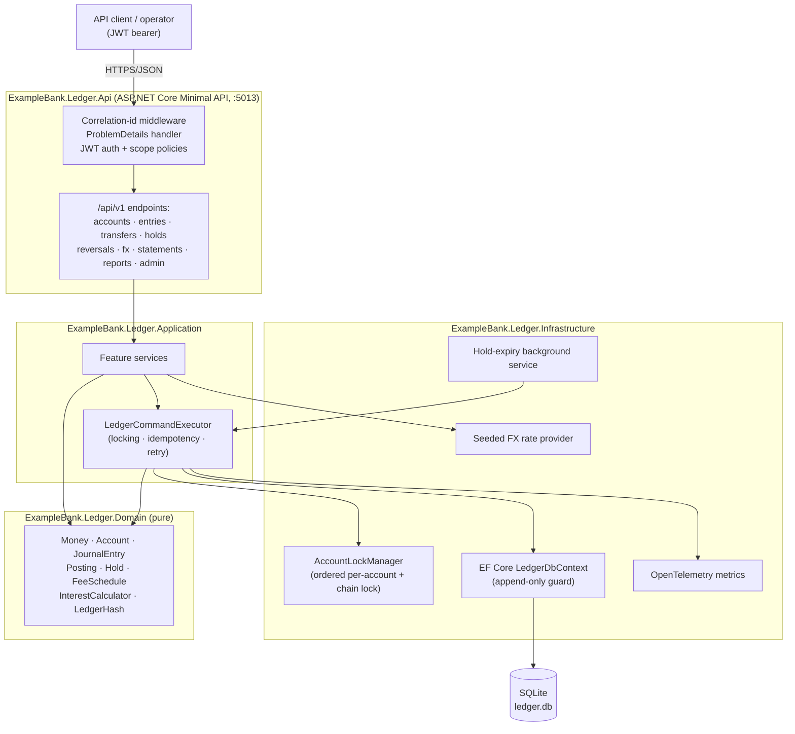
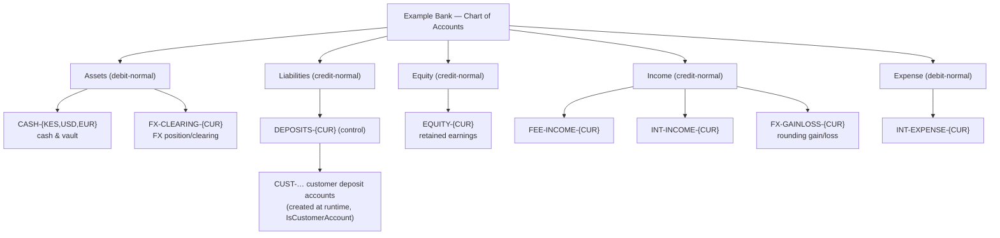
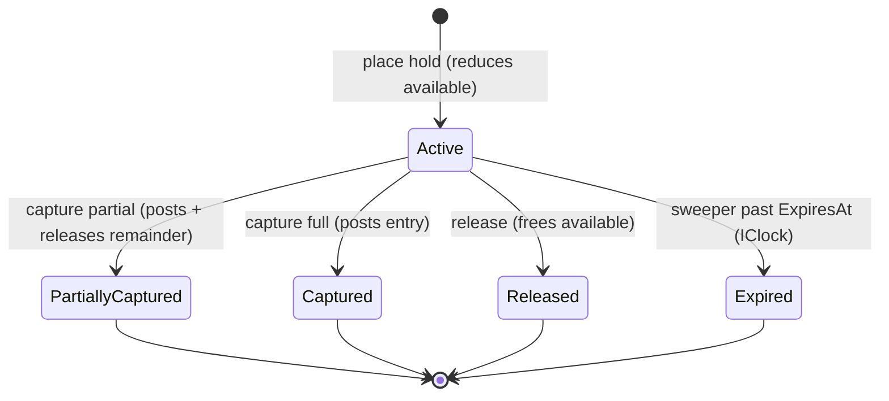

# Example Bank — Digital Banking Ledger

A double-entry, append-only general ledger for core banking, engineered so that **it is
impossible to create or destroy money** — including under heavy concurrency. Built on .NET 10,
runs on SQLite with zero external infrastructure, and proves its correctness with an automated
test suite (99 tests, all passing).

> `Example Bank` is a fictional institution. All data is synthetic. Supported currencies: **KES, USD, EUR**.

---

## Portfolio Classification

**Self-directed engineering case study.** This is a reference implementation authored to
demonstrate senior-level backend engineering in a high-stakes financial domain. It models no real
institution, processes no real money, and makes no claims of production deployment, users, or
revenue.

---

## Executive Summary

A general ledger is the part of a bank that must never be wrong. If a transfer debits one account
but fails to credit another, or a race between two withdrawals lets both succeed against the same
balance, the institution has literally created money out of nothing. This project implements a
**double-entry accounting engine** whose invariants are enforced in the domain model *and* proven
by tests:

- Every journal entry is **balanced** — Σ debits = Σ credits, per currency.
- The ledger is **append-only** — entries are never mutated or deleted; corrections are new
  **reversal** entries that reference the original.
- Every balance is **derivable** from the postings, and any cached balance must **reconcile
  exactly** with the derived value (a self-check endpoint proves it).
- Money is an integer count of **minor units** (`long`) with an explicit currency and scale —
  there is **no `double` or floating-point** anywhere in the domain.
- Postings are **idempotent** by a client-supplied key.
- The entry stream is **tamper-evident**: each entry embeds a SHA-256 hash of
  `(previous hash ‖ canonical content)`, forming a chain a verifier can walk.

The headline engineering concern is **correctness under concurrency**. The ledger uses an explicit
protocol — per-account locks acquired in a deterministic order (deadlock-free), a global chain lock
taken last, optimistic-concurrency version columns, serialized transactions, and idempotent replay
— and backs it with four concurrency tests that hammer the system with 50–150 parallel operations.

---

## Business Problem

Core-banking ledgers fail in expensive, hard-to-detect ways:

1. **Money creation under races.** Two concurrent withdrawals both read a balance of 100, both
   decide 80 is affordable, and both post — the account is now overdrawn by 60 and the bank has
   invented money. Naïve `UPDATE balance = balance - x` guards do not compose across the
   multi-row writes a real posting requires.
2. **Unbalanced or partial postings.** A crash between the debit and the credit leaves the books
   out of balance. Trial balance no longer sums to zero and nobody knows why.
3. **Silent mutation.** An operator "fixes" a bad entry by editing a row. The audit trail now lies,
   and downstream reports built on the old value are quietly wrong.
4. **Floating-point money.** `0.1 + 0.2 != 0.3`. Rounding drift accumulates into real discrepancies.
5. **Duplicate submission.** A client retries a timed-out transfer and the money moves twice.

This ledger addresses each failure mode directly and demonstrates the fix with a test.

---

## Functional Requirements

| # | Capability | Summary |
|---|------------|---------|
| F1 | Chart of accounts | Five account types (Asset, Liability, Equity, Income, Expense), normal-balance side, parent/child hierarchy with roll-up, control accounts, `Active/Frozen/Closed` status. Closing requires a zero balance. |
| F2 | Journal & entries | Value date, booking timestamp, description, reference, source system, correlation id, and 2..N postings. Entry types: `Transfer, Fee, Interest, Adjustment, Reversal, FxConversion, Settlement`. |
| F3 | Transfers | Internal account-to-account, sufficient-funds check against **available balance**, configurable overdraft, atomic posting. |
| F4 | Holds / authorizations | Place (reduces available, not cleared), capture full or partial (converts to a posting, releases the remainder), release, and automatic expiry via a background sweeper driven by `IClock`. |
| F5 | Reversals | Full and partial, reference the original, produce mirror-image postings, cannot exceed the original amount. |
| F6 | Fees & interest | Fee-schedule engine (fixed, percentage, tiered, min/max caps); interest accrual with **Actual/365** and **30/360** day-count conventions plus capitalisation, driven by `IClock`. |
| F7 | FX conversion | Rate-provider abstraction with a seeded rate table; conversion posts a balanced entry across both currencies via FX clearing + rounding gain/loss accounts, with the sub-unit remainder conserved. |
| F8 | Statements | Opening balance, movements in period, closing balance, running balance, pagination, CSV/JSON export; ties out exactly (`opening + Σ movements = closing`). |
| F9 | Trial balance | Every account's debit/credit totals, grouped by currency; balances to zero globally. |
| F10 | Integrity & audit | Hash-chain verification endpoint + cached-vs-derived balance reconciliation self-check. |
| F11 | Concurrency control | Ordered per-account locking, optimistic version columns, serialized transactions, idempotent replay — proven by parallel tests. |

---

## Non-Functional Requirements

- **Correctness first.** No invariant may be violated even under adversarial concurrency. This is
  the primary design constraint; everything else yields to it.
- **Zero external infrastructure.** `dotnet build` and `dotnet test` succeed on a machine that has
  only the .NET SDK. SQLite is the default store.
- **Determinism.** Time is injected via `IClock`; no domain code reads the wall clock. Money is
  exact integer arithmetic.
- **Auditability.** Append-only storage plus a tamper-evident hash chain.
- **Observability.** OpenTelemetry metrics for posting latency, throughput, rejected-imbalance
  attempts, and hold expiries; structured logs with correlation ids.
- **Security.** JWT bearer auth with least-privilege scope policies; `ProblemDetails` errors;
  idempotency keys.

---

## Architecture

The system is a **modular monolith** with a strict, one-directional dependency graph. The Domain
layer holds the invariants and depends on nothing; each outer layer depends only on the one inside
it.

```
Api  ─▶  Infrastructure  ─▶  Application  ─▶  Domain
(HTTP,        (EF Core,          (services,       (accounts, money,
 auth,         SQLite,            concurrency       postings, holds,
 OpenAPI)      locks, FX,         orchestration,    fees, interest,
               metrics,           idempotency)      hash chain — pure)
               sweeper)
```

- **Domain** (`ExampleBank.Ledger.Domain`) — `Money`, `Currency`, `Account`, `JournalEntry`,
  `Posting`, `Hold`, `FeeSchedule`, `InterestCalculator`, `LedgerHash`. Pure C#, no I/O, no
  framework types. Every invariant (balanced entries, append-only sealing, overdraft floors,
  hash computation) lives here.
- **Application** (`ExampleBank.Ledger.Application`) — feature services (`TransferService`,
  `HoldService`, `ReversalService`, `FxService`, `StatementService`, `IntegrityService`, …), the
  `LedgerCommandExecutor` that owns the concurrency + idempotency protocol, and the repository/
  unit-of-work abstractions.
- **Infrastructure** (`ExampleBank.Ledger.Infrastructure`) — EF Core `LedgerDbContext` (which
  enforces append-only in `SaveChanges`), repositories, the `AccountLockManager`, the seeded FX
  rate provider, OpenTelemetry metrics, and the `HoldExpiryBackgroundService`.
- **Api** (`ExampleBank.Ledger.Api`) — Minimal API endpoints grouped under `/api/v1/...`, JWT auth
  and scope policies, correlation-id middleware, a `ProblemDetails` exception handler, and OpenAPI.

The four layers map onto the six solution projects (the two test projects are `UnitTests` and
`IntegrationTests`).

---

## Architecture Diagram

Container / component view:



A sequence diagram of the headline transfer flow (with locking) appears under **Core Workflows**
and in [`docs/architecture/architecture.md`](docs/architecture/architecture.md).

---

## Technology Stack

| Concern | Choice |
|---------|--------|
| Runtime | .NET 10 (`net10.0`), C# |
| API | ASP.NET Core Minimal APIs, `Microsoft.AspNetCore.OpenApi` |
| Persistence | EF Core 10 + SQLite (default; Postgres-compatible by design — see ADR-005) |
| Auth | `Microsoft.AspNetCore.Authentication.JwtBearer`, scope-based authorization policies |
| Observability | OpenTelemetry (metrics + tracing, console exporter), Serilog structured logging |
| Validation / errors | `ProblemDetails` (RFC 7807) with a `code` extension |
| Tests | xUnit, `Microsoft.AspNetCore.Mvc.Testing` (`WebApplicationFactory`) |
| Money | Custom `Money` value type over `long` minor units — no floating point |

All packages are restored from the configured NuGet feed with no pinned versions in source.

---

## Domain Model

The ledger is built from a small number of carefully-constrained aggregates.

- **`Money`** — a `readonly record struct` of `(long MinorUnits, Currency Currency)`. Arithmetic is
  `checked` integer math; combining different currencies throws `MixedCurrencyException`;
  `FromMajor` rejects values finer than the currency scale.
- **`Currency`** — a fixed, seeded set (KES/USD/EUR), each with an explicit `Scale` (2 decimal
  places → 100 minor units per major). Only known currencies are accepted.
- **`Account`** — a chart-of-accounts node with a `Type`, a derived `NormalBalance` side, a parent,
  status, an optional overdraft limit, cached debit/credit totals, an `HeldMinor` figure, and an
  optimistic-concurrency `Version`. Balance is **derived** from the cached totals in the account's
  normal-side orientation; `AvailableMinor = BalanceMinor − HeldMinor`. Assets/Expenses are
  debit-normal; Liabilities/Equity/Income are credit-normal. **Customer money accounts are modelled
  as Liabilities** (the bank owes the customer), and the `IsCustomerAccount` flag — not the account
  type — drives funds/overdraft enforcement.
- **`JournalEntry` + `Posting`** — an entry has 2..N postings and validates on construction that
  debits equal credits **per currency**; non-FX entries reject mixed currencies. Once persisted an
  entry is **sealed** into the hash chain and can never change.
- **`Hold`** — an authorization that reduces available (not cleared) balance, with a status
  lifecycle and an expiry timestamp.
- **`FeeSchedule`** — fixed, percentage, or tiered fee calculation with min/max caps.
- **`InterestCalculator`** — day-count accrual (Actual/365 and 30/360) over a period.
- **`LedgerHash`** — `SHA-256(previousHash ‖ "\n" ‖ canonicalContent)`, genesis = 64 zeroes.

### Chart of accounts (seeded per currency)



Customer accounts are created at runtime as leaves under the per-currency `DEPOSITS-{CUR}` control
account.

---

## Core Workflows

### Transfer (with ordered locking)

A transfer moves value between two customer accounts inside a single balanced, hash-sealed entry.
The executor acquires per-account locks **in ascending account-id order** (so `A→B` and `B→A` can
never deadlock), then takes the global chain lock last to seal the entry.

```mermaid
sequenceDiagram
    participant C as Client
    participant API as Transfers endpoint
    participant EX as LedgerCommandExecutor
    participant L as AccountLockManager
    participant DB as SQLite (tx)

    C->>API: POST /api/v1/transfers (Idempotency-Key)
    API->>EX: TransferAsync(request)
    EX->>DB: replay? (idempotency key already used)
    alt key already seen
        DB-->>EX: stored response
        EX-->>C: 201 (original entry, no double-post)
    else new request
        EX->>L: acquire account locks in ascending id order
        L-->>EX: locks held (deadlock-free)
        EX->>DB: BEGIN tx; load accounts; check funds/overdraft
        EX->>DB: apply postings to cached balances
        EX->>L: acquire global chain lock
        EX->>DB: seal entry (seq = head+1, hash = H(prev‖content))
        EX->>DB: insert entry + idempotency record; COMMIT
        L-->>EX: release chain + account locks
        EX-->>C: 201 Created (balanced entry)
    end
```

If two writers still collide at the storage layer, the executor retries transient/optimistic
failures up to five times; a duplicate idempotency key short-circuits to the stored response.

### Hold lifecycle



A hold reduces the account's **available** balance but not its **cleared** balance. Capture converts
the held amount (or part of it) into a real posting and releases any remainder; release and expiry
simply free the held amount. Expiry is handled by a background service that reads time from `IClock`,
so it is fully testable with a fake clock.

### FX conversion

A conversion posts a single balanced `FxConversion` entry with legs in both currencies, routed
through the per-currency `FX-CLEARING-{CUR}` accounts, using an exact rational rate. The sub-minor
rounding remainder is computed explicitly and conserved (it is reported on the quote and absorbed by
the FX gain/loss account), so total value is preserved to the minor unit.

---

## Security Model

- **Authentication** — JWT bearer tokens (HS256). Issuer, audience, lifetime, and signing key are
  all validated. A local-only `POST /api/v1/dev/token` endpoint mints tokens for demos and is
  enabled **only** when `Auth:EnableDevTokens` is true (Development/Testing).
- **Authorization** — four least-privilege scope policies enforced per endpoint:

  | Scope | Grants |
  |-------|--------|
  | `ledger:read` | read accounts, entries, statements, trial balance, FX quotes |
  | `ledger:post` | post entries, transfers, holds, FX conversions |
  | `ledger:adjust` | post reversals, freeze/activate accounts |
  | `ledger:admin` | create/close accounts, run integrity verification |

- **Append-only enforcement** — the `LedgerDbContext` rejects any attempt to modify or delete a
  persisted `JournalEntry` or `Posting` at `SaveChanges` time.
- **Tamper evidence** — the hash chain lets an auditor detect any retroactive edit or reordering.
- **Idempotency** — an `Idempotency-Key` header guarantees a retried mutation posts at most once.
- **Errors** — all failures are RFC 7807 `ProblemDetails` with a stable machine-readable `code`; no
  stack traces or internal detail leak to clients.

Full analysis (STRIDE table, privilege separation, four-eyes discussion, and explicit non-claims) is
in [`docs/security/security-review.md`](docs/security/security-review.md).

---

## Reliability & Failure Handling

- **Atomicity** — every posting is one database transaction; a failure rolls back cleanly, leaving
  the books balanced.
- **Concurrency** — ordered locking + optimistic `Version` columns + serialized transactions +
  bounded retry (see **Concurrency** below and `docs/concurrency-notes.md`).
- **Idempotent replay** — duplicate submissions return the original result instead of re-posting.
- **Self-healing checks** — the integrity endpoint reconciles cached balances against the postings
  and verifies the hash chain, so drift is detectable rather than silent.
- **Deterministic time** — the hold sweeper and interest accrual use `IClock`, so timeouts and
  accruals are testable and reproducible.

---

## Observability

OpenTelemetry metrics are published under the `ExampleBank.Ledger` meter (console exporter by
default):

| Metric | Type | Meaning |
|--------|------|---------|
| `ledger.posting.latency` | histogram (ms) | latency of posting a journal entry, tagged by entry type |
| `ledger.entries.posted` | counter | journal entries posted (throughput), tagged by entry type |
| `ledger.imbalance.attempts` | counter | rejected unbalanced / mixed-currency attempts, tagged by reason |
| `ledger.holds.expired` | counter | holds expired by the background sweeper |

ASP.NET Core request instrumentation (metrics + traces) is enabled, and Serilog emits structured
request logs. Every request carries a **correlation id** (from the `X-Correlation-Id` header or
generated), which is echoed back and attached to the log scope and to journal entries.

---

## Testing Strategy

Two test projects, **99 tests total, all passing** (see [`docs/test-results.md`](docs/test-results.md)
for the real output).

- **Unit tests (80)** — domain invariants and calculations with no I/O: money arithmetic and scale
  rejection, currency rules, account balances/overdraft/close guards, balanced-entry enforcement,
  mixed-currency rejection, hash-chain sealing and tamper detection, hold maths, fee schedules
  (fixed/percentage/tiered/caps), interest accrual for **both** day-count conventions with a
  `FakeClock`, and FX quote value conservation.
- **Integration tests (19)** — full HTTP through `WebApplicationFactory<Program>` on a real SQLite
  file: health, 401/403 authorization, transfer happy path + hash-chain sealing, validation → 422,
  insufficient funds → 422, close-with-balance → 400, idempotency replay, trial balance sums to
  zero, integrity verification, statement tie-out, reversal (full/partial/exceeding-rejected), FX
  conversion keeping trial balance zero, plus the **four concurrency tests**:

  1. 150 parallel transfers between the same two accounts — total conserved, derived balances correct.
  2. 150 bidirectional `A→B` / `B→A` transfers — no deadlock (ordered locking).
  3. 50 concurrent withdrawals against limited funds — never overdraw (exactly the funded number succeed).
  4. 50 parallel requests with the **same idempotency key** — exactly one posting.

Time is always injected via `IClock`/`FakeClock`; no domain code reads `DateTime.UtcNow`.

---

## Local Development

Prerequisites: **.NET 10 SDK** (nothing else).

```powershell
# from the repository root
dotnet build -c Release
dotnet test  -c Release          # 99 tests

# run the API (Development enables the dev-token endpoint)
dotnet run --project src\ExampleBank.Ledger.Api
# API:      http://localhost:5013
# health:   http://localhost:5013/health
# OpenAPI:  http://localhost:5013/openapi/v1.json
```

On startup the schema is created and the fictional Example Bank chart of accounts + fee schedules
are seeded (idempotently). A full scripted walkthrough is in
[`scripts/demo.ps1`](scripts/demo.ps1):

```powershell
pwsh -File scripts\demo.ps1
```

Configuration lives in `appsettings.json` and can be overridden by environment variables (see
[`.env.example`](.env.example)); the SQLite connection string is `ConnectionStrings__Ledger`.

---

## Running with Docker

A `Dockerfile` and `docker-compose.yml` are included to show intended packaging (multi-stage build,
non-root runtime user, SQLite on a mounted volume, and a commented optional Postgres service).

> **Docker configuration created but Docker is unavailable on the build host; the compose stack has
> not been started or verified.**

The default build needs no containers at all — SQLite runs in-process.

---

## API Documentation

All endpoints are versioned under `/api/v1`. OpenAPI is served at `/openapi/v1.json`.

| Method & path | Scope | Purpose |
|---------------|-------|---------|
| `POST /api/v1/accounts` | admin | create an account |
| `GET /api/v1/accounts` | read | list accounts |
| `GET /api/v1/accounts/{id}` | read | get one account |
| `GET /api/v1/accounts/{id}/balance` | read | balance + roll-up |
| `POST /api/v1/accounts/{id}/freeze` \| `/activate` | adjust | change status |
| `POST /api/v1/accounts/{id}/close` | admin | close (requires zero balance) |
| `POST /api/v1/entries` | post | post a balanced journal entry |
| `GET /api/v1/entries/{id}` \| `GET /api/v1/entries` | read | get / list entries (paged) |
| `POST /api/v1/transfers` | post | transfer between accounts |
| `POST /api/v1/holds` | post | place a hold |
| `POST /api/v1/holds/{id}/capture` \| `/release` | post | capture / release a hold |
| `POST /api/v1/reversals` | adjust | reverse an entry (full/partial) |
| `POST /api/v1/fx/convert` | post | cross-currency conversion |
| `POST /api/v1/fx/quote` | read | preview an FX quote |
| `GET /api/v1/statements/{accountId}` | read | statement (`?from=&to=&format=csv`) |
| `GET /api/v1/reports/trial-balance` | read | trial balance |
| `GET /api/v1/admin/integrity/verify` | admin | hash chain + reconciliation |
| `GET /health` | anonymous | liveness |
| `POST /api/v1/dev/token` | anonymous (dev only) | mint a demo JWT |

Mutating endpoints accept an `Idempotency-Key` header; all endpoints accept/emit `X-Correlation-Id`.

---

## Example Usage

Mint a token and create + fund an account (PowerShell):

```powershell
$base = "http://localhost:5013"

# 1. Mint an admin token (Development only)
$token = (Invoke-RestMethod -Method Post "$base/api/v1/dev/token" -ContentType application/json -Body (@{
  subject = "demo"; scopes = @("ledger:read","ledger:post","ledger:adjust","ledger:admin")
} | ConvertTo-Json)).access_token
$auth = @{ Authorization = "Bearer $token" }

# 2. Create a KES customer deposit account (Liability, credit-normal)
$cust = Invoke-RestMethod -Method Post "$base/api/v1/accounts" -Headers $auth -ContentType application/json -Body (@{
  code = "CUST-1001"; name = "Demo customer"; type = "Liability"; currency = "KES"
  parentCode = "DEPOSITS-KES"; isCustomerAccount = $true; overdraftLimitMinor = 0
} | ConvertTo-Json)

# 3. Fund it: Debit CASH-KES / Credit the customer (a balanced entry)
$cash = (Invoke-RestMethod -Method Get "$base/api/v1/accounts" -Headers $auth | Where-Object code -eq "CASH-KES").id
Invoke-RestMethod -Method Post "$base/api/v1/entries" -Headers ($auth + @{ "Idempotency-Key" = "fund-1" }) `
  -ContentType application/json -Body (@{
    type = "Adjustment"; description = "Opening deposit"; sourceSystem = "demo"
    postings = @(
      @{ accountId = $cash;    direction = "Debit";  amountMinor = 100000; currency = "KES" },
      @{ accountId = $cust.id; direction = "Credit"; amountMinor = 100000; currency = "KES" }
    )
  } | ConvertTo-Json -Depth 6)
```

A successful entry response (abridged):

```json
{
  "id": "b1e2...",
  "sequenceNumber": 2,
  "type": "Adjustment",
  "valueDate": "2026-01-15",
  "description": "Opening deposit",
  "previousHash": "0000...0000",
  "hash": "9f3c...a71b",
  "postings": [
    { "accountId": "…cash…", "direction": "Debit",  "amountMinor": 100000, "currency": "KES" },
    { "accountId": "…cust…", "direction": "Credit", "amountMinor": 100000, "currency": "KES" }
  ]
}
```

An unbalanced entry is rejected with `422` and a `ProblemDetails` body:

```json
{ "type": "about:blank", "title": "Unbalanced entry", "status": 422,
  "code": "ledger.unbalanced", "detail": "Debits 100000 != credits 90000 for KES." }
```

---

## Performance / Load Testing

No formal load test was run — this project optimises for **provable correctness**, not throughput,
and it deliberately serializes the hash-chain seal step behind a single global lock (see
Trade-offs). What *is* measured, in the automated suite, is behaviour under real in-process
contention: the concurrency tests drive 50–150 parallel operations against shared accounts and
assert that totals are conserved, no deadlock occurs, funds are never overdrawn, and idempotency
holds. The `ledger.posting.latency` histogram and `ledger.entries.posted` counter are emitted for
anyone who wants to attach a load generator; `docs/concurrency-notes.md` records the measured
results of the concurrency tests.

---

## Trade-offs

- **Global chain lock serializes writes.** Sealing every entry under one lock makes the hash chain
  and single-writer SQLite trivially correct, at the cost of write parallelism. A production system
  would sacrifice a strict total-order chain (or shard it) for throughput. Correctness was the
  explicit priority.
- **In-process locks are single-node.** The `AccountLockManager` is an in-memory construct; it is
  correct for one process but does not coordinate across a horizontally-scaled deployment. The
  Postgres mapping in ADR-005 explains how row locks / `SERIALIZABLE` replace it there.
- **Cached balances + reconciliation** instead of always summing postings — O(1) reads, at the cost
  of maintaining a cache that must be (and is) proven to reconcile.
- **SQLite default** trades server-grade concurrency for zero-infrastructure reproducibility.

---

## Architecture Decisions

Recorded as ADRs under [`docs/decisions/`](docs/decisions/):

- **ADR-001** — Double-entry ledger over a single balance column.
- **ADR-002** — Money as `long` minor units, never `double`.
- **ADR-003** — Ordered locking *and* optimistic concurrency, not optimistic-only.
- **ADR-004** — Hash-chain tamper evidence.
- **ADR-005** — SQLite as the default store and the Postgres `SERIALIZABLE` / `SELECT FOR UPDATE`
  mapping.

---

## Known Limitations

- **Single node.** In-process locking does not span multiple API instances; multi-node operation
  requires the Postgres path (ADR-005) or a distributed lock.
- **No maker-checker workflow.** Adjustments/reversals require the `ledger:adjust` scope but not
  dual approval; true four-eyes is described in the security review as future work.
- **Symmetric demo key.** JWTs are signed with a single HS256 key; a real deployment would use
  asymmetric keys / an identity provider and rotate secrets.
- **Seeded FX rates.** The rate provider is a fixed local table, not a live market feed.
- **Docker unverified.** The container assets are authored but never built or run.
- **Interest/fee scheduling is a library, not a scheduler.** The accrual/fee maths are implemented
  and tested; wiring them to a cron-like trigger is left as an operational concern.

---

## Future Improvements

- Postgres provider with `SELECT … FOR UPDATE` / `SERIALIZABLE` and multi-node deployment.
- Maker-checker (four-eyes) approval workflow for adjustments and reversals.
- Asymmetric JWTs / OIDC integration and secret rotation.
- A scheduled runner for daily interest accrual and periodic capitalisation.
- Live FX rate ingestion behind the existing `IFxRateProvider` abstraction.
- A signed, externally-anchored hash chain (e.g. periodic notarisation) for stronger tamper proofs.

---

## Portfolio Talking Points

- **"It is impossible to create money"** — and there are four concurrency tests that try hard to and
  fail: parallel transfers conserve totals, bidirectional transfers don't deadlock, concurrent
  withdrawals never overdraw, and duplicate idempotency keys post exactly once.
- **Real double-entry** — balanced-per-currency entries, append-only storage, reversals instead of
  edits, and a trial balance that sums to zero.
- **Money done right** — integer minor units with explicit scale, no floating point, checked
  arithmetic, and FX conversion that conserves value to the minor unit.
- **Deliberate concurrency protocol** — ordered per-account locks (deadlock-free) + optimistic
  version columns + serialized transactions + idempotent replay, honestly mapped to how Postgres
  `SERIALIZABLE` / `SELECT FOR UPDATE` would do the same job.
- **Tamper evidence** — a SHA-256 hash chain with a verification endpoint, plus a cached-vs-derived
  reconciliation self-check.
- **Engineered for reproducibility** — builds and passes 99 tests with only the .NET SDK.

More detail in [`docs/portfolio/interview-talking-points.md`](docs/portfolio/interview-talking-points.md).

---

## Upwork Portfolio Description

A production-shaped **double-entry banking ledger** in .NET 10 that makes it impossible to create
money — even under heavy concurrency. It enforces classical accounting invariants (balanced
entries, append-only journal, reversals-not-edits, trial balance to zero), stores money as exact
integer minor units, guarantees at-most-once posting via idempotency keys, and proves its
correctness with a 99-test suite including parallel-transfer, no-deadlock, no-overdraw, and
idempotency stress tests. The concurrency model (ordered locking + optimistic versions + serialized
transactions) is documented and mapped to Postgres `SERIALIZABLE`/`SELECT FOR UPDATE`. Runs with
zero external infrastructure on SQLite. A self-directed engineering case study — see
[`docs/portfolio/upwork-description.md`](docs/portfolio/upwork-description.md).
