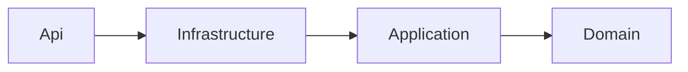
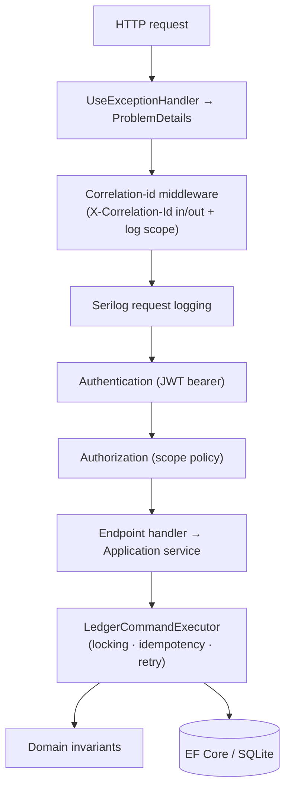
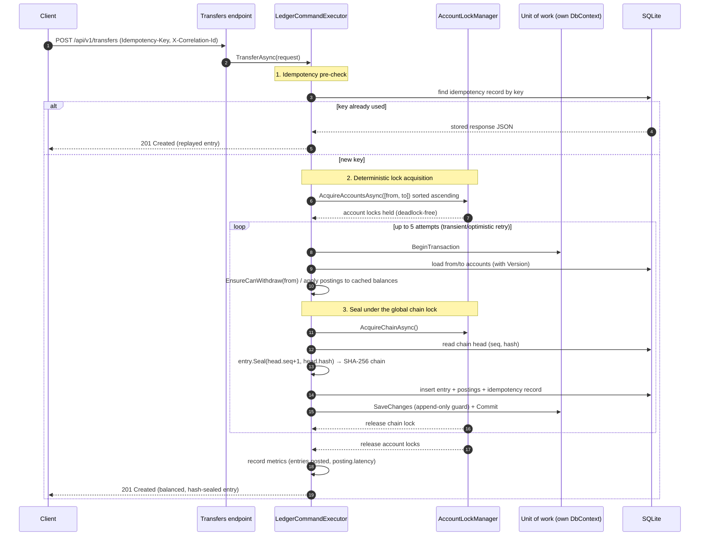

# Architecture — Example Bank Digital Banking Ledger

This document expands on the README's architecture section: the layering, the dependency rules, the
request lifecycle, and the headline transfer sequence.

## Layering and dependency rule

The solution is a modular monolith with a strict inward dependency rule — outer layers depend on
inner layers, never the reverse. The Domain layer has no dependencies on any other project or on any
framework.

| Project | Responsibility | Depends on |
|---------|----------------|------------|
| `ExampleBank.Ledger.Domain` | Entities, value objects, invariants, pure calculations. No I/O. | — |
| `ExampleBank.Ledger.Application` | Feature services, concurrency/idempotency orchestration, repository & unit-of-work abstractions, DTOs. | Domain |
| `ExampleBank.Ledger.Infrastructure` | EF Core context + configurations + repositories, lock manager, FX provider, metrics, background sweeper, seeding, DI. | Application, Domain |
| `ExampleBank.Ledger.Api` | Minimal API endpoints, JWT auth + policies, middleware, ProblemDetails, OpenAPI, host. | Infrastructure, Application, Domain |

The two test projects (`UnitTests`, `IntegrationTests`) sit outside this graph.

## Why a modular monolith

The problem is fundamentally about **transactional correctness across a small set of tightly-coupled
aggregates** (accounts, entries, postings, holds). Splitting those across services would introduce
distributed-transaction problems that would *reduce* correctness — exactly the property this project
exists to demonstrate. A monolith with clean internal boundaries keeps the invariants enforceable in
one transaction while preserving a path to extraction later (the Application services are already the
seams).

## Request lifecycle

Any exception thrown by the domain or application is translated to a `ProblemDetails` response by the
central `LedgerExceptionHandler`, which maps each exception type to a status code and a stable
machine-readable `code` (e.g. validation → 422 `validation_failed`, unbalanced → 422
`ledger.unbalanced`, non-zero close → 400 `account.non_zero_balance`, not found → 404, conflict → 409).

## Headline flow — transfer with ordered locking

The transfer is the canonical write path and shows the whole concurrency protocol in one picture.

Key points:

- **Lock order is total.** Account locks are always taken in ascending GUID order and the chain lock
  is always taken *after* them. A single global order means the wait-for graph can never contain a
  cycle, so the system is deadlock-free by construction — this is what the bidirectional-transfer
  test proves.
- **Each command owns its `DbContext`.** The unit-of-work factory hands every command its own
  context, so parallel commands never share EF change-tracking state.
- **The chain lock makes SQLite's single writer safe.** All appends are globally serialized at the
  seal step, which is also what keeps the hash chain a strict total order.
- **Idempotency is enforced twice.** A cheap pre-check replays before locking; a unique index on the
  idempotency key is the authoritative guard, and a `DuplicateKeyException` under contention falls
  back to replaying the stored response — so 50 racing duplicates still post exactly once.

See [`../concurrency-notes.md`](../concurrency-notes.md) for the model, the measured test results,
and the Postgres mapping, and [`../database-schema.md`](../database-schema.md) for the schema.
