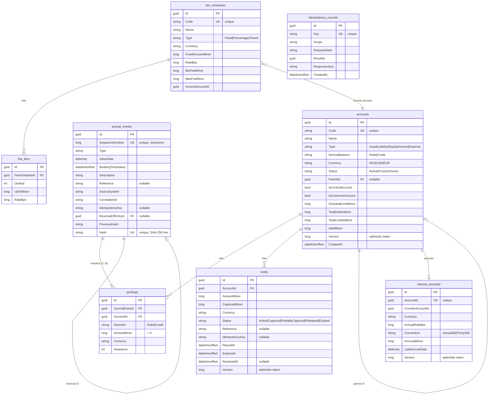

# Database Schema — Example Bank Digital Banking Ledger

The default store is **SQLite** (`ledger.db`), created via `EnsureCreated` and seeded on startup.
The same EF Core model targets Postgres unchanged (see [ADR-005](decisions/ADR-005-sqlite-default-postgres-serializable-mapping.md)).
All monetary columns are `long` **minor units**; there is no floating-point column anywhere.

## Entity–relationship diagram

## Tables, keys, indexes and constraints

Enum columns are persisted as strings (`HasConversion<string>`) with the length shown. Optimistic
concurrency is implemented with a `Version` column marked `IsConcurrencyToken()`.

### `accounts`
- **PK**: `Id` (GUID, never generated by the store).
- **Unique index**: `Code`.
- **Indexes**: `ParentId`; composite `(Type, Currency)`.
- **Concurrency token**: `Version`.
- **Constraints / rules** (enforced in the domain): `OverdraftLimitMinor >= 0`; balance is derived
  from `TotalDebitsMinor`/`TotalCreditsMinor` in the account's normal-side orientation; an account
  may only be closed with a zero balance and no holds; control accounts and non-active accounts
  reject direct postings.
- Lengths: `Code` ≤ 64, `Name` ≤ 200, `Type` ≤ 16, `NormalBalance` ≤ 8, `Currency` = 3, `Status` ≤ 16.

### `journal_entries`
- **PK**: `Id`.
- **Unique indexes**: `SequenceNumber` (monotonic chain position), `Hash` (SHA-256 hex).
- **Indexes**: `ValueDate`, `ReversalOfEntryId`, `CorrelationId`.
- **Relationship**: one-to-many to `postings` with **cascade delete** (an entry and its legs are one
  unit); self-reference `ReversalOfEntryId → journal_entries.Id` for reversals.
- **Append-only**: `LedgerDbContext.SaveChanges` throws `AppendOnlyViolationException` on any attempt
  to modify or delete a persisted entry or posting.
- Lengths: `Description` ≤ 512, `Reference` ≤ 200, `SourceSystem` ≤ 64, `CorrelationId` ≤ 64,
  `IdempotencyKey` ≤ 200, `PreviousHash`/`Hash` ≤ 64, `Type` ≤ 16.

### `postings`
- **PK**: `Id`.
- **Indexes**: `JournalEntryId`, `AccountId`, composite `(AccountId, Currency)` (drives balance
  derivation and statements).
- **Foreign keys**: `JournalEntryId → journal_entries` (**cascade**); `AccountId → accounts`
  (**restrict** — an account referenced by postings cannot be deleted).
- **Constraints**: `AmountMinor > 0` (direction, not sign, distinguishes debit/credit); `Direction`
  ≤ 8, `Currency` = 3.
- **Invariant**: within an entry, Σ debits = Σ credits **per currency** (validated on construction).

### `holds`
- **PK**: `Id`.
- **Indexes**: `AccountId`; composite `(Status, ExpiresAt)` (drives the expiry sweeper query).
- **Foreign key**: `AccountId → accounts` (**restrict**).
- **Concurrency token**: `Version`.
- **Constraints**: `AmountMinor > 0`, `ExpiresAt > PlacedAt`, `CapturedMinor <= AmountMinor`;
  `Status` ≤ 20, `Currency` = 3.

### `fee_schedules` / `fee_tiers`
- **PKs**: `Id`.
- **Unique indexes**: `fee_schedules.Code`; composite `(FeeScheduleId, Ordinal)` on `fee_tiers`.
- **Relationship**: `fee_schedules` one-to-many `fee_tiers` (**cascade**).
- Lengths: `Code` ≤ 64, `Name` ≤ 200, `Type` ≤ 16, `Currency` = 3.

### `interest_accruals`
- **PK**: `Id`.
- **Unique index**: `AccountId` (one accrual record per account).
- **Concurrency token**: `Version`.
- Lengths: `Currency` = 3, `Convention` ≤ 16.

### `idempotency_records`
- **PK**: `Id`.
- **Unique index**: `Key` — the authoritative guarantee that a client-supplied idempotency key posts
  at most once. A racing duplicate insert raises a unique-constraint violation, which the executor
  translates into a replay of the stored `ResponseJson`.
- Lengths: `Key` ≤ 200, `Scope` ≤ 64, `RequestHash` ≤ 64; `ResponseJson` is required (unbounded).

## Index rationale summary

| Index | Table | Purpose |
|-------|-------|---------|
| `Code` (unique) | accounts | look up GL accounts by code; prevent duplicates |
| `(Type, Currency)` | accounts | trial balance / reporting scans |
| `SequenceNumber` (unique) | journal_entries | hash-chain ordering & head lookup |
| `Hash` (unique) | journal_entries | tamper detection; no two entries share a hash |
| `ValueDate` | journal_entries | statement period queries |
| `CorrelationId` | journal_entries | trace all entries from one request/flow |
| `(AccountId, Currency)` | postings | balance derivation & statement lines |
| `(Status, ExpiresAt)` | holds | efficient expiry sweep |
| `Key` (unique) | idempotency_records | at-most-once posting |
| `AccountId` (unique) | interest_accruals | one accrual state per account |
