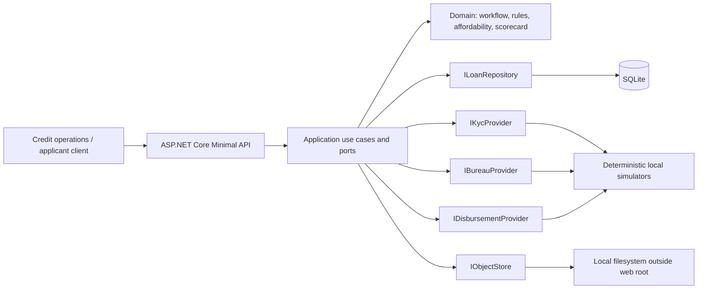
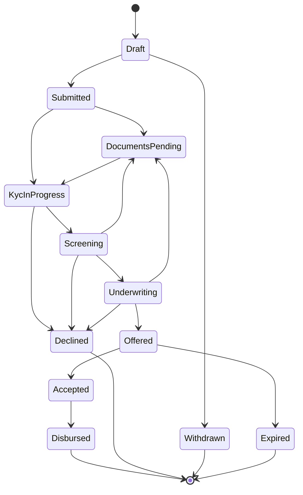
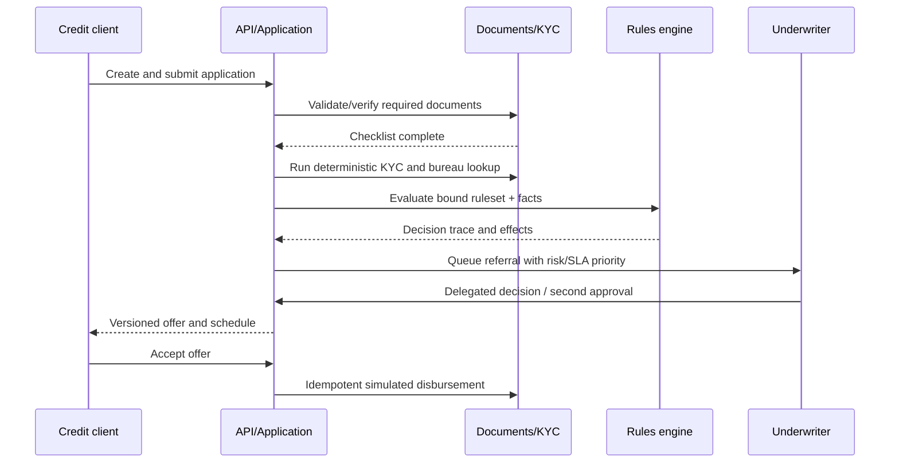

# Rift Valley Credit Loan Origination & Credit Workflow Platform

## Portfolio Classification
Self-directed engineering case study. This is a fictional, synthetic-data reference implementation for Rift Valley Credit Ltd (fictional), not client work and not a live lending system.

## Executive Summary
A modular .NET 10 loan-origination platform for SME and personal products in KES and USD. Its central feature is a deterministic, versioned rules engine that returns an auditable decision trace instead of an opaque score. The platform models application workflow, document checks, KYC and bureau simulators, affordability, human underwriting, offers, and idempotent disbursement simulation.

## Business Problem
Credit operations must explain why an application was declined, referred, or offered years after the event. Static code-only policy logic and undocumented manual overrides make that difficult. This implementation binds every application to immutable product and ruleset versions, records inputs and rule results, and preserves the decision record alongside the workflow history.

## Functional Requirements
- Individual and SME customers, synthetic identity/contact data, income, obligations, dependants, KYC state, and fuzzy duplicate detection.
- Versioned product catalogue with principal/term limits, rate method, fees, currency, documents, collateral, and bound eligibility rulesets.
- Explicit lifecycle and SLA timers: Draft → Submitted → DocumentsPending → KycInProgress → Screening → Underwriting → Offered → Accepted → Disbursed, with terminal decline, withdrawal, and expiry paths.
- Local object-store document upload, content/size checks, reviewer verification, expiry, and mandatory-checklist gating.
- Deterministic KYC/bureau/disbursement simulators, explainable scorecard, four-eyes underwriting, immutable offer acceptance, and reconciliation.
- Persisted rules traces, regulatory-style decision records, what-if simulation, and append-only hash-chained audit entries.

## Non-Functional Requirements
SQLite is the default and no external infrastructure is required. The API uses JWT scope policies, RFC 7807 responses, correlation IDs, headers, rate limiting, pagination, health checks, and OpenTelemetry console telemetry. All demo applicant data is synthetic.

## Architecture
The application is a modular monolith with dependency direction `Api → Infrastructure → Application → Domain`. Domain calculation and decision logic have no EF Core or ASP.NET dependency. Application owns ports; Infrastructure implements SQLite and local deterministic adapters.

## Architecture Diagram


## Technology Stack
- .NET 10 / ASP.NET Core Minimal APIs / OpenAPI and Swagger UI in Development
- EF Core 10 with SQLite default persistence
- JWT bearer authentication and scope policies
- OpenTelemetry ASP.NET Core/custom business metrics with console exporter
- xUnit, `WebApplicationFactory`, and SQLite in-memory integration tests

## Domain Model
The main records are `CustomerProfile`, immutable `LoanProductVersion`, `LoanApplication`, `LoanDocument`, `RuleSetDefinition`, `DecisionTrace`, `RiskAssessment`, `UnderwritingQueueItem`, `LoanOffer`, `DisbursementRecord`, `AuditEntry`, and `DecisionRecord`. See [database schema](docs/database-schema.md).

## Core Workflows




The system rejects illegal state edges, recalculates SLA due time on each transition, and records every transition with actor, reason, timestamp, and correlation ID.

## Security Model
Local development tokens are issued only in Development/Testing and contain explicit scopes: `loans:apply`, `loans:underwrite`, `loans:approve`, and `loans:admin`. Sensitive changes are audited. Uploads are content/size constrained and stored outside the web root. Production boot rejects the checked-in development signing key. Details: [security review](docs/security/security-review.md).

## Reliability & Failure Handling
The KYC simulator categorizes timeouts as transient and the application retries once. Disbursement references are idempotent, pending transfers can be completed by callback, failed transfers require a new retry reference, and reversal callbacks preserve reconciliation evidence. Queue claims expire. Optimistic application versions detect concurrent changes.

## Observability
Every response has `X-Correlation-Id`; audit entries use the same ID. OpenTelemetry exposes ASP.NET request traces and custom decision-latency, approval, referral, and SLA-breach meters to the console exporter. `/health/live` and `/health/ready` distinguish liveness from SQLite readiness.

## Testing Strategy
Unit tests pin rounding-sensitive schedules, IRR/APR, affordability stress boundaries, scorecard factors, rule combinators/outcomes/traces, workflow edges, documents, KYC, authorities, offers, and disbursement behavior. Integration tests use an open SQLite in-memory connection and exercise authentication, authorization, validation, and the full HTTP lifecycle. Actual output is retained in [docs/test-results.md](docs/test-results.md).

## Local Development
```powershell
Set-Location C:\Users\rukwaropaul\Downloads\DEV\Projects\14-loan-origination-platform
dotnet restore
dotnet run --project src\LoanOrigination.Api
```
The Development profile listens on `http://localhost:5014`, initializes SQLite with `EnsureCreated`, and idempotently seeds fictional products and applicants. Invoke `.\scripts\demo.ps1` in a second shell after startup.

## Running with Docker
Docker configuration created but Docker is unavailable on the build host; the compose stack has not been started or verified. The Docker files are convenience artifacts only and are explicitly marked **UNVERIFIED**.

## API Documentation
OpenAPI is served at `/openapi/v1.json`; Swagger UI is at `/docs` in Development. Main groups are `/api/v1/customers`, `/products`, `/applications`, `/rulesets`, `/underwriting/queue`, `/offers`, `/disbursements`, and `/audit`. Get a local Development token from `/api/v1/auth/token`.

## Example Usage
```powershell
$token = (Invoke-RestMethod http://localhost:5014/api/v1/auth/token -Method Post `
  -ContentType application/json -Body '{"subject":"demo","scopes":["loans:apply","loans:underwrite","loans:approve","loans:admin"]}').accessToken
$headers = @{ Authorization = "Bearer $token"; "X-Correlation-Id" = "readme-demo-001" }
Invoke-RestMethod "http://localhost:5014/api/v1/products?page=1&pageSize=20" -Headers $headers
Invoke-RestMethod http://localhost:5014/api/v1/applications -Method Post -Headers $headers `
  -ContentType application/json -Body '{"customerId":"<seeded-customer-guid>","productCode":"SME-FLEX","productVersion":1,"requestedPrincipal":100000,"requestedTermMonths":12,"currency":"KES"}'
```
An application response includes a version-bound `rulesetId`, `rulesetVersion`, event history, KYC state, and—after screening—the persisted `decisionTrace` with each input read and rule result.

## Performance / Load Testing
No load test or performance claim is included. This portfolio project has not been benchmarked; SQLite and local object storage are selected for zero-infrastructure reproducibility rather than throughput.

## Trade-offs
JSON payload snapshots in normalized lookup tables make historical aggregate persistence easy to inspect but are not a substitute for a production warehouse or field-level data-retention program. SQLite and local adapters reduce setup cost but do not model vendor latency, regional failover, key management, or high-contention behavior. `EnsureCreated` is intentional for this case study; a production deployment would use reviewed migrations.

## Architecture Decisions
Five concise decisions cover declarative rules, transparent scorecard rationale, immutable version binding, four-eyes authority, and money/rounding: [ADRs](docs/decisions/).

## Known Limitations
- KYC, bureau, object storage, and payment rails are deterministic in-process/local adapters; no real provider call is implemented.
- The simulator callback is API-policy protected rather than a real signed provider webhook.
- Audit hashes detect accidental alteration in the application path but are not an externally anchored tamper-evident ledger.
- There is no front end, encryption-at-rest configuration, background worker, or production identity provider.

## Future Improvements
Introduce production adapters behind existing ports (Smile ID/Trulioo-style KYC, bureau, bank/mobile-money rails, Blob Storage), signed callback verification, OIDC/JWKS, immutable external audit anchoring, migration scripts, retained decision exports, configurable SLA policies, and a credit-operations UI.

## Portfolio Talking Points
This project demonstrates a deliberate alternative to fake credit “AI”: every decision is reproducible using stored facts, bound versions, score contributions, and rule trace entries. It also shows the hard operational edges—rounding final installments, manual override audit, authority limits, document gating, provider timeout, retry, idempotence, callbacks, and reversal reconciliation.

## Upwork Portfolio Description
**Loan Origination & Credit Workflow Platform — self-directed engineering case study**  
Problem: lenders need explainable, auditable decisions across automated policy and human underwriting.  
Built: a .NET 10 modular loan workflow with SQLite, deterministic provider simulators, versioned products/rules, transparent affordability/scorecard calculations, and idempotent disbursement simulation.  
Engineering focus: decision reproducibility, money rounding, policy traceability, four-eyes controls, workflow reliability, and HTTP verification.  
This is a self-directed portfolio project, not client work.
