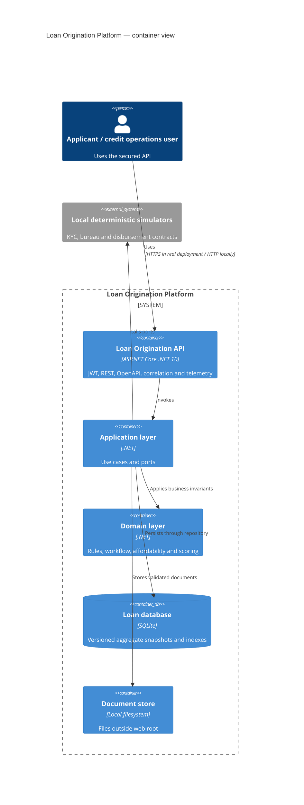
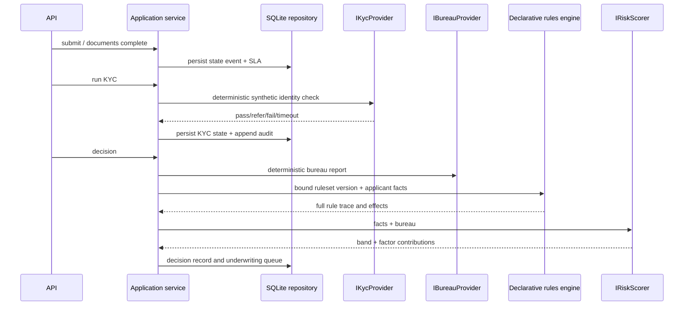

# Architecture

## Boundaries
`LoanOrigination.Domain` owns deterministic calculations, workflow transition rules, the rules interpreter, scorecard, offer lifecycle, and authority checks. `LoanOrigination.Application` owns use cases, request contracts, and ports. `LoanOrigination.Infrastructure` supplies EF Core/SQLite, local filesystem object storage, deterministic KYC/bureau/disbursement adapters, and append-only audit persistence. `LoanOrigination.Api` is the composition root and HTTP boundary.

## Decision sequence

## Runtime configuration
`Database:Provider=Sqlite` and `Database:ConnectionString` select the default zero-infrastructure adapter. `ObjectStorage:RootPath` is resolved beneath the content root. `Jwt` binds issuer, audience, and local signing key; startup rejects the known development key in Production. Real providers are intentionally absent: a Smile ID/Trulioo-style KYC adapter, production bureau, Blob Storage, bank/mobile-money rails, and OIDC would implement the existing Application ports.

## Production KYC adapter shape (documented, not implemented)
A `SmileIdKycProvider` or `TruliooKycProvider` would implement `IKycProvider`, obtain an OAuth/service credential from a secret store, apply a bounded HTTP timeout/retry policy, submit consented identity attributes, and map vendor decision/reason codes only into `Pass`, `Refer`, `Fail`, `PepHit`, `SanctionsHit`, or transient `Timeout`. It would retain a provider reference and normalized reason code—not raw document images—in the decision record. Vendor callbacks would verify HMAC-SHA256 over `timestamp.nonce.rawBody` with constant-time comparison and replay protection, as the Production-only middleware contract demonstrates. No provider SDK, endpoint, credential, or network call exists in this project.

## Persistence strategy
The EF Core schema uses indexed lookup columns plus serialized immutable aggregate payloads. This preserves decision snapshots without rehydrating a changing current product/ruleset. It is a pragmatic case-study trade-off; a production deployment would use reviewed migrations, retention controls, encrypted managed storage, and an analytical projection.
