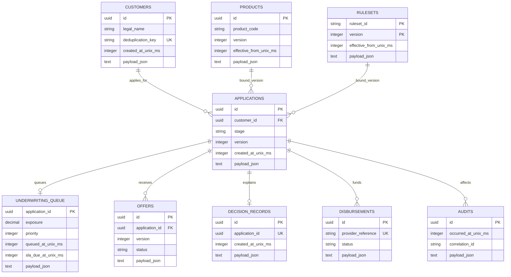

# Database Schema

SQLite is the default local store. EF Core maps explicit keys and indexes for lookup paths; aggregate payloads are JSON snapshots to preserve immutable historical decision context.

## Tables, keys, and indexes

| Table | Primary key | Unique/indexed lookup paths | Purpose |
|---|---|---|---|
| `Customers` | `Id` | unique `DeduplicationKey`, `LegalName` index | Synthetic applicant profile snapshot |
| `Products` | `Id` | unique `(ProductCode, Version)` | Immutable product versions |
| `Rulesets` | `(RulesetId, Version)` | composite primary key | Immutable declarative ruleset versions |
| `Applications` | `Id` | `CustomerId`; `(Stage, CreatedAtUnixMilliseconds)` | Workflow aggregate and optimistic `Version` |
| `UnderwritingQueue` | `ApplicationId` | `(Priority, SlaDueAtUnixMilliseconds)` | Claim/lock and triage projection; payload retains exposure and queue age |
| `Offers` | `Id` | unique `(ApplicationId, Version)` | Versioned terms, schedule, acceptance state |
| `Disbursements` | `Id` | unique `ProviderReference` | Provider idempotency and reconciliation |
| `Audits` | `Id` | occurrence timestamp, correlation ID | Append-only audit hash chain |
| `DecisionRecords` | `Id` | unique `ApplicationId` | Historical explanation bundle |

## Snapshot contents
`Applications.Payload` contains applicant facts, stage events, document metadata, bound product/ruleset versions, KYC status, decision trace, risk assessment, and underwriting decision. Document bytes are not stored in SQLite; `LoanDocument.ObjectKey` points to the configured local object-store path. `DecisionRecords.Payload` repeats the immutable facts, trace, product/ruleset provenance, and scorecard version intentionally for regulatory-style reconstruction.

## Concurrency and integrity
Application saves compare the stored `Version` to the caller’s expected version and reject stale updates. Product/ruleset version uniqueness prevents replacement. Provider reference uniqueness gives idempotent disbursement semantics. The application never exposes a mutation/deletion API for audit rows; each `AfterHash` chains from the previous row hash.
