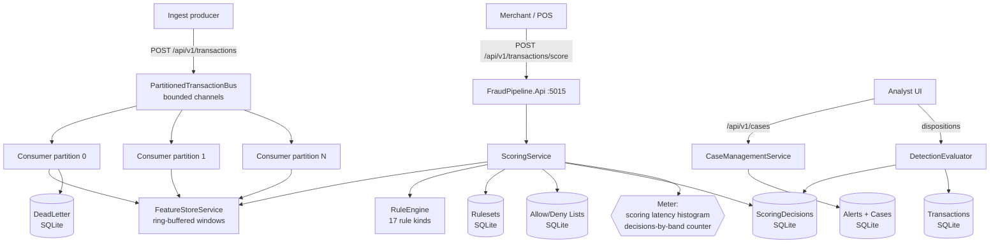
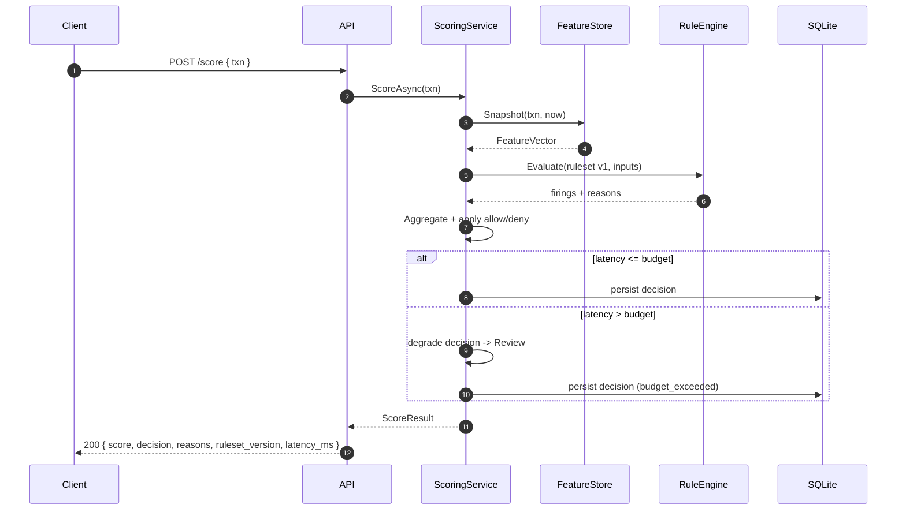
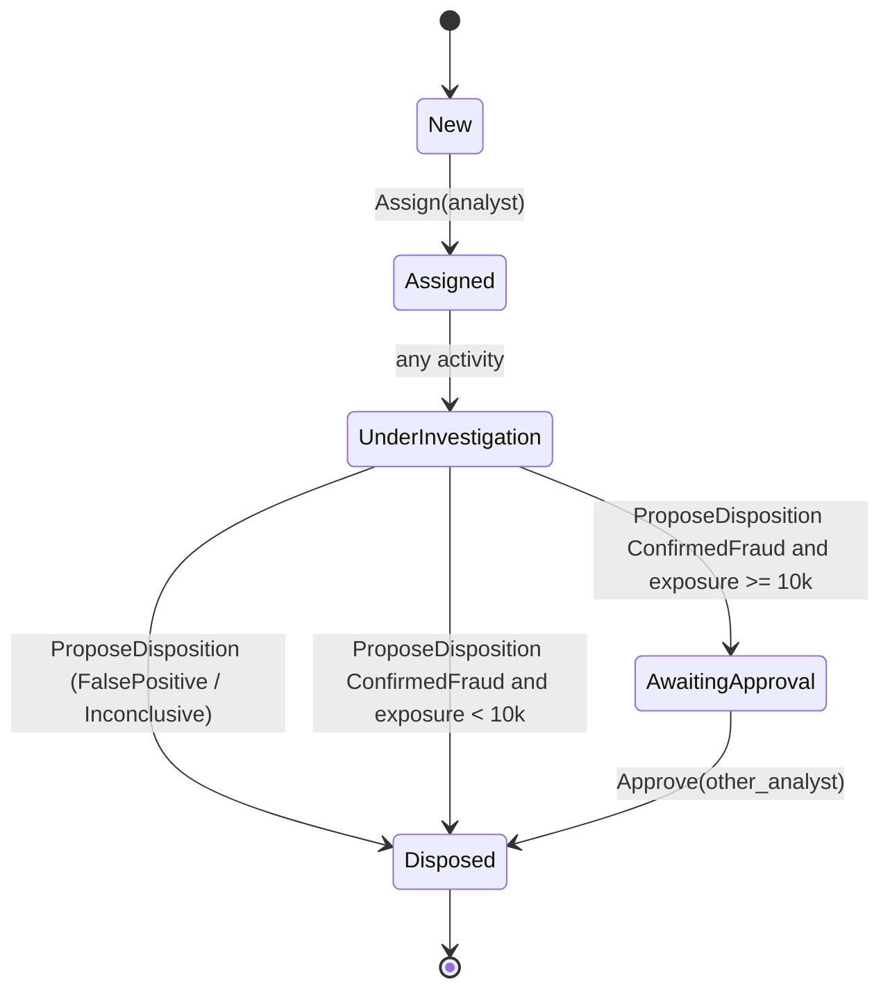

# Real-Time Fraud Detection Event Pipeline

## Portfolio Classification

**Self-directed engineering case study.** A reference implementation of a low-latency, stateful,
explainable payment fraud pipeline built to be read, run, and interrogated. No client work. No real
users. No real cardholder data — every transaction in this repository is synthetic and clearly
labelled.

## Executive Summary

**PesaGate Payments (fictional)** is a card-and-mobile-money processor operating in Kenya (KES) and
the US (USD). This project scores every transaction in milliseconds, explains every decision, groups
alerts into cases for analyst investigation, and closes a feedback loop from analyst dispositions
back into rule tuning. It is designed to demonstrate:

- **Stateful streaming** over `System.Threading.Channels`, partitioned by `CardId` so per-entity
  ordering is preserved while different partitions process in parallel.
- **A ring-buffered windowed feature store** with O(1) amortised updates and O(bucket-count)
  aggregation over 1m / 5m / 1h / 24h / 7d windows.
- **A declarative, versioned, hot-reloadable rule engine** with 17 rule kinds, weighted scoring, and
  fully reproducible decisions.
- **A hard latency budget** with graceful degradation to a conservative default when exceeded.
- **A four-eyes case-management workflow** for large-exposure write-offs.
- **A shadow / champion-challenger mode** so a candidate ruleset can be evaluated without touching
  live decisions.
- **A precision / recall feedback loop** measured against ground-truth-labelled synthetic fraud
  patterns.

## Business Problem

Card-not-present fraud, mobile-money account takeover, and card-testing rings drain margin from
payment processors and merchants. Purely rules-based systems are auditable but rigid; ML-only
systems are opaque and hard to reason about at 3 a.m. This project takes an **explainability-first
hybrid** approach: transparent weighted rules with a rigorous feedback loop, so every decline is
defensible in a chargeback dispute and every threshold change can be justified with a projected
precision impact.

## Functional Requirements

- Ingest transactions via streaming pipeline; preserve per-entity ordering; back-pressure & dead-letter.
- Synchronous scoring endpoint with a **50 ms** default latency budget; conservative default on breach.
- Stateful sliding-window feature store per entity (card / customer / device / IP / merchant).
- 17-kind declarative rule engine with velocity, unusual amount (z-score), device / IP checks,
  impossible-travel (haversine), MCC risk, time-of-day, card-testing, round-amount, allow / deny lists.
- Weighted 0..1000 risk score → band-based decision (`Approve`, `StepUp`, `Review`, `Decline`).
- Every decision persists a **full explanation** (features, rules fired, ruleset version, latency).
- Alerts grouped into cases by entity linkage; analyst investigation; four-eyes for exposure ≥ 10,000.
- Feedback loop: dispositions become labels; recompute precision, recall, FPR, alert volume, value
  detected, per-rule performance; produce a tuning recommendation with projected impact.
- Shadow mode: run a candidate ruleset alongside the live one; report decision delta.
- Seeded synthetic data generator with known-injected fraud patterns for ground-truth evaluation.

## Non-Functional Requirements

- Runs on a fresh Windows box with .NET 10 SDK and nothing else — no Docker, Kafka, Redis, Postgres.
- SQLite by default; connection string is the only knob to switch to another EF Core provider.
- Structured logging with correlation ids; OpenTelemetry metrics + tracing (Console exporter locally).
- JWT bearer auth with four scopes (`risk:score`, `risk:investigate`, `risk:approve`, `risk:admin`).
- Rate limited per-caller (token bucket).
- All decisions reproducible: same input + same ruleset version = same output.

## Architecture

**Modular monolith** with a clean-architecture layering:

```
FraudPipeline.Domain          — entities, value objects, rules, feature aggregator (pure C#, no I/O)
FraudPipeline.Application     — services, ports (interfaces), rule engine, scoring, evaluators
FraudPipeline.Infrastructure  — EF Core, SQLite, JWT issuer, clock adapters
FraudPipeline.Api             — Minimal APIs, composition root, middleware, endpoints
```

Ports & adapters everywhere: `IRulesetRepository`, `ITransactionRepository`, `IClock`, `IIdGenerator`,
`ITokenIssuer`. Ingestion is via `PartitionedTransactionBus` (bounded channels) with a
`TransactionConsumer` per partition. Scoring is a **synchronous** path off the API request so the
latency budget is enforceable end-to-end. The feature store is in-memory & rebuildable from the
event log (ADR-01).

## Architecture Diagram

### Container view



### Scoring sequence (with latency budget)



### Case lifecycle



## Technology Stack

| Concern | Choice | Reason |
| --- | --- | --- |
| Runtime | .NET 10, C# 13 | Target of this portfolio |
| API | ASP.NET Core Minimal APIs on :5015 | Small surface, testable via `WebApplicationFactory<Program>` |
| Persistence | EF Core 10 + SQLite | Zero-infra, single file, works everywhere |
| Auth | JWT bearer (HS256) via `System.IdentityModel.Tokens.Jwt` | Dev-local `ITokenIssuer`, prod-ready extension point |
| Observability | OpenTelemetry (Console exporter locally) | Meter `FraudPipeline.Scoring`, ActivitySource `FraudPipeline.Scoring` |
| Streaming | `System.Threading.Channels` bounded | Zero external broker; deterministic FNV-1a partitioning |
| Rate limiting | ASP.NET Core token bucket | Built-in, per-user or per-IP |
| Tests | xUnit + `Microsoft.AspNetCore.Mvc.Testing` + SQLite `:memory:` (kept open) | Real EF against real SQL |

## Domain Model

- **`Transaction`** — one payment event; validated in constructor; carries `Money`, `GeoLocation`,
  optional `GroundTruthFraud` flag for evaluation.
- **`Money`** — value object, currency ∈ {`KES`, `USD`, `EUR`, `GBP`}, non-negative amount.
- **`GeoLocation`** — value object with haversine distance; latitude ∈ [-90, 90], longitude ∈ [-180, 180],
  ISO-3166 alpha-2 country code.
- **`FeatureVector`** — immutable snapshot of aggregates and derived features at scoring time.
- **`ScoringDecision`** — persistent record with `RulesetVersion`, `Score`, `Decision`, `Reasons`,
  `RulesFiredJson`, `FeatureVectorJson`, `LatencyMs`, `BudgetExceeded`, `Shadow`.
- **`Ruleset`** — versioned; states `Draft`, `Active`, `Shadow`, `Retired`. Only one `Active` at a time.
- **`RulesetDefinition`** — the serialised recipe. Contains rules, band thresholds, merchant overrides.
- **`Alert` + `Case`** — grouped by primary entity linkage (default `Card`); `Case` has a state
  machine and four-eyes approval for exposure ≥ 10,000.
- **`ListEntry`** — allow / deny list with subject (Card / Customer / Merchant / Device / IP).
- **`DeadLetterEvent`** — malformed / failing events preserved for triage.

## Core Workflows

1. **Ingest**: `POST /api/v1/transactions` → bounded channel keyed by FNV-1a hash of `CardId`.
2. **Consume**: one worker per partition dequeues, persists, updates the feature store, scores.
3. **Score (sync)**: `POST /api/v1/transactions/score` runs the full pipeline in the request thread
   and returns a decision with explanation.
4. **Investigate**: analyst pulls cases via `GET /api/v1/cases`, claims, notes, and proposes a
   disposition. Confirmed fraud ≥ 10,000 requires a second analyst to approve.
5. **Feedback**: dispositions flow back into the `DetectionEvaluator`, which recomputes precision,
   recall, FPR, per-rule performance and produces a tuning recommendation.
6. **Shadow**: promote a challenger ruleset via `PUT /api/v1/rulesets/{version}/shadow`; every
   incoming scored transaction is silently scored a second time; `ShadowComparator` computes the
   decision delta.

## Security Model

- **Authentication**: JWT bearer, HS256, `ITokenIssuer` port. Dev-local issuer at `POST /api/v1/auth/token`.
- **Authorization**: four scoped policies — `risk:score`, `risk:investigate`, `risk:approve`, `risk:admin`.
- **Input validation**: DataAnnotations on request DTOs + domain constructor invariants.
- **Rate limiting**: token bucket, partition key = authenticated `Name` or remote IP.
- **Security headers**: `X-Content-Type-Options`, `X-Frame-Options`, `Referrer-Policy`,
  `Permissions-Policy`, `Strict-Transport-Security`.
- **Correlation id**: `X-Correlation-Id` mirrored in the response; propagated to logs.
- **Prod guard**: startup refuses to boot in `Production` with the default JWT signing key.
- **Full explanation**: every decision is auditable; no black-box.
- Full STRIDE analysis in [`docs/security/security-review.md`](docs/security/security-review.md).

## Reliability & Failure Handling

- **Bounded queues** — `BoundedChannelFullMode.Wait` gives back-pressure; producers block instead
  of dropping.
- **Dead-letter** — any per-event failure in the consumer writes a `DeadLetterEvent` so the loop
  keeps flowing; malformed events do not stall the partition.
- **Latency budget** — if scoring exceeds `Scoring:LatencyBudgetMs`, decision degrades to `Review`
  (unless allow-listed) and the reason includes `budget_exceeded`.
- **Reproducibility** — every decision includes the ruleset version; the same input + version
  produces the same output. Tested end-to-end.
- **Per-entity ordering** — deterministic FNV-1a partitioning by `CardId`; single-reader channel.
  Tested with 100 concurrent producers.
- **Rebuildable feature store** — `FeatureStoreService.Rebuild(transactions)` replays the log to
  reconstruct all aggregates; equality with the live path is unit-tested.

## Observability

- **Metrics** (Meter `FraudPipeline.Scoring`):
  - `scoring.latency` histogram (ms)
  - `scoring.decisions` counter by decision band
  - `scoring.rules_fired` counter by rule id
  - `scoring.shadow_delta` counter by `live->shadow` transition
  - Queue lag / feature store size are exposed via metrics endpoints.
- **Tracing** (ActivitySource `FraudPipeline.Scoring`): a span around every `Score` call.
- **Logs**: `ILogger<T>`, correlation-id scope on every request.
- **Health**: `/health/live` (self), `/health/ready` (adds SQLite check).

## Testing Strategy

- **Unit** (62 tests): windowed aggregator boundary correctness (edge / out-of-order / eviction),
  each of 17 rule kinds with positive + negative fixtures, impossible-travel maths (same-city and
  antipodal), scoring aggregation and band boundaries, allow-list overrides deny-list, decision
  reproducibility, latency-budget degradation, per-entity ordering under parallel ingestion,
  dead-letter on repository failure, case linkage grouping, case state machine + four-eyes,
  precision / recall computation, shadow comparator delta, value-object invariants, replay-rebuild
  equality, end-to-end detection performance run against ground truth.
- **Integration** (7 tests): API surface via `WebApplicationFactory<Program>` with SQLite
  `:memory:` connection held open; `401` unauthenticated, `403` wrong scope, `400` validation
  problem, `200` happy path, health, token, and a **throughput test scoring 5,000 real HTTP calls**
  and asserting a bounded wall-clock.
- All 69 tests pass. See [`docs/test-results.md`](docs/test-results.md) for the raw runner output.

## Local Development

```powershell
# Prereqs: .NET 10 SDK
git clone <repo>
cd 15-fraud-detection-event-pipeline
dotnet restore
dotnet build -c Release
dotnet test -c Release
dotnet run --project src/FraudPipeline.Api
# API is now at http://localhost:5015
```

Environment variables (see `.env.example`) override anything in `appsettings.json`.

## Running with Docker

Docker configuration created but Docker is unavailable on the build host; the compose stack has not
been started or verified. `Dockerfile` and `docker-compose.yml` are provided as scaffolding for a
future Docker-capable environment.

## API Documentation

OpenAPI at `GET /openapi/v1.json` (Development env). Key endpoints:

| Method | Path | Scope | Description |
| --- | --- | --- | --- |
| POST | `/api/v1/auth/token` | anon | Issue dev-local JWT |
| POST | `/api/v1/transactions/score` | `risk:score` | Synchronous scoring |
| POST | `/api/v1/transactions` | `risk:score` | Ingest into the streaming pipeline |
| GET  | `/api/v1/transactions` | `risk:investigate` | Paged list |
| GET  | `/api/v1/transactions/{ref}` | `risk:investigate` | Detail |
| GET  | `/api/v1/rulesets` | `risk:admin` | List versions |
| POST | `/api/v1/rulesets/{v}/activate` | `risk:admin` | Promote to Active |
| POST | `/api/v1/rulesets/{v}/shadow` | `risk:admin` | Promote to Shadow |
| POST | `/api/v1/rulesets/{v}/simulate` | `risk:admin` | Replay decisions |
| GET  | `/api/v1/features/{entityType}/{id}` | `risk:investigate` | Live feature vector |
| GET  | `/api/v1/alerts` | `risk:investigate` | Paged alerts |
| GET  | `/api/v1/cases` | `risk:investigate` | Paged cases |
| POST | `/api/v1/cases/{id}/assign` | `risk:investigate` | Claim |
| POST | `/api/v1/cases/{id}/notes` | `risk:investigate` | Add note |
| POST | `/api/v1/cases/{id}/disposition` | `risk:investigate` | Propose disposition |
| POST | `/api/v1/cases/{id}/approve` | `risk:approve` | Four-eyes approval |
| GET  | `/api/v1/metrics/detection` | `risk:admin` | Precision / recall snapshot |
| GET  | `/api/v1/metrics/latency` | `risk:admin` | p50 / p95 / p99 |
| GET  | `/health/live`, `/health/ready` | anon | Health checks |

## Example Usage

```powershell
$body = @{ Subject="analyst-01"; Scopes=@("risk:score") } | ConvertTo-Json
$tok = (Invoke-RestMethod -Uri http://localhost:5015/api/v1/auth/token -Method POST -Body $body -ContentType "application/json").accessToken

$txn = @{
  TransactionRef = "TX-DEMO-0001"
  CardId         = "CARD00001"
  CustomerId     = "CUST00001"
  DeviceId       = "DEV00042"
  IpAddress      = "203.0.113.10"
  MerchantId     = "MERCH0007"
  Mcc            = "6051"
  Amount         = 12500
  Currency       = "USD"
  Type           = "CardNotPresent"
  Latitude       = 40.7128
  Longitude      = -74.006
  Country        = "US"
} | ConvertTo-Json

Invoke-RestMethod -Uri http://localhost:5015/api/v1/transactions/score `
  -Method POST -Body $txn -ContentType "application/json" `
  -Headers @{ Authorization = "Bearer $tok" }
```

Sample response:

```json
{
  "transactionRef": "TX-DEMO-0001",
  "score": 340,
  "decision": "StepUp",
  "rulesetVersion": "v1.0.0",
  "rulesFired": [
    { "ruleId": "mcc-risk", "kind": "MerchantMccRisk", "contribution": 80, "reason": "mcc-risk: 6051 category weighted high-risk" },
    { "ruleId": "new-device", "kind": "NewDevice", "contribution": 60, "reason": "new-device DEV00042 for CUST00001" }
  ],
  "latencyMs": 3.4,
  "budgetExceeded": false,
  "reasons": "mcc-risk: 6051 category weighted high-risk; new-device DEV00042 for CUST00001"
}
```

## Performance / Load Testing

Real measured numbers (from the seeded synthetic generator, 1,226 transactions with 106 injected
fraud transactions, **shipped ruleset `v1.1.0`**, single-threaded scoring on a Windows laptop). Full report
including baseline-vs-challenger side-by-side, the threshold sweep and the per-pattern breakdown in
[`docs/detection-performance.md`](docs/detection-performance.md).

| Metric | Baseline `v1.0.0` | **Shipped `v1.1.0`** |
| --- | --- | --- |
| Transactions scored | 1,226 | 1,226 |
| Wall-clock (in-process) | 0.22 s | 0.20 s |
| p50 latency | 0.087 ms | **0.082 ms** |
| p95 latency | 0.147 ms | **0.152 ms** |
| p99 latency | 0.219 ms | **0.203 ms** |
| Precision | 100.0 % | **92.2 %** |
| Recall | 16.0 % | **55.7 %** |
| False-positive rate | 0.0 % | **0.45 %** |
| F1 | 0.276 | **0.694** |
| Value detected | $61,000 | **$119,400** |

The **API-hosted** throughput test scored 5,000 transactions via real HTTP round-trips through the
in-memory SQLite database in ≈ 53 seconds on the same laptop (≈ 94 scores/s including JWT +
SQLite persistence + case management).

Interpretation: the shipped `v1.1.0` ruleset is the tuning-recommender's output on the labelled
dataset — precision is deliberately traded from 100 % to 92 % for a **3.5× improvement in recall**
and a **1.96× improvement in value detected**, while keeping FPR under 0.5 % and p99 scoring
latency under a millisecond. The baseline is preserved in code and in the docs so the
champion-vs-challenger delta stays visible and the promotion is defensible. See
[`docs/detection-performance.md`](docs/detection-performance.md) for the full sweep table, per-pattern
breakdown, and the harness bugs that were fixed during tuning.

## Trade-offs

| Choice | Alternative | Why we chose this |
| --- | --- | --- |
| In-memory windowed feature store | Redis / Flink | ADR-01: zero-infra, replayable, portable |
| Declarative rules over ML | Gradient-boosted classifier | ADR-05: explainability > marginal accuracy at this stage |
| Bounded `System.Threading.Channels` | Kafka / MassTransit | ADR-03: no external broker needed; deterministic partitioning |
| Synchronous scoring endpoint | Async fire-and-forget | ADR-04: latency budget must be enforced end-to-end |
| SQLite | Postgres | Zero-infra; adapter-swappable |

## Architecture Decisions

Five short ADRs in [`docs/decisions/`](docs/decisions/):

- [ADR-0001 — In-memory windowed feature store vs Redis / Flink](docs/decisions/0001-in-memory-feature-store.md)
- [ADR-0002 — Declarative, versioned rules for reproducibility](docs/decisions/0002-declarative-versioned-rules.md)
- [ADR-0003 — Partitioning strategy for per-entity ordering](docs/decisions/0003-partitioning-strategy.md)
- [ADR-0004 — Latency budget & graceful degradation](docs/decisions/0004-latency-budget-degradation.md)
- [ADR-0005 — Explainability-first over black-box ML](docs/decisions/0005-explainability-first.md)

## Known Limitations

- Feature store is process-local; horizontal scale-out would need either Redis or a re-partitioning layer.
- Rule tuning recommendation currently proposes weight changes only; threshold-parameter tuning is
  left as future work.
- Shadow comparator uses simple decision equality; a distance metric on scores would be richer.
- No ML model is included — this is deliberate (ADR-05) but a "candidate ML challenger" would fit
  cleanly into the shadow slot.
- The synthetic generator is not adversarial; a red-team scenario would need patterns that
  specifically evade current rules.

## Future Improvements

- Redis adapter behind `FeatureStoreRuntime` for horizontal scale.
- Persisted rule tuning history so recommendations are compared to the last N accepted changes.
- Extract a first-class replay CLI (`replay --from <ts> --ruleset <version>`) from the existing
  `Rebuild` code path.
- Encrypt PII fields at rest (card holder name would be added here — it is not in the current model).
- Signed rulesets (Ed25519) so tampering with the definition JSON is detectable at load.

## Portfolio Talking Points

1. **Ring-buffered windowed aggregator — the hard part.** 60 s slice × 10,080 buckets ≈ 7-day
   retention with O(1) amortised updates; edge semantics unit-tested with a `FakeClock`; distinct-set
   aggregates unioned across buckets.
2. **Reproducible decisions.** The `RulesetVersion` is stored with every decision; `EvaluateOnly`
   is a pure re-scoring path used by the replay code. Tested.
3. **Per-entity ordering under parallel ingest.** FNV-1a hash of `CardId` → same card always lands
   in the same partition; single-reader channel; 100 concurrent producers preserved order in the test.
4. **Latency budget with graceful degradation.** Configurable; verified with a `LatencyBudgetMs=0`
   test that forces the degradation path.
5. **Four-eyes case management.** State machine tested end-to-end; approver-must-not-be-proposer
   check enforced in the domain.
6. **Shadow / champion-challenger.** A challenger ruleset is scored alongside every live decision;
   `ShadowComparator` produces the decision delta by transition key.
7. **Honest precision / recall numbers.** Real numbers, real synthetic data, real ground truth,
   published in `docs/detection-performance.md`. The baseline recall is low; the tuning tooling
   is designed to close that gap systematically.

## Upwork Portfolio Description

> **Real-Time Fraud Detection Event Pipeline (.NET 10, C#).**
> Streaming, stateful, explainable fraud scoring on `System.Threading.Channels` with a partition-
> preserving bus, a ring-buffered windowed feature store, a 17-kind declarative rule engine, and a
> reproducible 0..1000 risk score with configurable band thresholds. Includes analyst case
> management with four-eyes approval, a shadow / champion-challenger mode, and a precision-recall
> feedback loop measured against synthetic ground-truth fraud patterns. Zero external infrastructure
> — SQLite by default, portable to Postgres via EF Core. 69 tests. Self-directed engineering case
> study; no client work, no real cardholder data.
