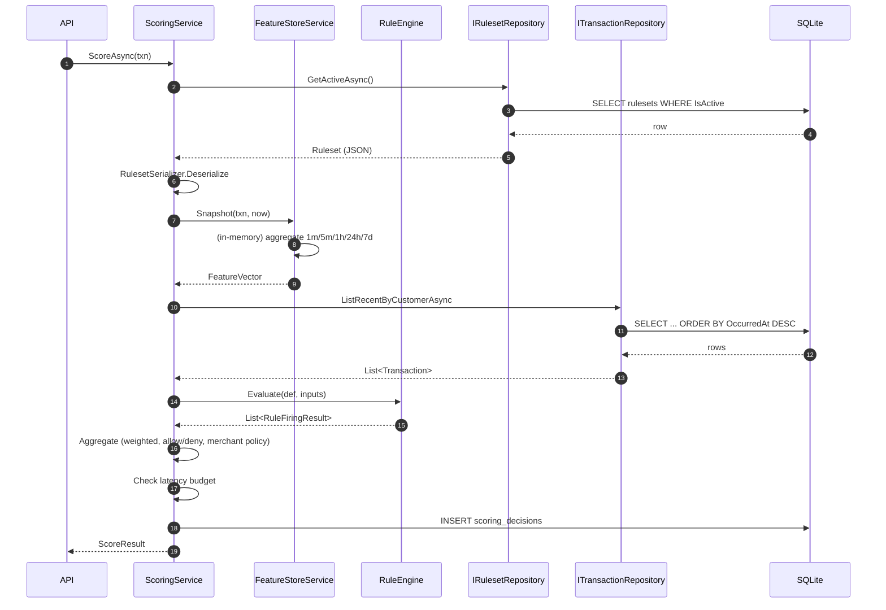
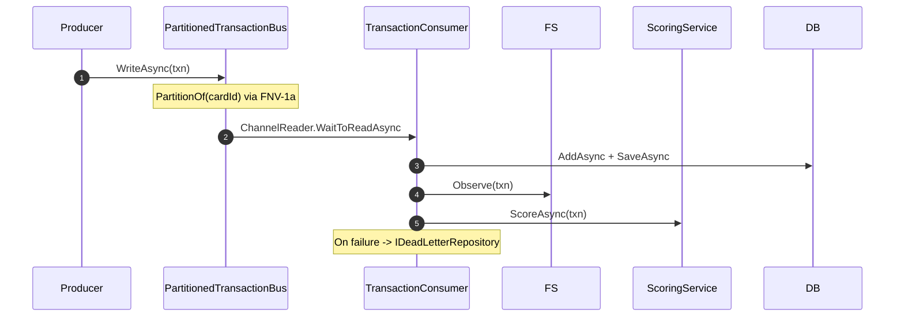
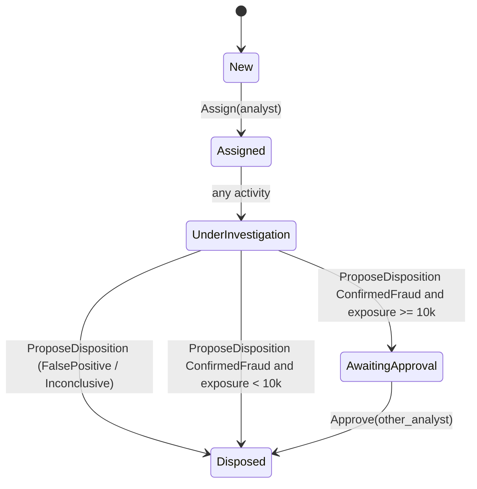

# Architecture

## One-page overview

Modular monolith. Clean architecture layering:

- **`FraudPipeline.Domain`** — pure C#. Entities, value objects, feature aggregator, rule
  definitions. No I/O, no async, no framework references. Pure functions and small classes with
  invariants in constructors.
- **`FraudPipeline.Application`** — services, ports (interfaces), the rule engine, the scoring
  service, the detection evaluator. Depends on `Domain` only.
- **`FraudPipeline.Infrastructure`** — EF Core, SQLite, JWT issuer, clock. Adapters that satisfy
  the ports in `Application`.
- **`FraudPipeline.Api`** — the composition root. Minimal APIs, middleware, endpoint groups.
  Only project that references `Microsoft.AspNetCore.*`.

## Container view

See the README's Mermaid diagram for the container view.

## Sequence — score

## Sequence — ingest + async consume

## Case lifecycle

## Key design invariants

1. **`Domain` has no I/O.** The feature aggregator is pure logic; the clock is injected. This is
   what makes deterministic testing with `FakeClock` possible.
2. **`Application` depends only on `Domain`.** Ports are defined here; adapters in `Infrastructure`
   implement them.
3. **Ruleset immutability.** Once a `Ruleset` has been activated, its `DefinitionJson` is not
   edited. To change rules, add a new version.
4. **Per-entity ordering by partition hash.** Same key → same partition → same reader.
5. **Reproducible decisions.** Same input + same ruleset version = same output. Enforced by
   `EvaluateOnly` being a pure function of its arguments.

## Where extension points are

- `IRulesetRepository`, `ITransactionRepository`, etc. — swap SQLite for Postgres or Redis by
  adding a new adapter.
- `ITokenIssuer` — swap `DevTokenIssuer` for an OIDC-backed issuer in production.
- `IIpReputationSource` (not yet a port; currently a static list) — a natural next port to extract.
- `FeatureStoreRuntime` — could be replaced with a Redis-backed runtime while keeping the
  `FeatureStoreService` unchanged.
