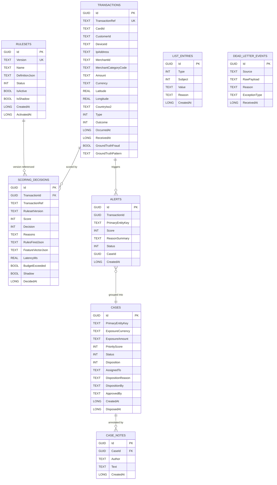

# Database Schema

Single SQLite database (default) named `fraudpipeline.db`. All timestamps are stored as
`long` ticks (`DateTimeOffsetToBinaryConverter`) so SQLite can `ORDER BY` them. All decimal
`Amount` columns are stored as `TEXT` per SQLite convention.

## ER diagram

## Tables

### `transactions`

| Column | Type | Notes |
| --- | --- | --- |
| Id | GUID | PK |
| TransactionRef | TEXT(64) | **Unique index**; the merchant's ref |
| CardId | TEXT(64) | Indexed |
| CustomerId | TEXT(64) | Indexed |
| DeviceId, IpAddress, MerchantId | TEXT(64) | |
| MerchantCategoryCode | TEXT(4) | ISO-18245 MCC |
| Amount, Currency | Owned value object (`Money`) | Currency ∈ KES/USD/EUR/GBP |
| Latitude, Longitude, CountryIso2 | Owned value object (`GeoLocation`) | |
| Type | INT | Enum `TransactionType` |
| Outcome | INT | Enum `TransactionOutcome` |
| OccurredAt, ReceivedAt | LONG (ticks) | Indexed |
| GroundTruthFraud | BOOL | Set by synthetic generator |
| GroundTruthPattern | TEXT(64) | e.g. `card-testing`, `impossible-travel` |

### `scoring_decisions`

| Column | Type | Notes |
| --- | --- | --- |
| Id | GUID | PK |
| TransactionId | GUID | Logical FK |
| TransactionRef | TEXT(64) | Indexed |
| RulesetVersion | TEXT(64) | Ruleset in force at decision time |
| Score | INT | 0..1000 |
| Decision | INT | Enum `Decision` |
| Reasons | TEXT(4000) | Semicolon-separated human reasons |
| RulesFiredJson, FeatureVectorJson | TEXT | JSON explanation for audit |
| LatencyMs | REAL | Measured budget consumption |
| BudgetExceeded | BOOL | See ADR-0004 |
| Shadow | BOOL | If true, produced by the shadow ruleset |
| DecidedAt | LONG | Indexed with `Shadow` for fast recent-scan |

### `rulesets`

Immutable once activated; only one `IsActive` at a time; at most one `IsShadow` at a time.

### `alerts` and `cases`

Alerts are logical children of transactions; they are grouped into cases by `PrimaryEntityKey`
(default `Card:<cardId>`). `CASE_NOTES` are a separate table so notes can be paged.

### `list_entries`

Allow / deny lists with a **unique index** on `(Type, Subject, Value)` so we cannot double-list the
same value.

### `dead_letter_events`

Everything that failed to score is captured here for triage.

## Retention

- `transactions` are the source of truth and are **not** deleted by application code; they are the
  replay source for the feature store (`ADR-0001`).
- `scoring_decisions` retention is business-policy driven — recommendation is at least the
  chargeback window (typically 120 days).
- `case_notes` retention follows the case; a disposed case may be archived after N years but not
  purged.

## Migrations

Development uses `Database.EnsureCreatedAsync()` at startup for zero-friction bootstrapping. A
real deployment would replace this with `Database.MigrateAsync()` against generated
`Migrations/` code — the schema is stable enough for this to be a swap without behavioural change.
