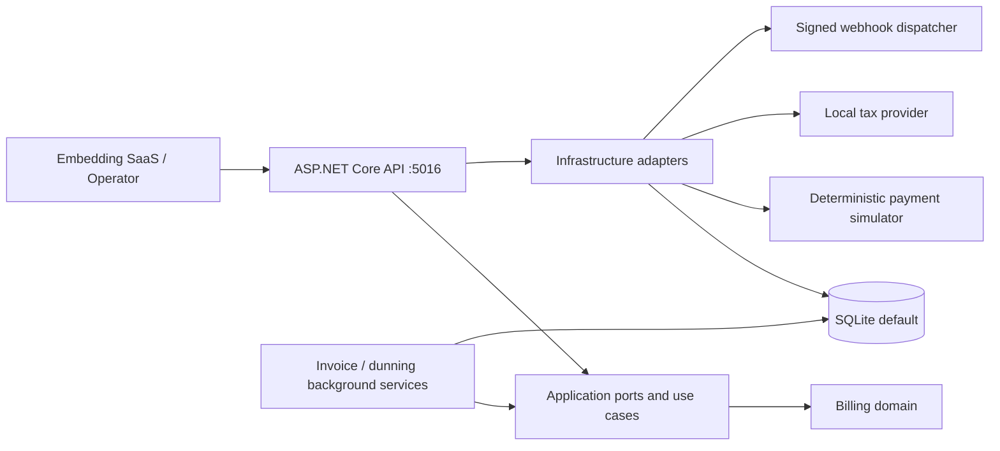
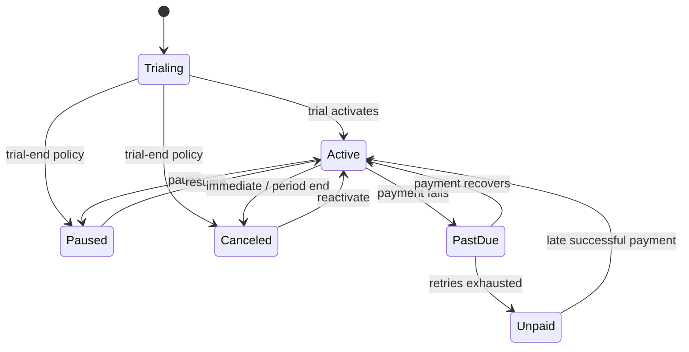
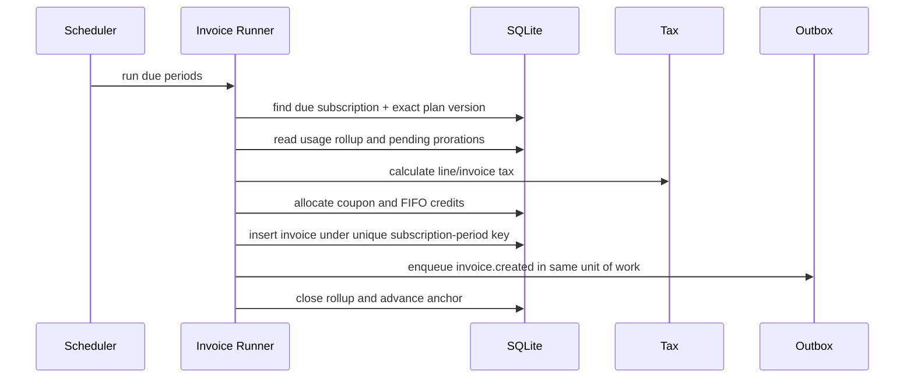
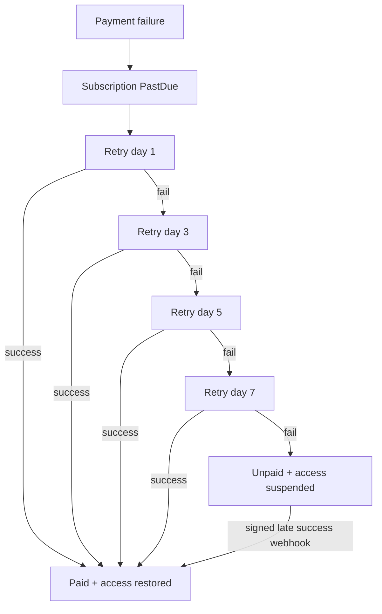

# Subscription Billing & Usage Metering Engine

## Portfolio Classification

Self-directed engineering case study. This repository is a production-style reference implementation of a reusable billing subsystem for SaaS products. It is not client work, has not processed real money, and makes no production-scale claim.

## Executive Summary

The engine models versioned plans, seven pricing strategies, subscription lifecycle transitions, immutable usage events, second-level proration, invoices, coupons, credits, tax, simulated payments, dunning, revenue reporting, and signed inbound/outbound webhooks. The default runtime is a modular .NET monolith backed by SQLite, so the complete API and test suite run without external infrastructure.

## Business Problem

Recurring billing fails in edge cases rather than on the happy path: a plan price changes after an invoice, January 31 rolls into February, usage arrives late, a retry is replayed, or tax rounding differs by one minor unit. This project centralizes those rules behind an embeddable API and keeps the evidence needed to reproduce every historical charge.

## Functional Requirements

- Products, interval-based plans, immutable plan versions, and KES/USD/EUR minor-unit money.
- Flat recurring, per-unit, cumulative tiered, volume, graduated-overage, package, and signed one-off pricing.
- Trial, active, past-due, unpaid, canceled, and paused states with immediate/deferred cancellation.
- Sum, max, last-value, and unique-count usage rollups with immutable correction events.
- To-the-second upgrade, downgrade, and quantity proration.
- Idempotent periodic invoice runs, sequential numbers, HTML/JSON rendering, and credit notes.
- Coupons, FIFO account credits, local tax rules, payment simulation, dunning, MRR/ARR, deferred revenue, and signed webhooks.

## Non-Functional Requirements

- `dotnet build -c Release` and `dotnet test -c Release` work with no services beyond the .NET SDK.
- SQLite is the default; all monetary amounts use signed `long` minor units.
- State-changing APIs support persisted idempotency responses.
- Append-only audit, plan-version, usage-event, and credit-note records preserve financial evidence.
- Correlation IDs, structured logs, health checks, rate limiting, JWT policies, OpenAPI, traces, and business metrics are built in.

## Architecture

The solution is a modular monolith. `Domain` owns calculations and invariants, `Application` owns ports and contracts, `Infrastructure` owns EF Core and simulators, and `Api` owns HTTP/authentication/composition. This avoids network-distributed failure modes while keeping external tax, payment, identity, database, and webhook adapters replaceable.

## Architecture Diagram



## Technology Stack

- .NET 10 / C#; ASP.NET Core minimal APIs.
- EF Core 10 with committed migration and SQLite default.
- xUnit, `WebApplicationFactory<Program>`, and SQLite in-memory integration tests.
- JWT bearer authentication, policy authorization, rate limiting, Problem Details, OpenAPI/Swagger.
- OpenTelemetry ASP.NET instrumentation plus custom billing counters and histograms.

## Domain Model

`Product -> Plan -> PlanVersion` separates commercial identity from immutable pricing. A `Subscription` points to one exact plan version and stores its anchor and current period. `UsageEvent` is immutable and contributes to one indexed `UsageRollup`. `Invoice` owns immutable line items and financial totals; coupons and credit lots are applied before payment. `DunningCase`, `PaymentAttempt`, `OutboundWebhook`, and `AuditRecord` retain reliability evidence.

## Core Workflows







## Security Model

JWT policies separate read, write, and administrator scopes. HMAC-SHA256 payment webhooks sign the timestamp plus exact raw body, enforce a five-minute window, compare in constant time, and persist nonces against replay. Mutation retries are bounded by persisted idempotency keys and request hashes. Rate limits, explicit CORS, security headers, startup secret guards, synthetic demo data, and append-only audit hashes reduce abuse and repudiation risk.

## Reliability & Failure Handling

The invoice database key makes `(subscription, period, billing reason)` unique, and invoice generation advances a period only after writing the invoice. Payment attempts are retained even when unsuccessful. Retryable and hard failures enter a deterministic dunning schedule; exhaustion makes the invoice uncollectible and suspends access. Outbound webhooks use bounded exponential backoff and a queryable dead-letter state with replay.

## Observability

Every response returns `X-Correlation-Id`. Structured logs carry the same ID. OpenTelemetry instruments ASP.NET Core and the `SubscriptionBilling` activity source. Custom instruments record `billing.invoice_run.duration`, `billing.invoices.generated`, `billing.dunning.attempts`, and `billing.payments.failed`. `/health/live` tests process liveness and `/health/ready` checks SQLite connectivity.

## Testing Strategy

The unit suite pins pricing boundaries, month-end/leap-year anchors, state transitions, proration reconciliation, usage aggregation, discount/credit/tax rules, dunning, reporting, signatures, and dead-letter behavior. Infrastructure tests run EF Core against open SQLite in-memory connections. API tests prove happy paths, validation Problem Details, 401, 403, idempotency replay, invoice-run uniqueness, rendering, and webhook replay protection. See `docs/test-results.md` for the actual final command output.

## Local Development

```powershell
dotnet restore SubscriptionBilling.sln
dotnet build -c Release
dotnet test -c Release
dotnet run --project src\SubscriptionBilling.Api
```

The Development API listens at `http://localhost:5016`, migrates `billing.db`, and idempotently seeds fictional catalogue/customer data. Obtain a local token from `/api/v1/auth/token`; Production refuses the development signing keys.

## Running with Docker

Docker configuration created but Docker is unavailable on the build host; the compose stack has not been started or verified.

If Docker is available elsewhere, review and replace all development keys before trying `docker compose up --build`.

## API Documentation

Development and Testing expose:

- OpenAPI document: `http://localhost:5016/openapi/v1.json`
- Swagger UI: `http://localhost:5016/docs`
- Health: `/health/live`, `/health/ready`

The versioned surface includes products, plans/versions/meters, customers, subscriptions/actions, usage, invoice preview/run/pay/void/render/credit notes, coupons, credits, payment webhooks, outbound webhook dead letters, and MRR.

## Example Usage

```powershell
$base = "http://localhost:5016"
$token = (Invoke-RestMethod -Method Post -Uri "$base/api/v1/auth/token" `
  -ContentType "application/json" `
  -Body '{"subject":"demo-operator","scopes":["billing.admin"]}').accessToken
$headers = @{ Authorization = "Bearer $token"; "Idempotency-Key" = [guid]::NewGuid().ToString() }

$subscription = Invoke-RestMethod -Method Post -Uri "$base/api/v1/subscriptions" `
  -Headers $headers -ContentType "application/json" -Body (@{
    customerId = "16000000-0000-0000-0000-000000000040"
    planVersionId = "16000000-0000-0000-0000-000000000021"
    quantity = 1
    trialEndBehavior = "Activate"
  } | ConvertTo-Json)

$preview = Invoke-RestMethod -Method Post -Uri "$base/api/v1/invoices/preview" `
  -Headers @{ Authorization = "Bearer $token"; "Idempotency-Key" = [guid]::NewGuid().ToString() } `
  -ContentType "application/json" -Body (@{
    subscriptionId = $subscription.id
    proposedPlanVersionId = "16000000-0000-0000-0000-000000000021"
    proposedQuantity = 3
    prorationBehavior = "CreateProrations"
  } | ConvertTo-Json)

$preview | ConvertTo-Json -Depth 8
```

Responses express money as fields such as `"totalMinor": 174000, "currency": "KES"` rather than binary floating-point amounts.

## Performance / Load Testing

No throughput claim is made. The hot ingestion path uses a unique event key plus one indexed period rollup, avoiding invoice-time scans for normal usage. A production benchmark should replay representative tenant cardinality, event skew, SQLite/PostgreSQL contention, and concurrent invoice workers before publishing any number.

## Trade-offs

- SQLite maximizes reviewer reproducibility; PostgreSQL would be preferred for multi-writer production concurrency.
- A modular monolith keeps financial transactions local; independent services would require distributed workflow and reconciliation machinery.
- Tax and payment adapters are deterministic local implementations, not vendor integrations.
- Revenue recognition is an even daily allocation helper, not a complete accounting subledger.
- The outbound transport is simulated so tests never call third parties.

## Architecture Decisions

- [ADR-001: minor-unit money and rounding](docs/decisions/ADR-001-minor-unit-money-and-rounding.md)
- [ADR-002: immutable plan versioning](docs/decisions/ADR-002-plan-versioning.md)
- [ADR-003: second-level proration](docs/decisions/ADR-003-proration-to-the-second.md)
- [ADR-004: idempotent invoice runs](docs/decisions/ADR-004-idempotent-invoice-runs.md)
- [ADR-005: immutable usage and adjustments](docs/decisions/ADR-005-immutable-usage-adjustments.md)
- [ADR-006: modular monolith with an outbox](docs/decisions/ADR-006-modular-monolith-outbox.md)

## Known Limitations

- The local payment and outbound webhook adapters are simulators.
- No card data is accepted or stored; this project is not a PCI implementation.
- The MRR endpoint reconstructs a one-month comparison from subscription/change history rather than a warehouse snapshot.
- Tax nexus, product tax codes, currencies beyond KES/USD/EUR, exchange rates, and statutory invoice localization are outside this case study.
- Docker files are authored but unverified on this host.

## Future Improvements

Add a PostgreSQL adapter with worker leasing, a transactional HTTP outbox transport, OIDC/JWKS identity configuration, immutable general-ledger postings, accounting exports, richer tax jurisdiction/product-code rules, customer portal workflows, and measured synthetic load tests. An Avalara-style adapter would map `TaxRequest` lines to a vendor transaction, persist the vendor document code, commit only after invoice finalization, and expose void/refund calls through the same `ITaxProvider` port.

## Portfolio Talking Points

1. Historical prices are reproducible because subscriptions bind to immutable plan versions.
2. Month-end anchors are preserved explicitly rather than delegated to naive date addition.
3. Proration rounds once to an intended net and adjusts the charge line so credit plus charge always reconciles.
4. Usage is immutable, deduplicated, and rolled up incrementally.
5. Invoice uniqueness, webhook replay defense, dunning recovery, and append-only audit evidence target the failures that occur at 3 a.m.

## Upwork Portfolio Description

Subscription Billing & Usage Metering Engine — self-directed engineering case study

Problem: SaaS billing must reproduce historical charges while handling usage, mid-cycle changes, failed collections, and replayed requests correctly. Built: a .NET 10 billing reference implementation with versioned pricing, second-level proration, idempotent invoicing, dunning, tax, credits, reporting, and signed webhooks. Engineering focus: financial rounding, immutable evidence, period idempotency, month-end anchors, retry/recovery, and SQLite-backed integration tests. Stack: ASP.NET Core, EF Core, SQLite, xUnit, JWT, OpenTelemetry. Verification: local Release build and automated suites; no client deployment or production usage is claimed.
