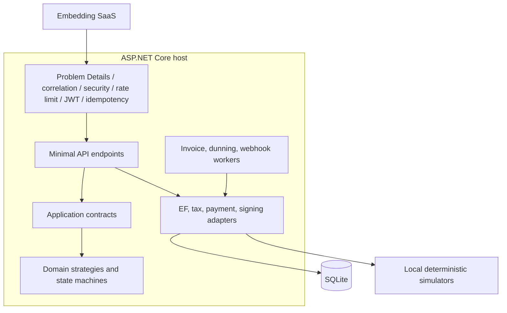
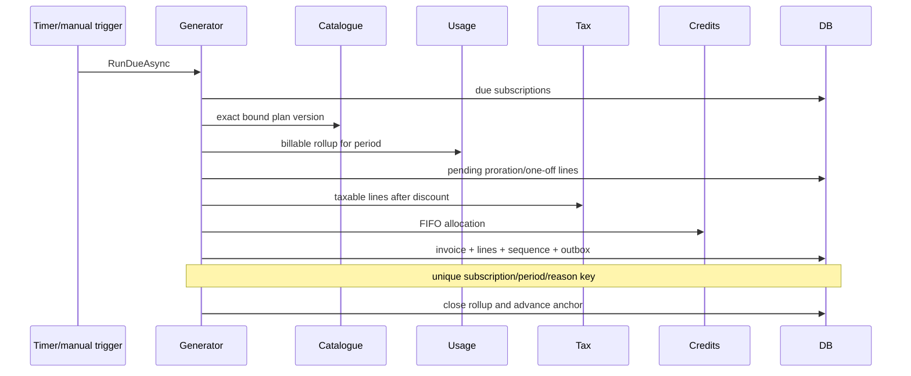
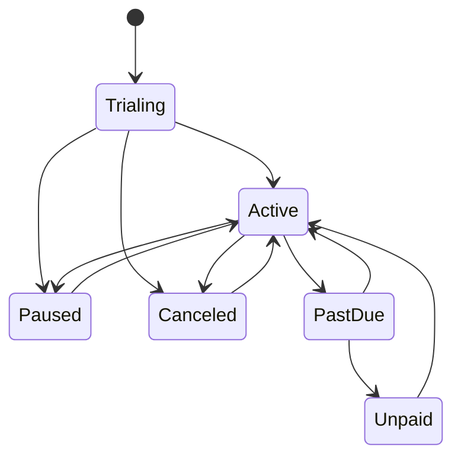
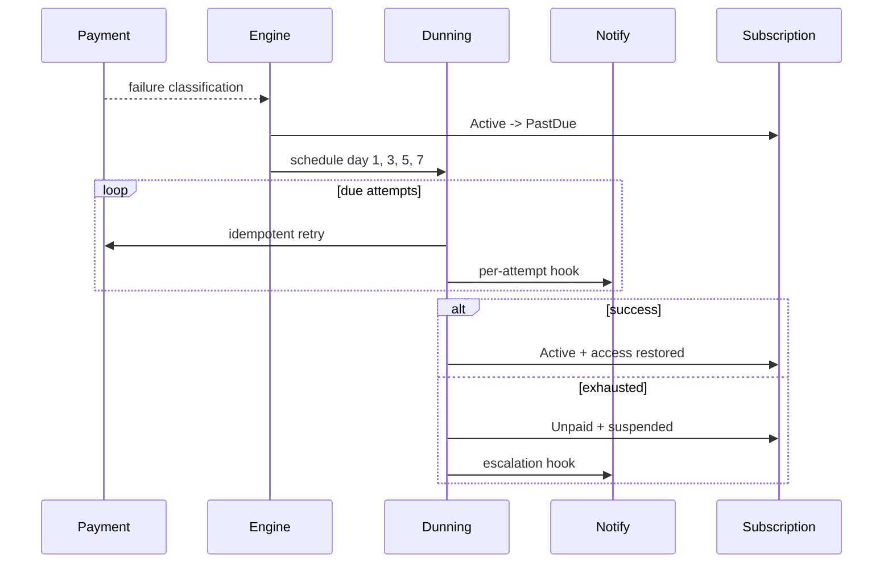

# Architecture — Subscription Billing & Usage Metering Engine

## Context

This reference implementation is intended to be embedded behind a SaaS control plane. It owns deterministic financial rules and evidence, but delegates identity, tax, payment, notification, database, and webhook transport concerns through ports.

## Container view



## Dependency rule

```text
Api -> Infrastructure -> Application -> Domain
Api --------------------> Application -> Domain
```

`Domain` contains no EF Core or ASP.NET types. `Application` defines `IBillingEngine`, `ITaxProvider`, `IPaymentProvider`, time/ID ports, webhook ports, and transport-neutral records. Infrastructure implements those ports and owns persistence. API endpoints compose them.

## Invoice run sequence



## Subscription lifecycle



`Unpaid` sets `IsAccessSuspended`; a verified late success can move the subscription back to `Active` and clear suspension.

## Dunning flow



## Persistence and concurrency

- SQLite `DateTimeOffset` values are converted to UTC ticks so comparison and ordering execute in SQL.
- The invoice number sequence and invoice insert participate in the same EF unit of work.
- Unique indexes back event IDs, plan version numbers/effective dates, coupon codes, webhook nonces, idempotency keys, usage rollups, and invoice periods.
- `Version` is an optimistic concurrency token on subscriptions.
- EF save guards reject update/delete attempts for plan versions, usage events, audit records, credit notes, and invoice lines. Finalized invoice changes are limited to lifecycle status.

## Adapter map

| Port | Local adapter | Production direction |
|---|---|---|
| `BillingDbContext` | EF Core + SQLite | PostgreSQL/SQL Server with worker leases |
| `ITaxProvider` | KE VAT 16%, configured US rate, flags | Avalara-style transaction/document adapter |
| `IPaymentProvider` | deterministic token-based simulator | PSP SDK behind idempotent payment intent |
| `IOutboundWebhookTransport` | no-network deterministic simulator | resilient `HttpClient`, mTLS/private egress as needed |
| `IWebhookReplayStore` | SQLite unique nonce | shared low-latency store with TTL |
| `IClock` | system clock | test fake; production NTP-monitored system source |

### Avalara-style tax adapter

A production adapter would translate invoice/customer/product tax data into the vendor's transaction lines, pass a stable invoice correlation/document code, and store the returned jurisdiction breakdown. The adapter would expose calculate, commit, void, and refund operations without leaking vendor DTOs into the domain. Timeouts would leave the invoice draft and retry only with the same vendor document key. This project does not call Avalara and claims no tax-compliance certification.

## Scaling path

1. Move SQLite to PostgreSQL and acquire due subscriptions with `FOR UPDATE SKIP LOCKED` or leases.
2. Keep the unique invoice-period constraint as the last line of defense.
3. Partition usage events/rollups by tenant and period; ingest batches while retaining event-level idempotency.
4. Relay outbox records with worker leases and isolate destination retry budgets.
5. Materialize MRR/revenue snapshots into an analytics store without changing source financial records.

## Failure boundaries

An invoice run may fail before persistence (safe retry), at a unique constraint (load the winner), or after persistence but before outbound delivery (outbox retries). Payment gateway timeout is retained as an attempt with unknown/transient classification rather than treated as success. Signed payment webhooks reconcile later outcomes.
